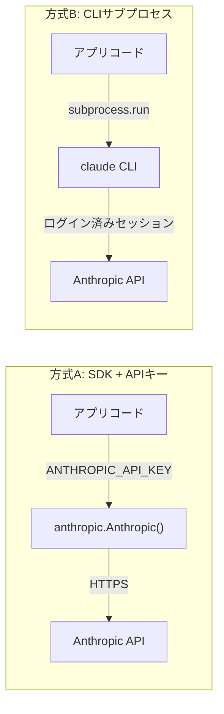

# SDK方式 vs CLIサブプロセス方式

## この教材で身につくこと

- API直叩き（SDK）方式とCLIサブプロセス方式を比較できる
- それぞれの認証・依存関係の違いを説明できる
- 実行環境に応じてどちらの方式を選ぶべきか判断できる

## 概要

LLMを呼び出す方法は「SDKでAPIを直接叩く」だけではありません。
本教材では、`ai-stock-investing-tutorial`の完成版アプリが採用している
「ログイン済みのCLIをサブプロセスとして呼び出す」方式を、
一般的なSDK方式と比較しながら解説します。

## 位置づけ

01-augmented-llm-building-block.mdで学んだAugmented LLM呼び出しを、
実際にどう実装するかという選択肢を扱います。次の03では、
CLIサブプロセス方式特有の入出力設計をさらに掘り下げます。

## 主要概念・設計判断の解説

### 2方式の比較

| 項目 | SDK + APIキー方式 | CLIサブプロセス方式 |
|---|---|---|
| 認証 | `ANTHROPIC_API_KEY`などを環境変数で管理 | ログイン済みCLIセッションに委譲（アプリ側で鍵を持たない） |
| 依存 | `anthropic`/`openai`等のSDKパッケージ | `claude`コマンドがPATH上にあること |
| 向いているケース | サーバー環境、複数ユーザー、レート制御を自前で持ちたい場合 | 個人利用ツール、開発者本人のログイン済み環境で動かす場合 |
| 呼び出し方法 | `client.messages.create(...)` | `subprocess.run([...], input=prompt)` |

### なぜCLIサブプロセス方式が選ばれたか

`ai-stock-investing-tutorial`には、SDK方式を教える既存教材
`ai-stock-investing-tutorial/docs/03-data-api/02-llm-api-integration.md`が
あります。一方、完成版アプリ`app/`はCLIサブプロセス方式を採用しています。
アプリの設計書（`app/docs/app-design.md`）には次のように書かれています。

> 個人利用向けのStreamlit Webアプリであり、ログイン済みのClaude Code CLI
> （`claude -p`）をサブプロセスとして実行する方式を採る。

つまり、個人利用ツールでAPIキー管理そのものをアプリの外に出すという
明確な設計判断です。サーバーで複数ユーザーに提供するアプリであれば、
SDK方式の方が適しています。

## 実ソースコード（Python / プロンプト例、出典パス明記）

出典: `ai-stock-investing-tutorial/app/data_api/llm_client.py`

```python
def _resolve_claude_executable() -> str:
    """`claude`実行ファイルのパスを解決する。未インストール時は分かりやすい例外に変換する。"""
    executable = shutil.which("claude")
    if executable is None:
        raise ClaudeCLINotFoundError(
            "Claude Code CLI（`claude`コマンド）が見つかりません。"
            "インストールとログインを確認してください。"
        )
    return executable
```

対比として、既存教材のSDK方式（出典:
`ai-stock-investing-tutorial/docs/03-data-api/02-llm-api-integration.md`）を示します。
どちらも正しい実装であり、優劣ではなく方式の違いです。

```python
import os
import anthropic


def call_llm(prompt: str) -> str:
    client = anthropic.Anthropic(api_key=os.environ["ANTHROPIC_API_KEY"])
    response = client.messages.create(
        model="claude-sonnet-5",
        max_tokens=1024,
        messages=[{"role": "user", "content": prompt}],
    )
    return response.content[0].text
```



## 演習課題

1. `app/data_api/llm_client.py`の`call_llm`をSDK方式（`anthropic`パッケージ使用）に
   書き換えるとしたら、`_resolve_claude_executable`・`ClaudeCLINotFoundError`・
   `ClaudeCLIError`をそれぞれ何に置き換えるか対応表を作ってください。
2. CLIサブプロセス方式のデメリットを1つ挙げ（`llm_client.py`のコメントに
   Windows環境での引数展開の実例があります）、対策を説明してください。

## 理解度チェック

- [ ] SDK方式とCLIサブプロセス方式それぞれの認証の違いを説明できる
- [ ] `app/`がCLIサブプロセス方式を選んだ理由を説明できる
- [ ] 自分のアプリではどちらが向いているか、理由とともに判断できる

---

[← 前へ: Augmented LLMという基本単位](01-augmented-llm-building-block.md) | [次へ: システムプロンプトと入出力の境界 →](03-system-prompt-and-io-boundary.md)
