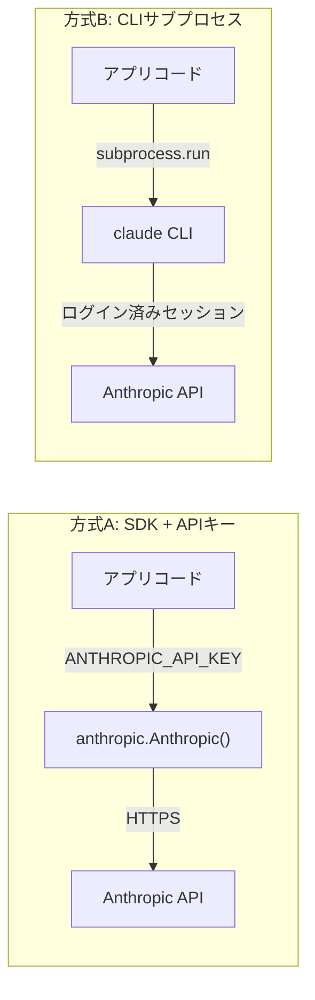

# SDK方式 vs CLIサブプロセス方式

## この教材で身につくこと

- API直叩き（SDK）方式とCLIサブプロセス方式を比較できる
- それぞれの認証・依存関係の違いを説明できる
- 実行環境に応じてどちらの方式を選ぶべきか判断できる

## 概要

「SDK」とは、API通信の詳細（HTTPリクエストの組み立てなど）を隠してくれるライブラリです。
Anthropicやopenaiが配布するPythonパッケージ（`anthropic`, `openai`）がこれにあたります。
「CLI」とは、ターミナルからコマンドとして実行するプログラム（ここでは`claude`コマンド）のことです。
SDK方式では、APIキーをアプリ自身が管理する必要があります。
APIキーが漏洩すると、第三者に勝手にAPIを使われ、想定外の課金が発生するリスクがあります。
この鍵管理の負担をどう扱うかが、呼び出し方式を選ぶ最初の分かれ道になります。
LLMを呼び出す方法は「SDKでAPIを直接叩く」だけではありません。
本教材では、`ai-stock-investing-tutorial`の完成版アプリが実装として備えている「ログイン済みのCLIをサブプロセスとして呼び出す」方式を、一般的なSDK方式と比較しながら解説します（`app/`自体は`llm_provider`設定でどちらの方式も使え、現在の設定はSDK方式です。詳細は後述）。

## 位置づけ

01-augmented-llm-building-block.mdで学んだAugmented LLM呼び出しを、実際にどう実装するかという選択肢を扱います。
次の03では、CLIサブプロセス方式特有の入出力設計をさらに掘り下げます。

## 主要概念・設計判断の解説

### 2方式の比較

| 項目 | SDK + APIキー方式 | CLIサブプロセス方式 |
|---|---|---|
| 認証 | `ANTHROPIC_API_KEY`などを環境変数で管理 | ログイン済みCLIセッションに委譲（アプリ側で鍵を持たない） |
| 依存 | `anthropic`/`openai`等のSDKパッケージ | `claude`コマンドがPATH上にあること |
| 向いているケース | サーバー環境、複数ユーザー、レート制御を自前で持ちたい場合 | 個人利用ツール、開発者本人のログイン済み環境で動かす場合 |
| 呼び出し方法 | `client.messages.create(...)` | `subprocess.run([...], input=prompt)` |
| つまずきやすい点 | APIキーの誤コミット・ログ出力への混入 | 実行環境（サーバー・CI等）にCLIとログインセッションが無いと動かない |

### なぜCLIサブプロセス方式が選ばれたか

`ai-stock-investing-tutorial`には、SDK方式を教える既存教材`ai-stock-investing-tutorial/docs/03-data-api/02-llm-api-integration.md`があります。
一方、完成版アプリ`app/`はCLIサブプロセス方式を実装として備えており、コード側のフォールバック既定値（`llm_provider`未設定時）もCLIサブプロセス方式です。
アプリの設計書（`app/docs/app-design.md`）には次のように書かれています。

> 個人利用向けのStreamlit Webアプリであり、ログイン済みのClaude Code CLI（`claude -p`）をサブプロセスとして実行する方式を採る。

つまり、個人利用ツールでAPIキー管理そのものをアプリの外に出すという明確な設計判断です。
サーバーで複数ユーザーに提供するアプリであれば、SDK方式の方が適しています。

### `app/`における2方式の共存

`llm_client.py`の`call_llm`は`llm_provider`という設定値（`.streamlit/secrets.toml`の`llm_provider = "claude_cli"`または`"openai"`）で実装を切り替える構造になっています。
現在の`secrets.toml`の設定はSDK方式（`"openai"`）で、`openai`パッケージの`client.chat.completions.create(...)`を直接呼び出しています（`ANTHROPIC_API_KEY`ではなく`openai_api_key`を`secrets.toml`で管理）。
`llm_provider`を`"claude_cli"`に戻せばCLIサブプロセス方式に切り替わります（コード側のフォールバック既定値、つまり`llm_provider`自体が未設定の場合の値もCLIサブプロセス方式のままです）。
つまり`app/`は「CLIサブプロセス方式のみ」ではなく、1つの入口関数の中で両方式を実装し、設定で選べるようにしている実例です。

### 方式を切り替える手順

実際に`app/`で方式を切り替える手順は、次の4ステップです（出典: [`ai-stock-investing-tutorial/app/README.md`](https://github.com/duwenji/ai-stock-investing-tutorial/blob/master/README.md)）。

1. `.streamlit/secrets.toml`に`llm_provider`と関連キーを追記する。
   ```toml
   llm_provider = "openai"       # "claude_cli"（デフォルト） | "openai"
   openai_api_key = "sk-..."     # llm_provider = "openai" の場合必須
   openai_model = "gpt-5"        # 省略可。デフォルト "gpt-5"
   ```
   つまずきやすい点: `secrets.toml`は`.gitignore`対象なので、リポジトリを新しくcloneした環境では毎回作り直す必要があります。
2. `llm_provider`の値に応じて必要な依存が揃っているか確認する。
   `"claude_cli"`なら`claude`コマンドがインストール・ログイン済みか、`"openai"`なら`openai_api_key`が設定済みかを確認します。
   つまずきやすい点: 依存を確認しないまま起動すると、`check_llm_available()`が例外を送出しアプリが起動画面で止まります（詳細は[03章](03-system-prompt-and-io-boundary.md)）。
3. Streamlitアプリを再起動する。
   つまずきやすい点: `secrets.toml`の変更はプロセス起動時に読み込まれるため、実行中のアプリを再読み込み（rerun）しただけでは反映されません。
4. 実際に生成AI機能（スクリーニング等）を1回動かし、応答が返ることを確認する。

この手順のうち1・3は設定ファイルの書き換えとプロセス再起動という定型作業ですが、2の依存確認を飛ばすと、症状（エラーの出方）だけでは「設定ミスなのかインストール漏れなのか」が切り分けにくくなります。

## 実ソースコード（Python / プロンプト例、出典パス明記）

出典: `ai-stock-investing-tutorial/app/data_api/llm_client.py`

```python
def _resolve_claude_executable() -> str:
    """`claude`実行ファイルのパスを解決する。未インストール時は分かりやすい例外に変換する。"""
    executable = shutil.which("claude")
    if executable is None:
        raise ClaudeCLINotFoundError(
            "Claude Code CLI（`claude`コマンド）が見つかりません。"
            "インストールとログインを確認してください。"
        )
    return executable
```

`app/`自身のSDK方式実装（出典は同じ`llm_client.py`）:

```python
def _call_openai(prompt: str, timeout: int) -> str:
    """OpenAI Chat Completions APIにプロンプトを渡し、応答テキストを取得する。"""
    api_key = _get_secret("openai_api_key")
    model = _get_secret("openai_model", "gpt-5")
    client = openai.OpenAI(api_key=api_key)
    completion = client.chat.completions.create(
        model=model,
        messages=[
            {"role": "system", "content": _SYSTEM_PROMPT},
            {"role": "user", "content": prompt},
        ],
        timeout=timeout,
    )
    return completion.choices[0].message.content.strip()
```

さらに対比として、既存教材のSDK方式（出典: `ai-stock-investing-tutorial/docs/03-data-api/02-llm-api-integration.md`、Anthropic公式SDKによる最小構成の例）も示します。
どちらも正しい実装であり、優劣ではなく方式の違いです。

```python
import os
import anthropic


def call_llm(prompt: str) -> str:
    client = anthropic.Anthropic(api_key=os.environ["ANTHROPIC_API_KEY"])
    response = client.messages.create(
        model="claude-sonnet-5",
        max_tokens=1024,
        messages=[{"role": "user", "content": prompt}],
    )
    return response.content[0].text
```



どちらの方式も最終的にはAnthropic APIに到達する点は同じです。
違うのは、アプリコードから見て「APIキーという機密情報を自分で運ぶか」「認証済みの別プロセスに委ねるか」だけです。
この違いが、サーバー環境で動かせるか・複数ユーザーに提供できるかを左右します。

## 演習課題

1. `app/data_api/llm_client.py`の`call_llm`をSDK方式（`anthropic`パッケージ使用）に書き換える場合の対応表を作ってください。
   1. `_resolve_claude_executable`は何に置き換わるか（クライアント初期化処理）。
   2. `ClaudeCLINotFoundError`（CLI未検出）は何に置き換わるか（APIキー未設定時の例外）。
   3. `ClaudeCLIError`（実行失敗）は何に置き換わるか（API呼び出し失敗時の例外）。
2. CLIサブプロセス方式のデメリットを説明してください。
   1. `llm_client.py`のコメントにあるWindows環境での引数展開の問題を1〜2文で要約してください。
   2. その問題への対策（`app/`が実際に採っている対策で構いません）を説明してください。

## 理解度チェック

- [ ] SDK方式とCLIサブプロセス方式それぞれの認証の違いを説明できる
- [ ] `app/`がCLIサブプロセス方式を選んだ理由を説明できる
- [ ] 自分のアプリではどちらが向いているか、理由とともに判断できる
- [ ] `llm_provider`設定を切り替える手順と、切り替え時に確認すべき点を説明できる

---

[← 前へ: Augmented LLMという基本単位](01-augmented-llm-building-block.md) | [次へ: システムプロンプトと入出力の境界 →](03-system-prompt-and-io-boundary.md)
