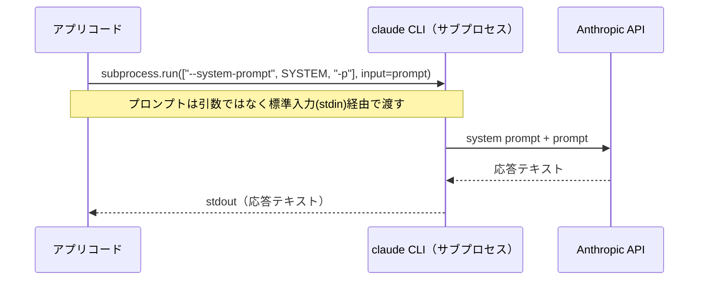

# システムプロンプトと入出力の境界

## この教材で身につくこと

- システムプロンプトで出力形式を制御する設計を説明できる
- CLIサブプロセス方式特有の入出力設計（標準入力経由での受け渡し）を説明できる
- CLI未検出・実行失敗時の例外設計を説明できる

## 概要

LLMの出力を安定してアプリに組み込むには、「何を渡すか」だけでなく
「どう渡すか」の設計も重要です。本教材では、システムプロンプトによる
出力制御と、CLIサブプロセス方式特有の入出力の境界設計を扱います。

## 位置づけ

本教材はカテゴリ01の最終教材です。ここで学ぶ入出力の境界設計は、
02章「I/O Contract Design」（プロンプトの内容そのものの設計）の前提となります。

## 主要概念・設計判断の解説

### システムプロンプトの役割

システムプロンプトは、ユーザープロンプトとは別に「常に守ってほしい振る舞い」を
LLMに伝える仕組みです。`app/`では次の1文だけを使い、指示外の余計な発言を
させないことで、出力形式をアプリ側で制御しやすくしています。

> あなたは指示に厳密に従うアシスタントです。指示された出力のみを返してください。

### なぜargvではなくstdinでプロンプトを渡すか

一見、コマンドライン引数でプロンプトを渡す方が単純に思えますが、
`app/`は標準入力（stdin）経由で渡しています。理由はWindows特有の問題です。
`claude`コマンドはnpmの`.cmd`シムに解決されるため、バッチファイルの
引数展開処理がダブルクォートを含む文字列（JSON形式のプロンプト）を
壊してしまいます。stdin経由ならこの問題を回避できます。

### 例外設計

| 例外クラス | 発生条件 | 発生タイミング |
|---|---|---|
| `ClaudeCLINotFoundError` | `shutil.which("claude")`が`None` | 起動時チェック、または呼び出し直前 |
| `ClaudeCLIError` | サブプロセスの終了コードが非0 | `call_llm`呼び出し中 |

2種類に分けることで、呼び出し元は「そもそもCLIが無い」のか
「CLIはあるが実行に失敗した」のかを区別できます。

## 実ソースコード（Python / プロンプト例、出典パス明記）

出典: `ai-stock-investing-tutorial/app/data_api/llm_client.py`

```python
_SYSTEM_PROMPT = "あなたは指示に厳密に従うアシスタントです。指示された出力のみを返してください。"


class ClaudeCLINotFoundError(RuntimeError):
    """`claude`コマンドがPATH上に見つからない場合に送出する例外。"""


class ClaudeCLIError(RuntimeError):
    """`claude`コマンドの実行がエラー終了した場合に送出する例外。"""
```

出典: `ai-stock-investing-tutorial/app/app.py`（起動時チェック）

```python
# Claude CLIが利用できない環境ではLLM機能が動作しないため、起動時点でチェックしてアプリを止める
try:
    check_claude_cli_available()
except Exception as exc:
    st.error(str(exc))
    st.stop()
```



## 演習課題

1. システムプロンプトを与えない場合にどのような問題が起きうるか、
   スクリーニング条件変換の例（JSON以外の説明文が混ざる等）で説明してください。
2. `check_claude_cli_available()`を起動時ではなく各機能の呼び出し直前だけで
   行う設計に変えた場合のトレードオフを考えてください。

## 理解度チェック

- [ ] システムプロンプトが出力形式の制御にどう寄与するか説明できる
- [ ] プロンプトをargvではなくstdinで渡す理由を説明できる
- [ ] `ClaudeCLINotFoundError`と`ClaudeCLIError`の使い分けを説明できる

---

[← 前へ: SDK方式 vs CLIサブプロセス方式](02-api-sdk-vs-cli-subprocess.md) | [次へ: 02-io-contract-design →](../02-io-contract-design/00-README.md)
