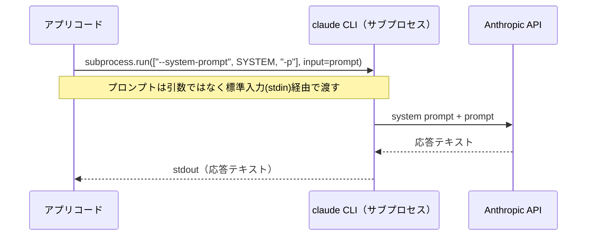

# システムプロンプトと入出力の境界

## この教材で身につくこと

- システムプロンプトで出力形式を制御する設計を説明できる
- CLIサブプロセス方式特有の入出力設計（標準入力経由での受け渡し）を説明できる
- CLI未検出・実行失敗時の例外設計を説明できる

## 概要

LLMへ送る文章には、役割が異なる2種類があります。
「ユーザープロンプト」（都度変わる具体的な依頼内容）と、「システムプロンプト」（毎回変わらない振る舞いの指示）です。
システムプロンプトを使わず、ユーザープロンプトだけで指示するとします。
LLMに「JSON配列だけ出力してください」と頼んでも、前置きの挨拶や説明文を付け足して返すことがあります。
アプリ側でその応答をそのまま`json.loads`に渡すと、パースエラーで機能全体が止まってしまいます。
LLMの出力を安定してアプリに組み込むには、「何を渡すか」だけでなく「どう渡すか」の設計も重要です。
本教材では、システムプロンプトによる出力制御と、CLIサブプロセス方式特有の入出力の境界設計を扱います。

## 位置づけ

本教材はカテゴリ01の最終教材です。
ここで学ぶ入出力の境界設計は、02章「I/O Contract Design」（プロンプトの内容そのものの設計）の前提となります。

## 主要概念・設計判断の解説

### システムプロンプトの役割

システムプロンプトは、ユーザープロンプトとは別に「常に守ってほしい振る舞い」をLLMに伝える仕組みです。
`app/`では次の1文だけを使い、指示外の余計な発言をさせないことで、出力形式をアプリ側で制御しやすくしています。

> あなたは指示に厳密に従うアシスタントです。指示された出力のみを返してください。

### なぜargvではなくstdinでプロンプトを渡すか

一見、コマンドライン引数でプロンプトを渡す方が単純に思えますが、`app/`は標準入力（stdin）経由で渡しています。
理由はWindows特有の問題です。
`claude`コマンドはnpmの`.cmd`シムに解決されるため、バッチファイルの引数展開処理がダブルクォートを含む文字列（JSON形式のプロンプト）を壊してしまいます。
stdin経由ならこの問題を回避できます。

### 例外設計

| 例外クラス | 発生条件 | 発生タイミング | つまずきやすい点 |
|---|---|---|---|
| `ClaudeCLINotFoundError` | `shutil.which("claude")`が`None` | 起動時チェック、または呼び出し直前 | メッセージだけ見て「ネットワーク障害」と誤解しがち。実際は未インストール/未ログイン |
| `ClaudeCLIError` | サブプロセスの終了コードが非0 | `call_llm`呼び出し中 | `result.stderr`を握りつぶすと、失敗理由（未ログイン/タイムアウト等）が分からなくなる |

2種類に分けることで、呼び出し元は「そもそもCLIが無い」のか「CLIはあるが実行に失敗した」のかを区別できます。
なお`app/`は`llm_provider = "openai"`時のために`OpenAIAPIKeyMissingError`・`OpenAIAPIError`という対の例外も持ちますが、設計思想（未検出/未設定と実行時失敗を分ける）は同じです。

## 実ソースコード（Python / プロンプト例、出典パス明記）

出典: `ai-stock-investing-tutorial/app/data_api/llm_client.py`

```python
_SYSTEM_PROMPT = "あなたは指示に厳密に従うアシスタントです。指示された出力のみを返してください。"


class ClaudeCLINotFoundError(RuntimeError):
    """`claude`コマンドがPATH上に見つからない場合に送出する例外。"""


class ClaudeCLIError(RuntimeError):
    """`claude`コマンドの実行がエラー終了した場合に送出する例外。"""
```

出典: `ai-stock-investing-tutorial/app/app.py`（起動時チェック）

```python
# 設定されたLLMプロバイダが利用できない環境ではLLM機能が動作しないため、起動時点でチェックしてアプリを止める
try:
    check_llm_available()
except Exception as exc:
    st.error(str(exc))
    st.stop()
```

`check_llm_available()`は、`llm_provider`設定に応じて`ClaudeCLINotFoundError`・`OpenAIAPIKeyMissingError`のいずれかを送出しうる関数です（出典は同じ`llm_client.py`）。
どちらの例外も`except Exception`でまとめて捕まえ、画面にエラーメッセージを出して`st.stop()`でアプリを止めます。
これにより、LLMが使えないまま機能を実行してしまう事故を防ぎます。

### もう1つの実例: 引数渡しだと壊れる理由（汎用サンプル）

本教材のこの部分のサンプルコードは`app/`に実装例が無いため、汎用サンプルコードで解説します。
「なぜargvではなくstdinか」を、実際に引数として渡した場合の壊れ方で確認してみましょう。

```python
# 悪い例: JSON形式のプロンプトを引数(argv)でそのまま渡す
# Windowsでは`claude`がnpmの.cmdシムに解決され、ダブルクォートを
# 含む引数がバッチファイルの引数展開処理で壊れることがある
prompt = '次のJSONを検証してください: {"per": 15, "sector": "自動車"}'
subprocess.run(["claude", "-p", prompt])  # 引数が途中で分割されうる

# 良い例: 標準入力(stdin)経由で渡す（app/の実装と同じ方式）
subprocess.run(["claude", "-p"], input=prompt, text=True)
```



システムプロンプトとプロンプト本体は別々に渡されますが、CLIの内部で1つのリクエストに合成されてAPIへ送られます。
アプリ側から見ると、「毎回同じ指示（システムプロンプト）」と「毎回変わる依頼内容（ユーザープロンプト）」を分離して管理できる、という設計上の利点がこのやり取りの背景にあります。

## 演習課題

1. システムプロンプトを与えない場合にどのような問題が起きうるか、説明してください。
   1. スクリーニング条件変換のプロンプト（[01章](01-augmented-llm-building-block.md)の`build_screening_prompt`）を例に、システムプロンプト無しでLLMがどう応答しうるか（JSON以外の説明文が混ざる等）を想像してください。
   2. その応答をそのまま`json.loads`に渡すと、アプリ側でどうなるか説明してください。
2. `check_llm_available()`を起動時ではなく各機能の呼び出し直前だけで行う設計に変えた場合のトレードオフを考えてください。
   1. その設計変更のメリットを1つ挙げてください。
   2. デメリットを1つ挙げてください。

## 理解度チェック

- [ ] システムプロンプトが出力形式の制御にどう寄与するか説明できる
- [ ] プロンプトをargvではなくstdinで渡す理由を説明できる
- [ ] `ClaudeCLINotFoundError`と`ClaudeCLIError`の使い分けを説明できる
- [ ] 各例外がどのタイミングで発生し、どう対処されるべきか、つまずきやすい点も含めて説明できる

---

[← 前へ: SDK方式 vs CLIサブプロセス方式](02-api-sdk-vs-cli-subprocess.md) | [次へ: 02-io-contract-design →](../02-io-contract-design/00-README.md)
