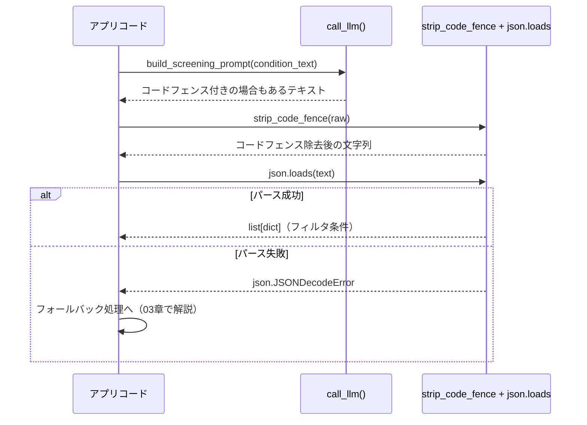

# 構造化出力（JSON）の契約設計

## この教材で身につくこと

- システムプロンプト・ユーザープロンプトの両方でJSON出力を指示する方法を説明できる
- コードフェンス除去からパースまでの二段構えの契約を設計できる
- パース失敗が起こりうる前提での実装ができる

## 概要

LLMの応答をアプリのロジックで扱うには、自由文ではなく構造化された
JSONで返してもらう必要があります。しかし、LLMは指示していても
Markdownのコードフェンス（```json ... ```）を付けて返すことがあります。
本教材では、この現実を前提にした「出力指示＋正規化＋パース」の契約設計を扱います。

## 位置づけ

本教材はカテゴリ02の1番目です。ここで学ぶJSON契約は、次の02（バッチ設計）・
03（出力範囲の限定）でも共通して使われます。パース失敗時の具体的な
フォールバック実装は03章で扱います。

## 主要概念・設計判断の解説

### 「コードブロック不要・JSONのみ出力」という指示文の型

`app/`内の複数箇所で、同じパターンの指示文が繰り返し使われています。

- スクリーニング条件変換:
  `出力形式: [{"field": "per", "operator": "<=", "value": 15}] のようなJSON配列のみを出力してください。説明文やコードブロック記法は不要です。`
- ニュースセンチメント判定:
  `出力は次の形式のJSONのみとしてください（説明文・コードブロック記法は不要です）。{"<ticker>": {"sentiment": "ポジティブ|ニュートラル|ネガティブ", "confidence": 0.0〜1.0}}`

どちらも「出力形式の具体例」と「説明文・コードブロック記法は不要」という
2要素を含んでいます。この型を踏襲すると、LLMの出力ゆれを最小化できます。

### それでも正規化が必要な理由

上記のように明示的に指示しても、LLMがコードフェンス付きで返すことは
珍しくありません。そのため`app/`では、01章で学んだシステムプロンプトによる
制御と、ユーザープロンプトでの明示指示に加えて、アプリ側でも
「コードフェンス除去→`json.loads`」という二段構えの防御をしています。

## 実ソースコード（Python / プロンプト例、出典パス明記）

出典: `ai-stock-investing-tutorial/app/common/json_parsing.py`

```python
_CODE_FENCE_RE = re.compile(r"^```(?:json)?\s*\n(.*)\n```$", re.DOTALL)


def strip_code_fence(text: str) -> str:
    stripped = text.strip()
    match = _CODE_FENCE_RE.match(stripped)
    if match:
        # コードフェンスで囲まれている場合は中身のみを返す。
        return match.group(1).strip()
    # コードフェンスが無ければそのまま（前後空白のみ除去して）返す。
    return stripped
```

出典: `ai-stock-investing-tutorial/app/prompt_patterns/screening.py`

```python
def build_screening_prompt(condition_text: str, sectors: list[str] | None = None) -> str:
    ...
    return (
        "次の投資条件をJSON形式のフィルタ配列に変換してください。\n"
        "使用できるfieldは per（PER）、pbr（PBR）、dividend_yield_pct"
        "（配当利回り、単位はパーセントの数値。例: 3%なら3）、sector（業種）のいずれかです。\n"
        f"{sector_line}"
        'sectorのoperatorは"=="のみ使用してください。\n'
        '出力形式: [{"field": "per", "operator": "<=", "value": 15}] の'
        "ようなJSON配列のみを出力してください。説明文やコードブロック記法は不要です。\n\n"
        f"条件: {condition_text}"
    )
```



## 演習課題

1. `strip_code_fence`が対応していない出力形式（例: コードフェンスの前後に
   説明文が付く場合）を1つ挙げ、対応する正規表現を考えてください。
2. JSON配列ではなくJSON Lines（1行1オブジェクト）で出力させたい場合、
   プロンプトの指示文をどう変えるか書いてください。

## 理解度チェック

- [ ] なぜシステムプロンプトだけでなくユーザープロンプト側でも出力形式を指示するか説明できる
- [ ] `strip_code_fence`が必要な理由を説明できる
- [ ] JSON構造化出力の契約を自分の機能に設計できる

---

[← 前へ: 00-README](00-README.md) | [次へ: 単発呼び出し vs バッチ呼び出し →](02-single-vs-batch-prompting.md)
