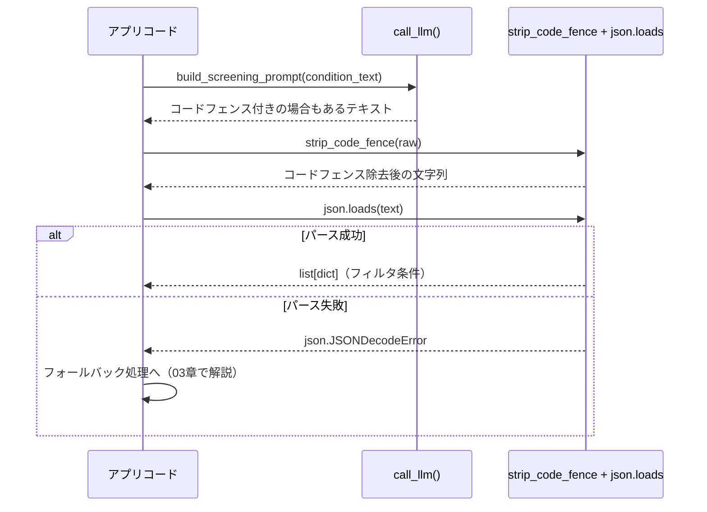

# 構造化出力（JSON）の契約設計

## この教材で身につくこと

- システムプロンプト・ユーザープロンプトの両方でJSON出力を指示する方法を説明できる
- コードフェンス除去からパースまでの二段構えの契約を設計できる
- パース失敗が起こりうる前提での実装ができる

## 概要

LLMはもともと人間向けの自由な文章を返す技術です。応答から必要な値を正規表現などで抜き出そうとすると、LLMの言い回しが少し変わるだけで抽出に失敗する、壊れやすい実装になりがちです。

これを避けるため、LLMの応答をアプリのロジックで扱うには、自由文ではなく構造化された（＝あらかじめ決まった形式に沿った）JSONで返してもらう必要があります。この設計は一般に「構造化出力（Structured Output）」と呼ばれます。

しかし、構造化出力を指示するだけでは万全ではありません。LLMは指示していてもMarkdownのコードフェンス（```json ... ```のようにコードブロックを```記号で囲む書式）を付けて返すことがあります。
本教材では、この現実を前提にした「出力指示＋正規化＋パース」の契約設計を扱います。

## 位置づけ

本教材はカテゴリ02の1番目です。ここで学ぶJSON契約は、次の02（バッチ設計）・03（出力範囲の限定）でも共通して使われます。
パース失敗時の具体的なフォールバック実装は03章で扱います。

## 主要概念・設計判断の解説

### 「コードブロック不要・JSONのみ出力」という指示文の型

`app/`内の複数箇所で、同じパターンの指示文が繰り返し使われています。

スクリーニング条件変換のプロンプト（出典: `app/prompt_patterns/screening.py`）:

```text
出力形式: [{"field": "per", "operator": "<=", "value": 15}] のような
JSON配列のみを出力してください。説明文やコードブロック記法は不要です。
```

ニュースセンチメント判定のプロンプト（出典: `app/analysis_agents/news_research_agent.py`）:

```text
出力は次の形式のJSONのみとしてください（説明文・コードブロック記法は不要です）。
{"<ticker>": {"sentiment": "ポジティブ|ニュートラル|ネガティブ", "confidence": 0.0〜1.0}}
```

どちらの指示文も、次の2要素で構成されています。

| 指示文の要素 | 目的 | 上記の例 |
|---|---|---|
| 出力形式の具体例を書く | 期待するJSON構造・キー名をLLMに明示し、ゆれを防ぐ | `[{"field": "per", ...}]` の具体例 |
| 「説明文・コードブロック記法は不要」と明示する | 前置き文やMarkdown装飾の混入確率を下げる | 「説明文やコードブロック記法は不要です」 |

この型を踏襲すると、LLMの出力ゆれを最小化できます。

### それでも正規化が必要な理由

上記のように明示的に指示しても、LLMがコードフェンス付きで返すことは珍しくありません。
そのため`app/`では、01章で学んだシステムプロンプトによる制御と、ユーザープロンプトでの明示指示に加えて、アプリ側でも「コードフェンス除去→`json.loads`」という二段構えの防御をしています。

### 処理の流れ（4ステップ）

「出力指示＋正規化＋パース」の契約は、実装レベルでは次の4ステップです。

1. **プロンプト送信**: 出力形式を指定したプロンプトを`call_llm`に渡す。
   つまずきやすい点: システムプロンプト側だけで指示すると、長いユーザープロンプトの文脈に埋もれてLLMに無視されることがある。
2. **LLM応答の受信**: 応答はコードフェンス付き/無しのどちらもあり得る前提で受け取る。
   つまずきやすい点: 「必ずコードフェンス無しで返る」と決め打つと、低確率の例外が本番投入後まで気づかれないことがある。
3. **コードフェンス除去**: `strip_code_fence`で```json ... ```の外側を剥がす。
   つまずきやすい点: 正規表現は行頭行末アンカー（`^`/`$`）付きの完全一致なので、コードフェンスの前後に説明文が付くと除去できない（演習1で扱います）。
4. **JSONパース**: `json.loads`で辞書やリストに変換する。
   つまずきやすい点: パース失敗を`try/except`で捕まえないと、1回のLLM出力ゆれでアプリ全体が例外停止する（対処法は03章）。

この4ステップを時系列で表すと、次のシーケンス図のようになります。
図だけでは各ステップの落とし穴が伝わらないため、上記の番号付き手順とあわせて読んでください。

## 実ソースコード（Python / プロンプト例、出典パス明記）

出典: `ai-stock-investing-tutorial/app/common/json_parsing.py`

```python
_CODE_FENCE_RE = re.compile(r"^```(?:json)?\s*\n(.*)\n```$", re.DOTALL)


def strip_code_fence(text: str) -> str:
    stripped = text.strip()
    match = _CODE_FENCE_RE.match(stripped)
    if match:
        # コードフェンスで囲まれている場合は中身のみを返す。
        return match.group(1).strip()
    # コードフェンスが無ければそのまま（前後空白のみ除去して）返す。
    return stripped
```

出典: `ai-stock-investing-tutorial/app/prompt_patterns/screening.py`

```python
def build_screening_prompt(condition_text: str, sectors: list[str] | None = None) -> str:
    ...
    return (
        "次の投資条件をJSON形式のフィルタ配列に変換してください。\n"
        "使用できるfieldは per（PER）、pbr（PBR）、dividend_yield_pct"
        "（配当利回り、単位はパーセントの数値。例: 3%なら3）、sector（業種）のいずれかです。\n"
        f"{sector_line}"
        'sectorのoperatorは"=="のみ使用してください。\n'
        '出力形式: [{"field": "per", "operator": "<=", "value": 15}] の'
        "ようなJSON配列のみを出力してください。説明文やコードブロック記法は不要です。\n\n"
        f"条件: {condition_text}"
    )
```



「パース失敗が起こりうる前提での実装」（この教材で身につくこと3点目）を実際にどう書くか、もう1つ実例を見てみます。

出典: `ai-stock-investing-tutorial/app/prompt_patterns/screening.py`（`generate_screening_comments`関数）

```python
def generate_screening_comments(
    result_df: pd.DataFrame, call_llm=default_call_llm
) -> dict[str, str]:
    if result_df.empty:
        return {}

    prompt = build_comment_prompt(result_df)
    raw = call_llm(prompt)
    try:
        return json.loads(strip_code_fence(raw))
    except json.JSONDecodeError:
        # LLM応答が不正なJSONの場合は、銘柄ごとに失敗プレースホルダーを返し処理を継続する。
        return {ticker: "コメント生成失敗" for ticker in result_df["ticker"]}
```

上記の4ステップ目「JSONパース」の`try/except`が、まさにこのコードです。
パースに失敗しても例外を外に投げず、画面に表示できるプレースホルダー文字列を返して処理を継続させています。

## 演習課題

1. `strip_code_fence`が対応していない出力形式を考えてください。
   1. コードフェンスの前後に説明文が付く出力例を1つ挙げてください（例: 「はい、以下がJSONです。```json ... ``` ご確認ください。」）。
   2. その出力に対応できる正規表現を考えてください。
   3. 現在の`_CODE_FENCE_RE`（`^```(?:json)?\s*\n(.*)\n```$`）と比べて、何が変わったか説明してください。
2. JSON配列ではなくJSON Lines（1行1オブジェクト）で出力させたい場合を考えてください。
   1. JSON Lines形式の出力例を1つ書いてください。
   2. プロンプトの指示文（「出力形式: ...」の部分）をどう変えるか書いてください。
   3. パース処理（`json.loads`の呼び出し方）はどう変える必要があるか説明してください（ヒント: 1行ずつパースする必要があります）。

## 理解度チェック

- [ ] なぜシステムプロンプトだけでなくユーザープロンプト側でも出力形式を指示するか説明できる
- [ ] `strip_code_fence`が必要な理由を説明できる
- [ ] JSON構造化出力の契約を自分の機能に設計できる
- [ ] パース失敗時に例外を外へ投げず、安全な既定値で処理を継続させる実装ができる

---

[← 前へ: 00-README](00-README.md) | [次へ: 単発呼び出し vs バッチ呼び出し →](02-single-vs-batch-prompting.md)
