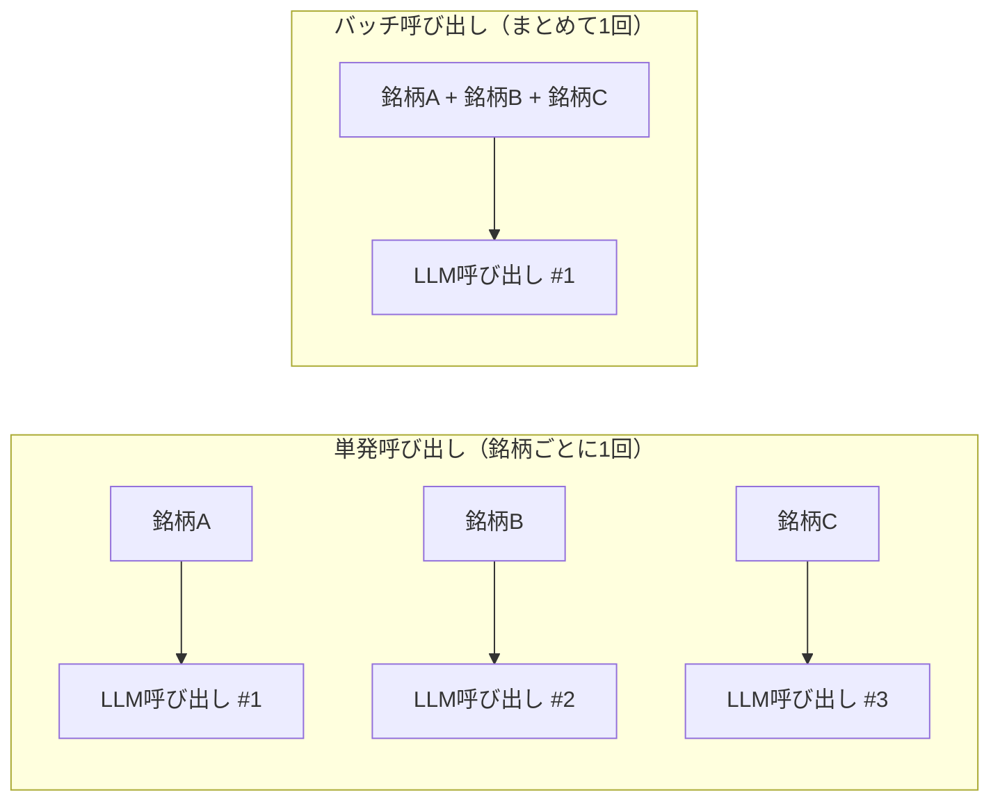

# 単発呼び出し vs バッチ呼び出し

## この教材で身につくこと

- 単発呼び出しとバッチ呼び出しの使い分け基準を説明できる
- バッチ化がAPIコストではなく何を削減しているかを説明できる
- バッチ結果の一部が欠けた場合の対処法を実装できる

## 概要

ここでいう「呼び出し」とは、`call_llm(prompt)`のようにLLMへ1回リクエストを送り、応答を受け取る一連の処理を指します。
01章の`call_llm`はCLIサブプロセスを毎回起動するため、1回の呼び出しには無視できない起動・終了のオーバーヘッドが伴います。

このオーバーヘッドは、対象件数が増えるほど無視できなくなります。
たとえば保有銘柄が20件あるとき、銘柄ごとに1回ずつ呼び出せば20回分の起動コストがかかりますが、20件分をまとめて1回で呼び出せば起動コストは1回分で済みます。
一方で、まとめすぎると1回の応答が壊れたときの影響範囲が広がる、というトレードオフもあります。

複数の対象（銘柄・ペアなど）にLLMでコメントを付けたいとき、1件ずつ呼び出すか、まとめて1回で呼び出すかは重要な設計判断です。
本教材では、`ai-stock-investing-tutorial`のアプリが採用しているバッチ化の方針と、単発呼び出しが適切なケースを対比して整理します。

## 位置づけ

01章で学んだJSON契約は、単発・バッチのどちらでも同じ形で使えます。
本教材は「何件分をまとめてプロンプトに詰め込むか」という設計軸を追加します。

## 主要概念・設計判断の解説

### `app/`の原則

アプリの設計書（`app/docs/app-design.md`）には次のように明記されています。

> 複数対象に対する処理（ニュースセンチメント・スクリーニングコメント・ランキングコメント・セクターローテーションコメント）は個別呼び出しではなく必ず1回のプロンプトにまとめてバッチ処理する（サブプロセス起動オーバーヘッドの削減）。
> 唯一の例外は銘柄詳細ダイアログのAIコメントで、こちらは性質上つねに単一銘柄分だけを都度呼び出す。

### バッチ化する理由は「APIコスト」ではない

一般的なSDK方式のLLM統合では、バッチ化はAPI課金の削減が主目的になりがちです。
しかし`app/`はCLIサブプロセス方式（01章）を採用しているため、削減対象は**サブプロセス起動オーバーヘッド**（CLIプロセスの起動・終了にかかる時間）です。
呼び出し方式が変われば、バッチ化のモチベーションも変わることを理解しておくと、自分のアプリでの判断がぶれません。

### 単発呼び出しが妥当なケース

銘柄詳細ダイアログは、ユーザー操作のたびに対象が1件に決まり、その場ですぐ結果を表示する必要があります。
他の対象とまとめて待たせる理由がないため、単発呼び出しのままで問題ありません。

### 単発 vs バッチの比較

ここまでの内容を整理すると、次の表のようになります。

| 観点 | 単発呼び出し | バッチ呼び出し |
|---|---|---|
| 向いている場面 | ユーザー操作のたびに対象が1件に決まる（銘柄詳細ダイアログ等） | 複数対象をまとめて処理できる（保有銘柄一覧のニュースセンチメント等） |
| メリット | 実装がシンプル。対象ごとに独立して結果を返せる | サブプロセス起動オーバーヘッドを対象件数分から1回分に削減できる |
| つまずきやすい点 | 対象件数が増えると呼び出し回数・待ち時間が比例して増える | 1回のLLM出力ゆれで、まとめた対象全体のJSONパースが失敗しうる（対処は03章） |
| `app/`での実例 | `prompt_patterns/stock_detail.py::build_stock_detail_prompt` | `analysis_agents/news_research_agent.py::research_news_batch` |

呼び出し回数の違いを図にすると、対象件数が増えるほどバッチ化の効果が大きくなることがより直感的にわかります。



対象が3件なら差は小さく見えますが、対象が20件・50件と増えるほど、単発方式の呼び出し回数（＝サブプロセス起動回数）は線形に増え続けます。
バッチ方式なら常に1回のままです。
この差が、`app/`が原則バッチ化を採用している理由です。

## 実ソースコード（Python / プロンプト例、出典パス明記）

バッチの例。出典: `ai-stock-investing-tutorial/app/analysis_agents/news_research_agent.py`

```python
def build_news_sentiment_prompt(news_by_ticker: dict[str, list[dict]]) -> str:
    # 全銘柄分のニュース見出しを1つのプロンプトにまとめてバッチ処理し、
    # 後段でticker単位にパースできるようJSON形式での出力を指示する。
    lines = [
        "以下は銘柄ごとの直近ニュース見出しです。",
        "各銘柄のニュースセンチメントを判定してください。",
        "出力は次の形式のJSONのみとしてください（説明文・コードブロック記法は不要です）。",
        '{"<ticker>": {"sentiment": "ポジティブ|ニュートラル|ネガティブ", "confidence": 0.0〜1.0}}',
        "",
    ]
    for ticker, items in news_by_ticker.items():
        titles = "\n".join(f"- {item['title']}" for item in items) or "- (ニュースなし)"
        lines.append(f"## {ticker}\n{titles}\n")
    return "\n".join(lines)


def research_news_batch(
    news_by_ticker: dict[str, list[dict]], call_llm=default_call_llm
) -> dict[str, dict]:
    prompt = build_news_sentiment_prompt(news_by_ticker)
    raw = call_llm(prompt)
    try:
        result = json.loads(strip_code_fence(raw))
    except json.JSONDecodeError:
        result = {}

    # LLMが一部の銘柄について結果を返さなかった場合でも、
    # 呼び出し元が全銘柄分のキーを期待できるようNoneで埋めて補完する。
    return {
        ticker: result.get(ticker, {"sentiment": None, "confidence": None})
        for ticker in news_by_ticker
    }
```

単発の例。出典: `ai-stock-investing-tutorial/app/prompt_patterns/stock_detail.py`

```python
def build_stock_detail_prompt(
    ticker: str, name: str | None, fundamentals: dict, technical: dict, news: list[dict]
) -> str:
    # 1銘柄のみを扱う。呼び出しごとに単一銘柄分の総合分析コメントを生成する。
    ...
```

バッチ呼び出しの入力（`news_by_ticker`）がどう組み立てられるかも見ておきます。
データ取得の並列化（`map_concurrently`）自体は03章のテーマですが、ここでは「バッチ呼び出しの入力をどう組み立てるか」に注目してください。
出典: `ai-stock-investing-tutorial/app/app_tabs/portfolio_tab.py`

```python
# 保有銘柄すべてのデータ取得を並列化し、待ち時間を短縮する
holding_tickers = [holding["ticker"] for holding in holdings]
with st.spinner("保有銘柄データを取得中..."):
    holding_results = map_concurrently(holding_tickers, _fetch_holding_data)

for ticker in holding_tickers:
    result = holding_results[ticker]
    if isinstance(result, Exception):
        continue
    history, fundamentals, technical, news = result
    ...
    news_by_ticker[ticker] = news

# 銘柄ごとのニュースをまとめてLLMに渡し、センチメントを一括判定する
news_sentiment_by_ticker = research_news_batch(news_by_ticker, call_llm=call_llm)
```

銘柄ごとのニュース取得はループで1件ずつ行いますが、LLM呼び出しは`news_by_ticker`という辞書にまとめてから最後に1回だけ実行しています。
「データ取得はループでよいが、LLM呼び出しはまとめる」という分担がポイントです。

## 演習課題

1. `news_research_agent.py`の`research_news_batch`を、銘柄ごとに個別呼び出しする実装に書き換える場合を考えてください。
   1. 保有銘柄5件のケースで、変更前後の呼び出し回数をそれぞれ試算してください。
   2. 書き換えによって失われるメリット（オーバーヘッド削減）を1文で説明してください。
   3. 逆に書き換えによって得られるメリットがもしあれば、1つ挙げてください。
2. 「バッチ化すべきだが現状は単発呼び出しになっている」機能が`app/`にあるか調べ、無ければ「無い」という結論とその理由を書いてください。

## 理解度チェック

- [ ] `app/`がバッチ化する理由を「APIコスト」ではなく正しい言葉で説明できる
- [ ] バッチ呼び出しで一部の対象だけ結果が欠けた場合の対処法を説明できる
- [ ] 単発呼び出しが妥当なケースの条件を説明できる
- [ ] バッチ呼び出しの入力データをどう組み立てるか、コードの流れを説明できる

---

[← 前へ: 構造化出力（JSON）の契約設計](01-structured-output-json-contract.md) | [次へ: 出力範囲の限定と禁止事項 →](03-prompt-scope-and-constraints.md)
