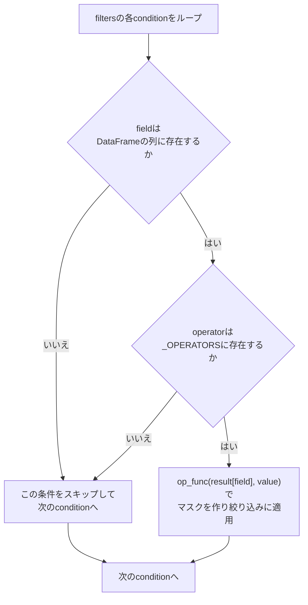

# 出力範囲の限定と禁止事項

## この教材で身につくこと

- 出力可能なフィールド・値域をプロンプトで限定する設計を実装できる
- ホワイトリスト方式の演算子マッピングがなぜ安全かを説明できる
- プロンプトでの限定とアプリ側の防御を二重化する設計を実装できる

## 概要

01章では「JSONで返してもらう」ところまでを扱いました。
しかしJSONとして正しくパースできても、中身が安全とは限りません。
LLMに自由なJSONを出力させると、アプリ側が想定していないフィールドや演算子（例: `<=`ではなく想定外の記号）が返ってくる可能性があります。

こうした想定外の値をそのままDataFrameの列指定や`eval`のような危険な処理に渡すと、アプリが例外で落ちる、最悪の場合は任意コード実行（インジェクション）につながるおそれもあります。
**ホワイトリスト方式**（許可する値だけを事前に列挙し、それ以外は一律拒否する方式）は、こうしたリスクを避ける代表的な防御手法です。

本教材では、出力可能な範囲をプロンプトの時点で限定し、さらにアプリ側でも安全に処理する二重の防御設計を扱います。

## 位置づけ

本教材はカテゴリ02の最終教材です。ここで学ぶ「限定」の考え方は、03章「Reliability & Cost」で扱う防御的パースの前段にあたります。

## 主要概念・設計判断の解説

### fieldとoperatorの限定

`build_screening_prompt`は、使用可能なfieldを`per`/`pbr`/`dividend_yield_pct`/`sector`の4つに限定するようプロンプト内で明示しています。
`sector`を使う場合のoperatorは`==`のみとし、valueは実在する業種名（`company_profiles`テーブルの`sector_jp`列。東証17業種区分）から選ばせることで表記ゆれを吸収しています。
呼び出し元の`app_tabs/screening_tab.py`が`load_all_company_profiles`（出典: `app/data_api/stock_price_api.py`）で全銘柄の`sector_jp`を取得し、重複を除いた一覧を`sectors`引数として`build_screening_prompt`に渡す流れです。

### プロンプトでの限定だけに頼らない

LLMがプロンプトの指示を無視して範囲外のfieldやoperatorを返す可能性はゼロではありません。
そのため`app/`は、アプリ側の`apply_filters`でもホワイトリスト外の値を無視する二重の防御をしています。

### 二重防御の比較

プロンプト側の限定とアプリ側の防御は、役割が異なります。

| 防御層 | 何をするか | 破られたらどうなるか | 破られる可能性 |
|---|---|---|---|
| プロンプトでの限定 | 使用可能なfield・operator・valueをLLMへの指示文で明示する | LLMが指示を無視し、想定外の値を出力する | ゼロではない（LLMは指示に従う保証がない） |
| アプリ側のホワイトリスト（`apply_filters`） | 想定外のfield・operatorをコードで機械的に無視する | 原理上、ホワイトリストの実装自体にバグがない限り破られない | 実装が正しい限りほぼ無い |

1段目（プロンプト）だけに頼ると、LLMの気まぐれな出力がそのまま危険な処理に渡ってしまいます。
2段目（アプリ側）だけに頼ると、LLMが無関係な出力を返す確率が上がり、ユーザー体験が悪化します。
両方を組み合わせることで、安全性とユーザー体験の両方を確保しています。

`apply_filters`が実際にどう分岐するかを図にすると、次のようになります。
表だけでは「1件の条件だけがスキップされ、残りは処理が続く」という挙動が伝わりにくいため、分岐をフローチャートで補足します。



条件を1件ずつ判定するため、複数条件のうち1件だけが不正でも、他の条件による絞り込みは正常に続行される点がポイントです。

## 実ソースコード（Python / プロンプト例、出典パス明記）

出典: `ai-stock-investing-tutorial/app/prompt_patterns/screening.py`

```python
# LLMが出力する演算子文字列を、実際に比較演算を行う関数へ安全にマッピングする。
# eval等を使わずホワイトリスト化することで、不正な演算子指定を無害化する。
_OPERATORS = {
    "<=": operator.le,
    ">=": operator.ge,
    "<": operator.lt,
    ">": operator.gt,
    "==": operator.eq,
}


def apply_filters(df: pd.DataFrame, filters: list[dict]) -> pd.DataFrame:
    # LLMが生成したフィルタ条件を順に適用する。存在しない列や未知の演算子は
    # 無視してスキップすることで、LLMの出力ゆれがあっても処理全体を落とさない。
    result = df
    for condition in filters:
        field = condition.get("field")
        op_symbol = condition.get("operator")
        value = condition.get("value")
        if field not in result.columns or op_symbol not in _OPERATORS:
            continue
        op_func = _OPERATORS[op_symbol]
        mask = result[field].notna() & op_func(result[field], value)
        result = result[mask]
    return result
```

### 良い例/悪い例

悪い例: 文字列演算子を直接評価する（インジェクションのリスク）。

```python
# 悪い例: LLMが返した演算子文字列をevalでそのまま実行する
mask = eval(f"df['{field}'] {op_symbol} {value}")
```

良い例: `_OPERATORS`辞書によるホワイトリスト化（存在しない演算子は`in`チェックで弾かれる）。

```python
# 良い例: ホワイトリストに無い演算子はスキップされ、evalは一切使わない
if op_symbol not in _OPERATORS:
    continue
op_func = _OPERATORS[op_symbol]
```

### valueの限定: sectorの表記ゆれ対策

field・operatorだけでなく、valueも限定できます。
`sector`のvalueは自由記述にせず、実在する業種名の一覧から選ばせています。
呼び出し元の一覧構築コードを見てみます。

出典: `ai-stock-investing-tutorial/app/app_tabs/screening_tab.py`

```python
company_profiles = load_all_company_profiles()
...
sector_jp_by_ticker = {
    p["ticker"]: p["sector_jp"] for p in company_profiles if p["sector_jp"]
}
...
prompt = build_screening_prompt(
    condition_text, sectors=sorted(set(sector_jp_by_ticker.values()))
)
```

`sorted(set(...))`で重複を除いた業種名の一覧を`sectors`引数に渡すことで、`build_screening_prompt`内の`sector_line`（valueとして使ってよい業種名を列挙する指示文）が組み立てられます。
valueの限定も、fieldやoperatorと同じ「許可リストをプロンプトに埋め込む」設計です。

## 演習課題

1. 新しいfield（例: `market_cap`）をスクリーニング条件に追加する場合を考えてください。
   1. `build_screening_prompt`のプロンプト文をどう変更する必要があるか書いてください。
   2. `_OPERATORS`辞書自体は変更が必要か、不要かを理由とともに説明してください。
   3. `apply_filters`側のコードは変更が必要か説明してください。
2. 悪い例（`eval`を使った実装）が実際に踏まれるとどんな入力で問題が起きるか、具体的な`condition_text`の例を1つ考えてください。

## 理解度チェック

- [ ] プロンプトでfieldを限定する目的を説明できる
- [ ] ホワイトリスト方式のoperatorマッピングがなぜ`eval`より安全か説明できる
- [ ] 自分の機能でLLMに渡す出力範囲をどう限定するか設計できる
- [ ] プロンプト側の限定とアプリ側の防御、それぞれが破られた場合に何が起きるか説明できる

---

[← 前へ: 単発呼び出し vs バッチ呼び出し](02-single-vs-batch-prompting.md) | [次へ: マルチターン（対話型）プロンプトの設計 →](04-multi-turn-dialogue-prompting.md)
