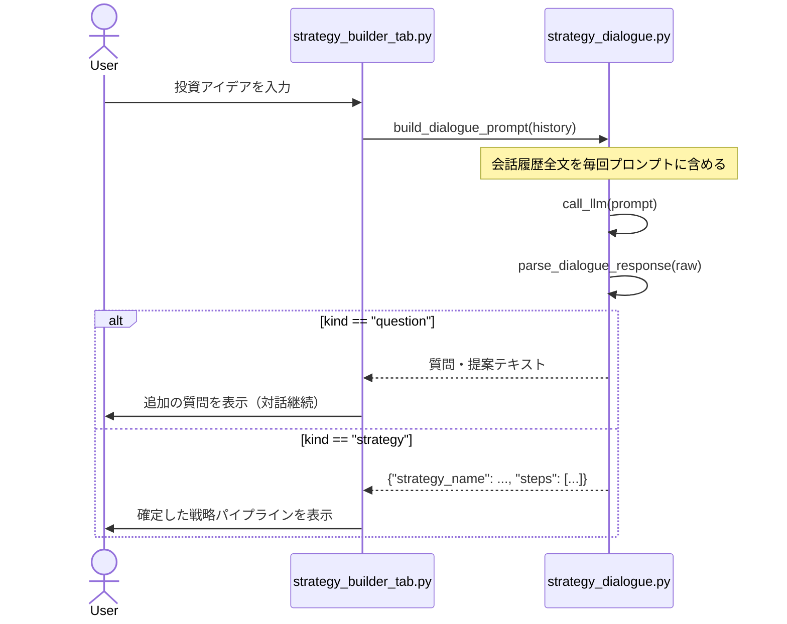

# マルチターン（対話型）プロンプトの設計

## この教材で身につくこと

- ステートレスな全履歴リプレイ方式でマルチターン対話を設計できる
- 応答を「対話継続（質問・提案）」と「確定出力（構造化データ）」に分岐処理する契約を実装できる
- マルチターン対話がターン数に比例してコストが増える点を理解し、設計時に考慮できる

## 概要

「マルチターン（Multi-turn）」とは、1回の質問・回答で終わらず、複数回のやり取り（ターン）を重ねて対話を進める形式のことです。
チャットボットのように、前のターンの内容を踏まえて次の回答が変わるのが特徴です。

ここで注意が必要なのは、「LLMが会話を覚えている」ように見えても、`app/`の`call_llm`自体には会話を記憶する仕組みが無い、という点です。
`call_llm`はCLIサブプロセスを毎回新規に起動する薄いラッパーであり、前のターンで何を話したかという状態（セッション状態）を一切保持しません。
このような性質を「ステートレス（Stateless、状態を持たない）」と呼びます。

本教材では、AI戦略ビルダー機能②の対話型スクリーニング条件構築（`strategy_dialogue.py`）を例に、このステートレスな呼び出しの制約の中でどうやって「対話しているように見せる」かを扱います。

## 位置づけ

02章の最後の教材です。01（構造化出力）・02（単発/バッチ）で学んだ「呼び出し単位」の設計軸に、3つ目の選択肢「マルチターン対話」を追加します。

## 主要概念・設計判断の解説

### ステートレスLLM呼び出しでの会話継続方法

`call_llm`はCLIサブプロセスを毎回起動する薄いラッパーで、ターン単位のセッション状態を持ちません（出典: `strategy_dialogue.py`冒頭のdocstring）。
そのため、各ターンで**会話履歴全文をプロンプトに含めて送信**することで「対話している」ように見せかけます。
この方式を、本教材では「全履歴リプレイ方式」と呼びます。

会話を継続させる方式には、全履歴リプレイ方式以外にも選択肢があります。
比較すると次のようになります。

| 方式 | 仕組み | 向いている場面 | つまずきやすい点 |
|---|---|---|---|
| 全履歴リプレイ方式（`app/`が採用） | 毎ターン、会話履歴全文をプロンプトに含めて送信する | ステートレスな呼び出し方式（CLIサブプロセス等）で、実装をシンプルに保ちたい場合 | ターン数が増えるほど送信トークン量が線形に増える（後述） |
| 履歴要約方式（本教材群のスコープ外） | 過去の履歴を要約し、要約結果だけをプロンプトに含める | 長い対話が想定され、トークン量の増加を抑えたい場合 | 要約の精度次第で、過去の合意事項が失われるリスクがある |
| API側のセッション管理（一部のLLM API） | LLM提供元のAPIが会話IDを発行し、履歴をサーバー側で保持する | ステートフルなAPI呼び出し方式を使える場合 | `app/`のCLIサブプロセス方式では利用できない |

`app/`が全履歴リプレイ方式を選んでいるのは、`call_llm`自体がステートレスであり、実装をシンプルに保てるためです。

### 2段階のペルソナ指示

`_PERSONA_INSTRUCTIONS_TEMPLATE`は、1つのプロンプトに2段階のステップを埋め込みます。

1. **ステップ1（アイデアの定量化）**: ユーザーの投資アイデアを具体化する質問・提案を1〜2個、短く行う。JSON形式は使わない。
   つまずきやすい点: 「JSON形式は使わない」と明示しないと、LLMがまだ条件が固まっていない段階で見切り発車のJSONを返すことがある。
2. **ステップ2（構造化データの出力）**: ユーザーと条件が合意できたら、説明文を含めず```json コードブロックのみで確定出力する。
   つまずきやすい点: ステップ1・2のどちらに進むかはLLM自身の判断に委ねられているため、アプリ側のコードでステップを明示的に切り替える分岐は存在しない（次項「応答の分岐解析」で判定する）。

アプリ側は毎ターン同じ指示文（`_PERSONA_INSTRUCTIONS_TEMPLATE`、使用できる関数一覧`{functions}`だけはターンによらず同じ内容で毎回展開）を送るだけです。
使用できる関数一覧はハードコードではなく、`strategy_builder/pipeline_functions.py`の`PIPELINE_FUNCTIONS`レジストリから`_format_pipeline_functions_for_prompt`が毎回組み立てます（05-03章 Orchestrator-Workersで扱うワーカーレジストリと同じもの）。

### 応答の分岐解析

`parse_dialogue_response`は、LLM応答を次のように判定します。

| 条件 | 判定結果 | 意味 |
|---|---|---|
| JSONとしてパースでき、かつ`strategy_name`と`steps`の両キーを含む | `{"kind": "strategy", "strategy": {...}}` | 確定出力（対話を終えて次の処理へ進む） |
| それ以外（パース失敗、または`strategy_name`か`steps`のどちらかを欠く） | `{"kind": "question", "text": raw}` | 対話継続（応答をそのまま質問・提案として表示） |

JSONパースに成功しても`strategy_name`が無ければ「question」として扱われる（`steps`のみで`strategy_name`を欠く場合も同様に「question」扱いになる）点がポイントです。
これにより、ステップ1の途中でLLMが誤って断片的なJSONらしき文字列を返しても、対話が壊れず継続します。

### コストの考慮

会話が長くなるほど、毎ターンの送信トークン量は履歴の長さに比例して線形に増えます。
10ターン目の呼び出しは、1ターン目の呼び出しよりもはるかに大きなプロンプトを毎回送信することになります。
会話履歴を要約して圧縮する対策は本教材群のスコープ外とし、将来の拡張候補とします。

## 実ソースコード（Python / プロンプト例、出典パス明記）

出典: `ai-stock-investing-tutorial/app/prompt_patterns/strategy_dialogue.py`
（`sectors`引数によるSECTOR表記ゆれ吸収の分岐は、下記コードでは簡略化して省略しています。理由は本セクション末尾で説明します）

````python
"""AI協調型のスクリーニングロジック構築（AI戦略ビルダー機能②）向けの
対話プロンプト構築・応答解析を行うモジュール。

data_api.llm_client.call_llm はターン単位のセッション状態を持たない
ステートレスなサブプロセス呼び出しのため、対話の各ターンで会話全履歴を
毎回プロンプトに含めて送信する。
"""

import json

from common.json_parsing import strip_code_fence
from strategy_builder.pipeline_functions import PIPELINE_FUNCTIONS


def _format_pipeline_functions_for_prompt() -> str:
    lines = []
    for name, entry in PIPELINE_FUNCTIONS.items():
        params_lines = "\n".join(
            f"    - {param}: {description}"
            for param, description in entry["params_schema"].items()
        )
        lines.append(f"- {name}: {entry['description']}\n  params:\n{params_lines}")
    return "\n".join(lines)


_PERSONA_INSTRUCTIONS_TEMPLATE = """\
あなた（AI）は、ユーザーの投資アイデアを厳密な「株式スクリーニング・パイプライン」へと
昇華させるプロのクオンツ・アナリストです。以下のステップに従ってユーザーをナビゲートしてください。

【ステップ1: アイデアの定量化】
ユーザーから「考え方」が入力されたら、それを歓迎し、以下の要素を具体化するための質問や提案を
1〜2個、短く行ってください。
1. どの関数（複数可）をどの順番で使うか
2. 各関数のパラメータ（戦略名・期間・閾値等）
このステップでは、説明文以外は出力しないでください。JSON形式は使わないでください。

【使用できる関数一覧】
{functions}

【ステップ2: 構造化データの出力】
ユーザーと条件が合意できたら、それ以外の説明文を一切含めず、必ず次のJSON形式のみを
```json コードブロックで返してください。
```json
{{
  "strategy_name": "確定した戦略名",
  "steps": [
    {{"function": "関数名", "params": {{...}}}}
  ]
}}
```
stepsは上記の関数一覧にある関数名のみを使い、必要な順番・組み合わせで並べてください。
"""


def build_dialogue_prompt(history: list[dict], sectors: list[str] | None = None) -> str:
    """会話履歴（[{"role": "user"|"assistant", "content": str}, ...]）から、
    ペルソナ指示と会話全文を含む1回分のLLM呼び出し用プロンプトを組み立てる。
    """
    persona = _PERSONA_INSTRUCTIONS_TEMPLATE.format(
        functions=_format_pipeline_functions_for_prompt()
    )
    transcript_lines = [
        f"{'ユーザー' if turn['role'] == 'user' else 'AI'}: {turn['content']}"
        for turn in history
    ]
    transcript = "\n".join(transcript_lines)
    return (
        f"{persona}"
        f"\n\n【これまでの会話】\n{transcript}\n\n【あなたの次の発言】"
    )


def parse_dialogue_response(raw: str) -> dict:
    """LLM応答を判定する。

    JSONコードブロックとして解析でき、かつ`strategy_name`と`steps`を
    含む場合は `{"kind": "strategy", "strategy": {...}}` を返す。
    それ以外は質問・提案テキストとして `{"kind": "question", "text": raw}` を返す。
    """
    try:
        parsed = json.loads(strip_code_fence(raw))
    except json.JSONDecodeError:
        return {"kind": "question", "text": raw.strip()}

    if (
        isinstance(parsed, dict)
        and "strategy_name" in parsed
        and "steps" in parsed
    ):
        return {"kind": "strategy", "strategy": parsed}
    return {"kind": "question", "text": raw.strip()}
````

使用できる関数一覧（`{functions}`）は、05-03章 Orchestrator-Workersで扱う`PIPELINE_FUNCTIONS`レジストリの`description`/`params_schema`から動的に組み立てられます。
ハードコードされた財務指標一覧ではなく、レジストリ側の関数追加・削除に自動で追従する設計です。

`sectors`引数によるSECTOR表記ゆれ吸収は、02-03章「出力範囲の限定と禁止事項」で学んだ内容と重複するため、本教材では説明を省略します。



### 比較: 全履歴を送らない単発呼び出しパターン

同じ`strategy_dialogue.py`には、これまで見てきた「会話継続」とは異なる性質のプロンプト生成関数もあります。
確定候補のJSONに対する評価フィードバックをもとに修正版を1回で生成させる`build_refinement_prompt`です（Evaluator-Optimizerパターンの改善ステップ）。

出典: `ai-stock-investing-tutorial/app/prompt_patterns/strategy_dialogue.py`

```python
def build_refinement_prompt(pending_strategy: dict, feedback: str) -> str:
    """確定候補の戦略JSONと評価フィードバックから、修正版JSONを1回で
    生成させる軽量プロンプト（Evaluator-Optimizerパターンの改善ステップ）。
    既存の対話ペルソナ指示（_PERSONA_INSTRUCTIONS_TEMPLATE）は使わない。"""
    strategy_json = json.dumps(pending_strategy, ensure_ascii=False, indent=2)
    return (
        "以下は投資戦略のスクリーニングパイプライン（JSON）と、その評価フィードバックです。\n\n"
        f"【現在の条件】\n{strategy_json}\n\n"
        f"【評価フィードバック】\n{feedback}\n\n"
        "このフィードバックを踏まえて修正し、それ以外の説明文を一切含めず、"
        "必ず次のJSON形式のみを```json コードブロックで返してください。\n"
        ...
    )
```

`build_dialogue_prompt`との違いがポイントです。
`build_refinement_prompt`は`history`（会話履歴）を一切受け取りません。
直前の確定候補（`pending_strategy`）と、その評価フィードバックだけを渡す**単発呼び出し**です（02章で学んだ単発/バッチの使い分けと同じ考え方が、マルチターン対話の中でも部分的に使われている例といえます）。
会話全体を対話継続させる必要がない場面では、無理に全履歴リプレイ方式に統一せず、単発呼び出しに切り替えたほうがプロンプトが短く済みます。

## 演習課題

1. 3ターン分の会話履歴がある状態で4ターン目を送信する場合を考えてください。
   1. 4ターン目のプロンプトに含まれる要素を、`build_dialogue_prompt`の戻り値の構造に沿って列挙してください。
   2. 3ターン目の送信時と比べて、送信トークン量がどう変化するか（増える/変わらない/減る）を説明してください。
   3. この変化が10ターン、20ターンと会話が続いた場合にどんな影響を及ぼすか、具体的に説明してください。
2. `parse_dialogue_response`がJSONパースに成功したが`strategy_name`キーが無い場合を考えてください。
   1. そのような応答が実際に返る具体例を1つ作ってください（例: ステップ1の途中でLLMが誤って`{"steps": []}`のような断片的なJSONを返す場合）。
   2. なぜ`question`種別として扱われるか、コードの分岐を追って説明してください。
   3. もし`strategy_name`キーの有無をチェックせず、`steps`キーの有無だけで判定していたら、どんな不具合が起きうるか考えてください。

## 理解度チェック

- [ ] ステートレスな呼び出しでマルチターン対話を実現する方法を説明できる
- [ ] 応答の分岐（質問継続/確定出力）をどう判定しているか説明できる
- [ ] マルチターン対話でコストが増える理由を説明できる
- [ ] 全履歴リプレイ方式と単発呼び出し（`build_refinement_prompt`）を、どんな基準で使い分けるか説明できる

---

[← 前へ: 出力範囲の限定と禁止事項](03-prompt-scope-and-constraints.md) | [次へ: 03-reliability-and-cost →](../03-reliability-and-cost/00-README.md)
