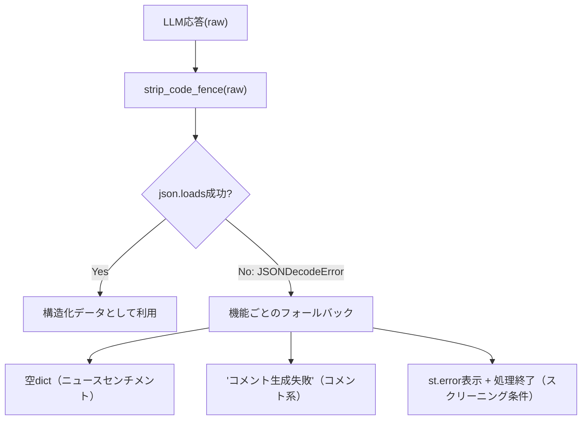

# 防御的パースとフォールバック設計

## この教材で身につくこと

- パース失敗時に機能ごとの安全な既定値へフォールバックする設計を実装できる
- フォールバック方針を機能のリスクに応じて使い分けられる
- パース失敗が起きても他の処理を止めない設計ができる

## 概要

LLMは指示通りの形式で必ず応答するとは限りません。
JSON形式をプロンプトで指示しても、説明文を混ぜて返す、フィールドが欠ける、括弧が閉じない、といった崩れた応答を返すことがあります。
このとき**パース**（テキストをPythonの辞書・リスト等のデータ構造に変換する処理）を行う`json.loads()`は`JSONDecodeError`という例外を送出します。
これをキャッチせず放置すると、例外がそのまま呼び出し元まで伝播し、その1回の失敗でアプリ全体が落ちる、または処理全体が止まってしまいます。
**フォールバック**とは、こうした通常経路の失敗時に使う「代わりの安全な既定値・処理」のことです。
02章で学んだJSON構造化出力の契約は、それでもLLMが不正なJSONを返す可能性を完全には排除できません。
本教材では、パース失敗を前提に、機能ごとに異なる安全なフォールバック方針を設計する方法を扱います。

## 位置づけ

02-01-structured-output-json-contract.mdで示した「strip_code_fence→json.loads」のパースが失敗した場合、具体的にどう振る舞うかを本教材で扱います。

## 主要概念・設計判断の解説

### 機能ごとに異なるフォールバック

`app/`には、パース失敗時の挙動が3パターンあります。

| 機能 | パース失敗時の挙動 | つまずきやすい点 |
|---|---|---|
| スクリーニング条件変換 | `st.error`表示 + 処理終了（実データに一切触れない） | 例外をキャッチし忘れると、崩れた応答のたびにアプリ全体が落ちる |
| 各種コメント一括生成 | 全対象に「コメント生成失敗」文字列 | 一部の対象だけ失敗した場合でも、成功分まで一律失敗扱いにしがち |
| ニュースセンチメント判定 | 空dict → 各銘柄`sentiment: None`扱い | `.get(ticker, 既定値)`を忘れると、省略された銘柄でKeyErrorになる |

### なぜフォールバックが機能ごとに違うか

「条件変換」は、誤った条件でユニバースを絞り込んでしまうとユーザーの意図と異なる銘柄が表示される実害が大きいため、処理そのものを止めます。
一方「コメント」はあくまで表示上の付加情報であり、失敗しても他の情報（価格・fundamentals等）の表示は継続すべきなので、プレースホルダー文字列で済ませて処理を続けます。

### フォールバック方針を選ぶ手順

新しい機能を作るとき、フォールバック方針は次の手順で決めます。

1. その機能が失敗した場合の実害を考える。
   - つまずきやすい点: 影響範囲をその機能だけでなく、後続処理全体まで含めて考える必要があります。
2. 実害が大きい機能は「処理を止める」方針を選ぶ。
   - 例: スクリーニング条件変換。
   - つまずきやすい点: 「止める」実装を忘れると、誤った絞り込み結果がそのまま使われてしまいます。
3. 実害が小さい付加情報は「安全な既定値で処理を継続する」方針を選ぶ。
   - 例: コメント生成、ニュースセンチメント判定。
   - つまずきやすい点: 既定値の型が呼び出し元の期待とずれていると、後続処理でKeyError/TypeErrorになります。
4. `try/except`では`json.JSONDecodeError`のみを捕捉する。
   - つまずきやすい点: `except Exception:`のように広く捕捉すると、本来気づくべき別のバグまで隠してしまいます。
5. 失敗を`logger.warning`等でログに記録する。
   - つまずきやすい点: フォールバックは画面上エラーに見えないため、ログが無いと失敗の発生自体に気づけません。

## 実ソースコード（Python / プロンプト例、出典パス明記）

出典: `ai-stock-investing-tutorial/app/prompt_patterns/screening.py`

```python
def generate_screening_comments(
    result_df: pd.DataFrame, call_llm=default_call_llm
) -> dict[str, str]:
    if result_df.empty:
        return {}

    prompt = build_comment_prompt(result_df)
    raw = call_llm(prompt)
    try:
        return json.loads(strip_code_fence(raw))
    except json.JSONDecodeError:
        # LLM応答が不正なJSONの場合は、銘柄ごとに失敗プレースホルダーを返し処理を継続する。
        return {ticker: "コメント生成失敗" for ticker in result_df["ticker"]}
```

出典: `ai-stock-investing-tutorial/app/analysis_agents/news_research_agent.py`

```python
try:
    result = json.loads(strip_code_fence(raw))
except json.JSONDecodeError:
    # LLM応答が不正な場合は空の結果として扱い、以降のフォールバック処理に委ねる。
    result = {}

return {
    ticker: result.get(ticker, {"sentiment": None, "confidence": None})
    for ticker in news_by_ticker
}
```

3つ目のパターン「処理そのものを止める」の実例です。

出典: `ai-stock-investing-tutorial/app/app_tabs/screening_tab.py`

```python
try:
    st.session_state["screening_filters"] = json.loads(strip_code_fence(raw_filters))
    st.session_state["screening_filters_error"] = False
except json.JSONDecodeError:
    # LLMの出力が不正なJSONだった場合はエラーとして扱い、フィルタなしにする
    logger.warning("スクリーニング条件のJSON解析に失敗しました")
    st.session_state["screening_filters"] = None
    st.session_state["screening_filters_error"] = True

filters = st.session_state.get("screening_filters")
if st.session_state.get("screening_filters_error"):
    st.error("条件の解釈に失敗しました。条件を言い換えて再度お試しください。")
```

コメント生成・センチメント判定と違い、`filters`は`None`のまま後続の絞り込み処理には一切渡されません（`if filters is not None:`の外側でのみ`st.error`を表示）。
「安全な既定値で継続」ではなく「実データに触れさせず止める」という、明確に異なる方針です。



## 演習課題

1. 「一括バックテストのランキングコメント」（`app/prompt_patterns/backtest_explanation.py`の`generate_ranking_comments`）のフォールバック実装を調べ、上記3種類のどのパターンに近いか分類してください。
2. 新機能で「パース失敗時に前回キャッシュ値を使う」という4つ目のフォールバック方針を採用する場合を考えてください。
   1. パース成功時に、結果をどこへキャッシュへ書き込むか決めてください。
   2. パース失敗時に、そのキャッシュをどう読み出すか擬似コードで書いてください。
   3. キャッシュも存在しない場合（初回呼び出し等）のフォールバックも決めてください。

## 理解度チェック

- [ ] 3種類のフォールバック方針とその使い分け基準を説明できる
- [ ] スクリーニング条件変換だけ処理を止める理由を説明できる
- [ ] 自分の機能に適したフォールバック方針を選べる
- [ ] フォールバック方針を選ぶ手順（実害の見積もり→方針選択→例外の絞り込み→ログ記録）を説明できる

---

[← 前へ: 00-README](00-README.md) | [次へ: レート制限・タイムアウト設計 →](02-rate-limit-and-timeout.md)
