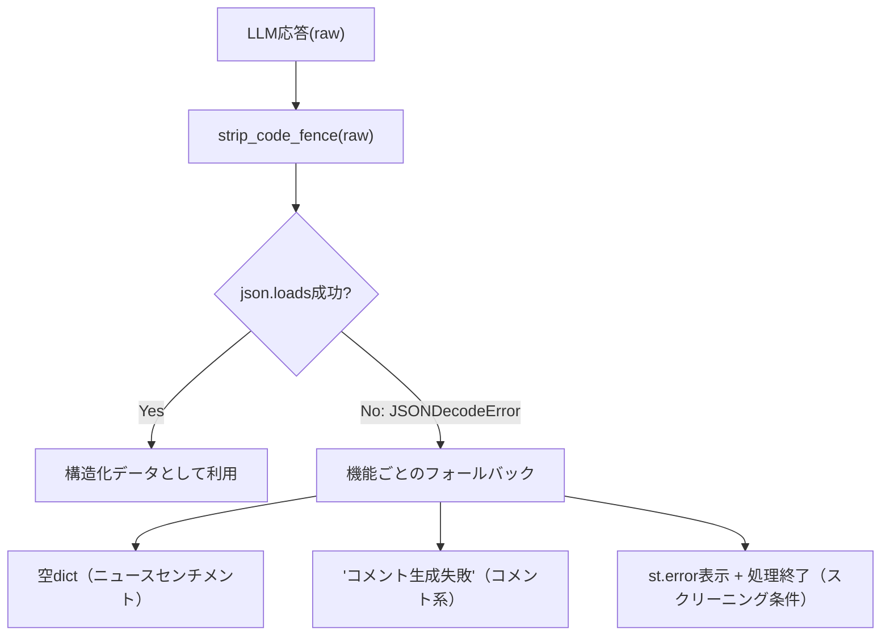

# 防御的パースとフォールバック設計

## この教材で身につくこと

- パース失敗時に機能ごとの安全な既定値へフォールバックする設計を実装できる
- フォールバック方針を機能のリスクに応じて使い分けられる
- パース失敗が起きても他の処理を止めない設計ができる

## 概要

02章で学んだJSON構造化出力の契約は、それでもLLMが不正なJSONを返す
可能性を完全には排除できません。本教材では、パース失敗を前提に、
機能ごとに異なる安全なフォールバック方針を設計する方法を扱います。

## 位置づけ

02-01-structured-output-json-contract.mdで示した
「strip_code_fence→json.loads」のパースが失敗した場合、
具体的にどう振る舞うかを本教材で扱います。

## 主要概念・設計判断の解説

### 機能ごとに異なるフォールバック

`app/`には、パース失敗時の挙動が3パターンあります。

| 機能 | パース失敗時の挙動 |
|---|---|
| スクリーニング条件変換 | `st.error`表示 + 処理終了（実データに一切触れない） |
| 各種コメント一括生成 | 全対象に「コメント生成失敗」文字列 |
| ニュースセンチメント判定 | 空dict → 各銘柄`sentiment: None`扱い |

### なぜフォールバックが機能ごとに違うか

「条件変換」は、誤った条件でユニバースを絞り込んでしまうと
ユーザーの意図と異なる銘柄が表示される実害が大きいため、処理そのものを
止めます。一方「コメント」はあくまで表示上の付加情報であり、
失敗しても他の情報（価格・fundamentals等）の表示は継続すべきなので、
プレースホルダー文字列で済ませて処理を続けます。

## 実ソースコード（Python / プロンプト例、出典パス明記）

出典: `ai-stock-investing-tutorial/app/prompt_patterns/screening.py`

```python
def generate_screening_comments(
    result_df: pd.DataFrame, call_llm=default_call_llm
) -> dict[str, str]:
    if result_df.empty:
        return {}

    prompt = build_comment_prompt(result_df)
    raw = call_llm(prompt)
    try:
        return json.loads(strip_code_fence(raw))
    except json.JSONDecodeError:
        # LLM応答が不正なJSONの場合は、銘柄ごとに失敗プレースホルダーを返し処理を継続する。
        return {ticker: "コメント生成失敗" for ticker in result_df["ticker"]}
```

出典: `ai-stock-investing-tutorial/app/analysis_agents/news_research_agent.py`

```python
try:
    result = json.loads(strip_code_fence(raw))
except json.JSONDecodeError:
    # LLM応答が不正な場合は空の結果として扱い、以降のフォールバック処理に委ねる。
    result = {}

return {
    ticker: result.get(ticker, {"sentiment": None, "confidence": None})
    for ticker in news_by_ticker
}
```



## 演習課題

1. 「一括バックテストのランキングコメント」（`app/prompt_patterns/backtest_explanation.py`
   の`generate_ranking_comments`）のフォールバック実装を調べ、
   上記3種類のどのパターンに近いか分類してください。
2. 新機能で「パース失敗時に前回キャッシュ値を使う」という4つ目のフォールバック
   方針を採用するなら、どんな実装になるか擬似コードで書いてください。

## 理解度チェック

- [ ] 3種類のフォールバック方針とその使い分け基準を説明できる
- [ ] スクリーニング条件変換だけ処理を止める理由を説明できる
- [ ] 自分の機能に適したフォールバック方針を選べる

---

[← 前へ: 00-README](00-README.md) | [次へ: レート制限・タイムアウト設計 →](02-rate-limit-and-timeout.md)
