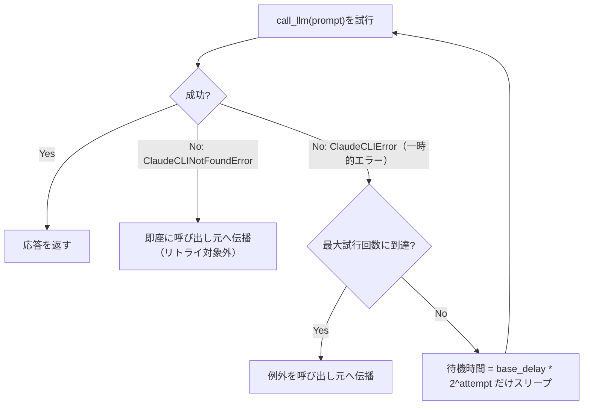

# レート制限・タイムアウト設計

## この教材で身につくこと

- タイムアウトを設定し、応答が返らないLLM呼び出しでアプリ全体が止まるのを防げる
- レート制限・一時的なエラーに対してリトライ/指数バックオフを実装できる
- リトライ対象にすべきエラーとすべきでないエラーを区別できる

## 概要

`app/`の`call_llm`が備える`timeout`引数を入口に、`app/`には実装されていない
リトライ/バックオフを汎用サンプルコードで補って解説します。

## 位置づけ

01（防御的パース）の直後に置く「呼び出し失敗への対処」ファミリーの教材です。
03（キャッシュ）以降の「コスト最適化」ファミリーとは役割が異なります。

## 主要概念・設計判断の解説

### `app/`のタイムアウト実装

`call_llm(prompt, timeout=120)`は`subprocess.run`に`timeout`を渡しています。
タイムアウト時は`subprocess.TimeoutExpired`が呼び出し元に伝播しますが、
現状`call_llm`内ではキャッチされていません。

### なぜタイムアウトが必要か

Streamlitのようなリクエスト応答型アプリでは、応答なしのプロセスが
ユーザー操作をブロックし続けます。タイムアウトを設定することで、
最悪の場合でも一定時間で処理が打ち切られることを保証できます。

### リトライすべきエラー・すべきでないエラー

- **一時的なエラー（リトライ対象）**: レート制限、タイムアウト、
  ネットワーク瞬断。時間を置けば成功する可能性がある
- **恒久的なエラー（リトライ対象外）**: 認証エラー、CLI未検出
  （`ClaudeCLINotFoundError`）。リトライしても解決しない

`app/`の`ClaudeCLIError`は上記の一時的なエラーを一括りにしているため、
レート制限だけを区別してリトライしたい場合は`stderr`文字列の判定が
必要になる、という設計トレードオフがあります。

### 指数バックオフ

失敗のたびに待機時間を倍にすることで、外部サービスへの負荷集中を
避けます。固定間隔でのリトライに比べ、一時的な過負荷からの回復を
妨げにくい設計です。

## 実ソースコード（Python / プロンプト例、出典パス明記）

出典: `ai-stock-investing-tutorial/app/data_api/llm_client.py`

```python
def call_llm(prompt: str, timeout: int = 120) -> str:
    """Claude Code CLIにプロンプトを渡し、応答テキストを取得する。"""
    executable = _resolve_claude_executable()
    result = subprocess.run(
        [executable, "--system-prompt", _SYSTEM_PROMPT, "-p"],
        input=prompt,
        capture_output=True,
        text=True,
        encoding="utf-8",
        timeout=timeout,
    )
    if result.returncode != 0:
        raise ClaudeCLIError(f"Claude Code CLIの実行に失敗しました: {result.stderr.strip()}")
    return result.stdout.strip()
```

`call_llm`自体にはリトライ実装が無いため、以下は汎用サンプルコードで
解説します。ただし同じ「一時的なエラーは指数バックオフでリトライ、恒久的な
エラーは即座に伝播」という原則は、LLM呼び出しより1段上のレイヤーで
`app/`にも実装があります（後述「`app/`での実例」）。

```python
import time

def call_llm_with_retry(prompt: str, max_retries: int = 3, base_delay: float = 2.0) -> str:
    """一時的なエラーに対して指数バックオフでリトライする。

    ClaudeCLINotFoundError（CLI未検出）はリトライしても解決しないため対象外とし、
    そのまま呼び出し元に伝播させる。
    """
    for attempt in range(max_retries):
        try:
            return call_llm(prompt)
        except ClaudeCLIError:
            if attempt == max_retries - 1:
                raise
            delay = base_delay * (2 ** attempt)
            time.sleep(delay)
    raise RuntimeError("unreachable")  # for文が必ずreturn/raiseするため到達しない
```



### `app/`での実例 — ワーカーステップ単位のリトライ

`app/`のAI戦略ビルダー（[03-orchestrator-workers.md](../05-agentic-workflow-patterns/03-orchestrator-workers.md)参照）の`run_pipeline`は、
上記と同じ`max_retries=3`・`base_delay=2.0`の指数バックオフで各ワーカー
ステップを実行します。呼び出し対象がLLMではなく決定的なPython関数
（価格取得等のネットワークI/Oを含む）である点が異なりますが、「一時的な
エラーはリトライ、恒久的なエラー（未知の`function`名等）はリトライしても
解決しないため即座に諦める」という判断基準は同じです。

出典: `ai-stock-investing-tutorial/app/strategy_builder/pipeline.py`

```python
_MAX_RETRIES = 3
_BASE_DELAY_SECONDS = 2.0


def _run_step_with_retry(run_func, candidates_df, params, cache_dir):
    """一時的なエラー（ネットワーク瞬断等）に対して指数バックオフでリトライする。
    未知のstrategy名等の恒久的なエラーもリトライ後は最終的に呼び出し元へ伝播する
    （リトライで解決しないため）。"""
    for attempt in range(_MAX_RETRIES):
        try:
            return run_func(candidates_df, params, cache_dir)
        except Exception:
            if attempt == _MAX_RETRIES - 1:
                raise
            time.sleep(_BASE_DELAY_SECONDS * (2 ** attempt))
```

`app/`にはこれとは別に、yfinance側のレート制限（`YFRateLimitError`）専用の
リトライも`data_api/stock_price_api.py`の`_call_with_rate_limit_retry`に
存在します（待機秒数30→60→120の固定バックオフ）。対象が汎用の`Exception`か
特定のレート制限エラーかで、待機時間の設計が異なる点を比較すると理解が
深まります。

## 演習課題

1. `max_retries=3`、`base_delay=2.0`のとき、各試行前の待機時間（秒）を
   計算してください（1回目0秒、2回目2秒、3回目4秒）。
2. `ClaudeCLINotFoundError`を`call_llm_with_retry`でリトライ対象にして
   しまった場合、何が起きるか説明してください。

## 理解度チェック

- [ ] タイムアウトがなぜ必要か説明できる
- [ ] リトライすべきエラーとすべきでないエラーを区別できる
- [ ] 指数バックオフの目的を説明できる

---

[← 前へ: 防御的パースとフォールバック設計](01-defensive-parsing-and-fallback.md) | [次へ: キャッシュ層の設計 →](03-caching-strategy.md)
