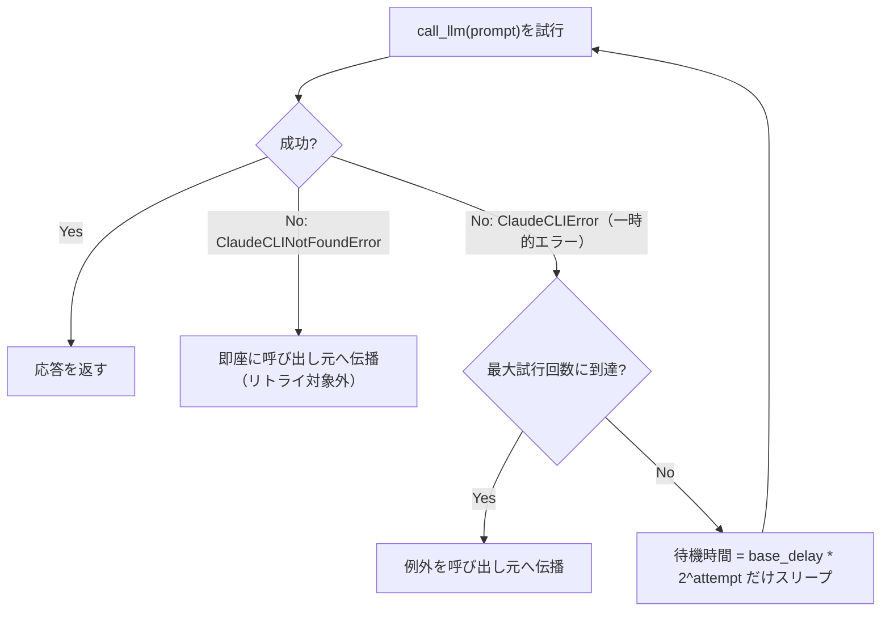

# レート制限・タイムアウト設計

## この教材で身につくこと

- タイムアウトを設定し、応答が返らないLLM呼び出しでアプリ全体が止まるのを防げる
- レート制限・一時的なエラーに対してリトライ/指数バックオフを実装できる
- リトライ対象にすべきエラーとすべきでないエラーを区別できる

## 概要

LLM呼び出しは、外部のAPIサーバーやCLIプロセスに依存する処理です。
ネットワークが不安定だったり、サーバー側が混雑していたりすると、応答が何十秒も返ってこないことがあります。
**タイムアウト**とは、指定した時間内に応答が無ければ処理を強制的に打ち切る仕組みです。
これが無いと、応答なしのプロセスに処理がずっと待たされ続け、Streamlitアプリの画面がフリーズしたように固まってしまいます。
また、短時間に大量のリクエストを送ると、サービス側から一時的に拒否される**レート制限（rate limit）**にも備える必要があります。
`app/`の`call_llm`が備える`timeout`引数を入口に、`app/`には実装されていないリトライ/バックオフを汎用サンプルコードで補って解説します。

## 位置づけ

01（防御的パース）の直後に置く「呼び出し失敗への対処」ファミリーの教材です。
03（キャッシュ）以降の「コスト最適化」ファミリーとは役割が異なります。

## 主要概念・設計判断の解説

### `app/`のタイムアウト実装

`call_llm(prompt, timeout=120)`は`subprocess.run`に`timeout`を渡しています。
タイムアウト時は`subprocess.TimeoutExpired`が呼び出し元に伝播しますが、現状`call_llm`内ではキャッチされていません。

### なぜタイムアウトが必要か

Streamlitのようなリクエスト応答型アプリでは、応答なしのプロセスがユーザー操作をブロックし続けます。
タイムアウトを設定することで、最悪の場合でも一定時間で処理が打ち切られることを保証できます。

### リトライすべきエラー・すべきでないエラー

| 分類 | 具体例 | リトライすべきか | つまずきやすい点 |
|---|---|---|---|
| 一時的なエラー | レート制限、タイムアウト、ネットワーク瞬断 | する（時間を置けば成功する可能性がある） | `except Exception:`のように広く捕捉すると、恒久的なエラーまで一時的なものとして扱ってしまう |
| 恒久的なエラー | 認証エラー、CLI未検出（`ClaudeCLINotFoundError`） | しない（リトライしても同じ理由で失敗し続ける） | 誤ってリトライ対象にすると、失敗が確定しているのに無駄な待機時間を挟んでしまう |

`app/`の`ClaudeCLIError`は上記の一時的なエラーを一括りにしているため、レート制限だけを区別してリトライしたい場合は`stderr`文字列の判定が必要になる、という設計トレードオフがあります。

### 指数バックオフ

失敗のたびに待機時間を倍にすることで、外部サービスへの負荷集中を避けます。
固定間隔でのリトライに比べ、一時的な過負荷からの回復を妨げにくい設計です。

### リトライ間隔の設計方式の比較

`app/`には、待機時間の決め方が異なる2つのリトライ実装があります。

| 方式 | 待機時間の決め方 | 向いている場面 | つまずきやすい点 |
|---|---|---|---|
| 指数バックオフ（`call_llm_with_retry`、後述のサンプル） | 失敗のたびに2倍（例: 2秒→4秒→8秒） | 相手側の混雑度が不明・変動する一般的なケース | 最大試行回数を決めないと待機時間が際限なく伸びる |
| 固定スケジュール（`_call_with_rate_limit_retry`、後述の実例） | あらかじめ決めた秒数列（例: 30秒→60秒→120秒） | 相手側のレート制限の回復時間がある程度予測できる場合 | スケジュールを変える際に定数配列を書き換える必要があり、動的な調整がしにくい |

## 実ソースコード（Python / プロンプト例、出典パス明記）

出典: `ai-stock-investing-tutorial/app/data_api/llm_client.py`

```python
def call_llm(prompt: str, timeout: int = 120) -> str:
    """Claude Code CLIにプロンプトを渡し、応答テキストを取得する。"""
    executable = _resolve_claude_executable()
    result = subprocess.run(
        [executable, "--system-prompt", _SYSTEM_PROMPT, "-p"],
        input=prompt,
        capture_output=True,
        text=True,
        encoding="utf-8",
        timeout=timeout,
    )
    if result.returncode != 0:
        raise ClaudeCLIError(f"Claude Code CLIの実行に失敗しました: {result.stderr.strip()}")
    return result.stdout.strip()
```

`call_llm`自体にはリトライ実装が無いため、以下は汎用サンプルコードで解説します。
ただし同じ「一時的なエラーは指数バックオフでリトライ、恒久的なエラーは即座に伝播」という原則は、LLM呼び出しより1段上のレイヤーで`app/`にも実装があります（後述「`app/`での実例」）。

```python
import time

def call_llm_with_retry(prompt: str, max_retries: int = 3, base_delay: float = 2.0) -> str:
    """一時的なエラーに対して指数バックオフでリトライする。

    ClaudeCLINotFoundError（CLI未検出）はリトライしても解決しないため対象外とし、
    そのまま呼び出し元に伝播させる。
    """
    for attempt in range(max_retries):
        try:
            return call_llm(prompt)
        except ClaudeCLIError:
            if attempt == max_retries - 1:
                raise
            delay = base_delay * (2 ** attempt)
            time.sleep(delay)
    raise RuntimeError("unreachable")  # for文が必ずreturn/raiseするため到達しない
```

### リトライ実装の手順

上記`call_llm_with_retry`は、次の手順で動きます。

1. `call_llm`を通常通り呼び出す。
   - つまずきやすい点: 本番相手にリトライロジックをテストすると、実際に何度もCLIを起動してしまいます。テストではモックします（05章参照）。
2. 例外の種類で分岐する。
   - `ClaudeCLINotFoundError`は即座に呼び出し元へ伝播させる。
   - `ClaudeCLIError`（一時的エラー）はリトライ対象にする。
   - つまずきやすい点: 例外の継承関係を確認せず`except Exception:`にすると、即座に諦めるべきエラーまでリトライしてしまいます。
3. 最大試行回数に達していなければ、待機してから再試行する。
   - つまずきやすい点: `attempt`を0始まりにし忘れると、`base_delay * (2 ** attempt)`の待機時間がずれます。
4. 最大試行回数に達したら、例外を呼び出し元へ伝播させる。
   - つまずきやすい点: ここで例外を握りつぶすと、呼び出し元は失敗に気づけないまま処理を続けてしまいます。



### `app/`での実例 — ワーカーステップ単位のリトライ

`app/`のAI戦略ビルダー（[03-orchestrator-workers.md](../05-agentic-workflow-patterns/03-orchestrator-workers.md)参照）の`run_pipeline`は、上記と同じ`max_retries=3`・`base_delay=2.0`の指数バックオフで各ワーカーステップを実行します。
呼び出し対象がLLMではなく決定的なPython関数（価格取得等のネットワークI/Oを含む）である点が異なりますが、「一時的なエラーはリトライ、恒久的なエラー（未知の`function`名等）はリトライしても解決しないため即座に諦める」という判断基準は同じです。

出典: `ai-stock-investing-tutorial/app/strategy_builder/pipeline.py`

```python
_MAX_RETRIES = 3
_BASE_DELAY_SECONDS = 2.0


def _run_step_with_retry(run_func, candidates_df, params, cache_dir):
    """一時的なエラー（ネットワーク瞬断等）に対して指数バックオフでリトライする。
    未知のstrategy名等の恒久的なエラーもリトライ後は最終的に呼び出し元へ伝播する
    （リトライで解決しないため）。"""
    for attempt in range(_MAX_RETRIES):
        try:
            return run_func(candidates_df, params, cache_dir)
        except Exception:
            if attempt == _MAX_RETRIES - 1:
                raise
            time.sleep(_BASE_DELAY_SECONDS * (2 ** attempt))
```

`app/`にはこれとは別に、yfinance側のレート制限（`YFRateLimitError`）専用のリトライも`data_api/stock_price_api.py`の`_call_with_rate_limit_retry`に存在します（待機秒数30→60→120の固定バックオフ）。
対象が汎用の`Exception`か特定のレート制限エラーかで、待機時間の設計が異なる点を比較すると理解が深まります。

出典: `ai-stock-investing-tutorial/app/data_api/stock_price_api.py`

```python
_RATE_LIMIT_RETRY_DELAYS_SEC: tuple[int | None, ...] = (30, 60, 120, None)


def _call_with_rate_limit_retry(fn):
    """yfinanceの1回の呼び出しをYFRateLimitError発生時にバックオフ付きで
    リトライする。Noneはこれ以上リトライせず例外を伝播させることを表す。"""
    for attempt, delay in enumerate(_RATE_LIMIT_RETRY_DELAYS_SEC):
        try:
            return fn()
        except YFRateLimitError:
            if delay is None:
                raise
            logger.warning(
                "yfinanceレート制限のため%d秒後にリトライします（%d回目）",
                delay,
                attempt + 1,
            )
            time.sleep(delay)
```

`call_llm_with_retry`と違い、待機秒数を`2 ** attempt`で計算せず、`_RATE_LIMIT_RETRY_DELAYS_SEC`という固定のタプルで管理しています。
最後の要素`None`が「これ以上リトライしない」の合図で、`for`ループの終端到達（＝最大試行回数超過）を待たずに判定できる、このモジュール独自の工夫です。

## 演習課題

1. `max_retries=3`、`base_delay=2.0`のとき、各試行前の待機時間（秒）を計算してください。
   1. 1回目の試行前の待機時間
   2. 2回目の試行前の待機時間
   3. 3回目の試行前の待機時間
   （ヒント: `base_delay * (2 ** attempt)`、attemptは0始まり）
2. `ClaudeCLINotFoundError`を`call_llm_with_retry`でリトライ対象にしてしまった場合、何が起きるか説明してください。
3. 指数バックオフ（`call_llm_with_retry`）と固定スケジュールのバックオフ（`_call_with_rate_limit_retry`）を比較し、後者のような固定スケジュールを選ぶ利点を説明してください。

## 理解度チェック

- [ ] タイムアウトがなぜ必要か説明できる
- [ ] リトライすべきエラーとすべきでないエラーを区別できる
- [ ] 指数バックオフの目的を説明できる
- [ ] 指数バックオフと固定スケジュールのバックオフ、それぞれ向いている場面を説明できる

---

[← 前へ: 防御的パースとフォールバック設計](01-defensive-parsing-and-fallback.md) | [次へ: キャッシュ層の設計 →](03-caching-strategy.md)
