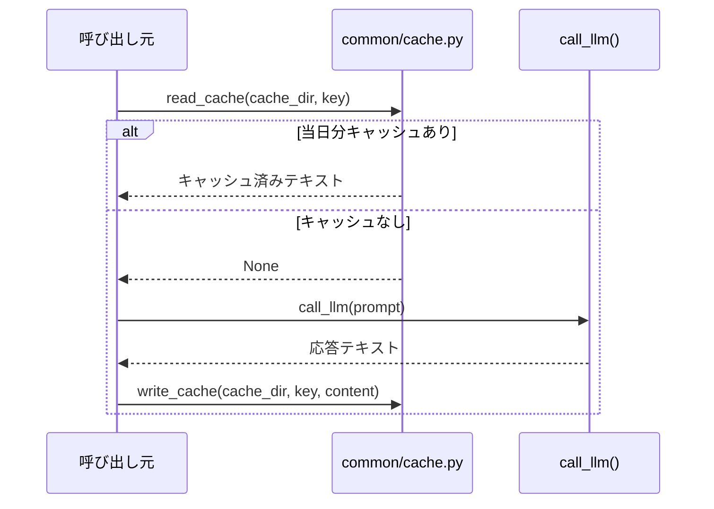

# キャッシュ層の設計

## この教材で身につくこと

- 日次ファイルキャッシュを設計し、同一入力への再計算コストを削減できる
- TTLベースではなく日付ベースのキャッシュを選ぶ利点を説明できる
- ユーザーが明示的に再計算をトリガーできる設計を実装できる

## 概要

LLM呼び出しは時間もコストもかかります。同じ入力に対して毎回
呼び出し直すのは無駄です。本教材では、`ai-stock-investing-tutorial`の
アプリが採用している「日次ファイルキャッシュ」というシンプルな
キャッシュ層の設計を扱います。

## 位置づけ

01章の防御的パースが「失敗にどう対処するか」を扱ったのに対し、
本教材は「そもそも呼び出し回数をどう減らすか」を扱います。

## 主要概念・設計判断の解説

### キャッシュキーの構成

キャッシュキーは「当日日付＋呼び出し元指定のキー文字列」で構成される
ファイルパス（例: `data/cache/YYYY-MM-DD-<key>.txt`）です。日付が変わると
自動的にキャッシュミスになる単純な設計です。

### なぜTTLではなく日付ベースか

TTL（Time To Live）ベースのキャッシュは、有効期限の管理やクリーンアップの
仕組みが別途必要になります。日付ベースなら、ファイル名を見るだけで
「いつのキャッシュか」が分かり、古いファイルの掃除も
「今日以外の日付のファイルを消す」だけで済みます。個人利用ツールにおいて、
実装・運用のシンプルさを優先した設計判断です。

### 明示的な再計算オプション

ユーザーが「キャッシュを無視して再生成する」チェックボックスをオンにすると、
`read_cache`自体を呼ばずに再計算します。これにより、日付が変わるのを
待たずにユーザー自身が最新化のタイミングを制御できます。

## 実ソースコード（Python / プロンプト例、出典パス明記）

出典: `ai-stock-investing-tutorial/app/common/cache.py`

```python
def get_cache_path(cache_dir: Path, key: str) -> Path:
    # キャッシュを日付単位で分けることで、日をまたいだ古い情報を自然に無効化する。
    today = datetime.date.today().isoformat()
    return Path(cache_dir) / f"{today}-{key}.txt"


def read_cache(cache_dir: Path, key: str) -> str | None:
    path = get_cache_path(cache_dir, key)
    if path.exists():
        logger.info("キャッシュヒット: %s", key)
        return path.read_text(encoding="utf-8")
    logger.info("キャッシュミス: %s", key)
    return None


def write_cache(cache_dir: Path, key: str, content: str) -> None:
    path = get_cache_path(cache_dir, key)
    # キャッシュディレクトリが未作成の場合に備え、書き込み前に作成しておく。
    path.parent.mkdir(parents=True, exist_ok=True)
    path.write_text(content, encoding="utf-8")
    logger.info("キャッシュ書き込み: %s", key)
```



### 良い例/悪い例

悪い例: キャッシュキーに現在時刻（秒単位）を含めてしまい、実質キャッシュが
一度もヒットしない。

```python
# 悪い例: 毎回異なるキーになり、キャッシュが機能しない
key = f"portfolio-review-{datetime.datetime.now().isoformat()}"
```

良い例: キャッシュキーに「内容のハッシュ」を使い、同一入力・同一日なら
確実にヒットする。

```python
# 良い例: 保有銘柄の構成が同じなら同じキーになる
key = "portfolio-review-" + hashlib.sha256(
    ":".join(f"{h['ticker']}:{h['shares']}:{h['cost']}" for h in holdings).encode()
).hexdigest()[:12]
```

## 演習課題

1. `read_cache`が返す値が「旧バージョン形式」で`json.loads`が失敗する場合の
   フォールバック（キャッシュ無視して再生成）を、`app/app_tabs/portfolio_tab.py`の
   該当箇所を参考に説明してください。
2. 日次キャッシュではなく「1時間TTLキャッシュ」に変更する場合、
   `get_cache_path`をどう書き換えるか実装してください。

## 理解度チェック

- [ ] 日次ファイルキャッシュのキー構成を説明できる
- [ ] TTLベースではなく日付ベースを選ぶ利点を説明できる
- [ ] 「キャッシュを無視して再生成する」オプションが必要な理由を説明できる

---

[← 前へ: レート制限・タイムアウト設計](02-rate-limit-and-timeout.md) | [次へ: バッチ化・並列化 →](04-batching-and-parallelization.md)
