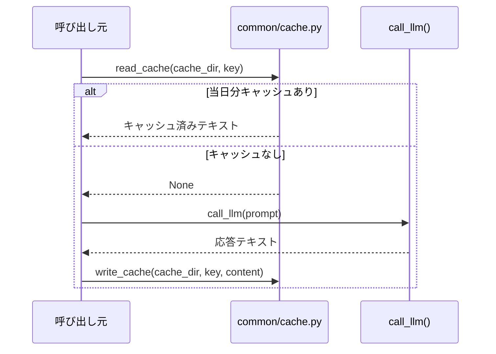

# キャッシュ層の設計

## この教材で身につくこと

- 日次ファイルキャッシュを設計し、同一入力への再計算コストを削減できる
- TTLベースではなく日付ベースのキャッシュを選ぶ利点を説明できる
- ユーザーが明示的に再計算をトリガーできる設計を実装できる

## 概要

**キャッシュ**とは、一度計算した結果を保存しておき、同じ入力が来たときは再計算せずその保存済みの結果を返す仕組みです。
LLM呼び出しは時間もコストもかかります。
同じ入力に対して毎回呼び出し直すのは無駄です。
特にStreamlitは、ユーザーがボタンを押す・入力するといった操作のたびにスクリプト全体を最初から実行し直す仕組み（rerun）を持ちます。
キャッシュが無いと、同じ画面を触るだけで何度もLLMを呼び直してしまい、API利用料が想定外に膨らむ危険があります。
本教材では、`ai-stock-investing-tutorial`のアプリが採用している「日次ファイルキャッシュ」というシンプルなキャッシュ層の設計を扱います。

## 位置づけ

01章の防御的パースが「失敗にどう対処するか」を扱ったのに対し、本教材は「そもそも呼び出し回数をどう減らすか」を扱います。

## 主要概念・設計判断の解説

### キャッシュキーの構成

キャッシュキーは「当日日付＋呼び出し元指定のキー文字列」で構成されるファイルパス（例: `data/cache/YYYY-MM-DD-<key>.txt`）です。
日付が変わると自動的にキャッシュミスになる単純な設計です。

### なぜTTLではなく日付ベースか

TTL（Time To Live）ベースのキャッシュは、有効期限の管理やクリーンアップの仕組みが別途必要になります。
日付ベースなら、ファイル名を見るだけで「いつのキャッシュか」が分かり、古いファイルの掃除も「今日以外の日付のファイルを消す」だけで済みます。
個人利用ツールにおいて、実装・運用のシンプルさを優先した設計判断です。

### 明示的な再計算オプション

ユーザーが「キャッシュを無視して再生成する」チェックボックスをオンにすると、`read_cache`自体を呼ばずに再計算します。
これにより、日付が変わるのを待たずにユーザー自身が最新化のタイミングを制御できます。

### `app/`にある3種類のキャッシュ層の比較

`app/`には、役割の異なる3種類のキャッシュ（無効化戦略）が併存しています。
それぞれ守備範囲が違うため、混同しないことが大切です。

| 方式 | 無効化のタイミング | 向いている場面 | つまずきやすい点 |
|---|---|---|---|
| 日次ファイルキャッシュ（`common/cache.py`） | 日付が変わったら自動的にミス | LLM呼び出し結果など、1日単位で鮮度が保てればよい重い処理 | ファイルシステムへの書き込み権限・古いファイルの掃除運用が別途必要 |
| TTLベースの前段キャッシュ（`st.cache_data(ttl=60)`、`app_tabs/shared.py`） | 経過秒数（例: 60秒）で自動的にミス | 同一セッション内の連続rerunだけを防ぎたい軽い処理 | プロセス内メモリキャッシュのため、別プロセス・別ユーザー間では共有されない |
| 明示的な再計算オプション | ユーザー操作（チェックボックス）でキャッシュを無視 | ユーザー自身が最新化のタイミングを判断すべき場面 | チェックを外し忘れると、意図せず古い結果が使われ続ける |

出典: `ai-stock-investing-tutorial/app/app_tabs/shared.py`

```python
@st.cache_data(ttl=60)
def cached_fetch_price_history(ticker: str, period: str):
    """株価履歴はDB（PriceHistory）で全ユーザー共有・長期キャッシュされているため、
    ここでは同一セッション内の連続rerunでDB問い合わせを繰り返さない薄い前段
    キャッシュとして短時間だけ保持する。"""
    return fetch_price_history(ticker, period=period)
```

この`st.cache_data`は日次ファイルキャッシュと別レイヤーです。
下位の`fetch_price_history`自体がDBを使った長期キャッシュ（read-through）を持っているため、ここでは「同じrerun中にDBへ何度も問い合わせない」という短時間の前段キャッシュとして使い分けられています。

### キャッシュ層を実装する手順

新しいキャッシュ付き処理を追加するときは、次の手順で設計します。

1. キャッシュキーを設計する。何を「同一入力」とみなすか決める。
   - つまずきやすい点: 呼び出し元の状態（時刻など）を安易にキーへ含めると、後述する「悪い例」のようにキャッシュが機能しません。
2. `read_cache`→ミス時のみ計算→`write_cache`という順で呼び出す。
   - つまずきやすい点: 計算結果を書き込む前に`return`してしまうと、次回また同じ計算が走ってしまいます。
3. ユーザーが明示的に再計算できるオプションを用意する。
   - つまずきやすい点: オプションを用意し忘れると、日付が変わるまでユーザーは古い結果から抜け出せません。

## 実ソースコード（Python / プロンプト例、出典パス明記）

出典: `ai-stock-investing-tutorial/app/common/cache.py`

```python
def get_cache_path(cache_dir: Path, key: str) -> Path:
    # キャッシュを日付単位で分けることで、日をまたいだ古い情報を自然に無効化する。
    today = datetime.date.today().isoformat()
    return Path(cache_dir) / f"{today}-{key}.txt"


def read_cache(cache_dir: Path, key: str) -> str | None:
    path = get_cache_path(cache_dir, key)
    if path.exists():
        logger.info("キャッシュヒット: %s", key)
        return path.read_text(encoding="utf-8")
    logger.info("キャッシュミス: %s", key)
    return None


def write_cache(cache_dir: Path, key: str, content: str) -> None:
    path = get_cache_path(cache_dir, key)
    # キャッシュディレクトリが未作成の場合に備え、書き込み前に作成しておく。
    path.parent.mkdir(parents=True, exist_ok=True)
    path.write_text(content, encoding="utf-8")
    logger.info("キャッシュ書き込み: %s", key)
```



### 良い例/悪い例

悪い例: キャッシュキーに現在時刻（秒単位）を含めてしまい、実質キャッシュが一度もヒットしない。

```python
# 悪い例: 毎回異なるキーになり、キャッシュが機能しない
key = f"portfolio-review-{datetime.datetime.now().isoformat()}"
```

良い例: キャッシュキーに「内容のハッシュ」を使い、同一入力・同一日なら確実にヒットする。

出典: `ai-stock-investing-tutorial/app/app_tabs/portfolio_tab.py`

```python
# 良い例: 保有銘柄の構成（ticker・shares・cost）が同じなら同じキーになる
cache_key = "portfolio-review-" + hashlib.sha256(
    "-".join(f"{h['ticker']}:{h['shares']}:{h['cost']}" for h in holdings).encode("utf-8")
).hexdigest()[:12]
```

## 演習課題

1. `read_cache`が返す値が「旧バージョン形式」で`json.loads`が失敗する場合のフォールバック（キャッシュ無視して再生成）を、`app/app_tabs/portfolio_tab.py`の該当箇所を参考に説明してください。
2. 日次キャッシュではなく「1時間TTLキャッシュ」に変更する場合を考えてください。
   1. `get_cache_path`の日付部分をどう書き換えるか実装してください。
   2. 変更後、古くなったキャッシュファイルの掃除方法がどう変わるか説明してください（日付ベースの「今日以外を消す」が使えなくなる点）。

## 理解度チェック

- [ ] 日次ファイルキャッシュのキー構成を説明できる
- [ ] TTLベースではなく日付ベースを選ぶ利点を説明できる
- [ ] 「キャッシュを無視して再生成する」オプションが必要な理由を説明できる
- [ ] 日次ファイルキャッシュと`st.cache_data(ttl=60)`の前段キャッシュ、それぞれの役割の違いを説明できる

---

[← 前へ: レート制限・タイムアウト設計](02-rate-limit-and-timeout.md) | [次へ: バッチ化・並列化 →](04-batching-and-parallelization.md)
