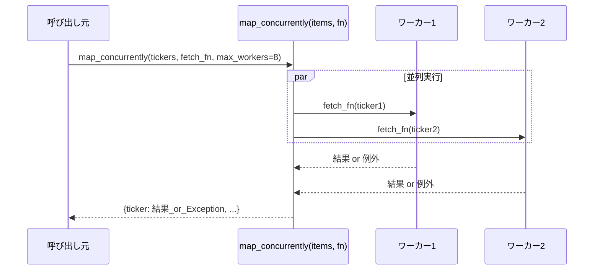

# バッチ化・並列化

## この教材で身につくこと

- 複数対象のデータ取得・処理を並列化し、個別の失敗が全体を止めない設計を実装できる
- 並列化がAnthropicのどのワークフローパターンに対応するか説明できる
- データ取得の並列化とLLM呼び出しのバッチ化を使い分けられる

## 概要

**並列化**とは、独立した複数の処理を同時に実行し、合計の待ち時間を短縮する手法です。
例えば10銘柄の株価を1つずつ順番に取得すると、1銘柄あたり1秒でも合計10秒かかります。
並列化すれば、複数の取得を同時に走らせることで、合計時間を1銘柄分の時間に近づけられます。
02章で学んだ「LLM呼び出しのバッチ化」とは別に、株価・fundamentals等の**データ取得**を並列化することでも待ち時間を削減できます。
本教材では、`ai-stock-investing-tutorial`のアプリが使う`map_concurrently`の設計を扱います。

## 位置づけ

02-02-single-vs-batch-prompting.mdで学んだ「LLM呼び出し1回にまとめる」バッチ化と、本教材の「複数の独立したタスクを同時実行する」並列化は別の技術です。
両方を組み合わせて使うこともできます。

## 主要概念・設計判断の解説

### バッチ化と並列化の違い

用語が似ているため混同しやすいですが、削減する対象が異なります。

| 観点 | バッチ化（LLM呼び出し） | 並列化（データ取得） |
|---|---|---|
| 何をまとめるか | 複数対象を1回のプロンプト・応答にまとめる | 複数の独立したリクエストを同時に実行する |
| 削減する対象 | 呼び出し回数（CLIサブプロセス起動コスト） | 待ち時間（合計のレイテンシ） |
| 向いている場面 | 対象間に依存が無く、1回の応答にまとめられる場合 | ネットワークI/O待ちが支配的で、対象ごとに別々のAPIを叩く場合 |
| つまずきやすい点 | プロンプトが長くなりすぎると、LLMが一部の指示を見落としやすくなる | スレッド数（`max_workers`）を増やしすぎると相手側のレート制限に抵触しやすくなる |

### Parallelizationパターンとの対応

Anthropicの[Building Effective Agents](https://www.anthropic.com/research/building-effective-agents)は、複数の独立したサブタスクを同時実行する構成を「Parallelization」（sectioning）というワークフローパターンとして紹介しています。
`map_concurrently`による並列データ取得は、このパターンに相当します。

### 部分失敗を許容する設計

`map_concurrently`は、1つの対象の処理で例外が発生しても、その例外自体を結果として格納し、他の対象の処理を止めません。
呼び出し元は`isinstance(result, Exception)`で判定し、失敗した対象だけをスキップできます。

### Streamlit特有の注意点

ワーカースレッドには呼び出し元の`ScriptRunContext`が引き継がれないため、スレッド内で`st.cache_data`等を呼ぶと警告が出ます。
`map_concurrently`は`add_script_run_ctx`でこれを明示的に伝播させています。

### `map_concurrently`を使う実装手順

1. 並列化したい対象のリスト（例: tickers）を用意する。
   - つまずきやすい点: 空リストを渡した場合の挙動を事前に確認しておく（`map_concurrently`は空なら即座に`{}`を返す）。
2. 1件を処理する関数（例: `fetch_fundamentals`）を用意する。
   - つまずきやすい点: 関数内で`st.cache_data`等のStreamlit専用APIを呼ぶ場合、ワーカースレッドへの`ScriptRunContext`伝播を意識する。
3. `map_concurrently(items, fn, max_workers=...)`を呼び出す。
   - つまずきやすい点: `max_workers`を大きくしすぎると、外部APIのレート制限に抵触しやすくなる。
4. 結果を`isinstance(result, Exception)`で判定し、失敗した対象をスキップする。
   - つまずきやすい点: この判定を忘れると、例外オブジェクトをそのままデータとして扱ってしまいバグになる。

## 実ソースコード（Python / プロンプト例、出典パス明記）

出典: `ai-stock-investing-tutorial/app/common/concurrency.py`

```python
def map_concurrently(items: list, fn, max_workers: int = 8) -> dict:
    """Apply fn to each item concurrently, returning {item: result_or_exception}.

    An exception raised by fn for one item is captured as that item's value
    instead of propagating, so a single failure doesn't block the others.
    """
    if not items:
        return {}

    results = {}
    ctx = get_script_run_ctx()

    def _run(item):
        if ctx is not None:
            add_script_run_ctx(threading.current_thread(), ctx)
        return fn(item)

    with ThreadPoolExecutor(max_workers=min(max_workers, len(items))) as executor:
        future_to_item = {executor.submit(_run, item): item for item in items}
        for future in as_completed(future_to_item):
            item = future_to_item[future]
            try:
                results[item] = future.result()
            except Exception as exc:  # noqa: BLE001 - intentionally captured per item
                # 1件の失敗が全体を止めないよう、例外自体を結果として格納し呼び出し元に委ねる。
                results[item] = exc
    return results
```



`map_concurrently`自体は汎用ユーティリティです。
実際の呼び出し元では「並列実行を依頼する」「結果から失敗をスキップする」という2つの役割が呼び出し側のコードに現れます。
次は、ユニバース全銘柄のfundamentalsをまとめて取得する呼び出し元の実例です。

出典: `ai-stock-investing-tutorial/app/data_api/stock_price_api.py`

```python
def fetch_universe_fundamentals(
    tickers: list[str],
    session_factory=SessionLocal,
    fetch_fundamentals=fetch_fundamentals,
) -> pd.DataFrame:
    """複数銘柄のファンダメンタルズをまとめて取得し、DataFrameとして返す。"""
    results = map_concurrently(
        tickers, lambda ticker: fetch_fundamentals(ticker, session_factory=session_factory)
    )
    rows = []
    for ticker_symbol in tickers:
        data = results[ticker_symbol]
        # 個別銘柄の取得失敗（例外）は全体を止めず、その銘柄だけスキップする
        if isinstance(data, Exception):
            continue
        rows.append({"ticker": data.get("ticker", ticker_symbol), "per": data.get("trailing_pe")})
    return pd.DataFrame(rows)
```

`map_concurrently`が返す`results`は`{ticker: 結果 or 例外}`という辞書です。
呼び出し元は`for`ループで全ticker分を回し、`isinstance(data, Exception)`で失敗した銘柄だけを飛ばします。
これにより、1銘柄の取得失敗が残り全銘柄の処理を止めません。

## 演習課題

1. `map_concurrently`の`max_workers`を8から1に変えた場合の挙動の変化（並列度が失われるだけで結果の形は変わらないこと）を説明してください。
2. `map_concurrently`をLLM呼び出し（`call_llm`）に対して使う場合を考えてください。
   1. CLIサブプロセスの起動コストが1回あたりどの程度かかりそうか、`data_api/llm_client.py`のコメントを参考に考えてください。
   2. 02章のバッチ化と比較し、どちらが適切か判断してください。

## 理解度チェック

- [ ] `map_concurrently`がAnthropicのどのワークフローパターンに対応するか説明できる
- [ ] 1件の失敗が全体を止めない設計をどう実現しているか説明できる
- [ ] バッチ化と並列化、それぞれが削減する対象（呼び出し回数 or 待ち時間）を説明できる
- [ ] データ取得の並列化とLLM呼び出しのバッチ化を使い分けられる

---

[← 前へ: キャッシュ層の設計](03-caching-strategy.md) | [次へ: LLM呼び出しのテスト →](05-testing-llm-integrations.md)
