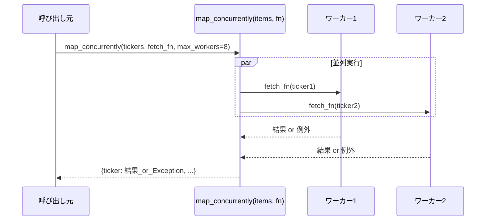

# バッチ化・並列化

## この教材で身につくこと

- 複数対象のデータ取得・処理を並列化し、個別の失敗が全体を止めない設計を実装できる
- 並列化がAnthropicのどのワークフローパターンに対応するか説明できる
- データ取得の並列化とLLM呼び出しのバッチ化を使い分けられる

## 概要

02章で学んだ「LLM呼び出しのバッチ化」とは別に、株価・fundamentals等の
**データ取得**を並列化することでも待ち時間を削減できます。本教材では、
`ai-stock-investing-tutorial`のアプリが使う`map_concurrently`の設計を扱います。

## 位置づけ

02-02-single-vs-batch-prompting.mdで学んだ「LLM呼び出し1回にまとめる」
バッチ化と、本教材の「複数の独立したタスクを同時実行する」並列化は
別の技術です。両方を組み合わせて使うこともできます。

## 主要概念・設計判断の解説

### Parallelizationパターンとの対応

Anthropicの
[Building Effective Agents](https://www.anthropic.com/research/building-effective-agents)
は、複数の独立したサブタスクを同時実行する構成を「Parallelization」
（sectioning）というワークフローパターンとして紹介しています。
`map_concurrently`による並列データ取得は、このパターンに相当します。

### 部分失敗を許容する設計

`map_concurrently`は、1つの対象の処理で例外が発生しても、
その例外自体を結果として格納し、他の対象の処理を止めません。
呼び出し元は`isinstance(result, Exception)`で判定し、
失敗した対象だけをスキップできます。

### Streamlit特有の注意点

ワーカースレッドには呼び出し元の`ScriptRunContext`が引き継がれないため、
スレッド内で`st.cache_data`等を呼ぶと警告が出ます。`map_concurrently`は
`add_script_run_ctx`でこれを明示的に伝播させています。

## 実ソースコード（Python / プロンプト例、出典パス明記）

出典: `ai-stock-investing-tutorial/app/common/concurrency.py`

```python
def map_concurrently(items: list, fn, max_workers: int = 8) -> dict:
    """Apply fn to each item concurrently, returning {item: result_or_exception}.

    An exception raised by fn for one item is captured as that item's value
    instead of propagating, so a single failure doesn't block the others.
    """
    if not items:
        return {}

    results = {}
    ctx = get_script_run_ctx()

    def _run(item):
        if ctx is not None:
            add_script_run_ctx(threading.current_thread(), ctx)
        return fn(item)

    with ThreadPoolExecutor(max_workers=min(max_workers, len(items))) as executor:
        future_to_item = {executor.submit(_run, item): item for item in items}
        for future in as_completed(future_to_item):
            item = future_to_item[future]
            try:
                results[item] = future.result()
            except Exception as exc:  # noqa: BLE001 - intentionally captured per item
                # 1件の失敗が全体を止めないよう、例外自体を結果として格納し呼び出し元に委ねる。
                results[item] = exc
    return results
```



## 演習課題

1. `map_concurrently`の`max_workers`を8から1に変えた場合の挙動の変化
   （並列度が失われるだけで結果の形は変わらないこと）を説明してください。
2. `map_concurrently`をLLM呼び出し（`call_llm`）に対して使う場合、
   02章のバッチ化と比べてどちらが適切か、CLIサブプロセス起動コストの観点で
   判断してください。

## 理解度チェック

- [ ] `map_concurrently`がAnthropicのどのワークフローパターンに対応するか説明できる
- [ ] 1件の失敗が全体を止めない設計をどう実現しているか説明できる
- [ ] データ取得の並列化とLLM呼び出しのバッチ化を使い分けられる

---

[← 前へ: キャッシュ層の設計](03-caching-strategy.md) | [次へ: LLM呼び出しのテスト →](05-testing-llm-integrations.md)
