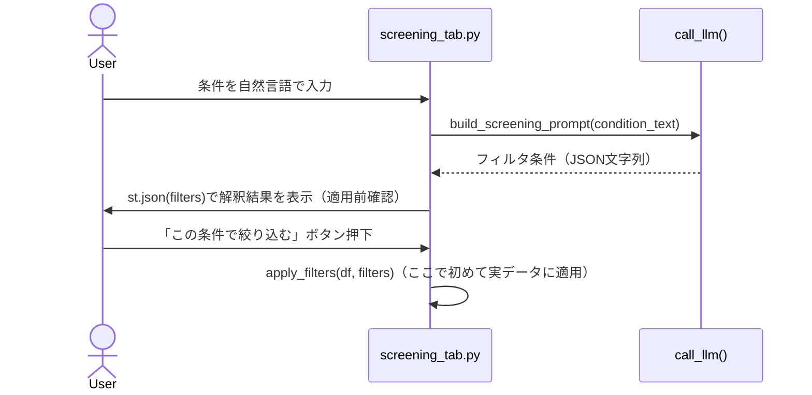

# 確認ステップ（Verificationパターン）

## この教材で身につくこと

- AIが解釈・生成した結果をユーザーに確認させてから実データへ適用するUI設計ができる
- 確認の強度をリスク・不可逆性に応じて調整する考え方を説明できる
- `app/`で確認ステップがある機能とない機能の違いを判断基準とともに説明できる

## 概要

生成AIは、もっともらしく見える誤った出力（ハルシネーション）を返すことがあります。
ユーザーがそれに気づかないまま実行してしまうと、誤った条件で銘柄を絞り込む、誤ったデータで処理を進めるといった実害につながります。
この失敗を防ぐ設計の総称が「Human-in-the-loop」（人間が処理の途中に介在し、最終判断を人間に残す設計）です。

AIの出力をそのまま実行してしまうと、誤変換や誤解釈がユーザーに気づかれないまま反映されてしまいます。
本教材では、AIの提案を実行前にユーザーが確認・編集できる「確認ステップ」の設計を扱います。
これはHuman-in-the-loopを具体的なUIとして実装したものの1つです。

## 位置づけ

本教材はカテゴリ04の1番目です。
ここで学ぶ確認ステップは、02章の「事実とAI考察の分離」と組み合わせて使われることが多い設計です。

## 主要概念・設計判断の解説

### Verificationパターンとは

[Shape of AI](https://www.shapeof.ai/patterns/verification)は、AIの出力を実行前にユーザーが確認・編集できるチェックポイントを設けるUXパターンを「Verification」と呼んでいます。
近い概念として[Sample response](https://www.shapeof.ai/patterns/sample-response)（複雑なプロンプトに対してユーザーの意図を確認する）があります。
両者は焦点が異なり、`app/`のスクリーニング条件確認はこの両方の性質を兼ねています。

| パターン | 焦点 | `app/`での該当箇所 |
|---|---|---|
| Verification | AIの出力を実行前に確認・編集する | 「この条件で絞り込む」ボタン |
| Sample response | 複雑な依頼をAIがどう解釈したか確認する | `st.json(filters)`の表示内容 |

### 確認の強度をリスクに応じて変える（Progressive Automation）

すべての操作に確認ステップを挟むと、ユーザー体験がかえって煩雑になります。
リスク・不可逆性に応じて確認の強度を変える考え方を「Progressive Automation」（低リスクな操作は自動実行、高リスクな操作は必ず確認、という段階分け）と呼びます。

| リスク・不可逆性 | 確認の強度 | `app/`での例 |
|---|---|---|
| 低い（表示のみ、やり直しが容易） | 確認なしで自動表示 | 銘柄コメントの自動生成 |
| 高い（実データへの適用、誤ると気づきにくい） | 必ず確認・編集させる | スクリーニング条件の絞り込み適用 |

### `app/`での実装: AI解釈→ユーザー確認→適用のフロー

スクリーニング条件変換は、誤った条件で絞り込むとユーザーの意図と異なる銘柄が表示されてしまう実害が大きい機能です。
そのため、次の3ステップで実データへの反映前に必ずユーザーの目を通します。

1. **AI解釈**: 自然言語の条件文をLLMに渡し、JSON形式のフィルタ条件に変換させる。
   つまずきやすい点: LLMの応答が不正なJSONの場合があるため、パース失敗時のエラー表示も併せて設計する必要があります。
2. **ユーザー確認**: 解釈結果を`st.json(filters)`でそのまま画面表示する。
   つまずきやすい点: 生のJSONをそのまま見せるだけでは、非エンジニアのユーザーには読み取りにくい場合があります。
   表示形式は対象読者に応じて調整してください。
3. **適用**: 「この条件で絞り込む」ボタンが押されて初めて、`apply_filters`で実データに反映する。
   つまずきやすい点: ボタンを経由しない自動適用にしてしまうと、確認ステップの意味がなくなります。

### 確認ステップが無い機能との対比

一方、各種コメント生成（スクリーニング結果コメント、ランキングコメント等）には確認ステップがありません。
これらは表示上の付加情報であり、誤りがあってもユーザーの操作結果を歪めるものではないため、確認を挟まずそのまま表示しています。

| 観点 | 確認ステップあり（条件変換） | 確認ステップなし（コメント生成） |
|---|---|---|
| 誤りの実害 | 意図と異なる銘柄が絞り込まれる | 一言コメントの精度が落ちるのみ |
| 適用先 | 実データへのフィルタ適用 | 表示専用の付加情報 |
| 向いている場面 | 実データを書き換える・絞り込む操作 | 参考情報としての表示 |
| つまずきやすい点 | 確認を省略すると誤りが気づかれない | 確認を挟みすぎるとUXが煩雑になる |

## 実ソースコード（Python / プロンプト例、出典パス明記）

出典: `ai-stock-investing-tutorial/app/app_tabs/screening_tab.py`

```python
raw_filters = call_llm(prompt)
st.session_state["screening_condition_text"] = condition_text
try:
    st.session_state["screening_filters"] = json.loads(strip_code_fence(raw_filters))
    st.session_state["screening_filters_error"] = False
except json.JSONDecodeError:
    st.session_state["screening_filters"] = None
    st.session_state["screening_filters_error"] = True

filters = st.session_state.get("screening_filters")
if filters is not None:
    # 実際に適用する前にAIが解釈した条件をユーザーに確認させる
    st.subheader("AIが解釈した条件（適用前に確認してください）")
    st.json(filters)

    if st.button("この条件で絞り込む"):
        result_df = apply_filters(universe_df, filters)
        comments = generate_screening_comments(result_df, call_llm=call_llm)
```



この図の要点は、「LLM-->>UI」（解釈結果の受け取り）と「UI->>UI: apply_filters」（実データへの適用）の間に、必ずユーザーの操作（ボタン押下）を挟んでいる点です。
この間に他の処理を挟まないことが、Verificationパターンの実装上の核心です。

出典: `ai-stock-investing-tutorial/app/app_tabs/strategy_builder_tab.py`
（AI戦略ビルダーの対話で確定した戦略候補も、同じ確認ステップを経る）

```python
if pending is not None:
    st.subheader("確定候補の戦略")
    ...
    # st.jsonは辞書を折りたたみ可能なツリー表示にする。確定前の戦略条件を
    # そのままの構造でユーザーに確認させたいのでst.writeより適している。
    st.json(pending)
    confirm_col, continue_col = st.columns(2)
    with confirm_col:
        if st.button("この条件で確定する", key="strategy_confirm_pending"):
            save_strategy(get_current_user_id(), pending)
            st.session_state["strategy_confirmed"] = pending
```

スクリーニング条件確認と同じ構造（AI解釈→`st.json`表示→ボタン押下で確定）が、対話で組み立てた戦略の保存にも使われています。
異なる機能でも同じ設計判断を繰り返し適用できることが分かります。

## 演習課題

1. `app/`内で確認ステップが**無い**バッチコメント生成機能について、なぜ確認ステップが不要と判断されているか、リスクの大きさの観点で説明してください。
2. 「ポートフォリオレビュー生成」に確認ステップを追加するとしたら、何を確認させるべきか設計してください。
   1. 確認させる対象（生成されたレポートのどの部分か）を決める。
   2. 画面上どう見せるか（`st.json`か`st.markdown`か）を決める。
   3. 確認後、どのボタン操作で実際の表示・保存に適用するかを決める。

## 理解度チェック

- [ ] Verificationパターンの定義を説明できる
- [ ] `app/`がスクリーニング条件変換にだけ確認ステップを設けている理由を説明できる
- [ ] 自分の機能でどこに確認ステップを置くべきか判断できる
- [ ] リスク・不可逆性に応じて確認の強度を変える考え方を説明できる

---

[← 前へ: 00-README](00-README.md) | [次へ: 事実とAI考察の分離 →](02-fact-and-opinion-separation.md)
