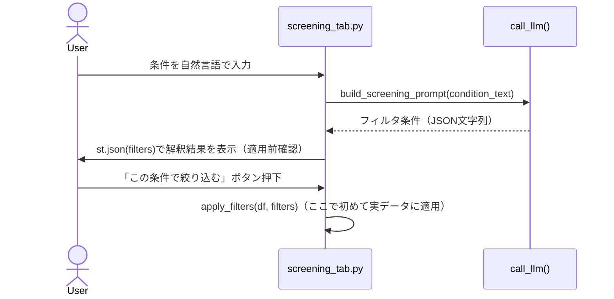

# 確認ステップ（Verificationパターン）

## この教材で身につくこと

- AIが解釈・生成した結果をユーザーに確認させてから実データへ適用するUI設計ができる
- 確認の強度をリスク・不可逆性に応じて調整する考え方を説明できる
- `app/`で確認ステップがある機能とない機能の違いを判断基準とともに説明できる

## 概要

AIの出力をそのまま実行してしまうと、誤変換や誤解釈がユーザーに
気づかれないまま反映されてしまいます。本教材では、AIの提案を
実行前にユーザーが確認・編集できる「確認ステップ」の設計を扱います。

## 位置づけ

本教材はカテゴリ04の1番目です。ここで学ぶ確認ステップは、
02章の「事実とAI考察の分離」と組み合わせて使われることが多い設計です。

## 主要概念・設計判断の解説

### Verificationパターンとは

[Shape of AI](https://www.shapeof.ai/patterns/verification)は、
AIの出力を実行前にユーザーが確認・編集できるチェックポイントを設ける
UXパターンを「Verification」と呼んでいます。関連する考え方として、
リスク・不可逆性に応じて確認の強度を変える「Progressive Automation」
（低リスクな操作は自動実行、高リスクな操作は必ず確認、という段階分け）
があります。

近い概念として[Sample response](https://www.shapeof.ai/patterns/sample-response)
（複雑なプロンプトに対してユーザーの意図を確認する）があります。
Verificationが「AIの出力を実行前に確認する」ことに焦点を当てるのに対し、
Sample responseは「複雑な依頼内容をAIがどう解釈したか」を確認する点に
焦点があり、`app/`のスクリーニング条件確認はこの両方の性質を兼ねています。

### `app/`での実装

スクリーニング条件変換は、誤った条件で絞り込むとユーザーの意図と
異なる銘柄が表示されてしまう実害が大きい機能です。そのため、
AIが解釈した条件を`st.json(filters)`でそのまま画面表示し、
「この条件で絞り込む」ボタンを押すまで実データには一切適用しません。

### 確認ステップが無い機能との対比

一方、各種コメント生成（スクリーニング結果コメント、ランキングコメント等）
には確認ステップがありません。これらは表示上の付加情報であり、
誤りがあってもユーザーの操作結果（絞り込み条件の適用など）を
歪めるものではないため、確認を挟まずそのまま表示しています。

## 実ソースコード（Python / プロンプト例、出典パス明記）

出典: `ai-stock-investing-tutorial/app/app_tabs/screening_tab.py`

```python
raw_filters = call_llm(prompt)
st.session_state["screening_condition_text"] = condition_text
try:
    st.session_state["screening_filters"] = json.loads(strip_code_fence(raw_filters))
    st.session_state["screening_filters_error"] = False
except json.JSONDecodeError:
    st.session_state["screening_filters"] = None
    st.session_state["screening_filters_error"] = True

filters = st.session_state.get("screening_filters")
if filters is not None:
    # 実際に適用する前にAIが解釈した条件をユーザーに確認させる
    st.subheader("AIが解釈した条件（適用前に確認してください）")
    st.json(filters)

    if st.button("この条件で絞り込む"):
        result_df = apply_filters(universe_df, filters)
        comments = generate_screening_comments(result_df, call_llm=call_llm)
```



## 演習課題

1. `app/`内で確認ステップが**無い**バッチコメント生成機能について、
   なぜ確認ステップが不要と判断されているか、リスクの大きさの観点で
   説明してください。
2. 「ポートフォリオレビュー生成」に確認ステップを追加するとしたら、
   何を確認させるべきか設計してください。

## 理解度チェック

- [ ] Verificationパターンの定義を説明できる
- [ ] `app/`がスクリーニング条件変換にだけ確認ステップを設けている理由を説明できる
- [ ] 自分の機能でどこに確認ステップを置くべきか判断できる

---

[← 前へ: 00-README](00-README.md) | [次へ: 事実とAI考察の分離 →](02-fact-and-opinion-separation.md)
