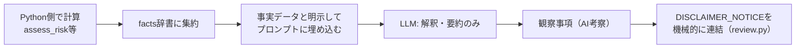

# 事実とAI考察の分離

## この教材で身につくこと

- プログラムで計算した「事実」とAIの「考察」を分離して扱う設計ができる
- LLMに数値計算そのものを任せない理由を説明できる
- 「事実データ」をプロンプトに埋め込む際の書き方を実装できる

## 概要

LLMは自然な文章の生成が得意な一方、四則演算や統計計算を苦手とします。
桁を間違えても、それに気づかず自然な文章で断定的に述べてしまうことがあります。
これが「ハルシネーション」（もっともらしい誤り）です。
さらにやっかいなのは、ユーザーがAIの出力する数値を「検証済みの事実」と誤解しやすいことです。
これを防ぐには、「どの数値が誰の計算結果か」を設計・表示の両面で明確に区別する必要があります。

本教材では、`ai-stock-investing-tutorial`のアプリが一貫して採用している「計算はプログラム、考察はAI」という役割分担の設計を扱います。

## 位置づけ

01章の確認ステップが「UI上でどう確認させるか」を扱ったのに対し、本教材は「そもそもLLMに何をさせないか」という設計判断を扱います。

## 主要概念・設計判断の解説

### 「事実」と「AI考察」の役割分担

| 観点 | 事実（Python側で計算） | AI考察（LLM側で生成） |
|---|---|---|
| 生成方法 | 決定的な計算（`assess_risk`等） | 自然言語による解釈・要約 |
| 再現性 | 同じ入力なら常に同じ結果 | 同じ入力でも文言が揺れうる |
| 向いている場面 | 数値・指標そのものの算出 | 観察事項の言語化・要約 |
| つまずきやすい点 | 計算ロジックのバグは気づきにくい | 数値計算そのものを任せると誤りやすい |

### `app/`の一貫した方針

構成比・リスク指標・テクニカルシグナル等の数値計算は、必ずPython側（`analyze_portfolio_composition`・`assess_risk`など）で行います。
その結果を「事実データ」としてプロンプトに埋め込んでから、初めてLLMに渡します。
LLM自身には数値計算をさせません。

### プロンプトでの境界の明示: 実装手順

`build_report_prompt`は、次の手順でLLMの役割を「解釈・要約のみ」に限定しています。

1. **Python側で計算する**: 構成比・リスク・テクニカルシグナル等を`assess_risk`等の関数で算出する。
   つまずきやすい点: この段階でLLMを呼んでしまうと、数値そのものが不確実になります。
2. **事実データとして1つにまとめる**: 計算結果を`facts`辞書に集約する。
   つまずきやすい点: 銘柄名など重複しうる情報を複数箇所に含めると、プロンプトが長くなりトークンを浪費します。
3. **境界を明示してプロンプトに埋め込む**: 「以下はポートフォリオの事実データ（Python側で計算済み）です」という文言でLLMに前提を伝える。
   つまずきやすい点: この明示を省くと、LLMが数値の再計算や検算を試み、誤った値を出すことがあります。
4. **LLMには解釈・要約のみを依頼する**: 「教育的な観察事項を箇条書きで示してください」と依頼し、数値計算の依頼は含めない。

## 実ソースコード（Python / プロンプト例、出典パス明記）

出典: `ai-stock-investing-tutorial/app/portfolio_management/review.py`

```python
def generate_portfolio_review(
    holdings, current_prices, price_histories, fundamentals_by_ticker,
    technicals_by_ticker, news_sentiment_by_ticker, names_by_ticker=None,
    call_llm=default_call_llm,
) -> str:
    composition = analyze_portfolio_composition(holdings, current_prices)
    risk = assess_risk(price_histories)
    snapshots = [
        build_holding_snapshot(holding, ...)
        for holding in holdings
    ]

    # LLMに渡す「事実（facts）」として、構成・リスク・銘柄詳細を1つにまとめる。
    facts = {
        "composition": composition,
        "risk": risk,
        "holdings": snapshots,
        "ticker_names": names_by_ticker,
    }
    prompt = build_report_prompt(facts)
    commentary = call_llm(prompt)
    ...
```

出典: `ai-stock-investing-tutorial/app/prompt_patterns/report_generation.py`

```python
def build_report_prompt(facts: dict) -> str:
    # ポートフォリオの数値的事実はPython側で計算済みのため、LLMには解釈・要約のみを依頼する。
    # LLMには整形不要のためindentは付けず、トークン消費を抑える。
    facts_json = json.dumps(facts, ensure_ascii=False, default=str)
    return (
        "以下はポートフォリオの事実データ（Python側で計算済み）です。\n\n"
        f"{facts_json}\n\n"
        "このデータを見て、教育的な観察事項（例: 集中度が高い銘柄、"
        "ニュースセンチメントが弱い銘柄、テクニカルシグナルが弱含みの銘柄）を"
        "箇条書きで示してください。\n"
        # 銘柄名の表記揺れを防ぎ、読み手が銘柄を特定しやすくするための指示。
        "各銘柄に言及する際は、必ず「銘柄コード（銘柄名）」の形式で表記して"
        "ください（例: 7203.T（トヨタ自動車））。銘柄名は各データ内の"
        "name フィールドを参照してください。\n"
        # 投資助言化を避けるための制約。
        "売買の推奨・指示・目標株価の提示は行わないでください。"
    )
```

免責事項（`DISCLAIMER_NOTICE`）自体は、このプロンプトの中には含めず、`generate_portfolio_review`側でレポート文字列の先頭・末尾に機械的に連結しています（詳細は次教材「[ガードレールと免責事項](03-guardrails-and-disclaimers.md)」）。

出典: `ai-stock-investing-tutorial/app/prompt_patterns/stock_detail.py`
（第二の実例: 個別銘柄詳細でも同じ役割分担を適用）

```python
def build_stock_detail_prompt(
    ticker: str, name: str | None, fundamentals: dict, technical: dict, news: list[dict]
) -> str:
    news_lines = _format_news_lines(news)
    label = f"{ticker}（{name}）" if name else ticker
    return (
        f"銘柄 {label} について、以下のファンダメンタルズ・テクニカル・ニュース見出しを踏まえて、"
        "投資家向けの総合分析コメントを日本語で3〜4文程度で作成してください。"
        "断定的な売買判断は含めないでください。\n\n"
        f"PER: {fundamentals.get('per')}\n"
        f"PBR: {fundamentals.get('pbr')}\n"
        f"テクニカルシグナル（移動平均線）: {technical.get('signal')}\n"
        f"RSI(14日、勢い): {technical.get('rsi')}（{technical.get('rsi_signal') or '不明'}）\n"
        f"直近ニュース見出し:\n{news_lines}\n"
    )
```

RSI等のテクニカル指標は`analysis_agents/technical_agent.py`の`analyze_technical`がPython側で計算し、その結果（`technical.get('rsi')`等）をこの関数が事実データとしてプロンプトに埋め込んでいます。
ここでもLLMには「総合分析コメントの作成」という解釈・要約の役割しか与えていません。

### 良い例/悪い例

悪い例: LLMに数値計算そのものを依頼するプロンプト。

```text
保有銘柄の損益率を計算して教えてください。
ticker: 7203.T, shares: 100, cost: 2000, current: 2150
```

良い例: 損益率はPython側で計算し、結果の数値をプロンプトに埋め込んで観察事項の言語化のみを依頼する。

```text
以下はポートフォリオの事実データ（Python側で計算済み）です。
{"ticker": "7203.T", "profit_loss_pct": 7.5}
このデータを見て、教育的な観察事項を箇条書きで示してください。
```

事実とAI考察の境界を、データがプロンプトに渡るまでの流れとして図にすると次のようになります。
「Python計算」から「LLM」の間に、必ず「事実データとして明示」という工程を挟んでいる点が設計の要です。



LLMには常に「計算済みの事実」が渡り、計算そのものを依頼することはありません。
免責事項の連結（`F`）はプロンプト内ではなくコード側で行われる点が、次教材で扱うガードレール設計につながります。

## 演習課題

1. `assess_risk`（`app/portfolio_management/risk.py`）が計算する年率ボラティリティ・銘柄間相関のいずれかを1つ挙げ、それをLLMに計算させた場合に起こりうる誤りを説明してください。
2. 「事実」と「AI考察」を画面表示上どう視覚的に区別すべきか、UIデザインの観点で提案してください。
   1. 事実部分（数値・指標）をどう区別表示するか考える。
   2. AI考察部分（観察事項の文章）をどう区別表示するか考える。
   3. 免責事項をどこに、どの頻度で配置するか考える。

## 理解度チェック

- [ ] `app/`が数値計算をLLMに任せない理由を説明できる
- [ ] 「事実データ」をプロンプトに埋め込む際の書き方を説明できる
- [ ] 事実とAI考察の分離を自分の機能に適用する方法を説明できる
- [ ] ポートフォリオレビューと個別銘柄詳細、2つの機能で同じ役割分担が使われていることを説明できる

---

[← 前へ: 確認ステップ（Verificationパターン）](01-verification-checkpoint.md) | [次へ: ガードレールと免責事項 →](03-guardrails-and-disclaimers.md)
