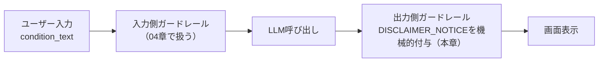

# ガードレールと免責事項

## この教材で身につくこと

- プロンプトでの禁止事項明示と免責事項の必須表示を実装できる
- プロンプト内の指示と機械的な注記付与の信頼性の違いを説明できる
- 自分のドメインに合わせたガードレールを設計できる

## 概要

たとえば、AIが生成したレポートに「いま買うべき」のような断定的な文言が混じると、読者は気づかないうちに投資助言として受け取ってしまうことがあります。
教育目的の情報提供のつもりでも、これは法的・倫理的なリスクに直結します。
ガードレールとは、生成物が越えてはいけない境界をあらかじめ明示しておく設計のことです。
本教材では、`ai-stock-investing-tutorial`のアプリが実装している2種類のガードレール（プロンプト内の禁止事項と、コード側での免責事項の機械的付与）を扱います。

生成AIアプリのガードレールは、**入力側**（プロンプトインジェクション・意図しない指示の混入）と**出力側**（ポリシー違反・機密情報の混入）の二層構造で考えると設計が整理しやすくなります。
本教材が扱う免責事項の機械的付与は出力側の対策です。
入力側の対策は次の04教材（[プロンプトインジェクション対策](04-prompt-injection-defense.md)）で扱います。

本教材が扱う免責事項の機械的付与は、[Shape of AI](https://www.shapeof.ai/)の[Caveat](https://www.shapeof.ai/patterns/caveat)（モデル・技術の限界やリスクをユーザーに伝える）と[Disclosure](https://www.shapeof.ai/patterns/disclosure)（AIが関与したコンテンツ・やり取りであることを明示する）の両方に対応します。

## 位置づけ

本教材はカテゴリ04の3番目の教材であり、01（確認ステップ）・02（事実と考察の分離）と合わせて、ユーザーがAIの出力を安全に扱うための三本柱を構成します。

## 主要概念・設計判断の解説

### 2種類のガードレール

| 種類 | 実装方法 | 信頼性 | 向いている場面 | つまずきやすい点 |
|---|---|---|---|---|
| プロンプト内の禁止事項明示 | 「売買の推奨・指示・目標株価の提示は行わないでください」等の指示文 | LLMが従わない可能性がある | 出力の質・傾向を望ましい方向へ誘導したいとき | 指示だけで安全と誤認しやすい |
| 免責事項の機械的付与 | `DISCLAIMER_NOTICE`をコード側で必ず文字列連結する | コードが必ず実行するため確実 | 最低限必ず表示すべき定型文言 | 付与位置を1箇所忘れると抜け漏れる |

### なぜ機械的付与の方が信頼できるか

プロンプト内の指示はLLMへの「お願い」に過ぎず、従わない可能性をゼロにはできません。
一方、`DISCLAIMER_NOTICE`をレポート文字列に連結する処理はコードが必ず実行するため、LLMの協力に依存しません。
両方を組み合わせることで、望ましい出力を促しつつ、最低限守るべき表示は確実に担保しています。

### ガードレール実装の手順

1. **禁止事項をプロンプトに明示する**: 「売買の推奨・指示・目標株価の提示は行わないでください」のような文言をプロンプト末尾に加える。
   つまずきやすい点: これだけで対策完了と誤解しないでください。
2. **免責事項の定型文をコード側で一元管理する**: `DISCLAIMER_NOTICE`のような定数を1箇所にまとめる。
   つまずきやすい点: 文言をあちこちに直書きすると、後から表現を変更する際に修正漏れが起きます。
3. **出力の先頭・末尾に機械的に連結する**: LLMの応答を組み立てるコード側で、必ず`DISCLAIMER_NOTICE`を連結する。
   つまずきやすい点: 末尾だけに付けると、レポートが長い場合に読者が見落とします。

## 実ソースコード（Python / プロンプト例、出典パス明記）

出典: `ai-stock-investing-tutorial/app/common/disclaimer.py`

```python
DISCLAIMER_NOTICE = (
    "本レポートは教育目的の情報提供であり、投資助言ではありません。"
    "個別銘柄への言及や推奨を含む場合がありますが、AIによる考察には誤りが"
    "含まれる可能性があります。実際の投資判断とその結果については、"
    "一次情報の確認のうえ、すべてご自身の責任において行ってください。"
)
```

出典: `ai-stock-investing-tutorial/app/portfolio_management/review.py`

```python
sections = [
    DISCLAIMER_NOTICE,
    "",
    "# ポートフォリオ統合レビュー",
    "",
    commentary,
    "",
    "---",
    "",
    DISCLAIMER_NOTICE,
]
return "\n".join(sections)
```

出典: `ai-stock-investing-tutorial/app/prompt_patterns/report_generation.py`
（プロンプト内の禁止事項の例）

```text
売買の推奨・指示・目標株価の提示は行わないでください。
```

出典: `ai-stock-investing-tutorial/app/app_tabs/strategy_builder_tab.py`
（第二の実例: AI戦略ビルダータブでも同じ`DISCLAIMER_NOTICE`を表示する）

```python
def render_strategy_builder_tab() -> None:
    ...
    _render_idea_input_section()
    st.divider()
    _render_dialogue_section()
    st.divider()
    _render_pipeline_section()
    st.markdown(DISCLAIMER_NOTICE)
```

ポートフォリオレビューと違い、こちらは1回だけタブ末尾に表示する形です。
同じ`DISCLAIMER_NOTICE`定数を複数機能で使い回すことで、免責文言を一元管理しながら、それぞれの画面に合った付与位置を選べます。

生成AIアプリのガードレールは、**入力側**と**出力側**の二層構造で整理できると先に述べました。
本教材が扱う免責事項の機械的付与がどこに位置するかを図にすると次のとおりです。



本章が扱う免責事項は常に「LLM呼び出しの後」に付与する出力側の対策で、プロンプトの内容やユーザー入力の中身に関わらず必ず実行されます。

## 演習課題

1. プロンプト内の禁止事項だけに頼った場合（免責事項の機械的付与をしない場合）に起こりうるリスクを説明してください。
2. 自分のアプリ（投資以外のドメイン）でガードレールが必要な出力を1つ想定し、両方を設計してください。
   1. どんな出力にガードレールが必要か想定する。
   2. プロンプトでどう禁止事項を明示するか書く。
   3. コード側でどう機械的な注記を付与するか書く。

## 理解度チェック

- [ ] プロンプト内禁止事項と機械的な免責事項付与の違いを説明できる
- [ ] なぜ機械的付与の方が信頼性が高いか説明できる
- [ ] 自分のドメインに合わせたガードレールを設計できる
- [ ] 本章の免責事項付与が入力側/出力側どちらの対策か説明できる

---

[← 前へ: 事実とAI考察の分離](02-fact-and-opinion-separation.md) | [次へ: プロンプトインジェクション対策 →](04-prompt-injection-defense.md)
