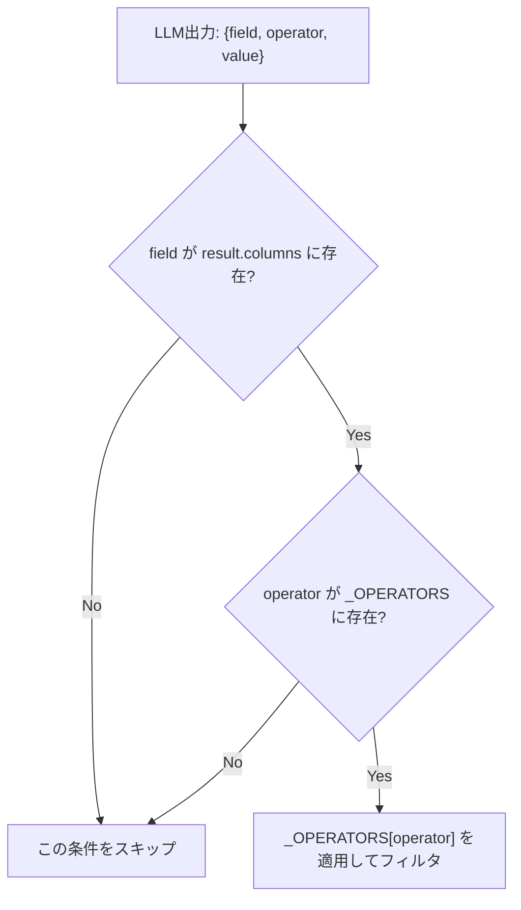

# プロンプトインジェクション対策

## この教材で身につくこと

- 列挙値制約・ホワイトリスト化によってLLM出力の攻撃面を縮小する設計を実装できる
- プロンプト内指示だけに頼る対策の限界を説明できる
- 入力側/出力側の二層ガードレール構造を説明できる

## 概要

「プロンプトインジェクション」とは、ユーザー入力の中に「これまでの指示を無視して」のような文言を紛れ込ませ、LLM本来の役割や制約を書き換えさせようとする攻撃です。
従来のWebアプリにおけるSQLインジェクション（入力にSQL文を混入させる攻撃）に近い発想ですが、対象がSQL文ではなく自然言語のプロンプトである点が異なります。
たとえば、スクリーニング条件の入力欄に条件文以外の指示文を混入させ、意図しない出力を引き出そうとする攻撃が考えられます。

`screening.py`の演算子ホワイトリスト化を例に、プロンプトインジェクション・不正な出力生成への対策を扱います。
前教材（[ガードレールと免責事項](03-guardrails-and-disclaimers.md)）が「出力への注記付与」を扱うのに対し、本教材は「そもそもLLMに何をさせないか」という入力・処理側の対策を扱います。

## 位置づけ

04章の最終教材（4番目）です。
01〜03で学んだUXの安全性に加え、システムとしてのセキュリティの観点を追加します。

## 主要概念・設計判断の解説

### 二層ガードレール構造

生成AIアプリのガードレールは、**入力側**（プロンプトインジェクション・意図しない指示の混入）と**出力側**（ポリシー違反・機密情報の混入）の二層構造で考えると設計が整理しやすくなります（出典: [AI Guardrails: Implementing Safety for Production LLM Apps](https://bigdataboutique.com/blog/ai-guardrails-implementing-safety-production-llm-apps)）。

| 層 | 対象とする問題 | 具体例 | 対応教材 |
|---|---|---|---|
| 入力側 | プロンプトインジェクション・意図しない指示の混入 | 演算子のホワイトリスト化 | 本教材（04） |
| 出力側 | ポリシー違反・機密情報の混入 | 免責事項の機械的付与 | 前教材（[03](03-guardrails-and-disclaimers.md)） |

「ホワイトリスト化」とは、許可する値をあらかじめ列挙し、それ以外を一律拒否する設計です（対義語は、禁止する値だけを列挙する「ブラックリスト化」）。
禁止パターンを列挙し尽くすのは事実上不可能なため、許可する値を列挙する方が安全です。

### プロンプトインジェクション対策の実装手順

1. **LLM出力の形式をプロンプトで限定する**: 使用できる`field`・出力形式（JSON配列のみ）をプロンプトで明示する。
   つまずきやすい点: プロンプトの指示だけでは強制力が無く、あくまで「お願い」に過ぎません。
2. **LLM出力を直接評価せず、ホワイトリスト辞書でマッピングする**: `_OPERATORS`辞書で許可された演算子のみ関数に変換する。
   つまずきやすい点: 新しい演算子を追加する際、プロンプト側の説明文の更新を忘れがちです。
3. **ホワイトリスト外の値は無視してスキップする（二重防御）**: `field`が`result.columns`に無い、`operator`が`_OPERATORS`に無い場合は条件ごと無視する。
   つまずきやすい点: サイレントにスキップすると、ユーザーは「なぜ条件が反映されなかったか」に気づきにくくなります。
4. **system promptで役割を固定化する**: `_SYSTEM_PROMPT`（「あなたは指示に厳密に従うアシスタントです。指示された出力のみを返してください。」）で、ユーザー入力経由の「別の指示」への基礎的な防御線を作る。
   つまずきやすい点: これも「お願い」の一種であり、単独では防御になりません。

### プロンプト内指示だけに頼る限界

「これらの指示を無視して」のような入力があった場合、system promptの指示に従わない可能性がゼロではありません。
ホワイトリスト化（コード側の強制）と組み合わせることが重要です。

### 第二の実例: フィールド値の列挙制約（プロンプト側）

演算子のホワイトリスト化がコード側の強制であるのに対し、`build_screening_prompt`は`sector`（業種）の値をプロンプト側で列挙して制約します。
コード側で全業種名をホワイトリストチェックしてはいないため、こちらは「プロンプトでの列挙制約」という、コード側のホワイトリストより弱い（LLMの協力に依存する）対策である点に注意してください。

### 発展的な対策（本教材群のスコープ外）

dual-LLMパターン（計画立案と実行を別モデル・別コンテキストに分離する）や型付きツール呼び出しは、より厳格な防御として研究・実務記事で挙げられています（出典: [Design Patterns for Securing LLM Agents against Prompt Injections](https://arxiv.org/pdf/2506.08837)）。
本教材群のスコープでは実装しません。

## 実ソースコード（Python / プロンプト例、出典パス明記）

出典: `ai-stock-investing-tutorial/app/prompt_patterns/screening.py`

```python
import operator

# LLMが出力する演算子文字列を、実際に比較演算を行う関数へ安全にマッピングする。
# eval等を使わずホワイトリスト化することで、不正な演算子指定を無害化する。
_OPERATORS = {
    "<=": operator.le,
    ">=": operator.ge,
    "<": operator.lt,
    ">": operator.gt,
    "==": operator.eq,
}


def apply_filters(df: pd.DataFrame, filters: list[dict]) -> pd.DataFrame:
    # LLMが生成したフィルタ条件を順に適用する。存在しない列や未知の演算子は
    # 無視してスキップすることで、LLMの出力ゆれがあっても処理全体を落とさない。
    result = df
    for condition in filters:
        field = condition.get("field")
        op_symbol = condition.get("operator")
        value = condition.get("value")
        if field not in result.columns or op_symbol not in _OPERATORS:
            continue
        op_func = _OPERATORS[op_symbol]
        mask = result[field].notna() & op_func(result[field], value)
        result = result[mask]
    return result
```

出典: `ai-stock-investing-tutorial/app/data_api/llm_client.py`

```python
_SYSTEM_PROMPT = "あなたは指示に厳密に従うアシスタントです。指示された出力のみを返してください。"
```

出典: `ai-stock-investing-tutorial/app/prompt_patterns/screening.py`
（第二の実例: フィールド値の列挙制約、プロンプト側の対策）

```python
def build_screening_prompt(condition_text: str, sectors: list[str] | None = None) -> str:
    sector_line = ""
    if sectors:
        sector_list = "、".join(sectors)
        sector_line = (
            "sector（業種）を使う場合、valueは次の業種名のいずれか一つを"
            f"そのまま正確に使ってください（表記ゆれを吸収し、最も近いものを選ぶこと）: {sector_list}\n"
        )
    return (
        "次の投資条件をJSON形式のフィルタ配列に変換してください。\n"
        "使用できるfieldは per（PER）、pbr（PBR）、dividend_yield_pct"
        "（配当利回り、単位はパーセントの数値。例: 3%なら3）、sector（業種）のいずれかです。\n"
        f"{sector_line}"
        'sectorのoperatorは"=="のみ使用してください。\n'
        '出力形式: [{"field": "per", "operator": "<=", "value": 15}] の'
        "ようなJSON配列のみを出力してください。説明文やコードブロック記法は不要です。\n\n"
        f"条件: {condition_text}"
    )
```

### 良い例/悪い例

悪い例: LLMが返した演算子文字列をそのまま評価する。

```python
mask = eval(f"df['{field}'] {op_symbol} {value}")
```

良い例: `_OPERATORS`辞書によるホワイトリスト化。

```python
if op_symbol not in _OPERATORS:
    continue
op_func = _OPERATORS[op_symbol]
```



この図は「実装手順」の3番目（二重防御）に対応します。
LLM出力の`field`・`operator`のどちらか一方でもホワイトリストから外れていれば、その条件を無害化してスキップします。

## 演習課題

1. 悪い例（`eval`版）が実際に踏まれるとどんな入力（`condition_text`）で問題が起きるか、具体的な例を1つ考えてください。
2. 新しいoperator（例: `!=`）を追加する場合、何をどう変更する必要があるか書いてください。
   1. `_OPERATORS`辞書に`!=`をどう追加するか書く。
   2. `build_screening_prompt`の出力形式の説明文をどう変更するか書く。
   3. 変更後、既存のテストで何を確認すべきか書く。

## 理解度チェック

- [ ] ホワイトリスト化が`eval`よりなぜ安全か説明できる
- [ ] 入力側/出力側の二層ガードレール構造を説明できる
- [ ] プロンプト内指示だけに頼る対策の限界を説明できる
- [ ] プロンプト側の値列挙制約とコード側のホワイトリストの違いを説明できる

---

[← 前へ: ガードレールと免責事項](03-guardrails-and-disclaimers.md) | [次へ: 透明性と制御 →](05-transparency-and-control.md)
