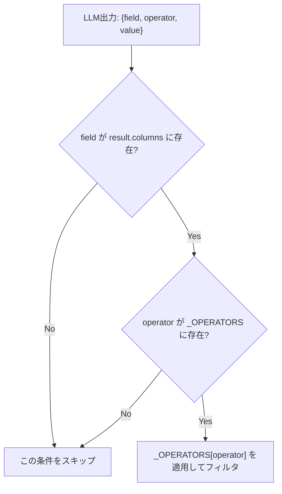

# プロンプトインジェクション対策

## この教材で身につくこと

- 列挙値制約・ホワイトリスト化によってLLM出力の攻撃面を縮小する設計を実装できる
- プロンプト内指示だけに頼る対策の限界を説明できる
- 入力側/出力側の二層ガードレール構造を説明できる

## 概要

`screening.py`の演算子ホワイトリスト化を例に、プロンプトインジェクション・
不正な出力生成への対策を扱います。前教材（[ガードレールと免責事項](03-guardrails-and-disclaimers.md)）が
「出力への注記付与」を扱うのに対し、本教材は「そもそもLLMに何をさせないか」
という入力・処理側の対策を扱います。

## 位置づけ

04章の最終教材（4番目）です。01〜03で学んだUXの安全性に加え、
システムとしてのセキュリティの観点を追加します。

## 主要概念・設計判断の解説

### 二層ガードレール構造

生成AIアプリのガードレールは、**入力側**（プロンプトインジェクション・
意図しない指示の混入）と**出力側**（ポリシー違反・機密情報の混入）の
二層構造で考えると設計が整理しやすくなります（出典:
[AI Guardrails: Implementing Safety for Production LLM Apps](https://bigdataboutique.com/blog/ai-guardrails-implementing-safety-production-llm-apps)）。
前教材の免責事項の機械的付与は出力側の対策、本教材が扱う
ホワイトリスト化は入力・処理側の対策です。

### `app/`の実例: 演算子のホワイトリスト化

`screening.py`の`_OPERATORS`辞書は、LLMが出力した演算子文字列を
`eval`で直接評価せず、事前定義した関数マッピングに限定します。
これにより、任意コード実行や不正な条件式の混入を防ぎます。

### `apply_filters`での二重防御

`field`が`result.columns`に無い場合、`operator`が`_OPERATORS`に
無い場合は無視してスキップします。ホワイトリスト外の値がLLM出力に
混入しても実害が出ない設計です。

### system promptによる指示の固定化

`llm_client.py`の`_SYSTEM_PROMPT`（「あなたは指示に厳密に従う
アシスタントです。指示された出力のみを返してください。」）は、
ユーザー入力（`condition_text`）経由で紛れ込む可能性のある「別の指示」への
基礎的な防御線になります。

### プロンプト内指示だけに頼る限界

「これらの指示を無視して」のような入力があった場合、system promptの
指示に従わない可能性がゼロではありません。ホワイトリスト化（コード側の
強制）と組み合わせることが重要です。

### 発展的な対策（本教材群のスコープ外）

dual-LLMパターン（計画立案と実行を別モデル・別コンテキストに分離する）や
型付きツール呼び出しは、より厳格な防御として研究・実務記事で挙げられて
います（出典: [Design Patterns for Securing LLM Agents against Prompt Injections](https://arxiv.org/pdf/2506.08837)）。
本教材群のスコープでは実装しません。

## 実ソースコード（Python / プロンプト例、出典パス明記）

出典: `ai-stock-investing-tutorial/app/prompt_patterns/screening.py`

```python
import operator

# LLMが出力する演算子文字列を、実際に比較演算を行う関数へ安全にマッピングする。
# eval等を使わずホワイトリスト化することで、不正な演算子指定を無害化する。
_OPERATORS = {
    "<=": operator.le,
    ">=": operator.ge,
    "<": operator.lt,
    ">": operator.gt,
    "==": operator.eq,
}


def apply_filters(df: pd.DataFrame, filters: list[dict]) -> pd.DataFrame:
    # LLMが生成したフィルタ条件を順に適用する。存在しない列や未知の演算子は
    # 無視してスキップすることで、LLMの出力ゆれがあっても処理全体を落とさない。
    result = df
    for condition in filters:
        field = condition.get("field")
        op_symbol = condition.get("operator")
        value = condition.get("value")
        if field not in result.columns or op_symbol not in _OPERATORS:
            continue
        op_func = _OPERATORS[op_symbol]
        mask = result[field].notna() & op_func(result[field], value)
        result = result[mask]
    return result
```

出典: `ai-stock-investing-tutorial/app/data_api/llm_client.py`

```python
_SYSTEM_PROMPT = "あなたは指示に厳密に従うアシスタントです。指示された出力のみを返してください。"
```

### 良い例/悪い例

悪い例: LLMが返した演算子文字列をそのまま評価する。

```python
mask = eval(f"df['{field}'] {op_symbol} {value}")
```

良い例: `_OPERATORS`辞書によるホワイトリスト化。

```python
if op_symbol not in _OPERATORS:
    continue
op_func = _OPERATORS[op_symbol]
```



## 演習課題

1. 悪い例（`eval`版）が実際に踏まれるとどんな入力（`condition_text`）で
   問題が起きるか、具体的な例を1つ考えてください。
2. 新しいoperator（例: `!=`）を追加する場合、`_OPERATORS`辞書と
   `build_screening_prompt`のどちらを、どう変更する必要があるか書いてください。

## 理解度チェック

- [ ] ホワイトリスト化が`eval`よりなぜ安全か説明できる
- [ ] 入力側/出力側の二層ガードレール構造を説明できる
- [ ] プロンプト内指示だけに頼る対策の限界を説明できる

---

[← 前へ: ガードレールと免責事項](03-guardrails-and-disclaimers.md) | [次へ: 透明性と制御 →](05-transparency-and-control.md)
