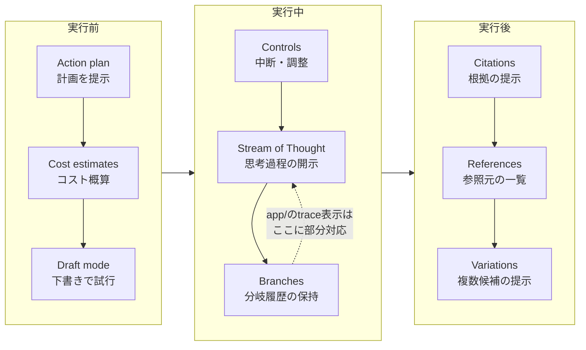

# 透明性と制御

## この教材で身につくこと

- AIの処理経過・実行計画をユーザーに開示するUXの設計判断を説明できる
- 「実行前の可視化」「実行中の制御」「結果の裏付け」という3つの局面で透明性パターンを分類できる
- `app/`のパイプライン実行トレースが、どの局面のどのパターンに部分的に対応するか説明できる

## 概要

AI戦略ビルダーが複数ステップのパイプラインを一括実行すると、ユーザーは「今どのステップが動いているか」も「どこで何件の銘柄が除外されたか」も、実行が終わるまで分かりません。
処理が長時間になるほど、この不透明さは不安・不信につながります。
01章の確認ステップが「実行直前の1回」に焦点を当てるのに対し、本教材は実行前・実行中・実行後を通じた透明性を扱います。
[Shape of AI](https://www.shapeof.ai/)では、AIの挙動をユーザーが把握・制御できるようにするパターン群を「Governors」と呼びます。
本教材では、Governorsカテゴリのうち、確認ステップ（Verification）以外の9パターン（Action plan, Branches, Citations, Controls, Cost estimates, Draft mode, References, Stream of Thought, Variations）を、「実行前」「実行中」「実行後」の3局面に整理して扱います。

## 位置づけ

本教材はカテゴリ04の5番目です。
01（確認ステップ）が「実行直前に1回確認する」ことに焦点を当てるのに対し、本教材は確認の前後を含めたプロセス全体の透明性を扱います。

## 主要概念・設計判断の解説

### 3つの局面への整理

| 局面 | パターン | 目的 | つまずきやすい点 |
|---|---|---|---|
| 実行前 | Action plan, Cost estimates, Draft mode | 実行する前に計画・コスト・下書きを見せる | 見せすぎると実行前の待ち時間が長く感じられる |
| 実行中 | Controls, Stream of Thought, Branches | 実行中に制御・思考過程・分岐履歴を見せる | リアルタイム更新の実装コストが高い |
| 実行後 | Citations, References, Variations | 結果の根拠・別候補を見せる | 事後報告だけでは「実行中に何が起きたか」は分からない |

### `app/`での部分的な対応: パイプライン実行トレース

AI戦略ビルダーのパイプライン実行は、実行**後**に「どのステップを通過したか」を`trace`として開示します。
これは[Stream of Thought](https://www.shapeof.ai/patterns/stream-of-thought)（AIの思考過程・ツール使用を開示する）に部分的に対応しますが、Shape of AIの定義が「実行中のリアルタイム開示」を指すのに対し、`app/`の実装は「実行後の事後報告」である点が異なります。
この違いを認識した上で参考にしてください。

| 観点 | Shape of AIの定義（Stream of Thought） | `app/`の実装（`trace`表示） |
|---|---|---|
| 開示のタイミング | 実行中にリアルタイム | 実行後にまとめて |
| ユーザーの介入余地 | 途中で気づいて中断できる | 終わってから結果を知るのみ |
| 実装コスト | ストリーミング等の追加実装が必要 | 通過したステップ名を配列に積むだけ |

同様に、評価・改善ループ（Evaluator-Optimizer、05章参照）が「AIによる自動改善を行いました」というキャプションと評価フィードバックを表示する箇所も、実行後にプロセスの一部を開示する例です。

### `app/`に実装が無い観点: 実行前の透明性

Action plan（実行前に計画を提示）・Cost estimates（実行前にコスト概算を提示）・Draft mode（低コストな下書きモードで試行）は、`app/`のパイプライン実行が「ボタンを押すと即座に全ステップを実行する」設計のため、実装例がありません。
本教材のサンプルコードは`app/`に実装例が無いため、汎用サンプルコードで解説します。

複数ステップのAIパイプラインを実行する前に、ステップ一覧と概算コストを提示し、ユーザーが実行前に把握できるようにする設計です。

## 実ソースコード（Python / プロンプト例、出典パス明記）

出典: `ai-stock-investing-tutorial/app/app_tabs/strategy_builder_tab.py`
（実行後のトレース開示、Stream of Thoughtに部分的に対応）

```python
result_df, trace = run_pipeline(strategy["steps"], all_tickers, CACHE_DIR)
st.session_state["strategy_pipeline_trace"] = trace
...
trace = st.session_state.get("strategy_pipeline_trace")
if trace:
    st.caption(" → ".join(trace))
```

出典: `ai-stock-investing-tutorial/app/app_tabs/strategy_builder_tab.py`
（実行後の改善プロセス開示、Stream of Thoughtに部分的に対応）

```python
if evaluation_result and evaluation_result["iterations"] > 0:
    st.caption("AIによる自動改善を行いました。")
    if evaluation_result["last_feedback"]:
        st.caption(f"評価フィードバック: {evaluation_result['last_feedback']}")
```

汎用サンプルコード（`app/`に実装例が無いため、実行前のAction plan・Cost estimatesを解説する架空のコード）:

```python
def render_action_plan_preview(steps: list[dict]) -> bool:
    """複数ステップのAIパイプラインを実行する前に、ステップ一覧と
    概算コストを提示し、ユーザーが承認した場合のみ実行を許可する。
    """
    st.subheader("実行計画")
    for i, step in enumerate(steps, start=1):
        st.write(f"{i}. {step['description']}（想定LLM呼び出し回数: {step['llm_calls']}）")
    total_calls = sum(step["llm_calls"] for step in steps)
    st.caption(f"概算コスト: LLM呼び出し{total_calls}回")
    return st.button("この計画で実行する")
```

汎用サンプルコード（`app/`に実装例が無いため、実行中のControlsを解説する架空のコード。上の例が「実行前」を扱うのに対し、こちらは「実行中」の中断を扱います）:

```python
def run_pipeline_with_control(steps: list[dict]) -> None:
    """複数ステップのAIパイプラインを実行中に、ユーザーが中断できる
    ようにする。ステップの合間ごとに中断フラグをチェックする。
    """
    if "pipeline_cancelled" not in st.session_state:
        st.session_state["pipeline_cancelled"] = False
    if st.button("実行を中断する"):
        st.session_state["pipeline_cancelled"] = True

    for i, step in enumerate(steps, start=1):
        if st.session_state["pipeline_cancelled"]:
            st.warning(f"ステップ{i}で中断されました。")
            break
        st.write(f"ステップ{i}: {step['description']} を実行中...")
        # ここで実際のLLM呼び出し・処理を行う
```



## 演習課題

1. `app/`のパイプライン実行トレース表示を、実行**前**の計画提示（Action plan）に変更するとしたら、何をどう変える必要があるか説明してください。
   1. `run_pipeline`が現在どのタイミングで呼ばれているか確認する。
   2. LLM呼び出し前に、ステップ一覧を画面表示する処理を追加する。
   3. 実行ボタン押下後に初めて`run_pipeline`を呼ぶよう順序を入れ替える。
2. 自分のアプリでコストが心配なAI機能を1つ想定し、実行前にCost estimatesを表示する設計を考えてください。

## 理解度チェック

- [ ] 透明性パターンを「実行前」「実行中」「実行後」の3局面で分類できる
- [ ] `app/`のトレース表示がStream of Thoughtとどう似ていて、どう違うか説明できる
- [ ] 実行中にControlsパターン（中断可能にする設計）を実装できる
- [ ] 実行前にAction plan・Cost estimatesを提示する設計を書ける

---

[← 前へ: プロンプトインジェクション対策](04-prompt-injection-defense.md) | [次へ: 記憶・プライバシー・来歴 →](06-memory-privacy-and-provenance.md)
