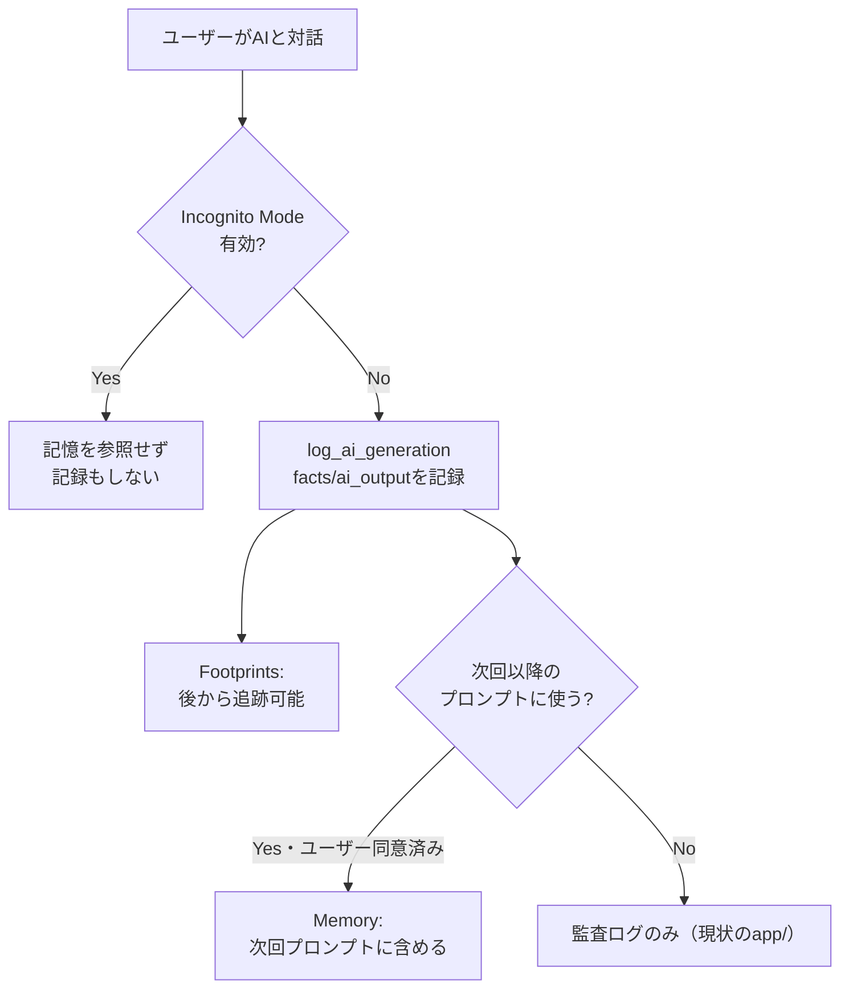

# 記憶・プライバシー・来歴

## この教材で身につくこと

- AIとのやり取りを「事実」と「AI出力」に分けて記録する設計を実装できる
- Footprints（AIの手順を追跡できるようにする）パターンを実装できる
- Memory・Consent・Data ownership・Incognito Mode・Watermarkの各パターンの目的を説明できる

## 概要

AIとのやり取りを一切記録しないと、後から「なぜAIがこの結果を出したのか」を誰も説明できなくなります。
逆に、何でも無制限に記憶・記録してしまうと、意図しない個人情報の保持につながるおそれがあります。
「来歴（provenance）」とは、ある情報が「いつ・何を根拠に・誰（AIか人間か）が生成したか」を追跡できる状態を指す言葉です。
本教材では、何を記録すべきで、何を記録すべきでないかの線引きを扱います。

[Shape of AI](https://www.shapeof.ai/)のGovernorsカテゴリのMemory・Shared visionと、Trust Buildersカテゴリの5パターン（Consent, Data ownership, Footprints, Incognito Mode, Watermark）を扱います。
共通するテーマは「AIが何を知っていて、何を記録し、ユーザーがそれをどう制御できるか」です。

## 位置づけ

本教材は04章の最終教材（6番目）です。
01〜05で学んだ「実行前後の透明性」に対し、本教材は「セッションをまたいだ記憶」「記録されたログへのプライバシー配慮」という、より長期的な視点を扱います。

## 主要概念・設計判断の解説

### `app/`の実例: Footprints（AIの手順を追跡できるようにする）

[Footprints](https://www.shapeof.ai/patterns/footprints)は「ユーザーがプロンプトから結果までのAIの手順を追跡できるようにする」パターンです。
`app/`の`log_ai_generation`は、次の手順でFootprintsを実装しています。

1. **facts（入力事実）を渡す**: LLMに渡した事実データを引数で受け取る。
   つまずきやすい点: `facts`と`ai_output`を同じ列に混ぜて記録すると、後から「どこまでが検証済み事実か」を判別できなくなります。
2. **prompt（実際に送ったプロンプト）を渡す**: LLMへの入力全体をそのまま保存する。
   つまずきやすい点: プロンプトに機密情報が含まれる場合、保存先のアクセス制御も併せて設計する必要があります。
3. **ai_output（応答）を渡す**: LLMからの応答をそのまま保存する。
4. **session_id単位でAiSession/AiGenerationに分けて記録する**: 同一セッションの複数ターンを1つの`session_id`にまとめる。
   つまずきやすい点: `session_id`を発行し忘れると、後から「どのやり取りが一連の会話か」を追跡できなくなります。

これにより、`session_id`単位で一連のやり取りを追跡可能にしています。

### Memoryとの違い

Footprintsが「後から追跡できる記録」であるのに対し、[Memory](https://www.shapeof.ai/patterns/memory)は「AIが**次回以降のやり取りに使う**記憶」を指します。
`app/`の`log_ai_generation`はあくまで監査ログであり、記録した`facts`/`ai_output`を次回のプロンプトに自動的に読み込んで使う仕組みはありません。
したがって`app/`にMemoryパターンの実装例はありません。
本教材のサンプルコードは`app/`に実装例が無いため、汎用サンプルコードで解説します。

| 観点 | Footprints | Memory |
|---|---|---|
| 目的 | 後から手順を追跡できるようにする | 次回以降のやり取りに活用する |
| データの流れ | 記録するのみ（読み込まない） | 記録し、次のプロンプトに読み込む |
| `app/`での実装 | あり（`log_ai_generation`） | 無し（汎用サンプルで解説） |
| 向いている場面 | 監査・デバッグ・説明責任 | パーソナライズされた継続対話 |
| つまずきやすい点 | 記録するだけでは活用されない | 同意なく記憶するとプライバシー侵害になる |

### `app/`に実装が無い観点: プライバシー配慮の4パターン

`app/`に該当する実装が無いため、目的をパターンごとに整理します。
本教材のサンプルコードは`app/`に実装例が無いため、汎用サンプルコードで解説します。

| パターン | 目的 | つまずきやすい点 |
|---|---|---|
| [Consent](https://www.shapeof.ai/patterns/consent) | 第三者データを本人の同意なく取り込まない | 同意の取得タイミングを後回しにしやすい |
| [Data ownership](https://www.shapeof.ai/patterns/data-ownership) | AIが記憶・利用するデータをユーザーが制御できる | 削除・閲覧のUIまで用意しないと形骸化する |
| [Incognito Mode](https://www.shapeof.ai/patterns/incognito-mode) | 記憶に残さずAIとやり取りできる | オフ忘れで通常モードの記録が残ることがある |
| [Watermark](https://www.shapeof.ai/patterns/watermark) | AI生成物であることを機械可読な形で識別可能にする | 表示上の注記だけでは機械可読にならない |

## 実ソースコード（Python / プロンプト例、出典パス明記）

出典: `ai-stock-investing-tutorial/app/common/ai_generation_log.py`
（Footprintsの実装例）

```python
def log_ai_generation(
    session_id: str,
    feature: str,
    facts: dict,
    prompt: str,
    ai_output: str,
    *,
    turn_index: int = 0,
    ticker: str | None = None,
    user_id: int | None = None,
    session_feature: str | None = None,
    session_factory=SessionLocal,
) -> None:
    with session_factory() as session:
        if session.get(AiSession, session_id) is None:
            session.add(
                AiSession(
                    id=session_id,
                    feature=session_feature or feature,
                    ticker=ticker,
                    user_id=user_id,
                )
            )
            session.flush()
        session.add(
            AiGeneration(
                session_id=session_id,
                turn_index=turn_index,
                feature=feature,
                facts=json.dumps(facts, ensure_ascii=False, default=str),
                prompt=prompt,
                ai_output=ai_output,
            )
        )
        session.commit()
```

`facts`（プログラムが計算した事実情報）と`ai_output`（AIの応答）を別列に分離して記録する設計は、後から「AIが何を根拠に何を出力したか」を追跡できるようにするFootprintsの核心です。

出典: `ai-stock-investing-tutorial/app/app_tabs/strategy_builder_tab.py`
（第二の実例: `log_ai_generation`の実際の呼び出し箇所）

```python
raw = call_llm(prompt)
session_id = st.session_state["strategy_ai_session_id"]
turn = st.session_state["strategy_ai_turn"]
log_ai_generation(
    session_id,
    "strategy_dialogue_turn",
    facts={"history": history, "sectors": sectors},
    prompt=prompt,
    ai_output=raw,
    turn_index=turn,
    user_id=get_current_user_id(),
    session_feature="strategy_dialogue",
)
```

AI戦略ビルダーの対話1ターンごとに、その時点の`history`（それまでの会話）と`sectors`（プロンプトに渡した業種一覧）を`facts`として、LLMの生の応答を`ai_output`として、それぞれ別引数で渡しています。
呼び出し側は「何が事実で、何がAIの応答か」を意識して引数を分けるだけでよく、DBスキーマの詳細を知らなくても正しく記録できます。

汎用サンプルコード（`app/`に実装例が無いため、Memory・Incognito Modeを解説する架空のコード）:

```python
def build_prompt_with_memory(user_message: str, user_id: int) -> str:
    """ユーザーが許可した場合のみ、過去の記憶をプロンプトに含める。
    Incognito Modeが有効な場合は記憶を一切参照・記録しない。
    """
    if st.session_state.get("incognito_mode", False):
        return user_message  # 記憶を参照せず、この回のやり取りも記録しない

    remembered_facts = load_user_memory(user_id)  # ユーザーが同意したデータのみ
    if not remembered_facts:
        return user_message
    memory_context = "\n".join(f"- {fact}" for fact in remembered_facts)
    return f"【あなたについて記憶している情報】\n{memory_context}\n\n【今回のメッセージ】\n{user_message}"
```



図の下半分（`D`から`F`以降）が、Footprints（記録するだけ）とMemory（記録を次回に使う）の分岐点です。
`app/`は`D`→`E`の監査ログまでを実装しており、`F`から先（次回プロンプトへの読み込み）は実装していません。
実装する場合も、必ずユーザーの同意（Consent）を経てから`G`へ進む設計にする必要があります。

## 演習課題

1. `log_ai_generation`が`facts`と`ai_output`を同じ列ではなく別々の列に分離して記録している理由を、Footprintsの目的に照らして説明してください。
2. 自分のアプリにMemoryパターンを追加するとしたら、ユーザーにどんな同意（Consent）の取り方をするべきか設計してください。
   1. 何を記憶するか（データの範囲）を特定する。
   2. 同意をどのタイミングで取るか設計する。
   3. 同意を撤回された場合に記憶をどう扱うか設計する。

## 理解度チェック

- [ ] `ai_generation_log.py`がFootprintsパターンにどう対応するか説明できる
- [ ] FootprintsとMemoryの違いを説明できる
- [ ] Consent・Data ownership・Incognito Mode・Watermarkの目的をそれぞれ説明できる
- [ ] `strategy_builder_tab.py`の`log_ai_generation`呼び出しで、facts/prompt/ai_outputに何を渡しているか説明できる

---

[← 前へ: 透明性と制御](05-transparency-and-control.md) | [次へ: 05-agentic-workflow-patterns →](../05-agentic-workflow-patterns/00-README.md)
