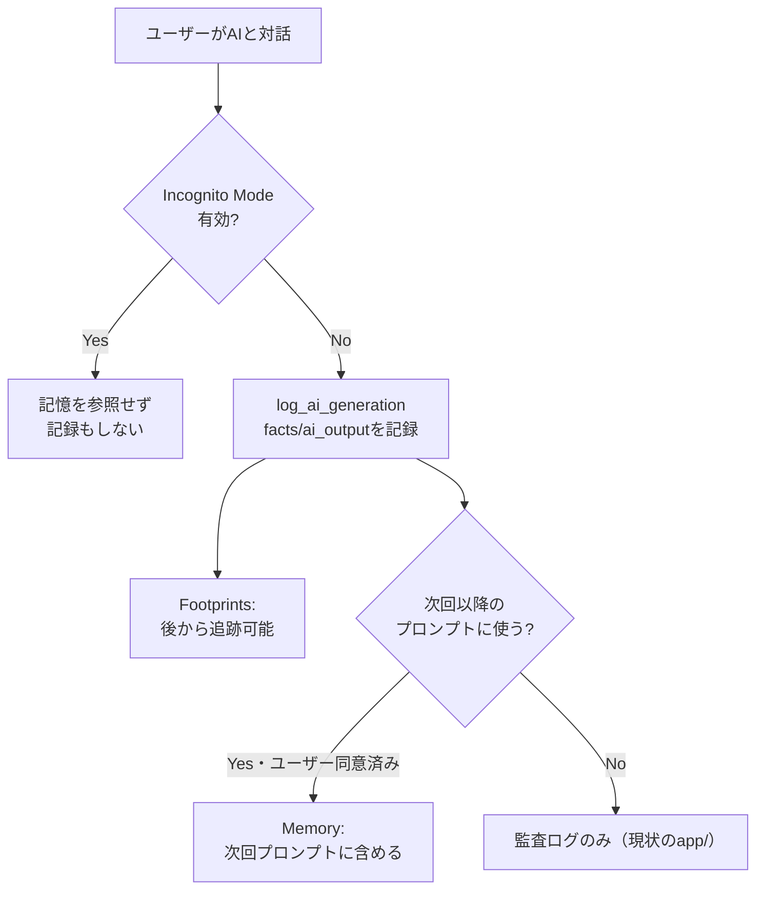

# 記憶・プライバシー・来歴

## この教材で身につくこと

- AIとのやり取りを「事実」と「AI出力」に分けて記録する設計を実装できる
- Footprints（AIの手順を追跡できるようにする）パターンを実装できる
- Memory・Consent・Data ownership・Incognito Mode・Watermarkの各パターンの
  目的を説明できる

## 概要

[Shape of AI](https://www.shapeof.ai/)のGovernorsカテゴリのMemory・Shared
visionと、Trust Buildersカテゴリの5パターン（Consent, Data ownership,
Footprints, Incognito Mode, Watermark）を扱います。共通するテーマは
「AIが何を知っていて、何を記録し、ユーザーがそれをどう制御できるか」です。

## 位置づけ

本教材は04章の最終教材（6番目）です。01〜05で学んだ「実行前後の
透明性」に対し、本教材は「セッションをまたいだ記憶」「記録されたログへの
プライバシー配慮」という、より長期的な視点を扱います。

## 主要概念・設計判断の解説

### `app/`の実例: Footprints（AIの手順を追跡できるようにする）

[Footprints](https://www.shapeof.ai/patterns/footprints)は「ユーザーが
プロンプトから結果までのAIの手順を追跡できるようにする」パターンです。
`app/`の`log_ai_generation`は、LLM呼び出しごとに入力した事実情報
（`facts`）とAIの応答（`ai_output`）を分離してDBに記録し、`session_id`単位で
一連のやり取りを追跡可能にしています。これはFootprintsの実装例です。

### Memoryとの違い

Footprintsが「後から追跡できる記録」であるのに対し、
[Memory](https://www.shapeof.ai/patterns/memory)は「AIが**次回以降の
やり取りに使う**記憶」を指します。`app/`の`log_ai_generation`はあくまで
監査ログであり、記録した`facts`/`ai_output`を次回のプロンプトに
自動的に読み込んで使う仕組みはありません。したがって`app/`にMemory
パターンの実装例はありません。本教材のサンプルコードは`app/`に実装例が
無いため、汎用サンプルコードで解説します。

### `app/`に実装が無い観点: プライバシー配慮の4パターン

[Consent](https://www.shapeof.ai/patterns/consent)（第三者データを本人の
同意なく取り込まない）・[Data ownership](https://www.shapeof.ai/patterns/data-ownership)
（AIが記憶・利用するデータをユーザーが制御できる）・
[Incognito Mode](https://www.shapeof.ai/patterns/incognito-mode)（記憶に
残さずAIとやり取りできる）・[Watermark](https://www.shapeof.ai/patterns/watermark)
（AI生成物であることを機械可読な形で識別可能にする）は、`app/`に
該当する実装がありません。本教材のサンプルコードは`app/`に実装例が
無いため、汎用サンプルコードで解説します。

## 実ソースコード（Python / プロンプト例、出典パス明記）

出典: `ai-stock-investing-tutorial/app/common/ai_generation_log.py`
（Footprintsの実装例）

```python
def log_ai_generation(
    session_id: str,
    feature: str,
    facts: dict,
    prompt: str,
    ai_output: str,
    *,
    turn_index: int = 0,
    ticker: str | None = None,
    user_id: int | None = None,
    session_feature: str | None = None,
    session_factory=SessionLocal,
) -> None:
    with session_factory() as session:
        if session.get(AiSession, session_id) is None:
            session.add(
                AiSession(
                    id=session_id,
                    feature=session_feature or feature,
                    ticker=ticker,
                    user_id=user_id,
                )
            )
            session.flush()
        session.add(
            AiGeneration(
                session_id=session_id,
                turn_index=turn_index,
                feature=feature,
                facts=json.dumps(facts, ensure_ascii=False, default=str),
                prompt=prompt,
                ai_output=ai_output,
            )
        )
        session.commit()
```

`facts`（プログラムが計算した事実情報）と`ai_output`（AIの応答）を別列に
分離して記録する設計は、後から「AIが何を根拠に何を出力したか」を
追跡できるようにするFootprintsの核心です。

汎用サンプルコード（`app/`に実装例が無いため、Memory・Incognito Modeを
解説する架空のコード）:

```python
def build_prompt_with_memory(user_message: str, user_id: int) -> str:
    """ユーザーが許可した場合のみ、過去の記憶をプロンプトに含める。
    Incognito Modeが有効な場合は記憶を一切参照・記録しない。
    """
    if st.session_state.get("incognito_mode", False):
        return user_message  # 記憶を参照せず、この回のやり取りも記録しない

    remembered_facts = load_user_memory(user_id)  # ユーザーが同意したデータのみ
    if not remembered_facts:
        return user_message
    memory_context = "\n".join(f"- {fact}" for fact in remembered_facts)
    return f"【あなたについて記憶している情報】\n{memory_context}\n\n【今回のメッセージ】\n{user_message}"
```



## 演習課題

1. `log_ai_generation`が`facts`と`ai_output`を同じ列ではなく別々の列に
   分離して記録している理由を、Footprintsの目的に照らして説明してください。
2. 自分のアプリにMemoryパターンを追加するとしたら、ユーザーにどんな
   同意（Consent）の取り方をするべきか設計してください。

## 理解度チェック

- [ ] `ai_generation_log.py`がFootprintsパターンにどう対応するか説明できる
- [ ] FootprintsとMemoryの違いを説明できる
- [ ] Consent・Data ownership・Incognito Mode・Watermarkの目的をそれぞれ説明できる

---

[← 前へ: 透明性と制御](05-transparency-and-control.md) | [次へ: 05-agentic-workflow-patterns →](../05-agentic-workflow-patterns/00-README.md)
