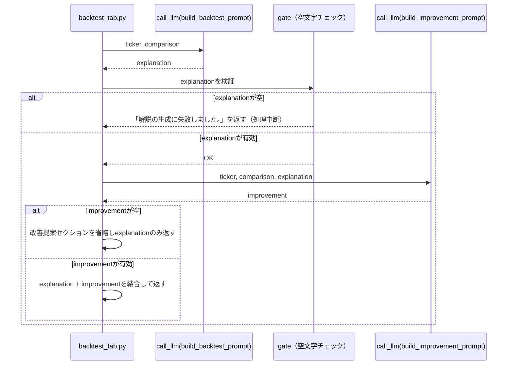

# Prompt Chaining

## この教材で身につくこと

- タスクを固定順序の複数LLM呼び出しに分解する設計を実装できる
- 各ステップの出力を次ステップの入力に渡す契約を設計できる
- ステップ間に検証（gate）を挟むかどうかを判断できる

## 概要

バックテスト結果の解説→改善提案という2段階のタスクを例に、Prompt Chaining
パターンを解説します。

## 位置づけ

05章の最初の教材で、最も単純な複数LLM呼び出しパターンです。02章で学んだ
単発/バッチ呼び出しを、複数回の呼び出しをつなげる形に拡張したものです。

## 主要概念・設計判断の解説

### Prompt Chainingの定義

タスクを固定の逐次ステップに分解し、各LLM呼び出しが前段の出力を処理します
（出典: [Anthropic "Building Effective Agents"](https://www.anthropic.com/research/building-effective-agents)）。

### 向いているケース

精度がレイテンシより重要で、タスクが明確な固定順序のサブタスクに
分解できる場合に向いています。

### ステップ間のgate（検証）の役割

各ステップの出力を次に渡す前に妥当性チェックを挟むことで、誤りの伝播を
防げます。`app/`の実装では、Step1（結果解説）が空文字を返した場合は
Step2（改善提案）に進まず、エラーメッセージをそのまま返します。一方、
Step2が空文字の場合はStep1の結果自体には価値があるため、改善提案
セクションだけを省略してStep1の結果を返します（gateは両ステップに
対称に置くとは限らない、という設計判断の例です）。

### `app/`での実装

既存の「バックテスト解説」機能（単発のAugmented LLM呼び出し）を、
「結果解説→改善提案」の2ステップに分解しています。関数シグネチャと
戻り値の型（Markdown文字列）は変更していないため、呼び出し元
（`backtest_tab.py`）と既存の日次ファイルキャッシュはそのまま機能します。

## 実ソースコード（Python / プロンプト例、出典パス明記）

出典: `ai-stock-investing-tutorial/app/portfolio_management/backtest.py`、
`ai-stock-investing-tutorial/app/prompt_patterns/backtest_explanation.py`

```python
def generate_backtest_explanation(
    ticker: str,
    prices: pd.Series,
    backtest_func=run_ma_crossover_backtest,
    strategy_name: str = "移動平均クロスオーバー",
    presets: list[tuple[str, dict]] | None = None,
    transaction_cost_pct: float = 0.0,
    call_llm=default_call_llm,
) -> str:
    if presets is None:
        presets = STRATEGIES[strategy_name]["presets"]

    comparison = run_backtest_comparison(prices, backtest_func, presets, transaction_cost_pct)

    # Step1: 結果解説
    explanation = call_llm(build_backtest_prompt(ticker, comparison, strategy_name)).strip()
    if not explanation:
        # gate: Step1が空文字ならStep2に進まずエラーメッセージを返す
        return "解説の生成に失敗しました。"

    sections = [
        DISCLAIMER_NOTICE,
        "",
        f"# バックテスト結果解説（{ticker}）",
        "",
        explanation,
    ]

    # Step2: 改善提案（Step1の解説を入力として渡す）
    improvement_prompt = build_improvement_prompt(ticker, comparison, explanation, strategy_name)
    improvement = call_llm(improvement_prompt).strip()
    if improvement:
        sections += ["", "## 追加で検討したい観点", "", improvement]

    sections += ["", "---", "", DISCLAIMER_NOTICE]
    return "\n".join(sections)


def build_improvement_prompt(
    ticker: str,
    comparison: dict[str, dict],
    explanation: str,
    strategy_name: str = "移動平均クロスオーバー",
) -> str:
    # Step1（結果解説）の出力を入力として受け取り、追加で検討すべき観点を
    # 生成させる2段階目のプロンプト。
    comparison_json = json.dumps(comparison, ensure_ascii=False, indent=2, default=str)
    return (
        f"以下は{strategy_name}戦略のバックテスト結果（Python側で計算済み）と、"
        "その結果について別のAIが作成した解説文です。\n\n"
        f"【対象銘柄】{ticker}\n"
        f"【パラメータ組ごとの結果（JSON）】\n{comparison_json}\n\n"
        f"【既存の解説】\n{explanation}\n\n"
        "この解説を踏まえ、投資家が追加で検討する価値がある観点を"
        "日本語で2〜3個、簡潔に提案してください。\n"
        # ...（過学習リスク・取引コスト等を考慮させる指示が続く）
    )
```



## 演習課題

1. `generate_backtest_explanation`に3段階目（改善提案の内容を1〜5の
   優先度スコアに変換するステップ）を追加するなら、どんな関数
   シグネチャになるか設計してください。
2. gateがStep1（解説）の空文字チェックのみに置かれ、Step2（改善提案）の
   空文字チェックには「処理中断」ではなく「セクション省略」という
   異なる扱いになっている理由を、両ステップの成果物としての価値の違いの
   観点から説明してください。

## 理解度チェック

- [ ] Prompt Chainingが向いているケースを説明できる
- [ ] ステップ間のgate（検証）の役割を説明できる
- [ ] `app/`の1回呼び出しとPrompt Chainingの違いを説明できる

---

[← 前へ: 00-README](00-README.md) | [次へ: Routing →](02-routing.md)
