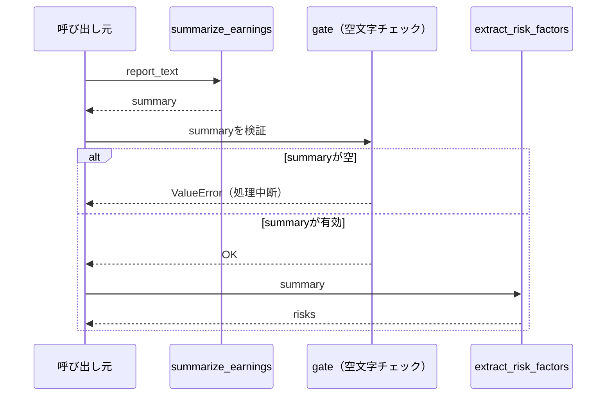

# Prompt Chaining

## この教材で身につくこと

- タスクを固定順序の複数LLM呼び出しに分解する設計を実装できる
- 各ステップの出力を次ステップの入力に渡す契約を設計できる
- ステップ間に検証（gate）を挟むかどうかを判断できる

## 概要

決算資料の要約→リスク要因抽出という2段階のタスクを例に、Prompt Chaining
パターンを解説します。

## 位置づけ

05章の最初の教材で、最も単純な複数LLM呼び出しパターンです。02章で学んだ
単発/バッチ呼び出しを、複数回の呼び出しをつなげる形に拡張したものです。

## 主要概念・設計判断の解説

### Prompt Chainingの定義

タスクを固定の逐次ステップに分解し、各LLM呼び出しが前段の出力を処理します
（出典: [Anthropic "Building Effective Agents"](https://www.anthropic.com/research/building-effective-agents)）。

### 向いているケース

精度がレイテンシより重要で、タスクが明確な固定順序のサブタスクに
分解できる場合に向いています。

### ステップ間のgate（検証）の役割

各ステップの出力を次に渡す前に妥当性チェックを挟むことで、誤りの伝播を
防げます。本教材のサンプルでは、要約が空文字列でないかを確認してから
リスク抽出に進みます。

### `app/`との対比

`app/`のポートフォリオレビュー（1回のAugmented LLM呼び出しで事実データを
渡し考察を得る）と異なり、Prompt Chainingは複数回の呼び出しそのものが
処理ステップになります。

## 実ソースコード（Python / プロンプト例、出典パス明記）

本教材のサンプルコードは`app/`に実装例が無いため、汎用サンプルコードで
解説します。

```python
def call_llm(prompt: str) -> str:
    """LLM呼び出しの共通口（01章のAugmented LLM呼び出しに相当）。"""
    ...


def summarize_earnings(report_text: str) -> str:
    prompt = f"次の決算資料を300字以内で要約してください。\n\n{report_text}"
    return call_llm(prompt)


def extract_risk_factors(summary: str) -> str:
    prompt = f"次の要約からリスク要因を箇条書きで3つ抽出してください。\n\n{summary}"
    return call_llm(prompt)


def chained_earnings_risk_report(report_text: str) -> str:
    """決算要約→リスク抽出の順に固定ステップでLLMを呼び出す（Prompt Chaining）。"""
    summary = summarize_earnings(report_text)
    if not summary.strip():
        raise ValueError("要約が空のため、リスク抽出ステップに進めません（gate）。")
    risks = extract_risk_factors(summary)
    return f"## 要約\n{summary}\n\n## リスク要因\n{risks}"
```



## 演習課題

1. `chained_earnings_risk_report`に3段階目（リスク要因を1〜5の
   リスクスコアに変換するステップ）を追加するなら、どんな関数シグネチャに
   なるか設計してください。
2. `app/`にPrompt Chainingを追加するなら、どの機能が候補になるか
   （例: バックテスト解説→改善提案の2段階化）理由とともに1つ挙げてください。

## 理解度チェック

- [ ] Prompt Chainingが向いているケースを説明できる
- [ ] ステップ間のgate（検証）の役割を説明できる
- [ ] `app/`の1回呼び出しとPrompt Chainingの違いを説明できる

---

[← 前へ: 00-README](00-README.md) | [次へ: Routing →](02-routing.md)
