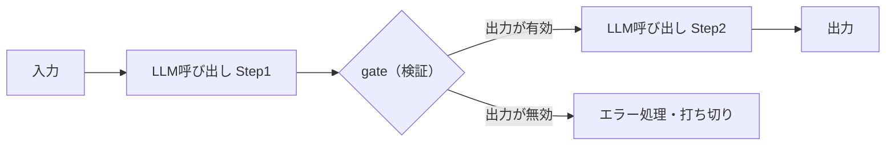
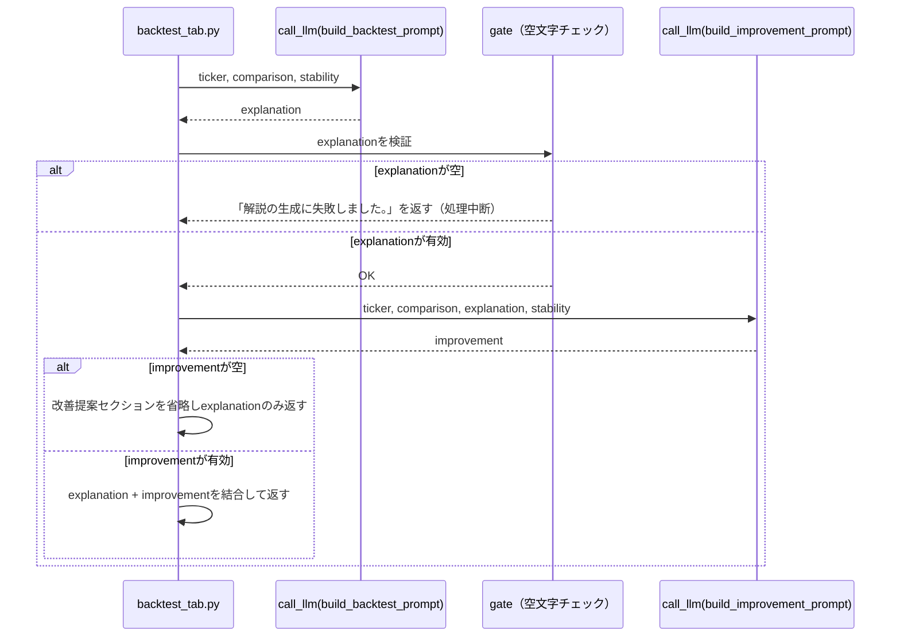

# Prompt Chaining

## この教材で身につくこと

- タスクを固定順序の複数LLM呼び出しに分解する設計を実装できる
- 各ステップの出力を次ステップの入力に渡す契約を設計できる
- ステップ間に検証（gate）を挟むかどうかを判断できる

## 概要

1回のLLM呼び出しで複雑なタスクをすべて済まそうとすると、指示が多くなりすぎて精度が落ちることがあります。
たとえば「結果を解説し、かつ改善案も提案してください」と1回で指示すると、どちらかの出力が薄くなりがちです。
タスクが明確な順序を持つ複数のサブステップに分解できる場合は、LLM呼び出し自体を複数回に分け、前段の出力を次段の入力として渡す設計が有効です。
これがPrompt Chaining（プロンプトチェイニング）パターンです。

本教材では、バックテスト結果の解説→改善提案という2段階のタスクを例に、Prompt Chainingパターンを解説します。

## 位置づけ

05章の最初の教材で、最も単純な複数LLM呼び出しパターンです。
02章で学んだ単発/バッチ呼び出しを、複数回の呼び出しをつなげる形に拡張したものです。

| 観点 | 単発のAugmented LLM呼び出し（01〜04章） | Prompt Chaining |
|---|---|---|
| 呼び出し回数 | 1回 | 複数回（固定順） |
| 向いている場面 | 単一の考察・レポート生成で完結するタスク | サブタスクに明確に分解できるタスク |
| つまずきやすい点 | タスクが複雑になるほど1回の出力の精度が落ちる | ステップが増えるほどレイテンシ・コストが線形に増える |

## 主要概念・設計判断の解説

### Prompt Chainingの定義

タスクを固定の逐次ステップに分解し、各LLM呼び出しが前段の出力を処理します（出典: [Anthropic "Building Effective Agents"](https://www.anthropic.com/research/building-effective-agents)）。

一般形は次のとおりです。
ステップ数やgateの有無はタスクに応じて変わりますが、「前段の出力を次段の入力に渡す」という骨格は共通です。



gateは「前段の出力を次段に渡してよいか」を判定する検証ステップです。
gate自体はコード（if文など）であり、LLM呼び出しではありません。

### 向いているケース

精度がレイテンシより重要で、タスクが明確な固定順序のサブタスクに分解できる場合に向いています。

### ステップ間のgate（検証）の役割

各ステップの出力を次に渡す前に妥当性チェックを挟むことで、誤りの伝播を防げます。
`app/`の実装（`generate_backtest_explanation`）は次の順序で処理します。

1. **Step1呼び出し**: `call_llm(build_backtest_prompt(...))`で結果解説を生成する。
   - つまずきやすい点: 空文字が返る可能性を考慮し、後続処理をどう扱うか決めておく必要がある。
2. **gate判定**: Step1の出力が空文字でないか検証する。
   - つまずきやすい点: 空文字ならStep2に進まず、エラーメッセージのみを返して処理を打ち切る。
3. **Step2呼び出し**: Step1の解説を入力に含めて`call_llm(build_improvement_prompt(...))`を呼び、改善提案を生成する。
4. **結果の結合**: Step2の出力が空文字でなければ改善提案セクションとして追記し、空文字ならStep1の結果のみを返す。
   - つまずきやすい点: Step1とStep2でgateの扱いが異なる（中断 vs セクション省略）。両ステップの成果物としての価値が違うためです。

### `app/`での実装

既存の「バックテスト解説」機能（単発のAugmented LLM呼び出し）を、「結果解説→改善提案」の2ステップに分解しています。
関数シグネチャと戻り値の型（Markdown文字列）は変更していないため、呼び出し元（`backtest_tab.py`）と既存の日次ファイルキャッシュはそのまま機能します。

## 実ソースコード（Python / プロンプト例、出典パス明記）

出典: `ai-stock-investing-tutorial/app/portfolio_management/backtest.py`、`ai-stock-investing-tutorial/app/prompt_patterns/backtest_explanation.py`

```python
def generate_backtest_explanation(
    ticker: str,
    grid_results: list[dict],
    strategy_name: str = "移動平均クロスオーバー",
    call_llm=default_call_llm,
) -> str:
    # grid_resultsはPython側のグリッドサーチで既に計算済み。
    # 最良/近傍最悪パラメータと安定性（cv, is_stable）をまとめる。
    summary = summarize_grid_stability(grid_results)
    best, worst = summary["best"], summary["worst"]
    comparison = {"最良": best, "近傍最悪": worst}  # 実際は日本語ラベルにparamsを含める
    stability = {
        "cv": summary["cv"],
        "is_stable": summary["is_stable"],
        "grid_size": summary["grid_size"],
    }

    # Step1: 結果解説
    explanation = call_llm(
        build_backtest_prompt(ticker, comparison, stability, strategy_name)
    ).strip()
    if not explanation:
        # gate: Step1が空文字ならStep2に進まずエラーメッセージを返す
        return "解説の生成に失敗しました。"

    sections = [
        DISCLAIMER_NOTICE,
        "",
        f"# バックテスト結果解説（{ticker}）",
        "",
        explanation,
    ]

    # Step2: 改善提案（Step1の解説を入力として渡す）
    improvement_prompt = build_improvement_prompt(
        ticker, comparison, explanation, stability, strategy_name
    )
    improvement = call_llm(improvement_prompt).strip()
    if improvement:
        sections += ["", "## 追加で検討したい観点", "", improvement]

    sections += ["", "---", "", DISCLAIMER_NOTICE]
    return "\n".join(sections)


def build_improvement_prompt(
    ticker: str,
    comparison: dict[str, dict],
    explanation: str,
    stability: dict,
    strategy_name: str = "移動平均クロスオーバー",
) -> str:
    # Step1（結果解説）の出力を入力として受け取り、追加で検討すべき観点を
    # 生成させる2段階目のプロンプト。
    comparison_json = json.dumps(comparison, ensure_ascii=False, default=str)
    return (
        f"以下は{strategy_name}戦略のバックテスト結果（Python側で計算済み）と、"
        "その結果について別のAIが作成した解説文です。\n\n"
        f"【対象銘柄】{ticker}\n"
        f"【近傍グリッド内の最良/最悪パラメータの結果（JSON）】\n{comparison_json}\n\n"
        f"【既存の解説】\n{explanation}\n\n"
        "この解説を踏まえ、投資家が追加で検討する価値がある観点を"
        "日本語で2〜3個、簡潔に提案してください。\n"
        # ...（過学習リスク・取引コスト等を考慮させる指示が続く）
    )
```

（参考）3ステップ目への拡張イメージです。
`app/`にはまだ3段階目の実装は無いため、以下は**汎用サンプルコード**です（演習課題1で設計するものと対応します）。

```python
# 汎用サンプル: Step2（改善提案）の内容を1〜5の優先度スコアに変換するStep3。
def build_priority_prompt(improvement: str) -> str:
    return (
        "以下は投資家向けの追加検討観点です。\n\n"
        f"{improvement}\n\n"
        "この内容の緊急度を1（低い）〜5（高い）の整数1つだけで評価してください。"
        "数字のみを出力してください。"
    )


def generate_backtest_explanation_with_priority(
    ticker: str, grid_results: list[dict], call_llm=default_call_llm
) -> tuple[str, int | None]:
    # Step1・Step2は既存のgenerate_backtest_explanationと同じ流れ。
    explanation_markdown = generate_backtest_explanation(
        ticker, grid_results, call_llm=call_llm
    )

    # Step3: Step2で生成された「追加で検討したい観点」だけを抜き出して渡す想定。
    # ここでは説明を簡略化するため、抽出処理は省略している。
    improvement_section = explanation_markdown  # 本来は該当セクションのみを抽出
    raw_priority = call_llm(build_priority_prompt(improvement_section)).strip()
    try:
        priority = int(raw_priority)
    except ValueError:
        # gate: 数値として解釈できない応答は「優先度不明」として扱う
        priority = None
    return explanation_markdown, priority
```



## 演習課題

1. `generate_backtest_explanation`に3段階目（改善提案の内容を1〜5の優先度スコアに変換するステップ）を追加するなら、どう設計するか考えてください。
   1. Step3の入力（何を渡すか）と出力（型）をまず決めてください。
   2. Step3をStep1・Step2のどの後段で呼ぶか決めてください。
   3. Step3の応答が数値としてパースできなかった場合のgateをどう置くか設計してください（上記の汎用サンプルも参考にしてください）。
2. gateがStep1（解説）の空文字チェックのみに置かれ、Step2（改善提案）の空文字チェックには「処理中断」ではなく「セクション省略」という異なる扱いになっている理由を、両ステップの成果物としての価値の違いの観点から説明してください。

## 理解度チェック

- [ ] Prompt Chainingが向いているケースを説明できる
- [ ] ステップ間のgate（検証）の役割を説明できる
- [ ] `app/`の1回呼び出しとPrompt Chainingの違いを説明できる
- [ ] 3ステップ以上にチェーンを拡張する場合の設計判断ができる

---

[← 前へ: 00-README](00-README.md) | [次へ: Routing →](02-routing.md)
