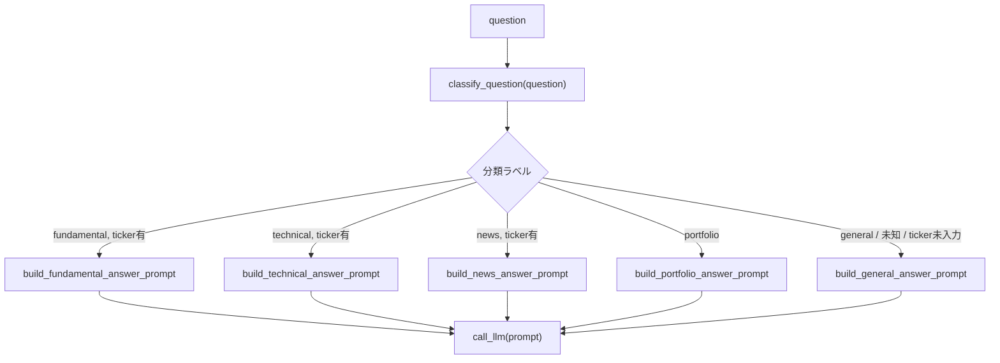

# Routing

## この教材で身につくこと

- 入力を分類し、専用の処理へ振り分ける設計を実装できる
- 分類結果が未知の値だった場合のフォールバックを設計できる
- Routingが向いているケースを説明できる

## 概要

ユーザーの自由記述の投資質問を「ファンダメンタル」「テクニカル」
「ニュース」「ポートフォリオ全体」「一般」の5カテゴリに分類し、
それぞれ専用のプロンプトで処理するRoutingパターンを解説します。

## 位置づけ

Prompt Chainingが固定順序であるのに対し、Routingは入力に応じて経路が
変わる点が異なります。02章のプロンプト範囲限定（出力を列挙値に限定する
設計）を、「次に呼び出す処理の選択」に応用したものです。

## 主要概念・設計判断の解説

### Routingの定義

入力を分類し、専用のフォローアップタスクに振り分けます（出典:
[Anthropic "Building Effective Agents"](https://www.anthropic.com/research/building-effective-agents)）。

### 向いているケース

明確に異なるカテゴリを持つ複雑な問題で、カテゴリごとに個別対応する方が
精度が上がる場合に向いています。

### 分類自体もLLM呼び出しで行う設計

未知の分類ラベルが返った場合は既定カテゴリへフォールバックします。
これは04章のガードレール/03章の防御的パースと同じ「安全側に倒す」
考え方です。

### `app/`での実装

「AI質問箱」タブは、質問文をLLMで分類（`classify_question`）した後、
カテゴリに応じて既存の分析エージェント（ファンダメンタルズ・テクニカル・
ニュース・ポートフォリオ構成/リスク）を呼び出し、事実データを埋め込んだ
専用プロンプトで回答を生成します。分類のみをプロンプト層
（`prompt_patterns/qa_routing.py`）に切り出し、事実データの取得と
実際の分岐実行はタブ層（`app_tabs/qa_tab.py`）が担うという役割分担
（他タブとも共通）を取っています。

個別銘柄向けカテゴリ（fundamental/technical/news）に分類されたが銘柄
コードが未入力の場合は`general`に読み替える、という追加のフォールバックも
入れています。これは「未知ラベル→既定カテゴリ」と同じ「安全側に倒す」
考え方を、「分類は正しいが実行に必要な入力が欠けている」ケースにも
広げたものです。

## 実ソースコード（Python / プロンプト例、出典パス明記）

出典: `ai-stock-investing-tutorial/app/prompt_patterns/qa_routing.py`、
`ai-stock-investing-tutorial/app/app_tabs/qa_tab.py`

```python
_CATEGORIES = ["fundamental", "technical", "news", "portfolio", "general"]


def build_classify_prompt(question: str) -> str:
    return (
        "次の株式投資に関する質問を、fundamental, technical, news, portfolio, "
        "general のいずれか1つに分類し、分類名のみを出力してください"
        "（説明文やコードブロック記法は不要です）。\n\n"
        "- fundamental: PER・PBR・配当利回りなど個別銘柄の財務指標に関する質問\n"
        "- technical: 移動平均線など個別銘柄の値動き・チャートに関する質問\n"
        "- news: 個別銘柄の直近ニュース・センチメントに関する質問\n"
        "- portfolio: 保有銘柄全体の構成比・リスク・分散に関する質問\n"
        "- general: 上記のいずれにも当てはまらない一般的な投資知識の質問\n\n"
        f"質問: {question}"
    )


def classify_question(question: str, call_llm=default_call_llm) -> str:
    # 未知のラベルや空応答は安全側の "general" にフォールバックする。
    label = call_llm(build_classify_prompt(question)).strip()
    return label if label in _CATEGORIES else "general"
```

タブ層での振り分け実行部分:

```python
    with st.spinner("質問を分類しています..."):
        category = classify_question(question, call_llm=call_llm)

    note = None
    if category in ("fundamental", "technical", "news") and not ticker:
        note = "個別銘柄について聞く場合は銘柄コードを入力してください。一般的な回答を表示します。"
        category = "general"

    with st.spinner("回答を生成しています..."):
        if category == "fundamental":
            fundamentals = cached_analyze_fundamentals(ticker)
            prompt = build_fundamental_answer_prompt(question, fundamentals)
        elif category == "technical":
            history = cached_fetch_price_history(ticker, "6mo")
            technical = analyze_technical(history)
            prompt = build_technical_answer_prompt(question, technical)
        elif category == "news":
            news = cached_fetch_news(ticker)
            prompt = build_news_answer_prompt(question, news)
        elif category == "portfolio":
            ...  # 保有銘柄の構成比・リスク指標を計算してプロンプトへ
        else:
            prompt = build_general_answer_prompt(question)

        answer = call_llm(prompt)
```



## 演習課題

1. "general"以外に、未知ラベル時のフォールバック先として"fundamental"を
   選んだ場合、どんなリスクがあるか説明してください。
2. `app/`の「AI質問箱」に6番目のカテゴリ（例: "backtest" — バックテスト
   結果に関する質問）を追加するとしたら、`classify_question`の分類プロンプト
   と`app_tabs/qa_tab.py`の分岐処理をどう変更するか設計してください。

## 理解度チェック

- [ ] Routingが向いているケースを説明できる
- [ ] 未知の分類ラベルへのフォールバック設計の必要性を説明できる
- [ ] RoutingとPrompt Chainingの違いを説明できる

---

[← 前へ: Prompt Chaining](01-prompt-chaining.md) | [次へ: Orchestrator-Workers →](03-orchestrator-workers.md)
