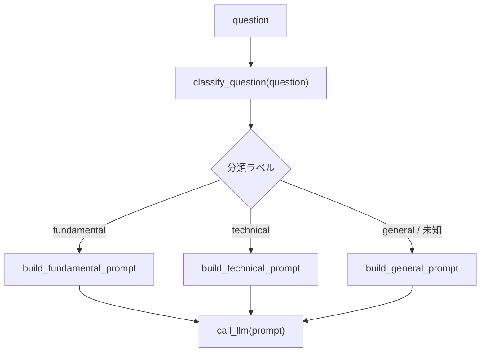

# Routing

## この教材で身につくこと

- 入力を分類し、専用の処理へ振り分ける設計を実装できる
- 分類結果が未知の値だった場合のフォールバックを設計できる
- Routingが向いているケースを説明できる

## 概要

ユーザーの自由記述の質問を「ファンダメンタル」「テクニカル」「一般」に
分類し、それぞれ専用のプロンプトで処理するRoutingパターンを解説します。

## 位置づけ

Prompt Chainingが固定順序であるのに対し、Routingは入力に応じて経路が
変わる点が異なります。02章のプロンプト範囲限定（出力を列挙値に限定する
設計）を、「次に呼び出す処理の選択」に応用したものです。

## 主要概念・設計判断の解説

### Routingの定義

入力を分類し、専用のフォローアップタスクに振り分けます（出典:
[Anthropic "Building Effective Agents"](https://www.anthropic.com/research/building-effective-agents)）。

### 向いているケース

明確に異なるカテゴリを持つ複雑な問題で、カテゴリごとに個別対応する方が
精度が上がる場合に向いています。

### 分類自体もLLM呼び出しで行う設計

未知の分類ラベルが返った場合は既定カテゴリへフォールバックします。
これは04章のガードレール/03章の防御的パースと同じ「安全側に倒す」
考え方です。

## 実ソースコード（Python / プロンプト例、出典パス明記）

本教材のサンプルコードは`app/`に実装例が無いため、汎用サンプルコードで
解説します。

```python
def build_fundamental_prompt(question: str) -> str:
    return f"次の質問にファンダメンタル分析の観点で答えてください。\n\n{question}"


def build_technical_prompt(question: str) -> str:
    return f"次の質問にテクニカル分析の観点で答えてください。\n\n{question}"


def build_general_prompt(question: str) -> str:
    return f"次の質問に一般的な投資知識の観点で答えてください。\n\n{question}"


_ROUTES = {
    "fundamental": build_fundamental_prompt,
    "technical": build_technical_prompt,
    "general": build_general_prompt,
}


def classify_question(question: str) -> str:
    prompt = (
        "次の質問を fundamental, technical, general のいずれかに分類し、"
        "分類名のみを出力してください。\n\n" + question
    )
    label = call_llm(prompt).strip()
    # 未知のラベルが返った場合は "general" にフォールバックする。
    return label if label in _ROUTES else "general"


def route_question(question: str) -> str:
    label = classify_question(question)
    build_prompt = _ROUTES[label]
    return call_llm(build_prompt(question))
```



## 演習課題

1. "general"以外に、未知ラベル時のフォールバック先として"fundamental"を
   選んだ場合、どんなリスクがあるか説明してください。
2. `app/`のスクリーニング機能にRoutingを追加するなら、どんな分類軸が
   考えられるか（例: 個別銘柄向けか業種横断か）1つ挙げてください。

## 理解度チェック

- [ ] Routingが向いているケースを説明できる
- [ ] 未知の分類ラベルへのフォールバック設計の必要性を説明できる
- [ ] RoutingとPrompt Chainingの違いを説明できる

---

[← 前へ: Prompt Chaining](01-prompt-chaining.md) | [次へ: Orchestrator-Workers →](03-orchestrator-workers.md)
