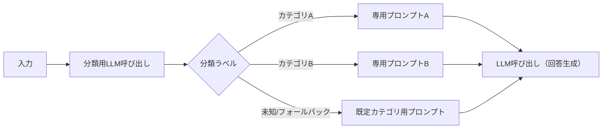
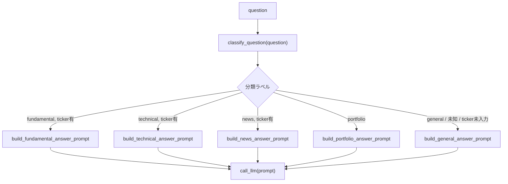

# Routing

## この教材で身につくこと

- 入力を分類し、専用の処理へ振り分ける設計を実装できる
- 分類結果が未知の値だった場合のフォールバックを設計できる
- Routingが向いているケースを説明できる

## 概要

1つのプロンプトに「財務指標の質問にも、チャートの質問にも、ニュースの質問にも答えて」と欲張って詰め込むと、プロンプトが長大になり、どの意図に対しても中途半端にしか対応できなくなりがちです。
入力ごとに扱うべき事実データやトーンが大きく異なる場合は、まず入力の種類（カテゴリ）を見分けてから、カテゴリ専用の処理に振り分ける設計が有効です。
これがRouting（ルーティング）パターンです。

本教材では、ユーザーの自由記述の投資質問を「ファンダメンタル」「テクニカル」「ニュース」「ポートフォリオ全体」「一般」の5カテゴリに分類し、それぞれ専用のプロンプトで処理するRoutingパターンを解説します。

## 位置づけ

Prompt Chainingが固定順序であるのに対し、Routingは入力に応じて経路が変わる点が異なります。
02章のプロンプト範囲限定（出力を列挙値に限定する設計）を、「次に呼び出す処理の選択」に応用したものです。

| 観点 | Prompt Chaining | Routing |
|---|---|---|
| 制御フロー | コードが決めた固定順序で全ステップを実行 | コードが分類結果に応じて1つの経路を選ぶ |
| トリガー条件 | タスクが逐次のサブタスクに分解できる | 入力のカテゴリが明確に分かれる |
| 向いている場面 | 精度重視で、順を追った処理が必要な場合 | カテゴリごとに専用処理する方が精度が上がる場合 |
| つまずきやすい点 | ステップ数が増えるとコストが線形に増える | 誤分類・未知ラベルへのフォールバック設計が必須 |

## 主要概念・設計判断の解説

### Routingの定義

入力を分類し、専用のフォローアップタスクに振り分けます（出典: [Anthropic "Building Effective Agents"](https://www.anthropic.com/research/building-effective-agents)）。

一般形は次のとおりです。
分類自体をLLM呼び出しで行い、その結果に応じてコードが実行経路を分岐させます。



### 向いているケース

明確に異なるカテゴリを持つ複雑な問題で、カテゴリごとに個別対応する方が精度が上がる場合に向いています。

### 分類自体もLLM呼び出しで行う設計

分類も1回のLLM呼び出しです。
そのため分類結果自体が誤ったり、想定外の文字列を返したりする可能性があります。
未知の分類ラベルが返った場合は既定カテゴリへ**フォールバック**（想定外の場合の退避先として、あらかじめ決めておいた安全な選択肢に倒すこと）します。
これは04章のガードレール/03章の防御的パースと同じ「安全側に倒す」考え方です。

### 処理の流れ（ステップ順）

`app/`の「AI質問箱」機能を例にすると、処理は次の順序で進みます。

1. **質問受付**: 自由記述の質問文と（任意の）銘柄コードを受け取る。
2. **分類**: `classify_question`でLLMに質問をカテゴリ分類させる。
   - つまずきやすい点: 未知ラベル・空応答は`general`にフォールバックさせる（上記参照）。
3. **入力不足のフォールバック**: 個別銘柄向けカテゴリなのに銘柄コードが未入力なら`general`に読み替える。
   - つまずきやすい点: 「分類は正しいが実行に必要な入力が欠けている」ケースは、未知ラベルとは別に個別の対処が必要になる。
4. **専用プロンプトの組み立て**: カテゴリに応じた事実データ（財務指標・テクニカル指標・ニュース等）を取得し、専用プロンプトへ埋め込む。
5. **回答生成**: `call_llm(prompt)`を呼び、最終回答を生成する。

### `app/`での実装

「AI質問箱」タブは、質問文をLLMで分類（`classify_question`）した後、カテゴリに応じて既存の分析エージェント（ファンダメンタルズ・テクニカル・ニュース・ポートフォリオ構成/リスク）を呼び出し、事実データを埋め込んだ専用プロンプトで回答を生成します。
分類のみをプロンプト層（`prompt_patterns/qa_routing.py`）に切り出し、事実データの取得と実際の分岐実行はタブ層（`app_tabs/qa_tab.py`）が担うという役割分担（他タブとも共通）を取っています（詳細は上の「処理の流れ」を参照）。

## 実ソースコード（Python / プロンプト例、出典パス明記）

出典: `ai-stock-investing-tutorial/app/prompt_patterns/qa_routing.py`、`ai-stock-investing-tutorial/app/app_tabs/qa_tab.py`

```python
_CATEGORIES = ["fundamental", "technical", "news", "portfolio", "general"]


def build_classify_prompt(question: str) -> str:
    return (
        "次の株式投資に関する質問を、fundamental, technical, news, portfolio, "
        "general のいずれか1つに分類し、分類名のみを出力してください"
        "（説明文やコードブロック記法は不要です）。\n\n"
        "- fundamental: PER・PBR・配当利回りなど個別銘柄の財務指標に関する質問\n"
        "- technical: 移動平均線など個別銘柄の値動き・チャートに関する質問\n"
        "- news: 個別銘柄の直近ニュース・センチメントに関する質問\n"
        "- portfolio: 保有銘柄全体の構成比・リスク・分散に関する質問\n"
        "- general: 上記のいずれにも当てはまらない一般的な投資知識の質問\n\n"
        f"質問: {question}"
    )


def classify_question(question: str, call_llm=default_call_llm) -> str:
    # 未知のラベルや空応答は安全側の "general" にフォールバックする。
    label = call_llm(build_classify_prompt(question)).strip()
    return label if label in _CATEGORIES else "general"
```

タブ層での振り分け実行部分:

```python
    with st.spinner("質問を分類しています..."):
        category = classify_question(question, call_llm=call_llm)

    note = None
    if category in ("fundamental", "technical", "news") and not ticker:
        note = "個別銘柄について聞く場合は銘柄コードを入力してください。一般的な回答を表示します。"
        category = "general"

    with st.spinner("回答を生成しています..."):
        if category == "fundamental":
            fundamentals = cached_analyze_fundamentals(ticker)
            prompt = build_fundamental_answer_prompt(question, fundamentals)
        elif category == "technical":
            history = cached_fetch_price_history(ticker, "6mo")
            technical = analyze_technical(history)
            prompt = build_technical_answer_prompt(question, technical)
        elif category == "news":
            news = cached_fetch_news(ticker)
            prompt = build_news_answer_prompt(question, news)
        elif category == "portfolio":
            ...  # 保有銘柄の構成比・リスク指標を計算してプロンプトへ
        else:
            prompt = build_general_answer_prompt(question)

        answer = call_llm(prompt)
```



Routingは投資ドメイン以外でも一般的に使われるパターンです。
`app/`にはこれ以外の実装例が無いため、以下は**汎用サンプルコード**として、カスタマーサポートのメール分類を例に示します。

```python
# 汎用サンプル: 問い合わせメールを分類し、担当部署別のプロンプトへ振り分ける。
_SUPPORT_CATEGORIES = ["billing", "technical", "cancellation", "other"]


def build_support_classify_prompt(email_body: str) -> str:
    return (
        "次の問い合わせメールを、billing, technical, cancellation, other "
        "のいずれか1つに分類し、分類名のみを出力してください。\n\n"
        f"メール本文: {email_body}"
    )


def classify_support_email(email_body: str, call_llm) -> str:
    # 未知のラベルや空応答は "other"（総合窓口）に安全側フォールバックする。
    label = call_llm(build_support_classify_prompt(email_body)).strip()
    return label if label in _SUPPORT_CATEGORIES else "other"
```

## 演習課題

1. "general"以外に、未知ラベル時のフォールバック先として"fundamental"を選んだ場合、どんなリスクがあるか説明してください。
2. `app/`の「AI質問箱」に6番目のカテゴリ（例: "backtest" — バックテスト結果に関する質問）を追加するとしたら、どう変更するか設計してください。
   1. `classify_question`の分類プロンプトに、新カテゴリの説明文をどう追記するか書いてください。
   2. `app_tabs/qa_tab.py`の分岐処理に、新カテゴリの分岐をどう追加するか書いてください。
   3. 個別銘柄向けカテゴリと同様、ticker未入力時のフォールバックが必要かどうか判断してください。

## 理解度チェック

- [ ] Routingが向いているケースを説明できる
- [ ] 未知の分類ラベルへのフォールバック設計の必要性を説明できる
- [ ] RoutingとPrompt Chainingの違いを説明できる
- [ ] 分類からプロンプト分岐までの処理の流れを順を追って説明できる

---

[← 前へ: Prompt Chaining](01-prompt-chaining.md) | [次へ: Orchestrator-Workers →](03-orchestrator-workers.md)
