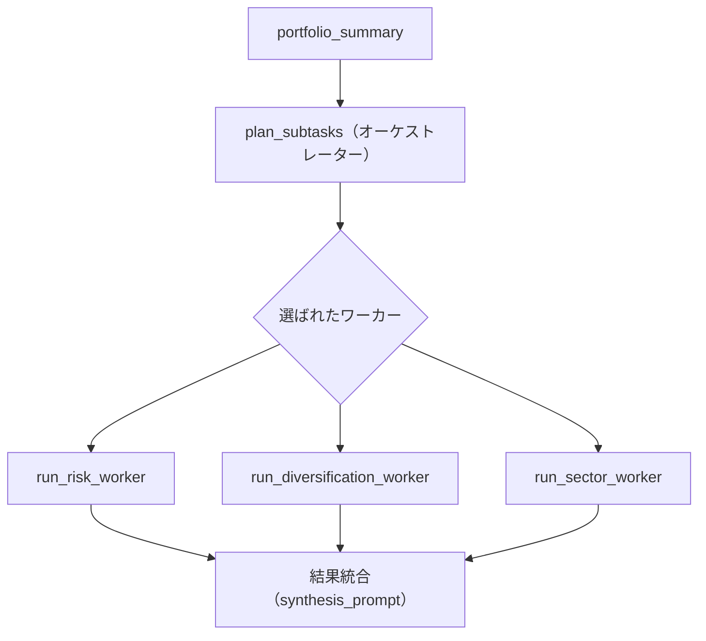

# Orchestrator-Workers

## この教材で身につくこと

- 中央LLMが動的にサブタスクを分解・委譲する設計を説明できる
- Orchestrator-WorkersとRoutingの違いを説明できる
- OpenAI Agents SDKのHandoffとの違いを説明できる

## 概要

ポートフォリオ総合診断を例に、中央のLLM（オーケストレーター）が
ポートフォリオの特性に応じて必要なワーカー分析を動的に選び、結果を
統合するOrchestrator-Workersパターンを解説します。

## 位置づけ

Routingは「1つの入力を1つの経路に振り分ける」のに対し、
Orchestrator-Workersは「1つの入力から複数のサブタスクを動的に生成し、
複数のワーカーに委譲する」点が異なります。

## 主要概念・設計判断の解説

### Orchestrator-Workersの定義

中央LLMがタスクを動的に分解し、ワーカーLLMに委譲して結果を統合します
（出典: [Anthropic "Building Effective Agents"](https://www.anthropic.com/research/building-effective-agents)）。
事前にサブタスクを予測できない複雑な問題に向きます。

### Routingとの違い

Routingは入力ごとに1つの経路を選ぶだけですが、Orchestrator-Workersは
複数のワーカーを組み合わせて呼び出せます（0個も複数も選べます）。

### OpenAI Agents SDKの「Handoff」との違い

Handoffはピアエージェント間で会話の主導権そのものを譲り渡します（以後の
会話全体を引き継ぐ）（出典: [OpenAI Agents SDK](https://openai.github.io/openai-agents-python/agents/)）。
一方Orchestrator-Workersは、中央が主導権を保ったままワーカーを呼び出し、
結果を統合します。目的は近いですが「制御の所在」が異なります。

## 実ソースコード（Python / プロンプト例、出典パス明記）

本教材のサンプルコードは`app/`に実装例が無いため、汎用サンプルコードで
解説します。

```python
import json

from common.json_parsing import strip_code_fence


def run_risk_worker(portfolio_summary: str) -> str:
    prompt = f"次のポートフォリオのリスク要因を分析してください。\n\n{portfolio_summary}"
    return call_llm(prompt)


def run_diversification_worker(portfolio_summary: str) -> str:
    prompt = f"次のポートフォリオの分散度を分析してください。\n\n{portfolio_summary}"
    return call_llm(prompt)


def run_sector_worker(portfolio_summary: str) -> str:
    prompt = f"次のポートフォリオの業種集中度を分析してください。\n\n{portfolio_summary}"
    return call_llm(prompt)


_WORKERS = {
    "risk": run_risk_worker,
    "diversification": run_diversification_worker,
    "sector_concentration": run_sector_worker,
}


def plan_subtasks(portfolio_summary: str) -> list[str]:
    prompt = (
        "次のポートフォリオ概要を読み、詳しく分析すべき観点を"
        f"{list(_WORKERS)}の中から必要なものだけJSON配列で選んでください。"
        "説明文やコードブロック記法は不要です。\n\n" + portfolio_summary
    )
    raw = call_llm(prompt)
    try:
        return json.loads(strip_code_fence(raw))
    except json.JSONDecodeError:
        # 分解に失敗した場合は全ワーカーを実行するフォールバックとする。
        return list(_WORKERS)


def orchestrate_portfolio_diagnosis(portfolio_summary: str) -> str:
    subtasks = [name for name in plan_subtasks(portfolio_summary) if name in _WORKERS]
    worker_results = {name: _WORKERS[name](portfolio_summary) for name in subtasks}
    synthesis_prompt = (
        "次の各観点の分析結果を統合し、総合診断コメントを書いてください。\n\n"
        + json.dumps(worker_results, ensure_ascii=False)
    )
    return call_llm(synthesis_prompt)
```



## 演習課題

1. `plan_subtasks`がJSONパースに失敗した場合、なぜ「全ワーカー実行」という
   安全側のフォールバックを選んでいるか、03章の防御的パースの考え方と
   結び付けて説明してください。
2. `app/`のポートフォリオレビュー（`review.py`）は現在1回のAugmented LLM
   呼び出しですが、Orchestrator-Workersに変えるとしたら、どんなワーカーに
   分割できるか1つ挙げてください。

## 理解度チェック

- [ ] Orchestrator-WorkersがRoutingとどう違うか説明できる
- [ ] OpenAI Agents SDKのHandoffとの違いを説明できる
- [ ] 中央LLMがサブタスクを動的に決める設計のメリットを説明できる

---

[← 前へ: Routing](02-routing.md) | [次へ: Evaluator-Optimizer →](04-evaluator-optimizer.md)
