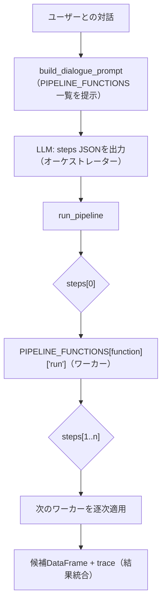

# Orchestrator-Workers

## この教材で身につくこと

- 中央LLMが動的にサブタスクを分解・委譲する設計を説明できる
- Orchestrator-WorkersとRoutingの違いを説明できる
- OpenAI Agents SDKのHandoffとの違いを説明できる

## 概要

Routingは「入力を1つの経路に振り分ける」設計でした。
しかし、必要なサブタスクの数や組み合わせ自体が事前に予測できない、もっと複雑な問題もあります。
たとえば「ユーザーとの対話から、どの分析関数をどの順番で組み合わせて実行すべきか」は、対話の内容次第で毎回変わります。
このような場合、中央のLLM（**オーケストレーター**、全体を指揮する役割）が実行時に動的にサブタスクを決定し、それぞれの実行を担当するLLM呼び出しや関数（**ワーカー**）に委譲する設計が有効です。
これがOrchestrator-Workers（オーケストレーター・ワーカーズ）パターンです。

本教材では、AI協調型戦略対話（AI戦略ビルダー）を例に、中央のLLM（オーケストレーター）がユーザーとの対話から「どのスクリーニング/ランキング関数（ワーカー）を、どの順番・パラメータで呼ぶか」を動的に決定し、決定した手順（steps）を決定的なエンジンが実行するOrchestrator-Workersパターンを解説します。

## 位置づけ

Routingは「1つの入力を1つの経路に振り分ける」のに対し、Orchestrator-Workersは「1つの入力から複数のサブタスクを動的に生成し、複数のワーカーに委譲する」点が異なります。
ここまでの3パターンの違いは初学者には混同しやすいため、次の表で整理します。

| 観点 | Prompt Chaining | Routing | Orchestrator-Workers |
|---|---|---|---|
| 経路の決定方法 | コードが固定順序を決める | コードが分類結果で1経路を選ぶ | 中央LLMが動的にサブタスクの組合せ・順序を決める |
| サブタスク数 | 事前に決まった固定数 | 常に1つ | 0個から複数まで動的 |
| 向いている場面 | サブタスクが明確に分解できる | カテゴリが明確に分かれる | サブタスクの組合せを事前に予測できない開放的な問題 |
| つまずきやすい点 | gateの配置判断 | 未知ラベルへのフォールバック | 中央LLMの出力（steps）が壊れた場合の防御的処理が必須 |

## 主要概念・設計判断の解説

### Orchestrator-Workersの定義

中央LLMがタスクを動的に分解し、ワーカーLLMに委譲して結果を統合します（出典: [Anthropic "Building Effective Agents"](https://www.anthropic.com/research/building-effective-agents)）。
事前にサブタスクを予測できない複雑な問題に向きます。

Routingとの違いは上の3パターン比較表のとおりです。
Routingは入力ごとに1つの経路を選ぶだけですが、Orchestrator-Workersは複数のワーカーを組み合わせて呼び出せます（0個も複数も選べます）。

### OpenAI Agents SDKの「Handoff」との違い

Handoffはピアエージェント間で会話の主導権そのものを譲り渡します（以後の会話全体を引き継ぐ）（出典: [OpenAI Agents SDK](https://openai.github.io/openai-agents-python/agents/)）。
一方Orchestrator-Workersは、中央が主導権を保ったままワーカーを呼び出し、結果を統合します。
目的は近いですが「制御の所在」が異なります。

### `app/`での実装 — ワーカーがLLMではなく決定的関数である変種

「ワーカーに委譲」というと各ワーカーもLLM呼び出しであることが多いですが、`app/`のAI戦略ビルダーでは、オーケストレーター（対話LLM）が動的に選ぶワーカーは、スクリーニング/ランキングを行う**決定的なPython関数**のレジストリ（`PIPELINE_FUNCTIONS`）です。
ユーザーとの対話から、どの関数をどの順番・パラメータで呼ぶかを`steps`（`[{"function": ..., "params": {...}}, ...]`）としてLLMに出力させ（`prompt_patterns/strategy_dialogue.py`の`build_dialogue_prompt`／`parse_dialogue_response`）、実行時は`steps`に従うだけの薄いエンジン（`strategy_builder/pipeline.py`の`run_pipeline`）が`PIPELINE_FUNCTIONS`から対応する関数を都度呼び出します。
中央LLMが「事前に決め打ちできない、対話ごとに異なる関数の組み合わせ・順序」を動的に決定するという点はOrchestrator-Workersの定義そのままですが、ワーカー呼び出し自体にLLMを使わないため、結果の「統合」もLLM呼び出しではなくDataFrameへの逐次適用になります。

### 実行エンジン（`run_pipeline`）の処理の流れ

オーケストレーター（対話LLM）が`steps`を出力した後、実行エンジンは次の順序で各ステップを適用します。

1. **初期化**: 全銘柄のticker列のみを持つDataFrameを候補集合とする。
2. **stepsを先頭から順にループ**: 各stepの`function`名と`params`を取り出す。
3. **未知のfunction名の場合**: 候補を空にリセットしてtraceに理由を記録し、次のstepへ進む。
   - つまずきやすい点: 単に「そのstepをスキップ」するのではなく「候補を空にリセット」する。
     絞り込み漏れのまま後続の重いワーカー（バックテスト等）が想定外に大きい候補集合に対して実行されるのを防ぐためです。
4. **既知のfunctionの場合**: 指数バックオフで最大3回までリトライしながらワーカー（`PIPELINE_FUNCTIONS[function]["run"]`）を実行する。
5. **リトライしても失敗した場合**: 同様に候補を空にリセットしてtraceに記録し、処理は継続する（03章の防御的パースと同じ「壊れたLLM出力で全体を落とさない」方針）。
6. **全stepsの適用後**: 最終的な候補DataFrameとtrace（各ステップ前後の件数推移）を返す。
   UI（`strategy_builder_tab.py`）はtraceをそのまま画面に表示し、ユーザーがどのステップで絞り込まれたか追えるようにする。

## 実ソースコード（Python / プロンプト例、出典パス明記）

出典: `ai-stock-investing-tutorial/app/prompt_patterns/strategy_dialogue.py`、`ai-stock-investing-tutorial/app/strategy_builder/pipeline.py`、`ai-stock-investing-tutorial/app/strategy_builder/pipeline_functions.py`

ワーカーのレジストリ（一部抜粋）。
各ワーカーは`(candidates_df, params, cache_dir) -> candidates_df`という統一シグネチャを持つ:

```python
def _run_backtest_rank(candidates_df, params, cache_dir):
    """対象銘柄群を1戦略でバックテストし、リスク調整済みリターン降順に
    ランキングして上位top_n件に絞る。"""
    ...


def _run_filter_by_fundamentals(candidates_df, params, cache_dir):
    """PER/PBR/ROE等のファンダメンタルズ条件で絞り込む。"""
    ...


# このdictはprompt_patterns/strategy_dialogue.pyがdescription/params_schemaを
# 読み取ってLLMへのシステムプロンプトを動的に組み立てる際にも使われる。
PIPELINE_FUNCTIONS: dict[str, dict] = {
    "BACKTEST_RANK": {"description": "...", "params_schema": {...}, "run": _run_backtest_rank},
    "MULTI_STRATEGY_RANK": {"description": "...", "params_schema": {...}, "run": _run_multi_strategy_rank},
    "FILTER_CURRENT_SIGNAL": {"description": "...", "params_schema": {...}, "run": _run_filter_current_signal},
    "FILTER_BY_FUNDAMENTALS": {"description": "...", "params_schema": {...}, "run": _run_filter_by_fundamentals},
    "SORT_BY": {"description": "...", "params_schema": {...}, "run": _run_sort_by},
    "TOP_N": {"description": "...", "params_schema": {...}, "run": _run_top_n},
}
```

オーケストレーター側は、ワーカーレジストリの`description`/`params_schema`をそのままプロンプトに埋め込んで、LLMに使える関数一覧を提示します（レジストリを更新すればプロンプトも自動で追従する設計）:

````python
def _format_pipeline_functions_for_prompt() -> str:
    lines = []
    for name, entry in PIPELINE_FUNCTIONS.items():
        params_lines = "\n".join(
            f"    - {param}: {description}"
            for param, description in entry["params_schema"].items()
        )
        lines.append(f"- {name}: {entry['description']}\n  params:\n{params_lines}")
    return "\n".join(lines)


_PERSONA_INSTRUCTIONS_TEMPLATE = """\
...
【ステップ2: 構造化データの出力】
ユーザーと条件が合意できたら...必ず次のJSON形式のみを返してください。
```json
{{
  "strategy_name": "確定した戦略名",
  "steps": [
    {{"function": "関数名", "params": {{...}}}}
  ]
}}
```
stepsは上記の関数一覧にある関数名のみを使い、必要な順番・組み合わせで並べてください。
"""
````

実行エンジン（ワーカー呼び出しと結果統合）。
ワーカー呼び出しは[02-レート制限・タイムアウト設計](../03-reliability-and-cost/02-rate-limit-and-timeout.md)と同じ指数バックオフでリトライし、未知のfunction名またはリトライ後も失敗したステップは候補を空にリセットする（絞り込み漏れのまま後続の重いワーカーが想定外に大きい候補集合に対して実行されるのを防ぐため）:

```python
_MAX_RETRIES = 3
_BASE_DELAY_SECONDS = 2.0


def _run_step_with_retry(run_func, candidates_df, params, cache_dir):
    for attempt in range(_MAX_RETRIES):
        try:
            return run_func(candidates_df, params, cache_dir)
        except Exception:
            if attempt == _MAX_RETRIES - 1:
                raise
            time.sleep(_BASE_DELAY_SECONDS * (2 ** attempt))


def run_pipeline(steps: list[dict], all_tickers: list[str], cache_dir) -> tuple[pd.DataFrame, list[str]]:
    """全銘柄のticker列のみのDataFrameを初期値とし、stepsを先頭から順に適用する。
    未知のfunction名、またはリトライしても例外を送出し続けたステップは、候補を
    空にリセットしてトレースに理由を記録し、処理を継続する（既存apply_filtersと
    同じ「壊れたLLM出力で全体を落とさない」方針）。"""
    candidates_df = pd.DataFrame({"ticker": all_tickers})
    trace = [f"開始: {len(candidates_df)}件"]

    for step in steps:
        function_name = step.get("function")
        params = step.get("params", {})
        entry = PIPELINE_FUNCTIONS.get(function_name)
        if entry is None:
            trace.append(f"{function_name}: 未知の関数のため候補をリセット")
            candidates_df = candidates_df.iloc[0:0]
            continue
        before_count = len(candidates_df)
        try:
            candidates_df = _run_step_with_retry(entry["run"], candidates_df, params, cache_dir)
        except Exception:
            logger.exception(
                "ステップ実行に%d回リトライしても失敗しました: function=%s params=%s",
                _MAX_RETRIES, function_name, params,
            )
            trace.append(f"{function_name}: {_MAX_RETRIES}回リトライしても失敗のため候補をリセット")
            candidates_df = candidates_df.iloc[0:0]
            continue
        trace.append(f"{function_name}: {before_count}件→{len(candidates_df)}件")

    return candidates_df, trace
```



呼び出し側（UI層）は、オーケストレーターが出力した`steps`をそのまま`run_pipeline`に渡し、返ってきた`trace`を画面に表示するだけです。
出典: `ai-stock-investing-tutorial/app/app_tabs/strategy_builder_tab.py`

```python
result_df, trace = run_pipeline(strategy["steps"], all_tickers, CACHE_DIR)
result_df = result_df.copy()
result_df["name"] = result_df["ticker"].map(names_by_ticker).fillna("")

st.session_state["strategy_pipeline_result_df"] = result_df
st.session_state["strategy_pipeline_trace"] = trace
```

```python
# 「リセット」を含む行は未知の関数、またはリトライしても失敗したことを
# 示すため、通常行に埋もれて見落とされないようst.warningで目立たせつつ、
# trace全体の順序はそのまま維持する。
normal_run = []
for line in trace:
    if "リセット" in line:
        if normal_run:
            st.caption(" → ".join(normal_run))
            normal_run = []
        st.warning(line, icon="⚠️")
    else:
        normal_run.append(line)
if normal_run:
    st.caption(" → ".join(normal_run))
```

## 演習課題

1. `run_pipeline`は未知の`function`名や例外発生時に処理全体を止めず、候補を空にリセットして`trace`に理由を記録し、処理を継続します。
   1. 単に「そのステップをスキップして直前の候補集合のまま次に進む」のではなく「候補を空にリセットする」設計になっているのはなぜか、後続のワーカー（`BACKTEST_RANK`等）への影響という観点から説明してください。
   2. これを03章の防御的パースの考え方と結び付けて、なぜ「全体を止めない」設計がここでは適切か説明してください。
2. `PIPELINE_FUNCTIONS`のワーカーはLLM呼び出しを含まない決定的関数ですが、仮に「上位候補についてAIが定性的な評価コメントを付ける」ワーカーを1つ追加するとしたら、`params_schema`と`run`関数のシグネチャをどう設計するか、既存の6関数のスタイルに合わせて考えてください。

## 理解度チェック

- [ ] Orchestrator-WorkersがRoutingとどう違うか説明できる
- [ ] OpenAI Agents SDKのHandoffとの違いを説明できる
- [ ] 中央LLMがサブタスクを動的に決める設計のメリットを説明できる
- [ ] `run_pipeline`が未知の関数名や失敗時に候補をリセットする処理の流れを、ステップを追って説明できる

---

[← 前へ: Routing](02-routing.md) | [次へ: Evaluator-Optimizer →](04-evaluator-optimizer.md)
