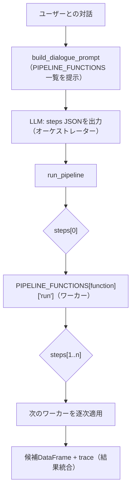

# Orchestrator-Workers

## この教材で身につくこと

- 中央LLMが動的にサブタスクを分解・委譲する設計を説明できる
- Orchestrator-WorkersとRoutingの違いを説明できる
- OpenAI Agents SDKのHandoffとの違いを説明できる

## 概要

AI協調型戦略対話（AI戦略ビルダー）を例に、中央のLLM（オーケストレーター）が
ユーザーとの対話から「どのスクリーニング/ランキング関数（ワーカー）を、
どの順番・パラメータで呼ぶか」を動的に決定し、決定した手順（steps）を
決定的なエンジンが実行するOrchestrator-Workersパターンを解説します。

## 位置づけ

Routingは「1つの入力を1つの経路に振り分ける」のに対し、
Orchestrator-Workersは「1つの入力から複数のサブタスクを動的に生成し、
複数のワーカーに委譲する」点が異なります。

## 主要概念・設計判断の解説

### Orchestrator-Workersの定義

中央LLMがタスクを動的に分解し、ワーカーLLMに委譲して結果を統合します
（出典: [Anthropic "Building Effective Agents"](https://www.anthropic.com/research/building-effective-agents)）。
事前にサブタスクを予測できない複雑な問題に向きます。

### Routingとの違い

Routingは入力ごとに1つの経路を選ぶだけですが、Orchestrator-Workersは
複数のワーカーを組み合わせて呼び出せます（0個も複数も選べます）。

### OpenAI Agents SDKの「Handoff」との違い

Handoffはピアエージェント間で会話の主導権そのものを譲り渡します（以後の
会話全体を引き継ぐ）（出典: [OpenAI Agents SDK](https://openai.github.io/openai-agents-python/agents/)）。
一方Orchestrator-Workersは、中央が主導権を保ったままワーカーを呼び出し、
結果を統合します。目的は近いですが「制御の所在」が異なります。

### `app/`での実装 — ワーカーがLLMではなく決定的関数である変種

「ワーカーに委譲」というと各ワーカーもLLM呼び出しであることが多いですが、
`app/`のAI戦略ビルダーでは、オーケストレーター（対話LLM）が動的に選ぶ
ワーカーは、スクリーニング/ランキングを行う**決定的なPython関数**の
レジストリ（`PIPELINE_FUNCTIONS`）です。ユーザーとの対話から、どの関数を
どの順番・パラメータで呼ぶかを`steps`（`[{"function": ..., "params": {...}}, ...]`）
としてLLMに出力させ（`prompt_patterns/strategy_dialogue.py`の
`build_dialogue_prompt`／`parse_dialogue_response`）、実行時は`steps`に
従うだけの薄いエンジン（`strategy_builder/pipeline.py`の`run_pipeline`）が
`PIPELINE_FUNCTIONS`から対応する関数を都度呼び出します。中央LLMが「事前に
決め打ちできない、対話ごとに異なる関数の組み合わせ・順序」を動的に決定する
という点はOrchestrator-Workersの定義そのままですが、ワーカー呼び出し自体に
LLMを使わないため、結果の「統合」もLLM呼び出しではなくDataFrameへの逐次
適用になります。

## 実ソースコード（Python / プロンプト例、出典パス明記）

出典: `ai-stock-investing-tutorial/app/prompt_patterns/strategy_dialogue.py`、
`ai-stock-investing-tutorial/app/strategy_builder/pipeline.py`、
`ai-stock-investing-tutorial/app/strategy_builder/pipeline_functions.py`

ワーカーのレジストリ（一部抜粋）。各ワーカーは
`(candidates_df, params, cache_dir) -> candidates_df`という統一シグネチャを持つ:

```python
def _run_backtest_rank(candidates_df, params, cache_dir):
    """対象銘柄群を1戦略でバックテストし、リスク調整済みリターン降順に
    ランキングして上位top_n件に絞る。"""
    ...


def _run_filter_by_fundamentals(candidates_df, params, cache_dir):
    """PER/PBR/ROE等のファンダメンタルズ条件で絞り込む。"""
    ...


# このdictはprompt_patterns/strategy_dialogue.pyがdescription/params_schemaを
# 読み取ってLLMへのシステムプロンプトを動的に組み立てる際にも使われる。
PIPELINE_FUNCTIONS: dict[str, dict] = {
    "BACKTEST_RANK": {"description": "...", "params_schema": {...}, "run": _run_backtest_rank},
    "MULTI_STRATEGY_RANK": {"description": "...", "params_schema": {...}, "run": _run_multi_strategy_rank},
    "FILTER_CURRENT_SIGNAL": {"description": "...", "params_schema": {...}, "run": _run_filter_current_signal},
    "FILTER_BY_FUNDAMENTALS": {"description": "...", "params_schema": {...}, "run": _run_filter_by_fundamentals},
    "SORT_BY": {"description": "...", "params_schema": {...}, "run": _run_sort_by},
    "TOP_N": {"description": "...", "params_schema": {...}, "run": _run_top_n},
}
```

オーケストレーター側は、ワーカーレジストリの`description`/`params_schema`を
そのままプロンプトに埋め込んで、LLMに使える関数一覧を提示します
（レジストリを更新すればプロンプトも自動で追従する設計）:

```python
def _format_pipeline_functions_for_prompt() -> str:
    lines = []
    for name, entry in PIPELINE_FUNCTIONS.items():
        params_lines = "\n".join(
            f"    - {param}: {description}"
            for param, description in entry["params_schema"].items()
        )
        lines.append(f"- {name}: {entry['description']}\n  params:\n{params_lines}")
    return "\n".join(lines)


_PERSONA_INSTRUCTIONS_TEMPLATE = """\
...
【ステップ2: 構造化データの出力】
ユーザーと条件が合意できたら...必ず次のJSON形式のみを返してください。
```json
{{
  "strategy_name": "確定した戦略名",
  "steps": [
    {{"function": "関数名", "params": {{...}}}}
  ]
}}
```
stepsは上記の関数一覧にある関数名のみを使い、必要な順番・組み合わせで並べてください。
"""
```

実行エンジン（ワーカー呼び出しと結果統合）。ワーカー呼び出しは
[02-レート制限・タイムアウト設計](../03-reliability-and-cost/02-rate-limit-and-timeout.md)
と同じ指数バックオフでリトライし、未知のfunction名またはリトライ後も失敗した
ステップは候補を空にリセットする（絞り込み漏れのまま後続の重いワーカーが想定外に
大きい候補集合に対して実行されるのを防ぐため）:

```python
_MAX_RETRIES = 3
_BASE_DELAY_SECONDS = 2.0


def _run_step_with_retry(run_func, candidates_df, params, cache_dir):
    for attempt in range(_MAX_RETRIES):
        try:
            return run_func(candidates_df, params, cache_dir)
        except Exception:
            if attempt == _MAX_RETRIES - 1:
                raise
            time.sleep(_BASE_DELAY_SECONDS * (2 ** attempt))


def run_pipeline(steps: list[dict], all_tickers: list[str], cache_dir) -> tuple[pd.DataFrame, list[str]]:
    """全銘柄のticker列のみのDataFrameを初期値とし、stepsを先頭から順に適用する。
    未知のfunction名、またはリトライしても例外を送出し続けたステップは、候補を
    空にリセットしてトレースに理由を記録し、処理を継続する（既存apply_filtersと
    同じ「壊れたLLM出力で全体を落とさない」方針）。"""
    candidates_df = pd.DataFrame({"ticker": all_tickers})
    trace = [f"開始: {len(candidates_df)}件"]

    for step in steps:
        function_name = step.get("function")
        params = step.get("params", {})
        entry = PIPELINE_FUNCTIONS.get(function_name)
        if entry is None:
            trace.append(f"{function_name}: 未知の関数のため候補をリセット")
            candidates_df = candidates_df.iloc[0:0]
            continue
        before_count = len(candidates_df)
        try:
            candidates_df = _run_step_with_retry(entry["run"], candidates_df, params, cache_dir)
        except Exception:
            logger.exception(
                "ステップ実行に%d回リトライしても失敗しました: function=%s params=%s",
                _MAX_RETRIES, function_name, params,
            )
            trace.append(f"{function_name}: {_MAX_RETRIES}回リトライしても失敗のため候補をリセット")
            candidates_df = candidates_df.iloc[0:0]
            continue
        trace.append(f"{function_name}: {before_count}件→{len(candidates_df)}件")

    return candidates_df, trace
```



## 演習課題

1. `run_pipeline`は未知の`function`名や例外発生時に処理全体を止めず、
   候補を空にリセットして`trace`に理由を記録し、処理を継続します。単に
   「そのステップをスキップして直前の候補集合のまま次に進む」のではなく
   「候補を空にリセットする」設計になっているのはなぜか、後続のワーカー
   （`BACKTEST_RANK`等）への影響という観点から説明してください。また、
   これを03章の防御的パースの考え方と結び付けて、なぜ「全体を止めない」
   設計がここでは適切か説明してください。
2. `PIPELINE_FUNCTIONS`のワーカーはLLM呼び出しを含まない決定的関数ですが、
   仮に「上位候補についてAIが定性的な評価コメントを付ける」ワーカーを
   1つ追加するとしたら、`params_schema`と`run`関数のシグネチャをどう
   設計するか、既存の6関数のスタイルに合わせて考えてください。

## 理解度チェック

- [ ] Orchestrator-WorkersがRoutingとどう違うか説明できる
- [ ] OpenAI Agents SDKのHandoffとの違いを説明できる
- [ ] 中央LLMがサブタスクを動的に決める設計のメリットを説明できる

---

[← 前へ: Routing](02-routing.md) | [次へ: Evaluator-Optimizer →](04-evaluator-optimizer.md)
