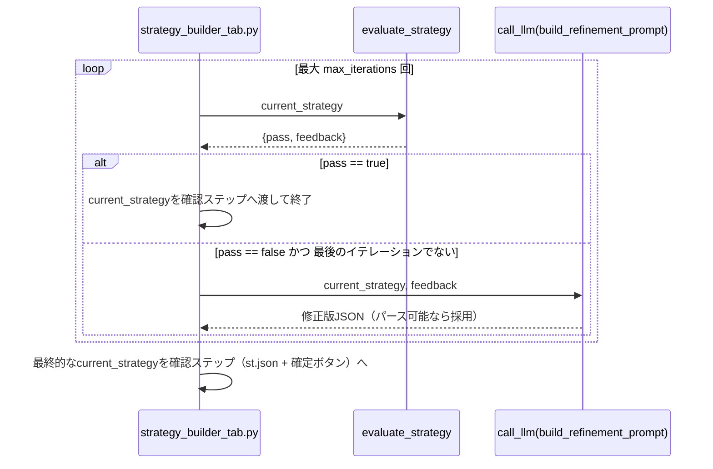

# Evaluator-Optimizer

## この教材で身につくこと

- 生成→評価→改善のループを実装できる
- ループの終了条件（合格判定・最大試行回数）を設計できる
- Evaluator-Optimizerが向いているケースを説明できる

## 概要

AI戦略ビルダーが対話で確定した投資戦略の条件（JSON）に対し、別のLLM
呼び出しが評価基準に照らしてフィードバックし、合格するまで改善を
繰り返すEvaluator-Optimizerパターンを解説します。

## 位置づけ

これまでの3パターンが「1回の生成で完結する」のに対し、Evaluator-Optimizer
は同じ出力を反復改善する点が異なります。04章のガードレール（禁止事項の
明示）を、生成後にもう一段チェックする形に発展させたものです。

## 主要概念・設計判断の解説

### Evaluator-Optimizerの定義

1つのLLMが生成し、別のLLM呼び出しが評価・フィードバックするループです
（出典: [Anthropic "Building Effective Agents"](https://www.anthropic.com/research/building-effective-agents)）。
明確な評価基準があり、反復改善が品質向上に効く場合に有効です。

### 終了条件の設計

合格判定（`pass: true`）で早期終了、または最大試行回数
（`max_iterations`）で打ち切り、無限ループを防ぎます。`app/`の実装では、
最後の評価イテレーションの後には改善案を生成しない（無駄な`call_llm`
呼び出しをしない）という追加の最適化も入れています。

### 04章のガードレールとの関係

「断定的な投資助言を含まないか」を評価基準に含めることで、プロンプト内の
禁止事項明示だけに頼らない多段防御になります。

### `app/`での実装

AI戦略ビルダーは、対話が確定候補（戦略JSON）を生成した直後に
`run_evaluation_loop`を1回実行し、既存の確認ステップ（`st.json`表示＋
「この条件で確定する」ボタン）にはループ後の最終案を渡します。評価・
改善ループそのものはUIに依存しない純粋関数として切り出されており、
04-01章のVerificationパターン（人間による最終確認）と組み合わせて
使われている点が特徴です（自動改善はするが、最終判断は必ず人間に委ねる）。

## 実ソースコード（Python / プロンプト例、出典パス明記）

出典: `ai-stock-investing-tutorial/app/strategy_builder/evaluation.py`

```python
def evaluate_strategy(strategy: dict, call_llm=default_call_llm) -> dict:
    raw = call_llm(build_evaluate_prompt(strategy))
    try:
        result = json.loads(strip_code_fence(raw))
    except json.JSONDecodeError:
        result = None

    # 評価自体が失敗した場合（パース不可・pass欠落）は安全側に倒し、不合格として扱う。
    if not isinstance(result, dict) or "pass" not in result:
        return {"pass": False, "feedback": "評価結果のパースに失敗しました。"}
    return {"pass": bool(result.get("pass")), "feedback": result.get("feedback", "")}


def run_evaluation_loop(
    strategy: dict, call_llm=default_call_llm, max_iterations: int = 3
) -> dict:
    current = strategy
    last_feedback = None
    for i in range(max_iterations):
        evaluation = evaluate_strategy(current, call_llm=call_llm)
        if evaluation["pass"]:
            return {"strategy": current, "iterations": i, "last_feedback": last_feedback}
        last_feedback = evaluation["feedback"]

        if i < max_iterations - 1:
            # 最後のイテレーションでは改善案を生成しない（無駄なcall_llmを避ける）
            raw = call_llm(build_refinement_prompt(current, last_feedback))
            try:
                refined = json.loads(strip_code_fence(raw))
            except json.JSONDecodeError:
                refined = None
            if isinstance(refined, dict) and "conditions" in refined:
                current = refined

    return {"strategy": current, "iterations": max_iterations, "last_feedback": last_feedback}
```

`build_evaluate_prompt`は3つの評価基準（条件の具体性、過度な絞り込みで
ないか、断定的な投資助言表現を含まないか）を`{"pass": bool, "feedback":
str}`形式のJSONで問うプロンプトを組み立てます。`build_refinement_prompt`
（`prompt_patterns/strategy_dialogue.py`）は、既存の対話ペルソナ指示を
使わず、確定候補JSON＋評価フィードバックから修正版JSONを1回で
生成させる軽量プロンプトです。



## 演習課題

1. `evaluate_strategy`がJSONパースに失敗した場合、なぜ「合格」ではなく
   「不合格」を既定値にしているか、安全側の設計の観点で説明してください。
2. `run_evaluation_loop`は評価に合格した`strategy`をそのまま確認ステップに
   渡し、ユーザーは`st.json`で最終案を見てから確定します。もし評価・改善
   ループを経ずに`save_strategy`を自動実行する設計に変えたら、04-01章の
   Verificationパターンの観点でどんなリスクが生まれるか説明してください。

## 理解度チェック

- [ ] Evaluator-Optimizerが向いているケースを説明できる
- [ ] ループの終了条件をどう設計しているか説明できる
- [ ] 評価基準にガードレール的な項目を含める利点を説明できる
- [ ] Evaluator-OptimizerとVerificationパターンをどう組み合わせているか説明できる

---

[← 前へ: Orchestrator-Workers](03-orchestrator-workers.md) | [次へ: Autonomous Agents →](05-autonomous-agents.md)
