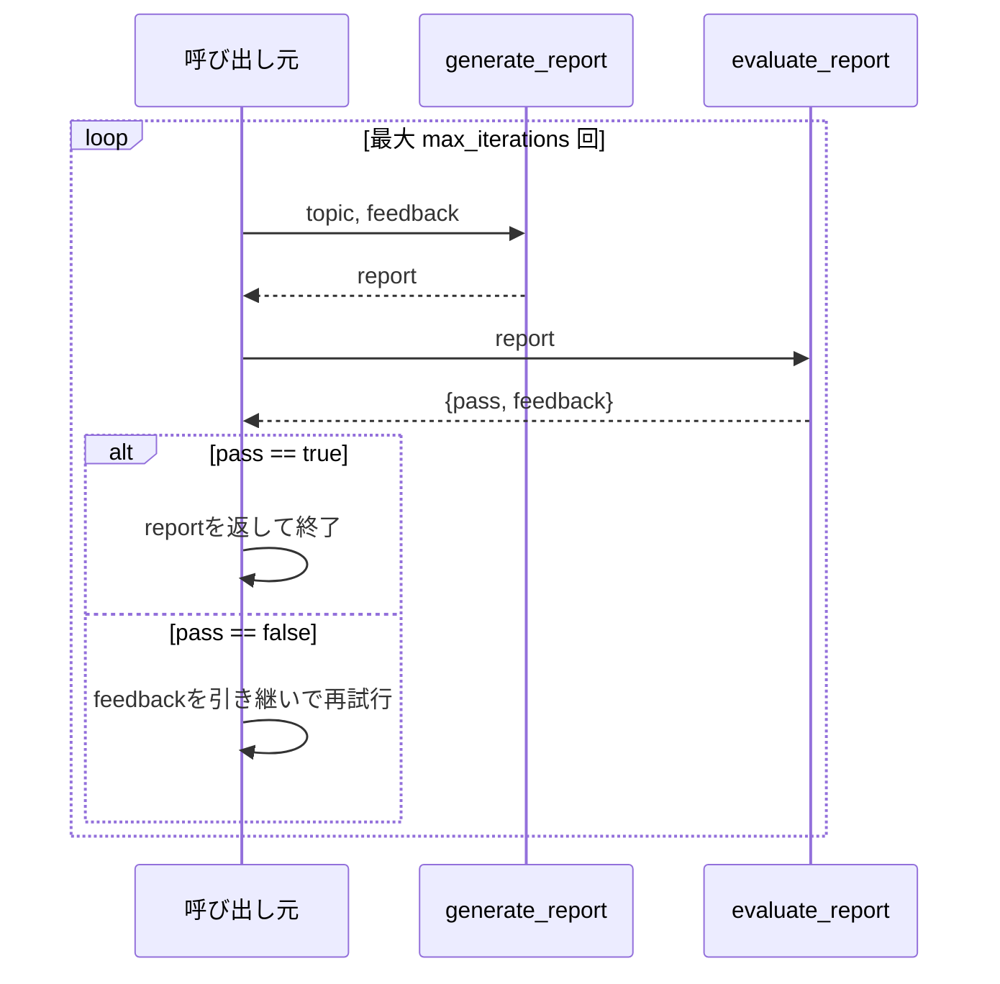

# Evaluator-Optimizer

## この教材で身につくこと

- 生成→評価→改善のループを実装できる
- ループの終了条件（合格判定・最大試行回数）を設計できる
- Evaluator-Optimizerが向いているケースを説明できる

## 概要

レポート生成に対し、別のLLM呼び出しが評価基準に照らしてフィードバックし、
合格するまで改善を繰り返すEvaluator-Optimizerパターンを解説します。

## 位置づけ

これまでの3パターンが「1回の生成で完結する」のに対し、Evaluator-Optimizer
は同じ出力を反復改善する点が異なります。04章のガードレール（禁止事項の
明示）を、生成後にもう一段チェックする形に発展させたものです。

## 主要概念・設計判断の解説

### Evaluator-Optimizerの定義

1つのLLMが生成し、別のLLM呼び出しが評価・フィードバックするループです
（出典: [Anthropic "Building Effective Agents"](https://www.anthropic.com/research/building-effective-agents)）。
明確な評価基準があり、反復改善が品質向上に効く場合に有効です。

### 終了条件の設計

合格判定（`pass: true`）で早期終了、または最大試行回数
（`max_iterations`）で打ち切り、無限ループを防ぎます。

### 04章のガードレールとの関係

「断定的な投資助言を含まないか」を評価基準に含めることで、プロンプト内の
禁止事項明示だけに頼らない多段防御になります。

## 実ソースコード（Python / プロンプト例、出典パス明記）

本教材のサンプルコードは`app/`に実装例が無いため、汎用サンプルコードで
解説します。

```python
import json

from common.json_parsing import strip_code_fence


def generate_report(topic: str, feedback: str | None = None) -> str:
    prompt = f"次のトピックについてレポートを書いてください: {topic}"
    if feedback:
        prompt += f"\n\n前回の評価フィードバック: {feedback}\nこれを踏まえて改善してください。"
    return call_llm(prompt)


def evaluate_report(report: str) -> dict:
    prompt = (
        "次のレポートを、(1)事実に基づく記述か (2)断定的な投資助言を含まないか "
        'の2点で評価し、{"pass": true/false, "feedback": "..."} 形式のJSONのみを'
        "出力してください。\n\n" + report
    )
    raw = call_llm(prompt)
    try:
        return json.loads(strip_code_fence(raw))
    except json.JSONDecodeError:
        # 評価自体が失敗した場合は安全側に倒し、不合格として扱う。
        return {"pass": False, "feedback": "評価結果のパースに失敗しました。"}


def generate_with_evaluation_loop(topic: str, max_iterations: int = 3) -> str:
    feedback = None
    report = ""
    for _ in range(max_iterations):
        report = generate_report(topic, feedback)
        evaluation = evaluate_report(report)
        if evaluation["pass"]:
            return report
        feedback = evaluation["feedback"]
    return report  # 最大試行回数に達した場合は最後の生成結果を返す
```



## 演習課題

1. `evaluate_report`がJSONパースに失敗した場合、なぜ「合格」ではなく
   「不合格」を既定値にしているか、安全側の設計の観点で説明してください。
2. `max_iterations`を1に設定した場合、Evaluator-Optimizerパターンとして
   機能するか（評価はされるが改善ループが起きない）説明してください。

## 理解度チェック

- [ ] Evaluator-Optimizerが向いているケースを説明できる
- [ ] ループの終了条件をどう設計しているか説明できる
- [ ] 評価基準にガードレール的な項目を含める利点を説明できる

---

[← 前へ: Orchestrator-Workers](03-orchestrator-workers.md) | [次へ: Autonomous Agents →](05-autonomous-agents.md)
