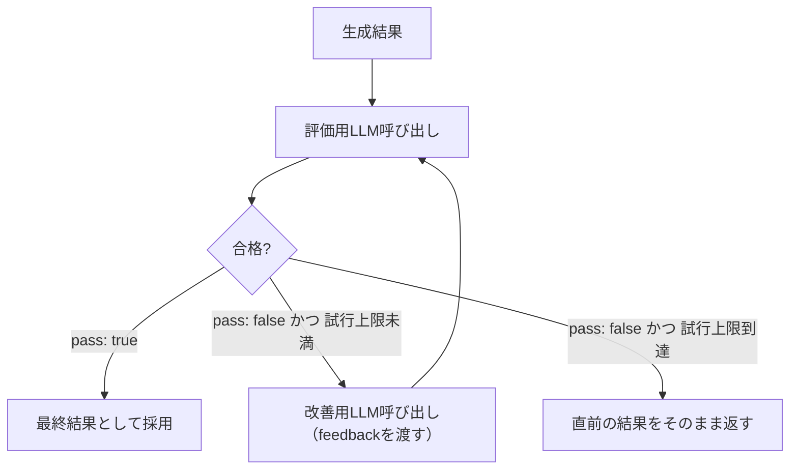
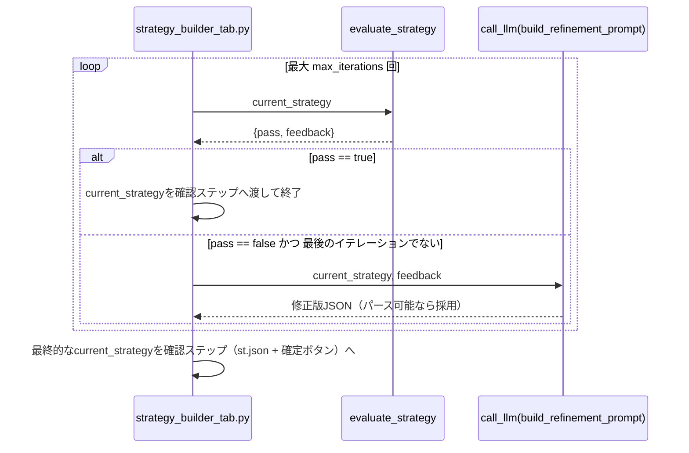

# Evaluator-Optimizer

## この教材で身につくこと

- 生成→評価→改善のループを実装できる
- ループの終了条件（合格判定・最大試行回数）を設計できる
- Evaluator-Optimizerが向いているケースを説明できる

## 概要

ここまでの3パターン（Prompt Chaining/Routing/Orchestrator-Workers）は、いずれも「1回生成したら、その結果をそのまま使う」設計でした。
しかし、出力の品質基準が明確に決まっているタスク（例: 特定の条件をすべて満たすこと）では、1回の生成だけでは基準を満たさないことがあります。
そこで、生成した結果を別のLLM呼び出しが評価し、基準を満たさなければフィードバックをもとに再生成する、という反復改善のループを組む設計が有効です。
これがEvaluator-Optimizer（評価者・最適化者）パターンです。
評価と再生成を繰り返す仕組みを**評価者ループ**と呼びます。

本教材では、AI戦略ビルダーが対話で確定した投資戦略の条件（JSON）に対し、別のLLM呼び出しが評価基準に照らしてフィードバックし、合格するまで改善を繰り返すEvaluator-Optimizerパターンを解説します。

## 位置づけ

これまでの3パターンが「1回の生成で完結する」のに対し、Evaluator-Optimizerは同じ出力を反復改善する点が異なります。
04章のガードレール（禁止事項の明示）を、生成後にもう一段チェックする形に発展させたものです。

| 観点 | これまでの3パターン（1回で完結） | Evaluator-Optimizer |
|---|---|---|
| 出力への関わり方 | 生成して終わり | 生成→評価→（不合格なら）再生成のループ |
| 向いている場面 | 生成物の質が1回の呼び出しで十分 | 明確な評価基準があり反復改善が品質向上に効く |
| つまずきやすい点 | （該当パターンごとの表を参照） | 終了条件（合格判定/最大試行回数）を設計しないと無限ループ・コスト増になる |

## 主要概念・設計判断の解説

### Evaluator-Optimizerの定義

1つのLLMが生成し、別のLLM呼び出しが評価・フィードバックするループです（出典: [Anthropic "Building Effective Agents"](https://www.anthropic.com/research/building-effective-agents)）。
明確な評価基準があり、反復改善が品質向上に効く場合に有効です。

一般形は次のとおりです。
合格するか、最大試行回数に達するまでループを続けます。



評価LLMと改善LLMは別々のプロンプトを使う、別の役割のLLM呼び出しです（同じLLMモデルを使い回しても構いませんが、役割は分離します）。

### 終了条件の設計

合格判定（`pass: true`）で早期終了、または最大試行回数（`max_iterations`）で打ち切り、無限ループを防ぎます。
`app/`の`run_evaluation_loop`は次の順序で処理します。

1. **評価**: `evaluate_strategy`で現在のstrategyを評価する。
2. **合格判定**: `pass: true`ならその場でループを終了し、その戦略を返す。
3. **不合格時の記録**: `pass: false`ならfeedbackを保存する。
4. **改善案の生成**: 最後のイテレーションでなければ`build_refinement_prompt`で改善案を生成する。
   - つまずきやすい点: 最後のイテレーションでは改善案を生成しない（どうせ再評価されない`call_llm`呼び出しを省く最適化）。
5. **改善案の採用判定**: 応答がパース可能なJSONで`steps`キーを含む場合のみ採用する。
   含まない場合は直前のstrategyのままループを継続する。
6. **上限到達**: `max_iterations`回繰り返しても合格しなければ、最後のstrategyをそのまま返す。

### 04章のガードレールとの関係

「断定的な投資助言を含まないか」を評価基準に含めることで、プロンプト内の禁止事項明示だけに頼らない多段防御になります。

### `app/`での実装

AI戦略ビルダーは、対話が確定候補（戦略JSON）を生成した直後に`run_evaluation_loop`を1回実行し、既存の確認ステップ（`st.json`表示＋「この条件で確定する」ボタン）にはループ後の最終案を渡します。
評価・改善ループそのものはUIに依存しない純粋関数として切り出されており、04-01章のVerificationパターン（人間による最終確認）と組み合わせて使われている点が特徴です（自動改善はするが、最終判断は必ず人間に委ねる）。

| 観点 | Verification（04-01章、人間による確認） | Evaluator-Optimizer（本教材、LLMによる自動評価） |
|---|---|---|
| 評価者 | 人間 | 別のLLM呼び出し |
| 実行タイミング | 生成後、確定前に必ず人間が見る | 確定候補生成直後に自動実行される |
| 役割 | 最終判断（拒否・修正依頼もできる） | 自動改善（人間の確認負荷を減らす） |

## 実ソースコード（Python / プロンプト例、出典パス明記）

出典: `ai-stock-investing-tutorial/app/strategy_builder/evaluation.py`

```python
def evaluate_strategy(strategy: dict, call_llm=default_call_llm) -> dict:
    raw = call_llm(build_evaluate_prompt(strategy))
    try:
        result = json.loads(strip_code_fence(raw))
    except json.JSONDecodeError:
        result = None

    # 評価自体が失敗した場合（パース不可・pass欠落）は安全側に倒し、不合格として扱う。
    if not isinstance(result, dict) or "pass" not in result:
        return {"pass": False, "feedback": "評価結果のパースに失敗しました。"}
    return {"pass": bool(result.get("pass")), "feedback": result.get("feedback", "")}


def run_evaluation_loop(
    strategy: dict, call_llm=default_call_llm, max_iterations: int = 3
) -> dict:
    current = strategy
    last_feedback = None
    for i in range(max_iterations):
        evaluation = evaluate_strategy(current, call_llm=call_llm)
        if evaluation["pass"]:
            return {"strategy": current, "iterations": i, "last_feedback": last_feedback}
        last_feedback = evaluation["feedback"]

        if i < max_iterations - 1:
            # 最後のイテレーションでは改善案を生成しない（無駄なcall_llmを避ける）
            raw = call_llm(build_refinement_prompt(current, last_feedback))
            try:
                refined = json.loads(strip_code_fence(raw))
            except json.JSONDecodeError:
                refined = None
            if isinstance(refined, dict) and "steps" in refined:
                current = refined

    return {"strategy": current, "iterations": max_iterations, "last_feedback": last_feedback}
```

実際の`evaluate_strategy`/`run_evaluation_loop`には、事実・推論ログ機能（`session_id`・`turn_index`・`user_id`等のキーワード引数）も追加されていますが、ここではEvaluator-Optimizerパターンの理解に絞るため省略しています。
ループの制御ロジック自体は上記のとおりです。

`build_evaluate_prompt`は3つの評価基準（各ステップのfunction・paramsが具体的か、過度な絞り込みでないか、断定的な投資助言表現を含まないか）を`{"pass": bool, "feedback": str}`形式のJSONで問うプロンプトを組み立てます。
`build_refinement_prompt`（`prompt_patterns/strategy_dialogue.py`）は、既存の対話ペルソナ指示を使わず、確定候補JSON＋評価フィードバックから修正版JSONを1回で生成させる軽量プロンプトです。



呼び出し側（UI層）は、確定候補が生成された直後に評価・改善ループを1回だけ実行し、結果をVerificationステップ（`st.json`表示）に渡します。
出典: `ai-stock-investing-tutorial/app/app_tabs/strategy_builder_tab.py`

```python
with st.spinner("戦略条件を評価・改善中..."):
    evaluation_result = run_evaluation_loop(
        parsed["strategy"], call_llm=call_llm, session_id=session_id,
    )
st.session_state["strategy_pending_strategy"] = evaluation_result["strategy"]
st.session_state["strategy_pending_evaluation"] = evaluation_result
```

```python
# Verificationステップ（人間による最終確認）側の表示。自動改善が
# 行われたことと、そのフィードバック内容をユーザーに明示する。
if evaluation_result and evaluation_result["iterations"] > 0:
    st.caption("AIによる自動改善を行いました。")
    if evaluation_result["last_feedback"]:
        st.caption(f"評価フィードバック: {evaluation_result['last_feedback']}")
st.json(pending)  # 最終案をツリー表示し、ユーザーが確定ボタンを押すまで待つ
```

## 演習課題

1. `evaluate_strategy`がJSONパースに失敗した場合、なぜ「合格」ではなく「不合格」を既定値にしているか、安全側の設計の観点で説明してください。
2. `run_evaluation_loop`は評価に合格した`strategy`をそのまま確認ステップに渡し、ユーザーは`st.json`で最終案を見てから確定します。
   もし評価・改善ループを経ずに`save_strategy`を自動実行する設計に変えたら、04-01章のVerificationパターンの観点でどんなリスクが生まれるか説明してください。

## 理解度チェック

- [ ] Evaluator-Optimizerが向いているケースを説明できる
- [ ] ループの終了条件をどう設計しているか説明できる
- [ ] 評価基準にガードレール的な項目を含める利点を説明できる
- [ ] Evaluator-OptimizerとVerificationパターンをどう組み合わせているか説明できる
- [ ] `run_evaluation_loop`の1イテレーションで何が起きるか、ステップを追って説明できる

---

[← 前へ: Orchestrator-Workers](03-orchestrator-workers.md) | [次へ: Autonomous Agents →](05-autonomous-agents.md)
