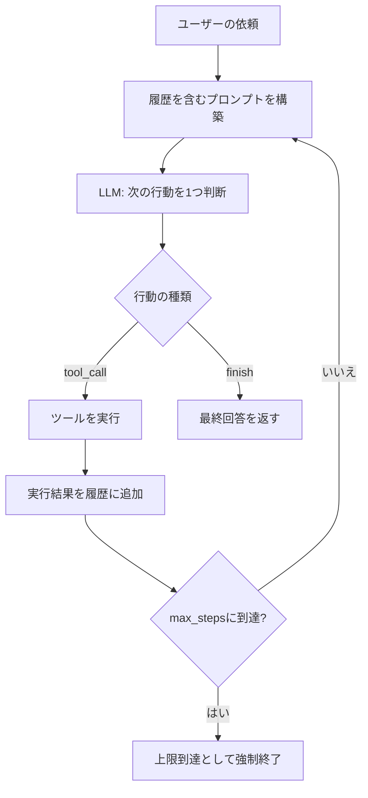

# Autonomous Agents

## この教材で身につくこと

- ワークフロー（固定コード経路）と自律エージェント（動的なツール選択ループ）の違いを説明できる
- 最小限のツール呼び出しループを実装できる
- ワークフローと自律エージェントのどちらを採用すべきか判断基準を持てる

## 概要

01〜04で見た4パターンは、いずれも「次に何を呼ぶか」を人間があらかじめコードで決めています。
Orchestrator-Workersも、ステップの組み合わせをLLMの1回の出力で決め、あとは決定的なエンジンが実行するだけでした。
しかし、途中の結果を見てから次の一手を考え直す必要がある、実行経路そのものを事前にコード化できないタスクもあります。
この場合は、LLM自身に「ツールを呼ぶか、終了するか」を1ステップごとに判断させ、その結果を踏まえて次の判断をさせる、というループを組みます。
これが**自律エージェント**（Autonomous Agents）パターンです。

本教材では、銘柄情報の取得・回答をLLM自身がツール呼び出しの要否を判断しながら繰り返す、最小限の自律エージェントループを解説します。

## 位置づけ

05章の最後の教材です。
01〜04で扱ったワークフロー（あらかじめ決めたコード経路）に対し、本教材は「次に何をするか」をLLM自身が決める点で質的に異なります。
章全体の締めくくりとして、ワークフローとエージェントの使い分け判断基準を示します。

| 観点 | ワークフロー（Prompt Chaining〜Evaluator-Optimizer） | 自律エージェント |
|---|---|---|
| 次の行動を決めるのは | コード（あらかじめ決めた経路） | LLM自身（ループ内で都度判断） |
| 実行経路の予測可能性 | 高い（事前にコード化されている） | 低い（実行してみないと分からない） |
| 向いている場面 | サブタスクや分岐をあらかじめコード化できる | 実行経路を事前にコード化できない開放的な問題 |
| つまずきやすい点 | （各パターンの表を参照） | 終了条件（`max_steps`/`finish`）が無いと暴走・コスト増になる |

## 主要概念・設計判断の解説

### 自律エージェントの定義

LLMが環境からのフィードバックに基づき、ツールをループで使用します（出典: [Anthropic "Building Effective Agents"](https://www.anthropic.com/research/building-effective-agents)）。
実行経路を事前にコード化できない開放的な問題に向きます。

一般形は次のとおりです。
LLMが「ツールを呼ぶ」か「終了する」かを毎ステップ判断し、ツールの実行結果を次の判断材料として履歴に積みます。



ワークフローとの違いは上の表のとおりです。
ワークフロー（Prompt Chaining〜Evaluator-Optimizer）は「次に何を呼ぶか」がコードで決まっていますが、自律エージェントは「次に何をするか」をLLMの応答自体が決めます。

### Anthropicの推奨

「まず単純な構成（ワークフロー）から始め、効果が実証された場合のみ自律エージェントの複雑さを足す」。
`app/`が採用していない理由（01章と接続）は、用途がシンプルなAugmented LLM呼び出しで十分なためです。

### 終了条件の設計

`max_steps`による上限、および`"finish"`という明示的な終了アクションの両方を用意し、無限ループを防ぎます。
下のサンプルコード（`run_agent_loop`）は次の順序で処理します。

1. **履歴の初期化**: ユーザーの依頼を履歴の先頭に積む。
2. **プロンプト構築**: `build_agent_prompt`で履歴全体とツール一覧を渡す。
   - つまずきやすい点: 履歴を毎回全部渡す（02章のマルチターン対話と同じステートレス設計）。
     省略するとLLMが前の行動を覚えていない。
3. **LLM呼び出し**: 次の行動を1つだけJSON形式で判断させる。
4. **行動の分岐**: `"finish"`ならその場でanswerを返して終了する。
   `"tool_call"`ならツールを実行し、結果を履歴に積んでループを続ける。
5. **上限判定**: `max_steps`回に達したら強制終了する。
   - つまずきやすい点: 終了条件（`max_steps`と`"finish"`の両方）を用意しないと、無限ループやコスト超過につながる。

## 実ソースコード（Python / プロンプト例、出典パス明記）

本教材のサンプルコードは`app/`に実装例が無いため、汎用サンプルコードで解説します。

```python
import json

from common.json_parsing import strip_code_fence

_TOOLS = {
    "get_price": lambda args: get_price(args["ticker"]),
    "get_news": lambda args: get_news(args["ticker"]),
}


def build_agent_prompt(history: list[dict], tools: list[str]) -> str:
    transcript = "\n".join(f"{turn['role']}: {turn['content']}" for turn in history)
    return (
        f"利用できるツール: {tools}\n"
        '次のいずれかのJSON形式で次の行動を1つだけ出力してください。\n'
        '{"type": "tool_call", "tool": "<ツール名>", "args": {...}}\n'
        '{"type": "finish", "answer": "<最終回答>"}\n\n'
        f"【これまでの履歴】\n{transcript}"
    )


def run_agent_loop(user_request: str, max_steps: int = 5) -> str:
    history = [{"role": "user", "content": user_request}]
    for _ in range(max_steps):
        raw = call_llm(build_agent_prompt(history, tools=list(_TOOLS)))
        action = json.loads(strip_code_fence(raw))
        if action["type"] == "finish":
            return action["answer"]
        tool_result = _TOOLS[action["tool"]](action["args"])
        history.append({"role": "assistant", "content": raw})
        history.append({"role": "tool", "content": json.dumps(tool_result, ensure_ascii=False)})
    return "ステップ上限に達したため終了しました。"
```

（参考）行動の前に「なぜその行動を選ぶか」を1行の理由（`thought`）として出力させると、判断の妥当性を人間が後から検証しやすくなります（ReActと呼ばれる代表的な派生形の一つ）。
これも**汎用サンプルコード**です。

```python
# 汎用サンプル: 行動の前にthought（判断理由）も出力させる派生形。
def build_agent_prompt_with_thought(history: list[dict], tools: list[str]) -> str:
    transcript = "\n".join(f"{turn['role']}: {turn['content']}" for turn in history)
    return (
        f"利用できるツール: {tools}\n"
        "まずthoughtフィールドに次の行動を選んだ理由を1文で書き、"
        "続けて行動を1つだけJSON形式で出力してください。\n"
        '{"thought": "<理由>", "type": "tool_call", "tool": "<ツール名>", "args": {...}}\n'
        '{"thought": "<理由>", "type": "finish", "answer": "<最終回答>"}\n\n'
        f"【これまでの履歴】\n{transcript}"
    )
```

## 演習課題

1. `get_price`/`get_news`ツールに加え、第3のツール（例: `get_technical_indicators`）を追加する場合、どう変更するか考えてください。
   1. `_TOOLS`辞書にどんなエントリを追加するか書いてください。
   2. `build_agent_prompt`の出力するツール一覧・説明文をどう変更する必要があるか書いてください。
2. `app/`にこのパターンを追加するとしたら、Anthropicの「まず単純な構成から始める」原則に照らして、どんな条件が揃えば自律エージェント化を検討すべきか考えてください。

## 理解度チェック

- [ ] ワークフローと自律エージェントの違いを説明できる
- [ ] ツール呼び出しループの終了条件をどう設計しているか説明できる
- [ ] ワークフローと自律エージェントのどちらを採用すべきか判断基準を説明できる
- [ ] ツール呼び出しループの各ステップ（プロンプト構築→LLM判断→分岐→ループ）を図を使って説明できる

---

[← 前へ: Evaluator-Optimizer](04-evaluator-optimizer.md) | [次へ: 06-ai-product-ux-patterns →](../06-ai-product-ux-patterns/00-README.md)
