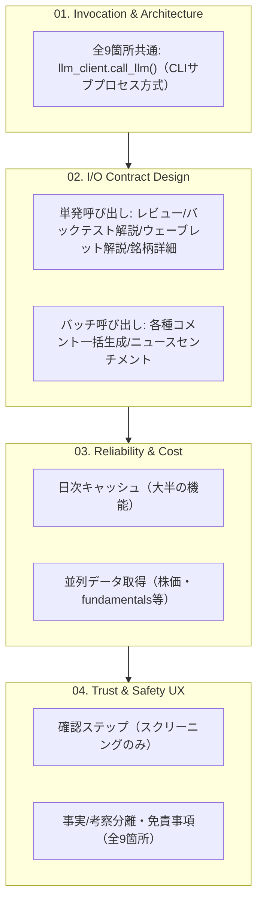

# 既存アプリの統合パターン横断マッピング

## この教材で身につくこと

- `app/`内の生成AI活用箇所（9箇所）を、01〜04で学んだ観点でマッピングした
  一覧表を読み解ける
- 01〜04章の原則が実アプリでどう組み合わさっているか説明できる
- 確認ステップの有無をリスクの観点で判断できる

## 概要

ここまでのカテゴリで学んだ原則（呼び出し方式・入出力契約・信頼性/コスト・
安全性UX）を、`ai-stock-investing-tutorial`の完成版アプリ`app/`の
9箇所の生成AI活用箇所に当てはめて棚卸しします。

## 位置づけ

本教材は01〜04で学んだ内容の統合的な確認です。新しい設計原則は
登場しません。次の02では、この棚卸しを自分のアプリに応用する演習を行います。

## 主要概念・設計判断の解説

### `app/`内の生成AI活用9箇所

出典: `ai-stock-investing-tutorial/app/docs/app-design.md`（「3. 機能一覧」と
各機能のシーケンス図）を根拠に整理した一覧です。

| # | 機能 | 何をする機能か | 呼び出し単位（02章） | フォールバック（03章） | 確認ステップ（04章） |
|---|------|----------------|----------------------|--------------------------|------------------------|
| 1 | スクリーニング条件変換 | 自然言語の投資条件をAIがJSON形式のフィルタ条件に変換する | 単発 | 処理を止めてエラー表示 | あり（st.json確認） |
| 2 | スクリーニング結果コメント | 絞り込み結果の各銘柄にAIが一言コメントを付ける | バッチ | 「コメント生成失敗」 | なし |
| 3 | ニュースセンチメント判定 | 保有銘柄のニュース見出しからポジティブ/ネガティブをAIが判定する | バッチ | 空dict | なし |
| 4 | ポートフォリオレビュー考察 | 保有銘柄の構成比・リスク・銘柄別情報を統合した考察レポートをAIが生成する | 単発 | （呼び出し元にエラー伝播） | なし |
| 5 | バックテスト解説 | 単一銘柄の戦略バックテスト結果をAIが解説する | 単発 | （呼び出し元にエラー伝播） | なし |
| 6 | 一括バックテストのランキングコメント | 全銘柄一括バックテストの上位銘柄にAIがコメントする | バッチ（上位5件） | 「コメント生成失敗」 | なし |
| 7 | セクターローテーションのペアコメント | 業種間の値動きの時差相関が高い上位ペアにAIがコメントする | バッチ（上位5件） | 「コメント生成失敗」 | なし |
| 8 | ウェーブレット分析のAI解説 | 2業種間の時間変化するリード・ラグの直近シグナルをAIが解説する | 単発 | （呼び出し元にエラー伝播） | なし |
| 9 | 銘柄詳細ダイアログの総合コメント | 個別銘柄のPER/PBR/テクニカル/ニュースを統合した総合コメントをAIが生成する | 単発 | （呼び出し元にエラー伝播） | なし |

### 全9箇所に共通する設計

- **01章（呼び出し方式）**: すべてCLIサブプロセス方式（`llm_client.call_llm`）を経由する
- **03章（キャッシュ）**: 大半が日次ファイルキャッシュを使う（銘柄詳細情報のみ
  「キャッシュを無視して再生成する」オプションが無い例外）
- **04章（事実/考察分離・免責事項）**: 全9箇所が、Python側で計算した事実データを
  プロンプトに埋め込み、生成されたレポート・コメントには免責事項が付与される

### 確認ステップが1箇所だけの理由

確認ステップ（04-01章のVerificationパターン）があるのはスクリーニング条件変換
だけです。これは、誤った条件でユニバースを絞り込むと実害が大きい一方、
コメント生成の誤りは表示上の付加情報の誤りにとどまるためです。

## 実ソースコード（Python / プロンプト例、出典パス明記）

上記の表は、出典: `ai-stock-investing-tutorial/app/docs/app-design.md`の
「3. 機能一覧」表と「5.1 LLM連携」節を根拠にしています（全文転載はせず、
本教材の一覧表として要約しています）。

## 演習課題

1. 上記マッピング表のうち、確認ステップが「なし」の機能を1つ選び、
   04-01で学んだ基準（リスク・不可逆性）に照らして、確認ステップを
   追加すべきか判断してください。
2. マッピング表に無い10番目の機能を`app/`に追加するとしたら、
   01〜04の各観点（呼び出し方式・入出力契約・信頼性/コスト・安全性UX）を
   どう設計するか、簡潔な設計メモを書いてください。

## 理解度チェック

- [ ] `app/`内9箇所の生成AI活用箇所を列挙できる
- [ ] 確認ステップがスクリーニング条件変換にのみ存在する理由を説明できる
- [ ] 01〜04章の原則が実アプリでどう組み合わさっているか説明できる

---

投資判断に関わる内容です。必ず
[ai-stock-investing-tutorialの免責事項](https://github.com/duwenji/ai-stock-investing-tutorial/blob/master/DISCLAIMER.md)
をご確認ください。

[← 前へ: 00-README](00-README.md) | [次へ: 自分のアプリへの適用演習 →](02-exercise-apply-to-your-app.md)
