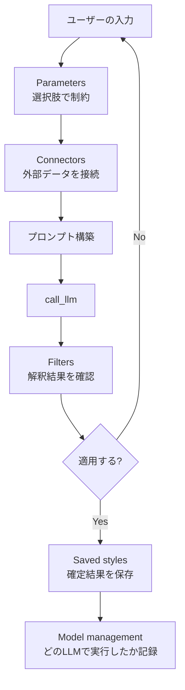

# 調整とコンテキスト制御

## この教材で身につくこと

- AIが解釈した条件をユーザーに確認させながら適用するFilters設計を実装できる
- ユーザー固有の設定（保存済み戦略、LLMプロバイダ選択）を永続化するSaved styles・Model managementを実装できる
- Attachments・Modes・Preset styles・Prompt enhancer・Voice and toneの目的を説明できる

## 概要

02教材のPrompt Actionsは「1回のやり取りの中でユーザーが押す操作」でした。
しかし実際のAI機能では、やり取りの前後にも調整すべき点があります。
例えば、「AIがこちらの条件をどう解釈したか事前に確認したい」「毎回同じ戦略設定を入力し直すのは面倒」「どのLLMプロバイダを使うかをアプリ側で選びたい」といった要望です。
これらはプロンプトの文面を直接いじる話ではなく、プロンプトの「前提」を調整する話です。
バックエンドの用語で例えると、リクエストの中身（ペイロード）ではなく、リクエストの前提となる設定値（コンフィグ）に近いイメージです。

Shape of AIでは、この「プロンプトの前提・文脈を調整するUI」をTunersと呼びます。
[Shape of AI](https://www.shapeof.ai/)のTunersカテゴリ10パターン（Attachments, Connectors, Filters, Model management, Modes, Parameters, Preset styles, Prompt enhancer, Saved styles, Voice and tone）を扱います。
共通するテーマは「プロンプトそのものではなく、その前後の設定・文脈を調整する」ことです。

## 位置づけ

06章の3番目の教材です。
02教材（プロンプト操作アクション）が「1回のやり取りの中でのアクション」を扱うのに対し、本教材は「やり取りの前提となる設定・文脈」を扱います。

## 主要概念・設計判断の解説

### `app/`の実例（5パターン）

| パターン | `app/`での対応 | つまずきやすい点 |
|---|---|---|
| [Filters](https://www.shapeof.ai/patterns/filters) | AIが解釈した絞り込み条件を`st.json`で確認してから適用 | 確認を挟まないと誤解釈のまま処理が進んでしまう |
| [Parameters](https://www.shapeof.ai/patterns/parameters) | 分析期間（`st.selectbox(["1y", "2y"])`）等の制約付きパラメータ | 選択肢を絞りすぎるとユーザーの意図に合わなくなる |
| [Connectors](https://www.shapeof.ai/patterns/connectors) | 質問カテゴリに応じて外部データ（株価・ニュース）をプロンプトに接続 | 接続先が増えるほど分類ミス時の影響が大きくなる |
| [Saved styles](https://www.shapeof.ai/patterns/saved-styles) | ユーザーが確定した戦略条件をDBに保存し再利用 | 同名上書きの仕様に気づかず意図せず消してしまう |
| [Model management](https://www.shapeof.ai/patterns/model-management) | `llm_provider`設定でClaude CLI/OpenAI APIを切り替え | 未対応プロバイダ名を設定すると実行時まで気づけない |

### `app/`に実装が無い観点（5パターン）

以下5パターンは`app/`に該当する実装がありません。
本教材のサンプルコードは`app/`に実装例が無いため、汎用サンプルコードで解説します。

| パターン | 説明 | つまずきやすい点 |
|---|---|---|
| [Attachments](https://www.shapeof.ai/patterns/attachments) | ファイル等を添付してAIの参照材料にする | 添付ファイルのサイズ・形式チェックが漏れやすい |
| [Modes](https://www.shapeof.ai/patterns/modes) | 用途に応じてAIの制約・ペルソナを切り替える | モード切替をユーザーが忘れて意図しない出力になる |
| [Preset styles](https://www.shapeof.ai/patterns/preset-styles) | 生成物の質感・トーンの既定オプション | プリセットの数が多いと選択自体が負担になる |
| [Prompt enhancer](https://www.shapeof.ai/patterns/prompt-enhancer) | ユーザーのプロンプトをAIが補強する | 補強後の文面をユーザーが確認しないと意図とずれる |
| [Voice and tone](https://www.shapeof.ai/patterns/voice-and-tone) | 出力の声・トーンを一貫させる | 長い対話でトーン指示が薄れ一貫性が崩れる |

## 実ソースコード（Python / プロンプト例、出典パス明記）

出典: `ai-stock-investing-tutorial/app/app_tabs/screening_tab.py`（Filters）

```python
st.subheader("AIが解釈した条件（適用前に確認してください）")
st.json(filters)
if st.button("この条件で絞り込む"):
    result_df = apply_filters(universe_df, filters)
```

出典: `ai-stock-investing-tutorial/app/app_tabs/strategy_builder_tab.py`（Parameters、制約付き選択肢）

```python
sector_period = st.selectbox(
    "分析期間", ["1y", "2y"], key="strategy_sector_period"
)
band_choice = st.selectbox(
    "周期帯",
    ["すべて（自動選択）", "短期", "中期", "長期"],
    key="strategy_watchlist_band",
)
```

出典: `ai-stock-investing-tutorial/app/app_tabs/qa_tab.py`（Connectors、質問カテゴリに応じた外部データの接続）

```python
if category == "technical":
    history = cached_fetch_price_history(ticker, "6mo")
    technical = analyze_technical(history)
    prompt = build_technical_answer_prompt(question, technical)
elif category == "news":
    news = cached_fetch_news(ticker)
    prompt = build_news_answer_prompt(question, news)
```

出典: `ai-stock-investing-tutorial/app/strategy_builder/storage.py`（Saved styles）

```python
def load_strategies(user_id: int, session_factory=SessionLocal) -> list[dict]:
    with session_factory() as session:
        rows = (
            session.query(Strategy)
            .filter_by(user_id=user_id)
            .order_by(Strategy.id)
            .all()
        )
        return [json.loads(row.strategy_json) for row in rows]


def save_strategy(user_id: int, strategy: dict, session_factory=SessionLocal) -> None:
    name = strategy.get("strategy_name")
    with session_factory() as session:
        session.query(Strategy).filter_by(user_id=user_id, strategy_name=name).delete()
        session.add(
            Strategy(
                user_id=user_id,
                strategy_name=name,
                strategy_json=json.dumps(strategy, ensure_ascii=False),
            )
        )
        session.commit()
```

出典: `ai-stock-investing-tutorial/app/data_api/llm_client.py`（Model management）

```python
def _get_provider() -> str:
    return (_get_secret("llm_provider", "claude_cli") or "claude_cli").strip().lower()


def call_llm(prompt: str, timeout: int = 120) -> str:
    provider = _get_provider()
    if provider == "claude_cli":
        return _call_claude_cli(prompt, timeout)
    elif provider == "openai":
        return _call_openai(prompt, timeout)
    else:
        raise ValueError(f"未対応のllm_providerです: {provider}")
```

汎用サンプルコード（`app/`に実装例が無いため、Modes・Voice and toneを解説する架空のコード）:

```python
def build_prompt_with_mode(user_message: str, mode: str) -> str:
    """用途（Modes）に応じてAIのペルソナ・制約・声のトーン
    （Voice and tone）を切り替える。
    """
    mode_instructions = {
        "初心者向け": "専門用語を避け、やさしい言葉で丁寧に説明してください。",
        "専門家向け": "専門用語を積極的に使い、簡潔に要点だけ述べてください。",
    }
    instruction = mode_instructions.get(mode, mode_instructions["初心者向け"])
    return f"{instruction}\n\n{user_message}"
```

汎用サンプルコード（`app/`に実装例が無いため、Preset styles・Attachmentsを解説する架空のコード）:

```python
_PRESET_STYLES = {
    "簡潔": "3行以内で要点だけ答えてください。",
    "詳細": "根拠となるデータを示しながら詳しく説明してください。",
}


def render_preset_and_attachment(user_message: str) -> str:
    """出力の質感を選ぶプリセット（Preset styles）と、参考資料を
    添付してAIの参照材料にする欄（Attachments）を並べて表示する。
    """
    style = st.selectbox("回答のスタイル", list(_PRESET_STYLES))
    uploaded = st.file_uploader("参考資料を添付（任意）", type=["pdf", "txt"])
    prompt = f"{_PRESET_STYLES[style]}\n\n{user_message}"
    if uploaded is not None:
        prompt += f"\n\n【添付資料】{uploaded.read().decode('utf-8', errors='ignore')}"
    return prompt
```



この図が示すように、Filtersの確認ステップは「No」の場合に入力へ差し戻る分岐を持ちます。
確認を挟まずに即座に適用してしまうと、AIの誤解釈がそのまま結果に反映されてしまうため、この分岐が欠かせません。

## 演習課題

1. `save_strategy`が同名戦略を「削除→追加」で上書きしている理由を、Saved stylesが目指す「再利用しやすさ」の観点で説明してください。
2. 自分のアプリにModel management（複数LLMプロバイダの切り替え）を追加する設計をしてください。
   1. `llm_client.py`の`_get_provider`が現在どの値を見て分岐しているか確認してください。
   2. 追加したいプロバイダ名（例: `"gemini"`）を1つ決めてください。
   3. `_get_provider`の分岐に追加するコード（`elif`節）を書いてください。

## 理解度チェック

- [ ] `app/`が実装する5つのTunersパターンをそれぞれ説明できる
- [ ] FiltersとVerification（04章）の違いを説明できる
- [ ] Attachments・Modes・Preset styles・Prompt enhancer・Voice and toneの目的をそれぞれ説明できる
- [ ] Tunersパターンのつまずきやすい点を、実例・未実装の両方について説明できる

---

[← 前へ: プロンプト操作アクション](02-prompt-action-patterns.md) | [次へ: AIの識別とブランディング →](04-ai-identity-and-branding.md)
