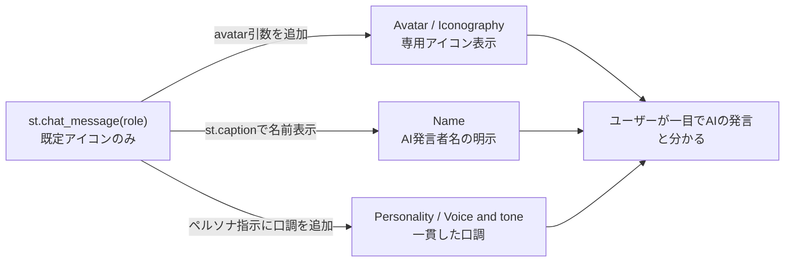

# AIの識別とブランディング

## この教材で身につくこと

- AIの発言をUI上で視覚的に識別可能にする設計要素（アバター・命名等）を説明できる
- AIの「声」を一貫させるためのペルソナ設計の考え方を理解する
- `st.chat_message`のようなチャットUIコンポーネントに、識別要素を追加する拡張ポイントを特定できる

## 概要

チャット画面で発言が並んでいるとき、それが「AIの発言」なのか「以前に自分（または他のユーザー）が入力した文章」なのか、パッと見て区別できるでしょうか。
区別できないと、ユーザーはAIの発言をあたかも人間の発言のように誤解したり、逆に人間の発言をAIの出力だと疑って信頼しなかったりします。
この「発言者の識別」は、見た目の装飾ではなく信頼性に直結するUX課題です。

Shape of AIでは、この「AIという存在をどう識別可能にするか」に関わるパターン群をIdentifiers（識別子）と呼びます。
[Shape of AI](https://www.shapeof.ai/)のIdentifiersカテゴリ5パターン（Avatar, Color, Iconography, Name, Personality）を扱います。
共通するテーマは「ユーザーが画面を見たときに、AIの発言だと一目で分かるようにする」ことです。

## 位置づけ

06章の最終教材（4番目）です。
01〜03で学んだプロンプト構築・操作・調整のUXに対し、本教材は「AIという存在そのものをどう表現するか」という、ブランディングに近い視点を扱います。

## 主要概念・設計判断の解説

### `app/`の拡張ポイント: `st.chat_message`

AI戦略ビルダーの対話画面は、Streamlitの`st.chat_message(role)`を使ってユーザーとAIの発言を吹き出し形式で表示します。
`role`に`"assistant"`を渡すと既定のアイコンが使われますが、`app/`では`avatar`引数を指定しておらず、AI独自の[Avatar](https://www.shapeof.ai/patterns/avatar)や[Name](https://www.shapeof.ai/patterns/name)（例:「アナリストAI」）はカスタマイズされていません。
この`st.chat_message`呼び出しが、Identifiersパターンを追加する場合の拡張ポイントです。

### `app/`に実装が無い観点: 5パターンすべて

以下5パターンは、いずれも`app/`にブランディングとしての実装がありません。
本教材のサンプルコードは`app/`に実装例が無いため、汎用サンプルコードで解説します。

| パターン                                                  | 説明                               | UI上の現れ方の例                                          |
| --------------------------------------------------------- | ---------------------------------- | --------------------------------------------------------- |
| [Avatar](https://www.shapeof.ai/patterns/avatar)           | AI自身の視覚的識別子               | `st.chat_message`の`avatar`引数にアイコン画像・絵文字 |
| [Color](https://www.shapeof.ai/patterns/color)             | AI機能を識別する色の視覚的手がかり | AI発言の吹き出しだけ背景色を変える                        |
| [Iconography](https://www.shapeof.ai/patterns/iconography) | AI駆動のアクションを表すアイコン   | ボタンに「✨」等のAI専用アイコンを添える                  |
| [Name](https://www.shapeof.ai/patterns/name)               | AIをどう呼ぶか                     | 発言の直前に`st.caption("アナリストAI")`                |
| [Personality](https://www.shapeof.ai/patterns/personality) | AIの個性を特徴づける性質           | システムプロンプトで口調・態度を指示する                  |

Avatar・Colorは「視覚的にひと目で気づかせる」役割、Name・Personalityは「発言の中身・口調で一貫性を持たせる」役割と考えると整理しやすくなります。

## 実ソースコード（Python / プロンプト例、出典パス明記）

出典: `ai-stock-investing-tutorial/app/app_tabs/strategy_builder_tab.py`
（拡張ポイントとなる既存コード、Avatar/Name未カスタマイズ）

```python
for turn in history:
    with st.chat_message(turn["role"]):
        st.write(turn["content"])
```

汎用サンプルコード（`app/`に実装例が無いため、Avatar・Name・Personalityを解説する架空のコード）:

```python
_AI_NAME = "アナリストAI"
_AI_AVATAR = "📊"  # Identifiers: Avatar/Iconography相当の絵文字アイコン
_AI_PERSONA_INSTRUCTIONS = (
    "あなたは冷静かつ丁寧な口調のアナリストです。断定を避け、"
    "常に根拠となるデータを添えて説明してください。"  # Personality/Voice and tone
)

for turn in history:
    role = turn["role"]
    avatar = _AI_AVATAR if role == "assistant" else None
    with st.chat_message(role, avatar=avatar):
        if role == "assistant":
            st.caption(_AI_NAME)  # Name: 発言者がAIだと一目で分かるようにする
        st.write(turn["content"])
```

汎用サンプルコード（`app/`に実装例が無いため、Color・Iconographyを解説する架空のコード）:

```python
_AI_BUBBLE_COLOR = "#eef4ff"  # Color: AI発言だけ薄い青系の背景色にする


def render_ai_message_with_color(content: str) -> None:
    """AIの発言だけ背景色を変え（Color）、先頭にAI駆動アクションである
    ことを示すアイコン（Iconography）を添えて表示する。
    """
    st.markdown(
        f'<div style="background-color:{_AI_BUBBLE_COLOR};padding:8px;">'
        f"✨ {content}</div>",
        unsafe_allow_html=True,
    )
```



この図が示すように、Avatar・Name・Personalityはいずれも同じ`st.chat_message(role)`という1箇所の拡張ポイントから枝分かれします。
つまり実装の追加コストは小さい一方、どの要素をどこまで作り込むかはプロダクトのブランディング方針次第で決める設計判断になります。

## 演習課題

1. `st.chat_message(turn["role"])`に`avatar`引数を追加する場合、ユーザー（`"user"`）とAI（`"assistant"`）でどう出し分けるべきかコードを書いてください。
2. 自分のアプリのAI機能に名前（Name）を付ける設計をしてください。
   1. 候補となる名前を2〜3個挙げてください。
   2. 上の比較表を参考に、名前と合わせてAvatar・Colorのどちらを併用するか決めてください。
   3. 選んだ名前がユーザーの信頼を得やすい理由を1〜2文で書いてください。

## 理解度チェック

- [ ] Identifiersカテゴリ5パターンの目的をそれぞれ説明できる
- [ ] `st.chat_message`がIdentifiersパターンの拡張ポイントになる理由を説明できる
- [ ] AvatarとColor・Iconographyの役割の違いを説明できる
- [ ] 「視覚的に気づかせる」要素と「口調で一貫させる」要素の違いを説明できる

---

[← 前へ: 調整とコンテキスト制御](03-tuning-and-context-control.md)
