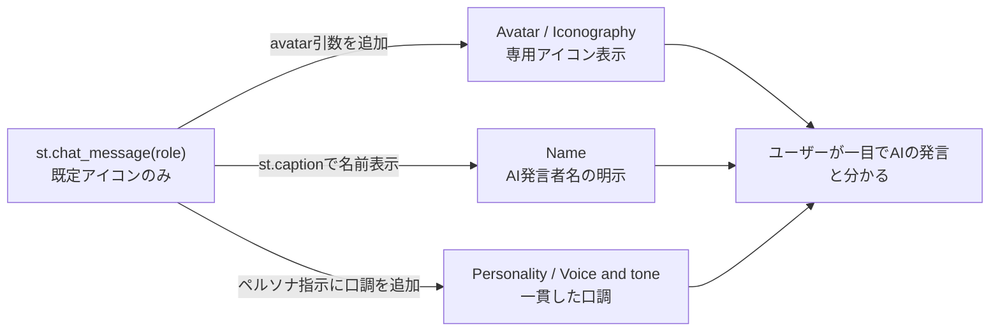

# AIの識別とブランディング

## この教材で身につくこと

- AIの発言をUI上で視覚的に識別可能にする設計要素（アバター・命名等）を説明できる
- AIの「声」を一貫させるためのペルソナ設計の考え方を理解する
- `st.chat_message`のようなチャットUIコンポーネントに、識別要素を
  追加する拡張ポイントを特定できる

## 概要

[Shape of AI](https://www.shapeof.ai/)のIdentifiersカテゴリ5パターン
（Avatar, Color, Iconography, Name, Personality）を扱います。共通する
テーマは「ユーザーが画面を見たときに、AIの発言だと一目で分かるように
する」ことです。

## 位置づけ

06章の最終教材（4番目）です。01〜03で学んだプロンプト構築・操作・調整の
UXに対し、本教材は「AIという存在そのものをどう表現するか」という、
ブランディングに近い視点を扱います。

## 主要概念・設計判断の解説

### `app/`の拡張ポイント: `st.chat_message`

AI戦略ビルダーの対話画面は、Streamlitの`st.chat_message(role)`を
使ってユーザーとAIの発言を吹き出し形式で表示します。`role`に
`"assistant"`を渡すと既定のアイコンが使われますが、`app/`では
`avatar`引数を指定しておらず、AI独自の[Avatar](https://www.shapeof.ai/patterns/avatar)や
[Name](https://www.shapeof.ai/patterns/name)（例:「アナリストAI」）は
カスタマイズされていません。この`st.chat_message`呼び出しが、
Identifiersパターンを追加する場合の拡張ポイントです。

### `app/`に実装が無い観点: 5パターンすべて

[Avatar](https://www.shapeof.ai/patterns/avatar)（AI自身の視覚的識別子）・
[Color](https://www.shapeof.ai/patterns/color)（AI機能を識別する色の
視覚的手がかり）・[Iconography](https://www.shapeof.ai/patterns/iconography)
（AI駆動のアクションを表すアイコン）・[Name](https://www.shapeof.ai/patterns/name)
（AIをどう呼ぶか）・[Personality](https://www.shapeof.ai/patterns/personality)
（AIの個性を特徴づける性質）は、いずれも`app/`にブランディングとしての
実装がありません。本教材のサンプルコードは`app/`に実装例が無いため、
汎用サンプルコードで解説します。

## 実ソースコード（Python / プロンプト例、出典パス明記）

出典: `ai-stock-investing-tutorial/app/app_tabs/strategy_builder_tab.py`
（拡張ポイントとなる既存コード、Avatar/Name未カスタマイズ）

```python
for turn in history:
    with st.chat_message(turn["role"]):
        st.write(turn["content"])
```

汎用サンプルコード（`app/`に実装例が無いため、Avatar・Name・
Personalityを解説する架空のコード）:

```python
_AI_NAME = "アナリストAI"
_AI_AVATAR = "📊"  # Identifiers: Avatar/Iconography相当の絵文字アイコン
_AI_PERSONA_INSTRUCTIONS = (
    "あなたは冷静かつ丁寧な口調のアナリストです。断定を避け、"
    "常に根拠となるデータを添えて説明してください。"  # Personality/Voice and tone
)

for turn in history:
    role = turn["role"]
    avatar = _AI_AVATAR if role == "assistant" else None
    with st.chat_message(role, avatar=avatar):
        if role == "assistant":
            st.caption(_AI_NAME)  # Name: 発言者がAIだと一目で分かるようにする
        st.write(turn["content"])
```



## 演習課題

1. `st.chat_message(turn["role"])`に`avatar`引数を追加する場合、
   ユーザー（`"user"`）とAI（`"assistant"`）でどう出し分けるべきか
   コードを書いてください。
2. 自分のアプリのAI機能に名前（Name）を付けるとしたら、どんな名前が
   ユーザーの信頼を得やすいか、理由とともに1つ提案してください。

## 理解度チェック

- [ ] Identifiersカテゴリ5パターンの目的をそれぞれ説明できる
- [ ] `st.chat_message`がIdentifiersパターンの拡張ポイントになる理由を説明できる
- [ ] AvatarとColor・Iconographyの役割の違いを説明できる

---

[← 前へ: 調整とコンテキスト制御](03-tuning-and-context-control.md)
