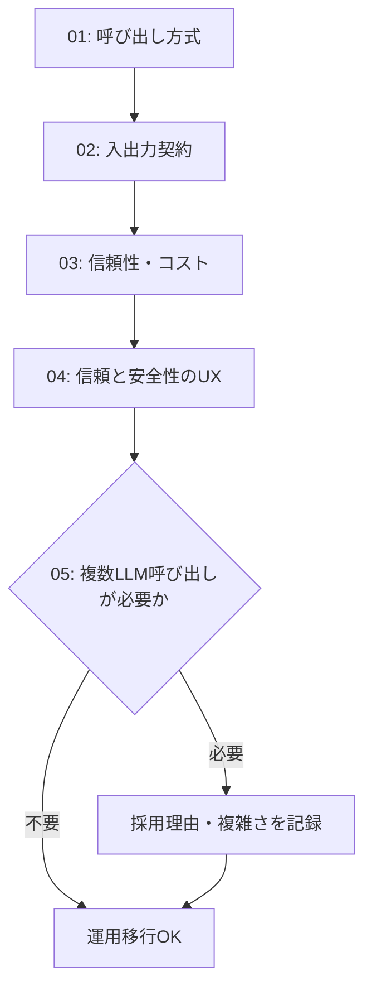

# 運用移行前チェックリスト

## この教材で身につくこと

- 01〜05章の設計判断を、本番投入前に一枚のチェックリストで一括点検できる
- チェックリストの各項目が、どの章のどの原則に対応するか説明できる
- 自分のアプリのチェック結果から、未対応の項目を洗い出せる

## 概要

本教材は、01〜05章で学んだ設計判断を、生成AI機能を本番運用に移す直前に
一括点検するためのチェックリストです。**新しい設計原則は登場しません。**
項目ごとに対応する章の教材へリンクします。

## 位置づけ

本カテゴリの3番目（最終）の教材です。01-case-study-mapで`app/`の実例を
確認し、02-exerciseで自分のアプリに設計判断を適用したあと、本教材で
運用投入前の最終確認を行う位置づけです。

## 主要概念・設計判断の解説

チェック項目は01〜05章の順に並べています。05章は単発呼び出しで
用途が足りる場合、対象外として構いません。

### 01章: 呼び出し方式とアーキテクチャ

- [ ] 呼び出し方式（API直叩き/SDK/CLIサブプロセス）を選定し理由を記録した
      （[02-api-sdk-vs-cli-subprocess.md](../01-invocation-and-architecture/02-api-sdk-vs-cli-subprocess.md)）
- [ ] システムプロンプトで出力範囲を制御している
      （[03-system-prompt-and-io-boundary.md](../01-invocation-and-architecture/03-system-prompt-and-io-boundary.md)）
- [ ] APIキー・認証情報が環境変数等で管理され、リポジトリに含まれていない（同上）

### 02章: 入出力契約

- [ ] JSON構造化出力の契約とパース処理を実装した
      （[01-structured-output-json-contract.md](../02-io-contract-design/01-structured-output-json-contract.md)）
- [ ] 呼び出し単位（単発/バッチ/マルチターン）を明確にした
      （[02-single-vs-batch-prompting.md](../02-io-contract-design/02-single-vs-batch-prompting.md)）
- [ ] 出力範囲（フィールド・値域）をプロンプトで限定した
      （[03-prompt-scope-and-constraints.md](../02-io-contract-design/03-prompt-scope-and-constraints.md)）

### 03章: 信頼性・コスト

- [ ] パース失敗時の機能ごとの安全な既定値（フォールバック）を用意した
      （[01-defensive-parsing-and-fallback.md](../03-reliability-and-cost/01-defensive-parsing-and-fallback.md)）
- [ ] タイムアウト・リトライ（指数バックオフ）を設定した
      （[02-rate-limit-and-timeout.md](../03-reliability-and-cost/02-rate-limit-and-timeout.md)）
- [ ] キャッシュ層を設計し、再計算コストを抑えた
      （[03-caching-strategy.md](../03-reliability-and-cost/03-caching-strategy.md)）
- [ ] バッチ処理での部分失敗時の挙動を決めた
      （[04-batching-and-parallelization.md](../03-reliability-and-cost/04-batching-and-parallelization.md)）
- [ ] LLM呼び出しをモック化したテストがある
      （[05-testing-llm-integrations.md](../03-reliability-and-cost/05-testing-llm-integrations.md)）

### 04章: 信頼と安全性のUX

- [ ] リスクが高い判断には確認ステップ（Verification）を設けた
      （[01-verification-checkpoint.md](../04-trust-and-safety-ux/01-verification-checkpoint.md)）
- [ ] 事実（プログラム計算）とAI考察を分離して表示している
      （[02-fact-and-opinion-separation.md](../04-trust-and-safety-ux/02-fact-and-opinion-separation.md)）
- [ ] 禁止事項・免責事項をガードレールとして実装した
      （[03-guardrails-and-disclaimers.md](../04-trust-and-safety-ux/03-guardrails-and-disclaimers.md)）
- [ ] 列挙値制約・ホワイトリスト化でプロンプトインジェクション対策をした
      （[04-prompt-injection-defense.md](../04-trust-and-safety-ux/04-prompt-injection-defense.md)）

### 05章: 複数LLM呼び出しの組み合わせ（単発呼び出しで足りる場合は対象外）

- [ ] 単発呼び出しで十分か、ワークフロー/エージェントパターンが必要か判断した
      （[00-README.md](../05-agentic-workflow-patterns/00-README.md)）
- [ ] ワークフローパターンを採用した場合、採用理由と複雑さに見合う効果を記録した

### チェックの流れ



1つでも未対応の項目がある場合は、対応する章の教材に戻って設計判断を
やり直してください。

## 実ソースコード（Python / プロンプト例、出典パス明記）

本教材はチェックリストのため実ソースコードの引用はありません。代わりに、
PRの説明欄にそのまま貼り付けられるチェックリストを示します。

```text
## 生成AI機能 運用移行前チェックリスト

### 01. 呼び出し方式とアーキテクチャ
- [ ] 呼び出し方式を選定し理由を記録した
- [ ] システムプロンプトで出力範囲を制御している
- [ ] APIキー・認証情報がリポジトリに含まれていない

### 02. 入出力契約
- [ ] JSON構造化出力の契約とパース処理を実装した
- [ ] 呼び出し単位（単発/バッチ/マルチターン）を明確にした
- [ ] 出力範囲をプロンプトで限定した

### 03. 信頼性・コスト
- [ ] パース失敗時のフォールバックを用意した
- [ ] タイムアウト・リトライを設定した
- [ ] キャッシュ層を設計した
- [ ] バッチ処理の部分失敗時の挙動を決めた
- [ ] LLM呼び出しのテスト（モック化）がある

### 04. 信頼と安全性のUX
- [ ] リスクが高い判断に確認ステップを設けた
- [ ] 事実とAI考察を分離した
- [ ] ガードレール・免責事項を実装した
- [ ] プロンプトインジェクション対策をした

### 05. 複数LLM呼び出しの組み合わせ（該当する場合）
- [ ] 単発呼び出しで十分か判断した
- [ ] ワークフローパターン採用理由を記録した
```

## 演習課題

1. 自分のアプリ（または02-exerciseで設計した新機能）に上記チェックリスト
   を適用し、未対応の項目をすべて洗い出してください。
2. 未対応項目のうち最もリスクが高いものを1つ選び、対応に必要な作業を
   1〜2文で書いてください。

## 理解度チェック

- [ ] 01〜05章の設計判断が、チェックリストのどの項目に対応するか説明できる
- [ ] 自分のアプリのチェック結果から、未対応の項目を洗い出せる
- [ ] チェックリストの各項目がなぜ必要か（リスク・コスト・信頼性の観点で）
      説明できる

---

投資判断に関わる内容です。必ず
[ai-stock-investing-tutorialの免責事項](https://github.com/duwenji/ai-stock-investing-tutorial/blob/master/DISCLAIMER.md)
をご確認ください。

[← 前へ: 自分のアプリへの適用演習](02-exercise-apply-to-your-app.md) | [次へ: 07-ai-product-ux-patterns →](../07-ai-product-ux-patterns/00-README.md)
