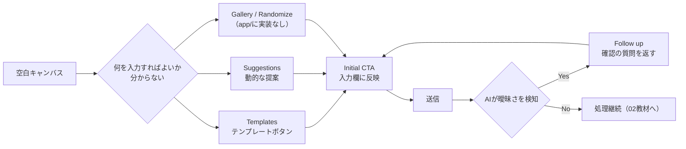

# オンボーディングと導線

## この教材で身につくこと

- 空白キャンバス問題への対策（テンプレート・提案）を設計できる
- 初回プロンプトを促すCTA（Call To Action）を設計できる
- AIが曖昧な入力に対して確認・提案で返す「Follow up」設計を実装できる

## 概要

ユーザーが何も入力されていない画面（空白キャンバス）を前にすると、
何を入力すればいいか分からず離脱しがちです。本教材では、[Shape of
AI](https://www.shapeof.ai/)のWayfindersカテゴリ8パターン（Gallery, Follow
up, Initial CTA, Nudges, Prompt details, Randomize, Suggestions,
Templates）を、「空白キャンバス対策」と「入力ガイダンス」の2グループに
整理して扱います。

## 位置づけ

07章の1番目の教材です。ここで学ぶ導線設計は、02教材で扱う「入力後の
アクション」の前段階、つまりユーザーが最初のプロンプトを送るまでの
体験を扱います。

## 主要概念・設計判断の解説

### 空白キャンバス対策: Templates・Suggestions

AI戦略ビルダーの投資アイデア入力欄は、あらかじめ用意した
[Templates](https://www.shapeof.ai/patterns/templates)（テンプレート
ボタン）と、その日の値上がり銘柄から動的に生成する
[Suggestions](https://www.shapeof.ai/patterns/suggestions)（提案）の
両方を用意し、何も思いつかないユーザーでも入力を始められるようにして
います。

### 入力ガイダンス: Initial CTA・Follow up

投資アイデア入力欄自体は、プレースホルダー付きの大きな`st.text_area`
（[Initial CTA](https://www.shapeof.ai/patterns/initial-cta)）です。
入力後、AIは曖昧なアイデアに対してすぐ確定させず、財務指標や閾値を
具体化する質問・提案を返します。これは[Follow up](https://www.shapeof.ai/patterns/follow-up)
（初期プロンプトが不十分な場合に追加情報を引き出す）に対応します。

### `app/`に実装が無い観点: Gallery・Nudges・Prompt details・Randomize

[Gallery](https://www.shapeof.ai/patterns/gallery)（生成例・プロンプト例の
共有）・[Nudges](https://www.shapeof.ai/patterns/nudges)（利用可能な操作への
気づきを促す）・[Prompt details](https://www.shapeof.ai/patterns/prompt-details)
（裏側で実際に何が起きているかを見せる）・[Randomize](https://www.shapeof.ai/patterns/randomize)
（低い障壁で試させるランダム生成）は、`app/`に該当する実装がありません。
本教材のサンプルコードは`app/`に実装例が無いため、汎用サンプルコードで
解説します。

## 実ソースコード（Python / プロンプト例、出典パス明記）

出典: `ai-stock-investing-tutorial/app/app_tabs/strategy_builder_tab.py`
（Templates）

```python
_TEMPLATES = {
    "バリュー株": "PERが低く、PBRも割安な銘柄に投資したい。",
    "グロース株": "売上高の伸び率が高く、将来性のある成長株に投資したい。",
    "配当株": "配当利回りが高く、安定した配当が期待できる銘柄に投資したい。",
}

template_cols = st.columns(len(_TEMPLATES))
for col, (label, template_text) in zip(template_cols, _TEMPLATES.items()):
    with col:
        if st.button(label, key=f"strategy_template_{label}"):
            st.session_state["strategy_idea_text"] = template_text
            st.rerun()
```

出典: `ai-stock-investing-tutorial/app/app_tabs/strategy_builder_tab.py`
（Suggestions、業種ローテーション分析からの提案）

```python
watchlist = build_watchlist_from_rotation(...)
if watchlist["idea_text"] is None:
    st.info("十分な確信度を持つ業種間の関係が見つかりませんでした。")
    return
st.write(watchlist["idea_text"])
if st.button("この案をアイデア欄に反映", key="strategy_apply_watchlist_idea"):
    st.session_state["strategy_idea_text"] = watchlist["idea_text"]
    st.rerun()
```

出典: `ai-stock-investing-tutorial/app/app_tabs/strategy_builder_tab.py`
（Initial CTA）

```python
st.text_area(
    "投資アイデア",
    key="strategy_idea_text",
    placeholder="例: PERが低く、ROEが高い成長株に投資したい",
    height=100,
)
if st.button("対話を始める", disabled=not st.session_state.get("strategy_idea_text")):
    st.session_state["strategy_chat_history"] = [
        {"role": "user", "content": st.session_state["strategy_idea_text"]}
    ]
```

出典: `ai-stock-investing-tutorial/app/prompt_patterns/strategy_dialogue.py`
（Follow up、ステップ1の指示文）

```text
【ステップ1: アイデアの定量化】
ユーザーから「考え方」が入力されたら、それを歓迎し、以下の要素を具体化するための質問や提案を
1〜2個、短く行ってください。
1. 使用する財務指標（例: PER, PBR, ROE, DIVIDEND_YIELD, REVENUE_GROWTH のいずれか）
2. 具体的な数値の閾値（例: PBR 1倍未満、ROE 10%以上など）
このステップでは、説明文以外は出力しないでください。JSON形式は使わないでください。
```

汎用サンプルコード（`app/`に実装例が無いため、Gallery・Randomizeを
解説する架空のコード）:

```python
def render_gallery_and_randomize(examples: list[dict]) -> str | None:
    """過去の生成例（Gallery）と、ランダムに1件選んで試させるボタン
    （Randomize）を並べて表示する。選ばれた例のプロンプトを返す。
    """
    st.subheader("こんな使い方ができます")
    for example in examples[:3]:
        st.caption(f"「{example['prompt']}」→ {example['result_summary']}")
    if st.button("ランダムに試す"):
        import random
        return random.choice(examples)["prompt"]
    return None
```



## 演習課題

1. `_TEMPLATES`のようなテンプレートボタンと、業種ローテーションからの
   動的な提案（Suggestions）は、どちらも入力欄を埋める点で似ています。
   ユーザー体験上の違いを1つ挙げてください。
2. 自分のアプリでAI機能への入り口を1つ想定し、Templates・Suggestions・
   Initial CTAのうちどれを使うべきか、理由とともに設計してください。

## 理解度チェック

- [ ] 空白キャンバス問題とは何か説明できる
- [ ] `app/`のTemplates・Suggestions・Initial CTA・Follow upの実装を説明できる
- [ ] Gallery・Nudges・Prompt details・Randomizeの目的をそれぞれ説明できる

---

[← 前へ: 00-README](00-README.md) | [次へ: プロンプト操作アクション →](02-prompt-action-patterns.md)
