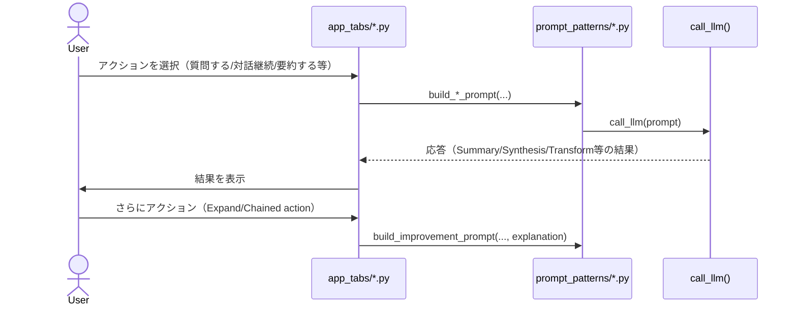

# プロンプト操作アクション

## この教材で身につくこと

- ユーザーがAIに指示する典型的なアクション（開いた入力・対話継続・要約・
  拡張等）を、目的別に分類できる
- 既存の分析結果を入力として次のAI呼び出しに渡す「Chained action」を実装できる
- `app/`のどの機能がどのPrompt Actionsパターンに対応するか説明できる

## 概要

[Shape of AI](https://www.shapeof.ai/)のPrompt Actionsカテゴリ14パターン
（Auto-fill, Chained action, Describe, Expand, Inline Action, Inpainting,
Madlibs, Open input, Regenerate, Restructure, Restyle, Summary, Synthesis,
Transform）を、`app/`の実装に対応するものと、対応しないものに分けて
扱います。

## 位置づけ

07章の2番目の教材です。01教材（導線）で最初のプロンプトを送った後、
ユーザーがAIに対して行う様々な操作アクションを扱います。

## 主要概念・設計判断の解説

### `app/`の実例（7パターン）

| パターン | `app/`での対応 |
|---|---|
| [Open input](https://www.shapeof.ai/patterns/open-input) | AI質問箱の自由記述入力（`qa_tab.py`） |
| [Chained action](https://www.shapeof.ai/patterns/chained-action) | 戦略ビルダーの対話継続（`st.chat_input`で追加発言） |
| [Auto-fill](https://www.shapeof.ai/patterns/auto-fill) | 提案結果を投資アイデア入力欄へ反映（単一フィールド版） |
| [Summary](https://www.shapeof.ai/patterns/summary) | バックテスト結果を初心者向けに要約説明 |
| [Expand](https://www.shapeof.ai/patterns/expand) | 既存の解説に追加の検討観点を加える（Prompt Chaining 2段目） |
| [Synthesis](https://www.shapeof.ai/patterns/synthesis) | ポートフォリオの事実データから観察事項を箇条書きに整理 |
| [Transform](https://www.shapeof.ai/patterns/transform) | ランキング結果（構造化データ）を銘柄ごとの一言コメント（文章）に変換 |

### `app/`に実装が無い観点（7パターン）

[Describe](https://www.shapeof.ai/patterns/describe)（対象を基本要素に
分解しプロンプト候補を示す）・[Inline Action](https://www.shapeof.ai/patterns/inline-action)
（画面上の既存コンテンツを起点にAIへ問い合わせる）・
[Inpainting](https://www.shapeof.ai/patterns/inpainting)（結果の一部だけを
再生成する）・[Madlibs](https://www.shapeof.ai/patterns/madlibs)（同じ
書式のまま繰り返し生成する）・[Regenerate](https://www.shapeof.ai/patterns/regenerate)
（追加入力なしで再生成する）・[Restructure](https://www.shapeof.ai/patterns/restructure)
（既存コンテンツを起点にプロンプトを組み立てる）・
[Restyle](https://www.shapeof.ai/patterns/restyle)（構造を変えずスタイルだけ
変換する）は、`app/`に該当する実装がありません。本教材のサンプルコードは
`app/`に実装例が無いため、汎用サンプルコードで解説します。

## 実ソースコード（Python / プロンプト例、出典パス明記）

出典: `ai-stock-investing-tutorial/app/app_tabs/qa_tab.py`（Open input）

```python
ticker = st.text_input("銘柄コード（任意）", placeholder="7203.T", key="qa_ticker")
question = st.text_area(
    "質問", placeholder="この銘柄は割安ですか？", key="qa_question"
)
if not st.button("質問する", disabled=not question):
    return
```

出典: `ai-stock-investing-tutorial/app/app_tabs/strategy_builder_tab.py`
（Chained action、対話の継続）

```python
user_reply = st.chat_input("AIへの返信を入力", key="strategy_chat_input")
if user_reply:
    history.append({"role": "user", "content": user_reply})
    st.session_state["strategy_chat_history"] = history
    st.rerun()
```

出典: `ai-stock-investing-tutorial/app/prompt_patterns/backtest_explanation.py`
（Summary、複雑な数値結果を初心者向けに要約）

```python
return (
    f"以下は{strategy_name}戦略のバックテスト結果です"
    "（Python側でパラメータの近傍グリッドサーチまで計算済みのため再計算は不要です）。\n\n"
    ...
    "この結果を投資初心者にも分かる言葉で説明してください。\n"
)
```

出典: `ai-stock-investing-tutorial/app/prompt_patterns/backtest_explanation.py`
（Expand、既存の解説に追加の観点を加える2段目のプロンプト）

```python
def build_improvement_prompt(
    ticker: str, comparison: dict, explanation: str, stability: dict, ...
) -> str:
    # Step1（結果解説）の出力を入力として受け取り、追加で検討すべき観点を
    # 生成させる2段階目のプロンプト（Prompt Chaining）。
    return (
        f"...\n【既存の解説】\n{explanation}\n\n"
        "この解説を踏まえ、投資家が追加で検討する価値がある観点を"
        "日本語で2〜3個、簡潔に提案してください。\n"
    )
```

出典: `ai-stock-investing-tutorial/app/prompt_patterns/report_generation.py`
（Synthesis、事実データを観察事項に整理）

```python
return (
    "以下はポートフォリオの事実データ（Python側で計算済み）です。\n\n"
    f"{facts_json}\n\n"
    "このデータを見て、教育的な観察事項（例: 集中度が高い銘柄、"
    "ニュースセンチメントが弱い銘柄、テクニカルシグナルが弱含みの銘柄）を"
    "箇条書きで示してください。\n"
)
```

出典: `ai-stock-investing-tutorial/app/prompt_patterns/backtest_explanation.py`
（Transform、構造化ランキングを文章コメントへ変換）

```python
def build_ranking_comment_prompt(ranking_rows: list[dict]) -> str:
    rows_json = json.dumps(rows, ensure_ascii=False)
    return (
        "以下は複数銘柄のバックテスト結果ランキング（リスク調整済みリターン降順）です。"
        "銘柄ごとに投資家向けの一言コメントを日本語で1文ずつ作成してください。"
        '出力形式: {"<ticker>": "<コメント>"} というJSONのみを出力してください。\n\n'
        f"{rows_json}"
    )
```

汎用サンプルコード（`app/`に実装例が無いため、Regenerate・Inline Actionを
解説する架空のコード）:

```python
def render_regenerate_and_inline_action(last_prompt: str, selected_text: str | None) -> str | None:
    """同じプロンプトのまま結果だけ再生成する（Regenerate）ボタンと、
    画面上で選択済みのテキストを起点にAIへ問い合わせる（Inline Action）
    ボタンを並べて表示する。
    """
    col1, col2 = st.columns(2)
    with col1:
        if st.button("再生成する（同じ条件で）"):
            return last_prompt
    with col2:
        if selected_text and st.button(f"「{selected_text}」について聞く"):
            return f"次のテキストについて詳しく説明してください: {selected_text}"
    return None
```



## 演習課題

1. `build_improvement_prompt`がExpandパターンに対応する理由を、
   「既存の出力を入力として使う」という観点で説明してください。
2. 自分のアプリの既存出力に対して、Regenerate（同条件で再生成）と
   Restyle（構造は変えずスタイルだけ変更）のどちらを追加すべきか、
   ユースケースを1つ想定して判断してください。

## 理解度チェック

- [ ] `app/`が実装する7つのPrompt Actionsパターンをそれぞれ説明できる
- [ ] Expand（既存出力を入力にする）とSummary（複雑な結果を要約する）の違いを説明できる
- [ ] Describe・Inline Action・Inpainting・Madlibs・Regenerate・Restructure・
      Restyleの目的をそれぞれ説明できる

---

[← 前へ: オンボーディングと導線](01-onboarding-and-wayfinding.md) | [次へ: 調整とコンテキスト制御 →](03-tuning-and-context-control.md)
