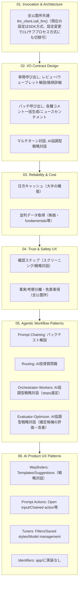

# 既存アプリの統合パターン横断マッピング

## この教材で身につくこと

- `app/`内の生成AI活用箇所（11箇所）を、01〜06で学んだ観点でマッピングした一覧表を読み解ける
- 01〜06章の原則が実アプリでどう組み合わさっているか説明できる
- 確認ステップの有無をリスクの観点で判断できる
- 06章のUXパターンが、11箇所のどの機能に対応するか説明できる

## 概要

ここまでのカテゴリで学んだ原則（呼び出し方式・入出力契約・信頼性/コスト・安全性UX・複数LLM呼び出しの組み合わせ・AIプロダクトUX）を、`ai-stock-investing-tutorial`の完成版アプリ`app/`の11箇所の生成AI活用箇所に当てはめて棚卸しします。

はじめてこの教材を読む場合、01〜06の細部を覚えている必要はありません。
以下は各カテゴリの1行要約です。
表を読む前に読み返してください。

| カテゴリ | 一言でいうと |
|---|---|
| 01. 呼び出し方式とアーキテクチャ | AIをどの方式（API/SDK/CLI）でどう呼ぶか |
| 02. 入出力契約 | AIへの入力とAIからの出力の形式をどう決めるか |
| 03. 信頼性・コスト | 失敗時にどう対処し、無駄な呼び出しをどう減らすか |
| 04. 信頼と安全性のUX | AIの誤りをユーザーにどう気づかせ、免責をどう示すか |
| 05. 複数LLM呼び出しの組み合わせ | 1回の呼び出しで足りない処理をどう分割・連携するか |
| 06. AIプロダクトUXパターン | ユーザーがAI機能をどう使い始め、どう操作するか |

## 位置づけ

本教材は01〜06で学んだ内容の統合的な確認です。
新しい設計原則は登場しません。
次の02では、この棚卸しを自分のアプリに応用する演習を行います。

## 主要概念・設計判断の解説

### `app/`内の生成AI活用11箇所

出典: `ai-stock-investing-tutorial/app/docs/app-design.md`（「3. 機能一覧」と各機能のシーケンス図）に加え、その後追加された「AI質問箱」機能、および「バックテスト解説」「AI協調型戦略対話」への05章パターン導入を反映して整理した一覧です。

表の列は、上の「一言でいうと」表のうち02章（呼び出し単位）・05章（複数LLM呼び出しの組み合わせ）・03章（フォールバック）・04章（確認ステップ）に対応します。
01章・06章は全11箇所に共通する内容が多いため、表の後にまとめて説明します。

| # | 機能 | 何をする機能か | 呼び出し単位（02章/05章） | フォールバック（03章） | 確認ステップ（04章） |
|---|------|----------------|----------------------|--------------------------|------------------------|
| 1 | スクリーニング条件変換 | 自然言語の投資条件をAIがJSON形式のフィルタ条件に変換する | 単発 | 処理を止めてエラー表示 | あり（st.json確認） |
| 2 | スクリーニング結果コメント | 絞り込み結果の各銘柄にAIが一言コメントを付ける | バッチ | 「コメント生成失敗」 | なし |
| 3 | ニュースセンチメント判定 | 保有銘柄のニュース見出しからポジティブ/ネガティブをAIが判定する | バッチ | 空dict | なし |
| 4 | ポートフォリオレビュー考察 | 保有銘柄の構成比・リスク・銘柄別情報を統合した考察レポートをAIが生成する | 単発 | （呼び出し元にエラー伝播） | なし |
| 5 | バックテスト解説 | 単一銘柄の戦略バックテスト結果をAIが解説し、追加で検討すべき観点を提案する | 単発×2（**Prompt Chaining**） | Step1（解説）空文字ならエラーメッセージ、Step2（改善提案）空文字ならそのセクションのみ省略 | なし |
| 6 | 一括バックテストのランキングコメント | 全銘柄一括バックテストの上位銘柄にAIがコメントする | バッチ（上位5件） | 「コメント生成失敗」 | なし |
| 7 | セクターローテーションのペアコメント | 業種間の値動きの時差相関が高い上位ペアにAIがコメントする | バッチ（上位5件） | 「コメント生成失敗」 | なし |
| 8 | ウェーブレット分析のAI解説 | 2業種間の時間変化するリード・ラグの直近シグナルをAIが解説する | 単発 | （呼び出し元にエラー伝播） | なし |
| 9 | 銘柄詳細ダイアログの総合コメント | 個別銘柄のPER/PBR/テクニカル/ニュースを統合した総合コメントをAIが生成する | 単発 | （呼び出し元にエラー伝播） | なし |
| 10 | AI協調型戦略対話 | ユーザーの投資アイデアを対話しながらスクリーニング/ランキング関数の実行手順（steps）に構造化し、確定前に自動評価・改善する | マルチターン対話（02章）＋**Orchestrator-Workers**（steps選定）＋**Evaluator-Optimizer**（確定候補の評価・改善） | 質問継続へのフォールバック（JSONパース失敗時はquestion種別として扱う）／未知関数・実行時例外のステップはスキップしtraceに記録して継続／評価パース失敗時は不合格として扱う | あり（評価・改善ループ後の最終案をst.json確認） |
| 11 | AI投資質問箱 | 自由記述の投資質問をAIが5カテゴリに分類し、専用の分析エージェントへ振り分けて回答する | 単発×2（**Routing**: 分類＋回答） | 未知ラベル/銘柄コード未入力時は`general`にフォールバック | なし |

**表の読み方でつまずきやすい点**: 「呼び出し単位」列の「バッチ」は、複数銘柄をまとめて1回のプロンプトで処理する構成を指します（03章のバッチ処理と同じ意味）。
1銘柄ずつAPIを複数回呼ぶ構成ではありません。
また「フォールバック」列が「（呼び出し元にエラー伝播）」の機能は、その関数自体は独自の既定値を返さず、例外がそのまま上位へ伝播します（例: `portfolio_management/review.py`は`try`/`except`を持たず、未処理の例外はStreamlitの既定のエラー表示に委ねられます）。
専用のフォールバック処理が無いという点で、他の機能よりリスクが高い設計です。

### 全11箇所に共通する設計

- **01章（呼び出し方式）**: すべて同一の入口関数`llm_client.call_llm`を経由する。
  `llm_provider`設定（`.streamlit/secrets.toml`）でCLIサブプロセス方式とSDK方式（OpenAI）を切り替えられ、現在の設定はSDK方式（`"openai"`）。
  コード側のフォールバック既定値（`llm_provider`未設定時）はCLIサブプロセス方式（`"claude_cli"`）のまま。
  切り替えは11箇所共通のグローバル設定であり、機能ごとに方式が異なることはない（例外: マルチターン対話（10番目）は複数ターンにわたり同じ`call_llm`を繰り返し呼び出すが、呼び出し方式自体は他の10箇所と変わらない）
- **03章（キャッシュ）**: 大半が日次ファイルキャッシュを使う（銘柄詳細情報とAI質問箱（11番目）は「キャッシュを無視して再生成する」オプションが無い、または当日中の再利用そのものを行わない例外）
- **04章（事実/考察分離・免責事項）**: 全11箇所が、Python側で計算した事実データをプロンプトに埋め込み、生成されたレポート・コメントには免責事項が付与される

### 確認ステップが2箇所ある理由

確認ステップ（04-01章のVerificationパターン）があるのは、スクリーニング条件変換とAI協調型戦略対話の2箇所です。
共通するのは「AIの解釈・判断をそのまま実データへの絞り込み条件として適用してしまうと、誤りがユーザーに気づかれないまま反映される」という実害の大きさです。
誤った条件でユニバースを絞り込む、あるいは誤った戦略条件を保存してしまうと、以降の銘柄選定・バックテストすべてに影響します。
一方、コメント生成の誤りは表示上の付加情報の誤りにとどまるため、確認ステップを設けていません。

AI協調型戦略対話（10番目）は、`parse_dialogue_response`のkind判定自体が「合意できるまで確定させない」という緩やかな確認プロセスとして機能することに加え、確定候補が生成された直後にEvaluator-Optimizerループ（05-04章）で自動評価・改善したうえで、最終的に人間がst.jsonで内容を確認してから確定する、という多段の構成になっています。

### 05章のパターンとの関係

05章で扱うエージェント型ワークフローパターンのうち、Prompt Chaining（5番目: バックテスト解説）・Routing（11番目: AI投資質問箱）・Orchestrator-Workers（10番目: AI協調型戦略対話、steps選定）・Evaluator-Optimizer（10番目: AI協調型戦略対話、確定候補の評価・改善）の4つは`app/`で実際に使われています。
いずれも「単一のAugmented LLM呼び出しでは表現しづらい構造」（固定順の2段階処理、入力に応じた分岐、動的なワーカー選定、生成→評価の反復）に対応する形で導入されており、Anthropicが推奨する「まず単純な構成から始め、必要になった箇所だけ複雑さを追加する」という原則の実例になっています。
10番目の機能はOrchestrator-WorkersとEvaluator-Optimizerが1つのフロー内の異なる局面（候補生成の局面／確定前の検証の局面）で組み合わさっている点が特徴です。

残るAutonomous Agentsの1パターンは、`app/`のどの機能でも使用していません。
自律的な複数ステップの意思決定（終了条件や次の行動をLLM自身が都度判断し続ける設計）が必要になるほど、`app/`の各機能は複雑なオープンエンドの意思決定を要求しないためです。
AI協調型戦略対話のOrchestrator-Workersも、ワーカーの選定はLLMが動的に行いますが、選定後の実行自体は`run_pipeline`が決定的に処理する点でAutonomous Agentsとは一線を画します。

### 06章のパターンとの関係

06章のAIプロダクトUXパターンは、01〜05章と違い「呼び出しの内部設計」ではなく「ユーザーからどう見えるか」を扱います。
11箇所のうち、UI上でユーザーが直接操作するボタン・入力欄を持つ機能（1番目・4番目・5番目・6番目・10番目・11番目）で、対応するパターンが確認できます。

| Shape of AIカテゴリ | パターン | 該当する活用箇所 | 出典教材 |
|---|---|---|---|
| Wayfinders | Templates・Suggestions・Initial CTA・Follow up | 10番目: AI協調型戦略対話 | [06-01](../06-ai-product-ux-patterns/01-onboarding-and-wayfinding.md) |
| Prompt Actions | Open input | 11番目: AI投資質問箱 | [06-02](../06-ai-product-ux-patterns/02-prompt-action-patterns.md) |
| Prompt Actions | Chained action | 10番目: AI協調型戦略対話 | [06-02](../06-ai-product-ux-patterns/02-prompt-action-patterns.md) |
| Prompt Actions | Summary・Expand | 5番目: バックテスト解説 | [06-02](../06-ai-product-ux-patterns/02-prompt-action-patterns.md) |
| Prompt Actions | Synthesis | 4番目: ポートフォリオレビュー考察 | [06-02](../06-ai-product-ux-patterns/02-prompt-action-patterns.md) |
| Prompt Actions | Transform | 6番目: ランキングコメント | [06-02](../06-ai-product-ux-patterns/02-prompt-action-patterns.md) |
| Tuners | Filters | 1番目: スクリーニング条件変換 | [06-03](../06-ai-product-ux-patterns/03-tuning-and-context-control.md) |
| Tuners | Connectors | 11番目: AI投資質問箱 | [06-03](../06-ai-product-ux-patterns/03-tuning-and-context-control.md) |
| Tuners | Saved styles・Model management | 10番目: AI協調型戦略対話／全11箇所共通 | [06-03](../06-ai-product-ux-patterns/03-tuning-and-context-control.md) |
| Identifiers | （`app/`に実装なし） | 全11箇所共通で未対応 | [06-04](../06-ai-product-ux-patterns/04-ai-identity-and-branding.md) |

`app/`に実装が無いUXパターン（Identifiers全般、Gallery・Nudgesなど）は各06章教材で「汎用サンプルコードで解説」と明記した上で扱っています。
この一覧表では、実装が無い観点も含めて省略せず記載しています。

## 実ソースコード（Python / プロンプト例、出典パス明記）

上記の表は、出典: `ai-stock-investing-tutorial/app/docs/app-design.md`の「3. 機能一覧」表と「5.1 LLM連携」節、および`app/app_tabs/qa_tab.py`（AI質問箱）・`app/portfolio_management/backtest.py`（バックテスト解説のPrompt Chaining化）・`app/prompt_patterns/strategy_dialogue.py`と`app/strategy_builder/pipeline.py`（戦略対話のOrchestrator-Workers化）・`app/strategy_builder/evaluation.py`（戦略対話のEvaluator-Optimizer化）を根拠にしています（全文転載はせず、本教材の一覧表として要約しています）。
各パターンの実ソースコード引用は05-01章・05-02章・05-03章・05-04章を参照してください。
06章のUXパターンの実ソースコード引用は06-01章・06-02章・06-03章・06-04章（`app/app_tabs/strategy_builder_tab.py`・`app/app_tabs/screening_tab.py`等）を参照してください。

この図は、11箇所の活用箇所を貫く設計判断を「呼び出しの土台（01）→入出力の形（02）→壊れない・高くならない工夫（03）→誤りに気づける工夫（04）→複雑な処理の組み立て方（05）→ユーザーへの見え方（06）」という、下位レイヤーから上位レイヤーへの積み重ねとして表しています。
実際には各活用箇所が全カテゴリを同じ強さで使うわけではありません（例: 06章のIdentifiersは`app/`未実装）が、判断の順序としてこの積み重ねを意識すると、新機能を追加する際に検討漏れを防ぎやすくなります。

## 演習課題

1. 上記マッピング表のうち、確認ステップが「なし」の機能を1つ選び、04-01で学んだ基準（リスク・不可逆性）に照らして、確認ステップを追加すべきか判断してください。
   （ヒント: 「誤りに気づかれずそのまま反映されるか」を軸に考えると判断しやすくなります。「確認ステップが2箇所ある理由」の節を参照）
2. マッピング表に無い12番目の機能を`app/`に追加するとしたら、01〜04の各観点（呼び出し方式・入出力契約・信頼性/コスト・安全性UX）をどう設計するか、簡潔な設計メモを書いてください。
   05章で学んだワークフローパターンを使う場合、06章で学んだUXパターンを使う場合は、それぞれの選定理由も含めてください（Autonomous Agentsは11番目までで未使用です）。
   （ヒント: 単発呼び出しで足りるなら「05章のパターンは不要」と書くだけで構いません。無理に複雑なパターンを選ぶ必要はありません）

## 理解度チェック

- [ ] `app/`内11箇所の生成AI活用箇所を列挙できる
- [ ] 確認ステップがスクリーニング条件変換とAI協調型戦略対話の2箇所にのみ存在する理由を説明できる
- [ ] 01〜06章の原則が実アプリでどう組み合わさっているか説明できる
- [ ] 05章の5パターンのうち、`app/`で使われている4つ（AI協調型戦略対話はOrchestrator-WorkersとEvaluator-Optimizerの両方を使う）と、使われていないAutonomous Agentsを区別できる
- [ ] 06章のUXパターン（Wayfinders/Prompt Actions/Tuners/Identifiers）が、11箇所のどの機能に対応するか（または対応する実装が無いか）説明できる

---

投資判断に関わる内容です。
必ず[ai-stock-investing-tutorialの免責事項](https://github.com/duwenji/ai-stock-investing-tutorial/blob/master/DISCLAIMER.md)をご確認ください。

[← 前へ: 00-README](00-README.md) | [次へ: 自分のアプリへの適用演習 →](02-exercise-apply-to-your-app.md)
