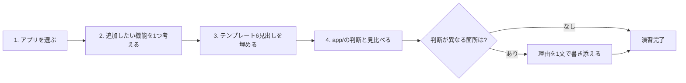

# 自分のアプリへの適用演習

## この教材で身につくこと

- 01〜06で学んだ設計判断を、自分のアプリの新機能に適用する演習に取り組める
- 6つの観点（呼び出し方式/入出力契約/信頼性・コスト/安全性UX/複数LLM呼び出しの組み合わせ/AIプロダクトUX）を漏れなく検討できる
- `app/`の設計判断と異なる選択をする場合、その理由を説明できる

## 概要

本教材はチュートリアル全体の最終演習です。
架空の新機能を題材に、01〜06の観点でミニ設計書を書きます。
実装コードは書きません。

「なぜ実装せずミニ設計書だけを書くのか」というと、生成AI機能はいきなりコードを書き始めると、パース失敗時の挙動や確認ステップの要否といった判断を後回しにしがちだからです。
設計書を先に埋めることで、01〜06章の観点を実装前に洗い出せます。
01-case-study-mapで見た`app/`の実例は、いわば「先輩エンジニアが書いた設計書の答え合わせ」に相当します。
迷ったときは、01-case-study-mapの表に戻って似た機能の判断を参考にしてください。

## 位置づけ

本カテゴリの最終教材であり、チュートリアル全体の総仕上げです。
01-case-study-map.mdで確認した`app/`の設計判断と見比べながら進めてください。

## 主要概念・設計判断の解説

演習で使うテンプレートは次の6見出しです。
01〜06章で学んだ観点にそのまま対応しています。
埋める順序は上から下がおすすめです。
前の見出しで決めた内容が、後の見出しの判断材料になるためです（例: 出力形式が決まらないと、パース失敗時のフォールバックも決められません）。

```text
## 呼び出し方式（01章）
- 採用する方式:
- 理由:

## 入出力契約（02章）
- 出力形式（JSON等）:
- 単発/バッチ/マルチターンの別:
- 出力範囲の限定方法:

## 信頼性・コスト（03章）
- パース失敗時のフォールバック:
- タイムアウト・リトライ方針:
- キャッシュ方針:
- 並列化の要否:

## 信頼と安全性のUX（04章）
- 確認ステップの要否:
- 事実とAI考察の分離方法:
- ガードレール・免責事項・プロンプトインジェクション対策:

## 複数LLM呼び出しの組み合わせ（05章、単発呼び出しで十分な場合は「不要」でよい）
- 採用するワークフローパターン（無ければ「単発呼び出しで十分」）:
- 理由:

## AIプロダクトUX（06章、UIを持たないバックエンド機能は「対象外」でよい）
- 初回入力の空白キャンバス対策（テンプレート・提案等）の要否:
- ユーザーがAIに指示するアクション（開いた入力・対話継続等）:
- AIの存在をUI上で識別可能にする表現の要否:
```

### 各見出しの記入ポイント

- **呼び出し方式（01章）**: つまずきやすい点は、API直叩き/SDK/CLIサブプロセスの3方式を比較せず、なんとなく1つを選んでしまうことです。
  迷ったら[01-02](../01-invocation-and-architecture/02-api-sdk-vs-cli-subprocess.md)の比較表に戻ってください。
- **入出力契約（02章）**: 「出力形式」は自由文かJSON構造化出力かを先に決めます。
  JSON構造化出力を選ぶ場合、02-01章のコードフェンス除去〜パースの流れを前提にしてください。
- **信頼性・コスト（03章）**: 「パース失敗時のフォールバック」は「エラーを表示して止める」のか「安全な既定値で処理を続ける」のか、機能ごとに変わります。
  01-case-study-mapの表の「フォールバック」列を参考にすると具体像がつかみやすくなります。
- **信頼と安全性のUX（04章）**: 「確認ステップの要否」は、AIの誤りがそのまま実データに反映されるかどうかで判断します（01-case-study-mapの「確認ステップが2箇所ある理由」の節を参照）。
- **複数LLM呼び出しの組み合わせ（05章）**: 単発呼び出しで足りるなら無理にワークフローパターンを選ばないでください。
  「単発呼び出しで十分」と書くこと自体が、05章で学ぶ判断の実践です。
- **AIプロダクトUX（06章）**: バックエンドのみの機能（他システムから呼ばれるAPI等）であれば「対象外」と明記して構いません。

## 実ソースコード（Python / プロンプト例、出典パス明記）

本教材は演習のため実ソースコードの引用はありません。
代わりに「演習の進め方」を示します。
各ステップは独立して完了できる単位に分けています。
前のステップが終わってから次に進んでください。

1. 自分が普段使う（または今後作りたい）アプリを1つ選ぶ（つまずきやすい点: 完成度は問いません。
   頭の中の構想段階でも構いません）
2. そのアプリに追加したい生成AI機能を1つ考える（つまずきやすい点: 複数思いついても1つに絞ってください。
   迷ったら`app/`のAI投資質問箱のような「自由記述の質問に答える」機能をイメージすると考えやすくなります）
3. 上記テンプレートの6見出しの空欄をすべて埋める（つまずきやすい点: 「AIプロダクトUX（06章）」で対象外の項目があれば「対象外」と書けば十分です。
   無回答のまま空欄にしないこと自体が重要です）
4. `01-case-study-map.md`のマッピング表と見比べ、`app/`の設計判断と異なる選択をした箇所があれば、その理由を1文で書き添える（つまずきやすい点: 「違いがない」のであれば「app/と同じ判断」と書くだけで構いません。
   無理に違いを作る必要はありません）

以下は、上記4ステップの流れです。
ステップ3が全体の中心であり、ステップ4は「答え合わせ」の位置づけであることを示しています。



## 演習課題

1. 埋めたテンプレートをもとに、プロンプトを組み立てる関数のシグネチャ（関数名・引数名・戻り値の型）だけを設計してください（実装は不要です）。
   例えば`app/`の`build_screening_prompt`は`def build_screening_prompt(condition_text: str, sectors: list[str] | None = None) -> str`（出典: `ai-stock-investing-tutorial/app/prompt_patterns/screening.py`）というシグネチャです。
   入力（何を渡すか）と出力（`str`でプロンプト文字列を返すか、`dict`で構造化した中間データを返すか）を明確にすることが目的で、実際の実装は書かなくて構いません。

## 理解度チェック

- [ ] 6つの観点（呼び出し方式/入出力契約/信頼性・コスト/安全性UX/複数LLM呼び出しの組み合わせ/AIプロダクトUX）を漏れなく検討できる
- [ ] `app/`の設計判断と異なる選択をした場合、その理由を説明できる
- [ ] チュートリアル全体で学んだ原則を新しい文脈に応用できる
- [ ] テンプレートの空欄を、対象外の項目も含めてすべて埋められる

---

投資判断に関わる内容です。
必ず[ai-stock-investing-tutorialの免責事項](https://github.com/duwenji/ai-stock-investing-tutorial/blob/master/DISCLAIMER.md)をご確認ください。

[← 前へ: 既存アプリの統合パターン横断マッピング](01-case-study-map.md) | [次へ: 運用移行前チェックリスト →](03-operations-checklist.md)
