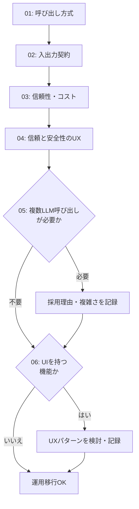

# 運用移行前チェックリスト

## この教材で身につくこと

- 01〜06章の設計判断を、本番投入前に一枚のチェックリストで一括点検できる
- チェックリストの各項目が、どの章のどの原則に対応するか説明できる
- 自分のアプリのチェック結果から、未対応の項目を洗い出せる

## 概要

本教材は、01〜06章で学んだ設計判断を、生成AI機能を本番運用に移す直前に一括点検するためのチェックリストです。
**新しい設計原則は登場しません。**
項目ごとに対応する章の教材へリンクします。

「運用移行」とは、開発中のコードを実際のユーザーが使える状態（本番環境）に公開することです。
生成AI機能は、通常のコードと違い「入力によって出力が変わる」「まれに壊れた形式で応答する」といった不確実性を持ちます。
そのため、公開直前に01〜06章の判断が漏れなく反映されているかをチェックリストで確認する価値が特に高くなります。
未対応のままだと、公開後に想定外のエラーやコスト超過が起きてから気づく、という事態になりがちです。

各章のチェックを怠ると何が起きやすいか、先に一覧で把握しておくと、以降のチェック項目の優先度をつけやすくなります。

| 章 | チェックしないと起きやすい問題 | 対象範囲 |
|---|---|---|
| 01. 呼び出し方式 | 認証情報の流出、実行環境依存の呼び出し失敗 | 全機能共通 |
| 02. 入出力契約 | パースエラーによる機能停止、想定外フィールドの混入 | 全機能共通 |
| 03. 信頼性・コスト | コスト超過、タイムアウトによるUIの応答停止 | 全機能共通 |
| 04. 信頼と安全性のUX | 誤った判断がそのまま反映される、投資助言と誤解される表示 | リスクが高い機能 |
| 05. 複数LLM呼び出し | 不要な複雑さの追加（オーバーエンジニアリング） | 複数LLM呼び出しを組み合わせる機能 |
| 06. AIプロダクトUX | ユーザーが機能に気づけない、AIの発言と誤認する | UIを持つ機能 |

## 位置づけ

本カテゴリの3番目（最終）の教材です。
01-case-study-mapで`app/`の実例を確認し、02-exerciseで自分のアプリに設計判断を適用したあと、本教材で運用投入前の最終確認を行う位置づけです。

## 主要概念・設計判断の解説

チェック項目は01〜06章の順に並べています。
05章は単発呼び出しで用途が足りる場合、06章はUI/UXが対象範囲外（バックエンドのみの機能等）の場合、それぞれ対象外として構いません。
「対象外」と判断すること自体も、検討した結果として記録に残す価値があります。
未検討のまま放置するのとは異なります。

各チェック項目には、実務でつまずきやすい点を1行の「つまずきやすい点」として添えています。
チェックボックスにしるしを付けるだけでなく、その項目がなぜ必要かを理解した上でチェックしてください。

### 01章: 呼び出し方式とアーキテクチャ

- [ ] 呼び出し方式（API直叩き/SDK/CLIサブプロセス）を選定し理由を記録した
      （[02-api-sdk-vs-cli-subprocess.md](../01-invocation-and-architecture/02-api-sdk-vs-cli-subprocess.md)）
      - つまずきやすい点: 選定理由をコードコメントや設定ファイルに残さないと、後任者が「なぜこの方式か」を追跡できなくなります。
- [ ] システムプロンプトで出力範囲を制御している
      （[03-system-prompt-and-io-boundary.md](../01-invocation-and-architecture/03-system-prompt-and-io-boundary.md)）
      - つまずきやすい点: 「何を出力するか」だけでなく「何を出力しないか」も明示すると、余計な情報の混入を防げます。
- [ ] APIキー・認証情報が環境変数等で管理され、リポジトリに含まれていない（同上）
      - つまずきやすい点: `.gitignore`に設定ファイルが含まれているかだけでなく、`git log`で過去のコミット履歴にも残っていないかを確認してください。
        一度コミットした秘密情報は履歴に残り続けます。

### 02章: 入出力契約

- [ ] JSON構造化出力の契約とパース処理を実装した
      （[01-structured-output-json-contract.md](../02-io-contract-design/01-structured-output-json-contract.md)）
      - つまずきやすい点: LLMの応答はコードフェンス（`json`ブロック）付きで返ることが多く、除去せずに`json.loads`すると失敗します。
- [ ] 呼び出し単位（単発/バッチ/マルチターン）を明確にした
      （[02-single-vs-batch-prompting.md](../02-io-contract-design/02-single-vs-batch-prompting.md)）
      - つまずきやすい点: 「バッチのつもり」が実装時に1件ずつの単発呼び出しになっていないか確認してください。
        コスト急増の典型例です。
- [ ] 出力範囲（フィールド・値域）をプロンプトで限定した
      （[03-prompt-scope-and-constraints.md](../02-io-contract-design/03-prompt-scope-and-constraints.md)）
      - つまずきやすい点: プロンプトでの指示だけに頼らず、受信後にも列挙値をホワイトリストで検証してください（二重の防御）。

### 03章: 信頼性・コスト

- [ ] パース失敗時の機能ごとの安全な既定値（フォールバック）を用意した
      （[01-defensive-parsing-and-fallback.md](../03-reliability-and-cost/01-defensive-parsing-and-fallback.md)）
      - つまずきやすい点: フォールバックは「空」ではなく、機能ごとに意味のある値にしてください（例: 空文字ではなくエラーメッセージ）。
- [ ] タイムアウト・リトライ（指数バックオフ）を設定した
      （[02-rate-limit-and-timeout.md](../03-reliability-and-cost/02-rate-limit-and-timeout.md)）
      - つまずきやすい点: リトライ回数×待機時間の合計が、UI側のタイムアウトを超えないか確認してください。
- [ ] キャッシュ層を設計し、再計算コストを抑えた
      （[03-caching-strategy.md](../03-reliability-and-cost/03-caching-strategy.md)）
      - つまずきやすい点: キャッシュキーにユーザーIDや日付を含めないと、他ユーザーの結果が混ざる事故につながります。
- [ ] バッチ処理での部分失敗時の挙動を決めた
      （[04-batching-and-parallelization.md](../03-reliability-and-cost/04-batching-and-parallelization.md)）
      - つまずきやすい点: 1件の失敗で全体を止めるか、失敗分だけスキップして続行するかを、実装前に決めておいてください。
- [ ] LLM呼び出しをモック化したテストがある
      （[05-testing-llm-integrations.md](../03-reliability-and-cost/05-testing-llm-integrations.md)）
      - つまずきやすい点: モックは成功パターンだけでなく、パース失敗やタイムアウトなどの異常系パターンも用意してください。

### 04章: 信頼と安全性のUX

- [ ] リスクが高い判断には確認ステップ（Verification）を設けた
      （[01-verification-checkpoint.md](../04-trust-and-safety-ux/01-verification-checkpoint.md)）
      - つまずきやすい点: 「リスクが高い」の基準に迷ったら、01章の表で見た「誤りが実データにそのまま反映されるか」で判断します。
- [ ] 事実（プログラム計算）とAI考察を分離して表示している
      （[02-fact-and-opinion-separation.md](../04-trust-and-safety-ux/02-fact-and-opinion-separation.md)）
      - つまずきやすい点: 見た目の分離だけでなく、事実側にAIの推測が混入していないか、プロンプト構築コードも確認してください。
- [ ] 禁止事項・免責事項をガードレールとして実装した
      （[03-guardrails-and-disclaimers.md](../04-trust-and-safety-ux/03-guardrails-and-disclaimers.md)）
      - つまずきやすい点: 免責事項はAI生成テキストの近くに毎回表示してください。
        ページ下部に1回だけでは見落とされがちです。
- [ ] 列挙値制約・ホワイトリスト化でプロンプトインジェクション対策をした
      （[04-prompt-injection-defense.md](../04-trust-and-safety-ux/04-prompt-injection-defense.md)）
      - つまずきやすい点: ユーザー入力をそのままプロンプトに埋め込む箇所をすべて洗い出し、列挙値以外は検証・エスケープしてください。

### 05章: 複数LLM呼び出しの組み合わせ（単発呼び出しで足りる場合は対象外）

- [ ] 単発呼び出しで十分か、ワークフロー/エージェントパターンが必要か判断した
      （[00-README.md](../05-agentic-workflow-patterns/00-README.md)）
      - つまずきやすい点: まず単純な単発呼び出しで動かし、複雑さが必要になった時だけパターンを追加します（Anthropicの推奨方針）。
- [ ] ワークフローパターンを採用した場合、採用理由と複雑さに見合う効果を記録した
      - つまずきやすい点: 「なんとなく良さそうだから」ではなく、精度向上やコスト削減など、具体的な効果を記録してください。

### 06章: AIプロダクトUXパターン（UIを持つ機能の場合）

- [ ] 初回プロンプト体験の空白キャンバス対策（テンプレート・提案等）を用意した
      （[01-onboarding-and-wayfinding.md](../06-ai-product-ux-patterns/01-onboarding-and-wayfinding.md)）
      - つまずきやすい点: 実際に初回操作を自分で試し、何も入力せずに迷わないか確認してください。
- [ ] ユーザーがAIに指示するアクション（開いた入力・対話継続等）を設計した
      （[02-prompt-action-patterns.md](../06-ai-product-ux-patterns/02-prompt-action-patterns.md)）
      - つまずきやすい点: 1回で終わる操作か、対話を続けられる操作かでボタン配置・入力欄の見せ方が変わります。
- [ ] フィルタ・保存済みプリセット・モデル選択によるプロンプト調整UXを用意した
      （[03-tuning-and-context-control.md](../06-ai-product-ux-patterns/03-tuning-and-context-control.md)）
      - つまずきやすい点: 設定項目を増やしすぎると選択コストが上がるため、初期状態でも迷わず使える既定値を用意してください。
- [ ] AIの存在をUI上で識別可能にする表現（命名・トーン等）を検討した
      （[04-ai-identity-and-branding.md](../06-ai-product-ux-patterns/04-ai-identity-and-branding.md)）
      - つまずきやすい点: 識別表現が無くても機能は動きますが、AIの発言と自分の入力を混同しやすくなる点に注意してください。

### チェックの流れ

01〜04章は全機能に共通する必須チェックのため、上から順に一本道で進みます。
一方05章・06章は、機能の性質によっては最初から「対象外」と判断してよい分岐点であるため、下図では条件分岐（ひし形）として表しています。



1つでも未対応の項目がある場合は、対応する章の教材に戻って設計判断をやり直してください。

## 実ソースコード（Python / プロンプト例、出典パス明記）

本教材はチェックリストのため実ソースコードの引用はありません。
代わりに、PRの説明欄にそのまま貼り付けられるチェックリストを示します。

```text
## 生成AI機能 運用移行前チェックリスト

### 01. 呼び出し方式とアーキテクチャ
- [ ] 呼び出し方式を選定し理由を記録した
- [ ] システムプロンプトで出力範囲を制御している
- [ ] APIキー・認証情報がリポジトリに含まれていない

### 02. 入出力契約
- [ ] JSON構造化出力の契約とパース処理を実装した
- [ ] 呼び出し単位（単発/バッチ/マルチターン）を明確にした
- [ ] 出力範囲をプロンプトで限定した

### 03. 信頼性・コスト
- [ ] パース失敗時のフォールバックを用意した
- [ ] タイムアウト・リトライを設定した
- [ ] キャッシュ層を設計した
- [ ] バッチ処理の部分失敗時の挙動を決めた
- [ ] LLM呼び出しのテスト（モック化）がある

### 04. 信頼と安全性のUX
- [ ] リスクが高い判断に確認ステップを設けた
- [ ] 事実とAI考察を分離した
- [ ] ガードレール・免責事項を実装した
- [ ] プロンプトインジェクション対策をした

### 05. 複数LLM呼び出しの組み合わせ（該当する場合）
- [ ] 単発呼び出しで十分か判断した
- [ ] ワークフローパターン採用理由を記録した

### 06. AIプロダクトUXパターン（UIを持つ機能の場合）
- [ ] 初回プロンプト体験の空白キャンバス対策を用意した
- [ ] ユーザーがAIに指示するアクションを設計した
- [ ] プロンプト調整UX（フィルタ・プリセット等）を用意した
- [ ] AIの存在をUI上で識別可能にする表現を検討した
```

## 演習課題

1. 自分のアプリ（または02-exerciseで設計した新機能）に上記チェックリストを適用し、未対応の項目をすべて洗い出してください。
   （ヒント: 「該当なし」も明記してください。
   05章が単発呼び出しのみ、06章がUIを持たない、といった項目は「対象外」と書けば十分です。
   未回答のまま空欄にしないことが重要です）
2. 未対応項目のうち最もリスクが高いものを1つ選び、対応に必要な作業を1〜2文で書いてください。
   （ヒント: 「最もリスクが高い」の判断に迷ったら、04章の確認ステップの判断基準（誤りの不可逆性・実害の大きさ）を目安にしてください）

## 理解度チェック

- [ ] 01〜06章の設計判断が、チェックリストのどの項目に対応するか説明できる
- [ ] 自分のアプリのチェック結果から、未対応の項目を洗い出せる
- [ ] チェックリストの各項目がなぜ必要か（リスク・コスト・信頼性の観点で）説明できる
- [ ] 各章のチェックを怠った場合に起きやすい問題（認証情報流出・パースエラー・コスト超過等）を、章ごとに1つずつ挙げられる

---

投資判断に関わる内容です。
必ず[ai-stock-investing-tutorialの免責事項](https://github.com/duwenji/ai-stock-investing-tutorial/blob/master/DISCLAIMER.md)をご確認ください。

[← 前へ: 自分のアプリへの適用演習](02-exercise-apply-to-your-app.md)
