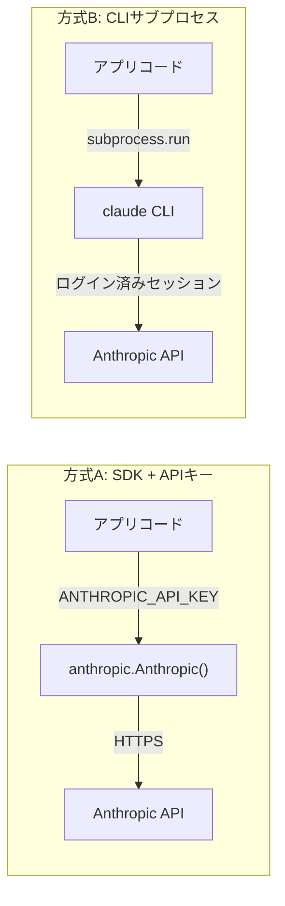
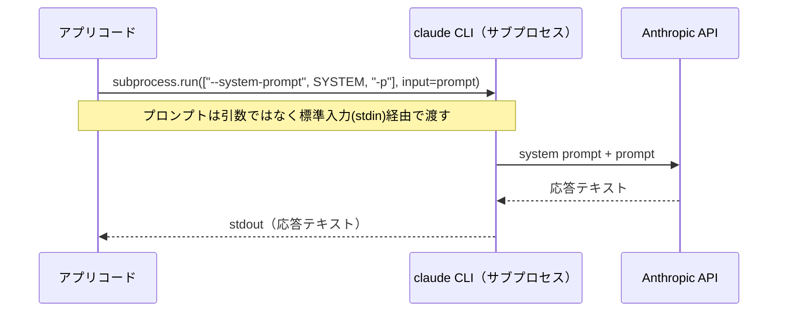
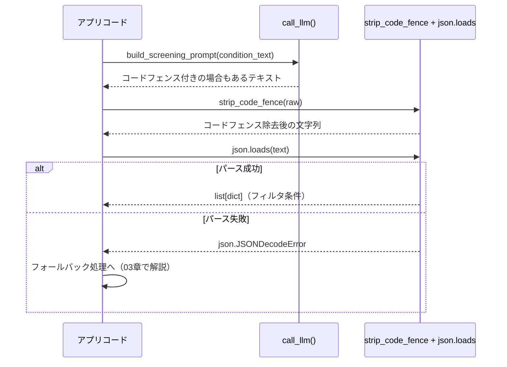
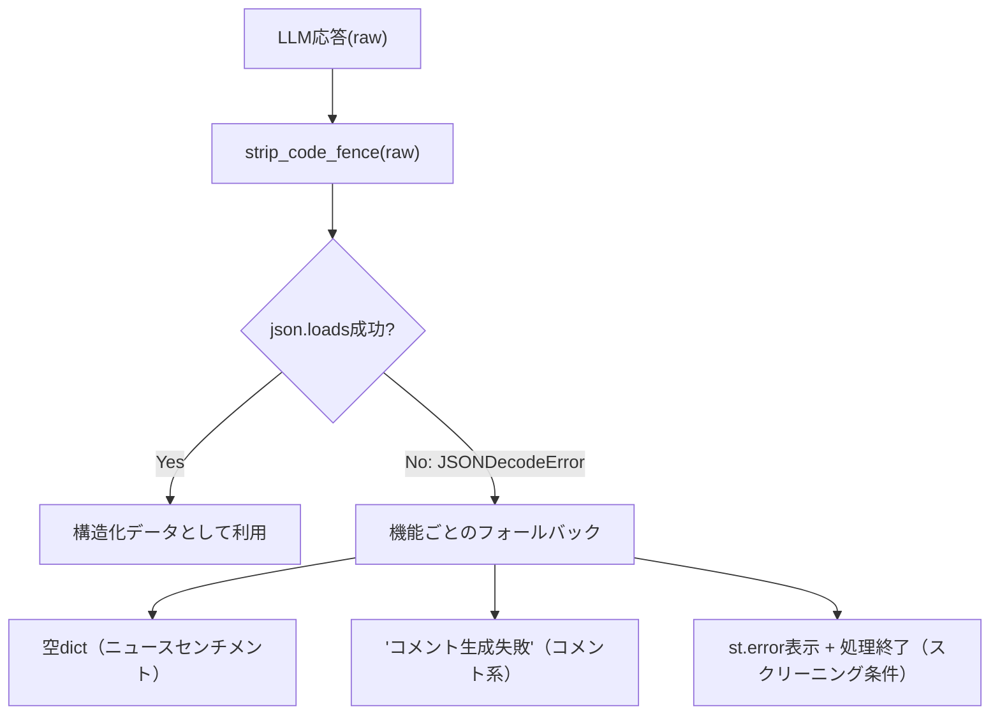
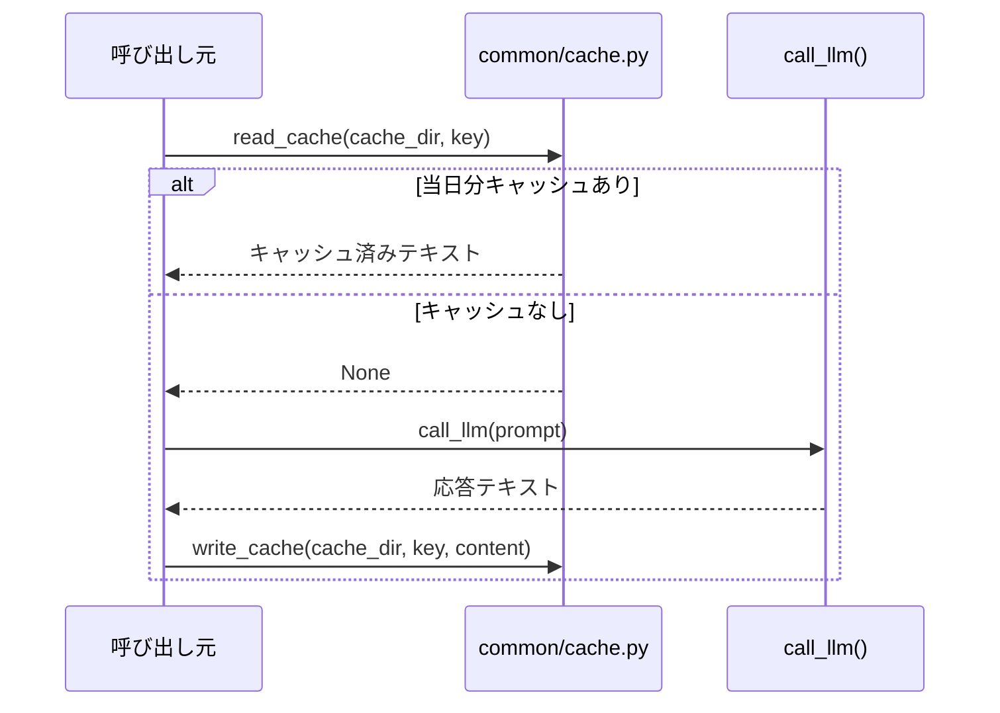
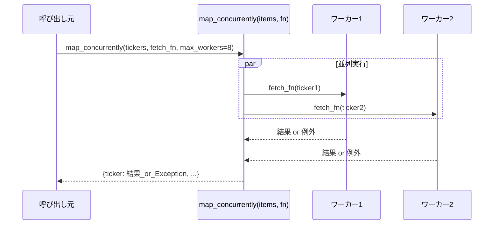
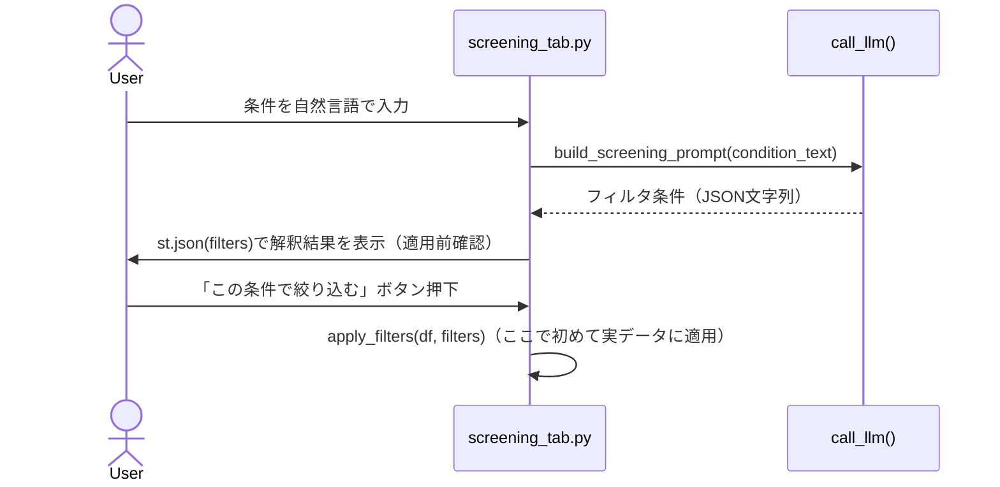
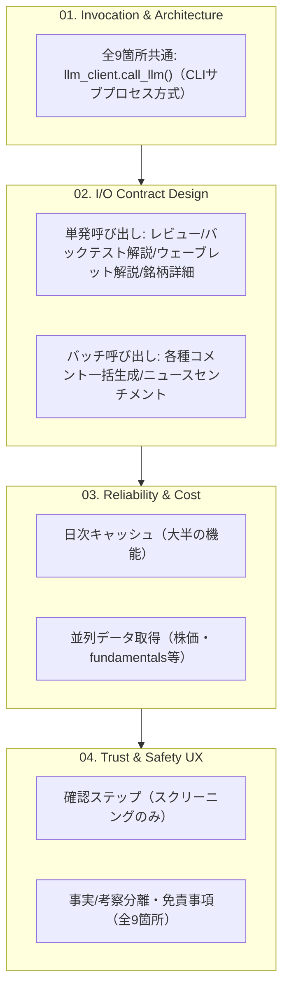

# 生成AIアプリ統合パターン教材 執筆 Implementation Plan

> **For agentic workers:** REQUIRED SUB-SKILL: Use superpowers:subagent-driven-development (recommended) or superpowers:executing-plans to implement this plan task-by-task. Steps use checkbox (`- [ ]`) syntax for tracking.

**Goal:** `genai-app-integration-tutorial` の `docs/01-*` 〜 `docs/05-*` 配下に、
設計書（`docs/superpowers/specs/2026-08-08-genai-app-integration-design.md`）で
定義した5カテゴリ・20ファイル（`00-README.md`×5 + 個別教材×15）の本文を作成する。

**Architecture:** Markdownのみの教材リポジトリ。「テスト」に相当する工程として、
リポジトリ内の全教材ファイルの構造（見出し順・Mermaidブロックの有無・
相互リンクの実在性）を検証する軽量スクリプト `tools/validate_docs.py` を
最初に作り、各カテゴリの執筆後に実行して確認する。

**Tech Stack:** Markdown、Mermaid（```mermaid コードブロック）、
検証スクリプトはPython標準ライブラリのみ（追加依存なし）。

## Global Constraints

- 個別教材ファイルは次の7見出しを**この文言・この順序**で使う（`00_STYLE_GUIDE.md` 2節）:
  `## この教材で身につくこと` / `## 概要` / `## 位置づけ` /
  `## 主要概念・設計判断の解説` / `## 実ソースコード（Python / プロンプト例、出典パス明記）` /
  `## 演習課題` / `## 理解度チェック`
- `app/` からの引用には出典パスを明記する（`00_STYLE_GUIDE.md` 1・2節、書式は
  「出典: `ai-stock-investing-tutorial/app/<path>`」を各コードブロック直前に置く）
- 図はすべてMermaid形式の ```mermaid コードブロックで記載し、画像ファイルは作らない
  （`00_STYLE_GUIDE.md` 6節）
- コードブロックには必ず言語指定を付ける（`python`, `bash`, `json`, `text`）
- 1文は60文字程度を目安に短く保つ
- 各ファイル末尾に前後リンク（`[← 前へ: ...](...)` / `[次へ: ... →](...)`）を置く
- `docs/05-real-world-case-study/` 配下のファイル末尾には、
  `https://github.com/duwenji/ai-stock-investing-tutorial/blob/master/DISCLAIMER.md`
  へのリンクと「投資判断に関わる内容です。」の一文を置く（01〜04には不要）。
  リポジトリをまたぐリンクは、相対パスではなくGitHub URLを使う
  （このリポジトリ単体でクローン・閲覧されてもリンク切れにならないようにするため）
- ai-stock-investing-tutorialの実ソースは
  `c:/Dev/tutorials/ai-stock-investing-tutorial/app/` 以下にある。本プランの
  コード引用はすべてこの時点の実ファイルから書き起こし済みなので、
  執筆時に該当ファイルを開いて一言一句を再確認してから引用すること
  （行番号がずれている場合があるため、内容の一致を優先する）

---

### Task 1: 教材構造の検証スクリプトを作る

**Files:**
- Create: `tools/validate_docs.py`
- Test: 同スクリプトを直接実行して確認する（pytestは使わない。理由: 対象がMarkdown
  ファイル群であり、Pythonのユニットテスト対象となるロジックがほぼ無いため）

**Interfaces:**
- Produces: コマンド `python tools/validate_docs.py [--category N]` として、
  以降のTask 2〜7から呼び出される。`N` は `01`〜`05` の2桁文字列。
  引数無しで全カテゴリを検証する。終了コード0=問題なし、1=問題あり
  （標準出力に問題一覧を表示）。

- [ ] **Step 1: スクリプトを作成する**

`tools/validate_docs.py`:

```python
"""genai-app-integration-tutorialの教材ファイル構造を検証するスクリプト。

チェック内容:
1. 個別教材ファイル(00-README.md以外)が7つの必須見出しをこの順序で含むか
2. 図解計画に記載のファイルがMermaidコードブロック(```mermaid)を含むか
3. (--category未指定の全体実行時のみ) docs/配下および ルート/MASTER-INDEX.md
   等のMarkdownファイル内の相対リンクが実在するファイルを指しているか
   （カテゴリ執筆順に前後カテゴリへのリンクを書くため、全カテゴリが揃うまでは
   意図的にリンク切れが残る。そのため--category指定時はリンク検証を行わない）

依存: 標準ライブラリのみ。
"""

from __future__ import annotations

import re
import sys
from pathlib import Path

REPO_ROOT = Path(__file__).resolve().parent.parent
DOCS_ROOT = REPO_ROOT / "docs"

REQUIRED_HEADINGS = [
    "## この教材で身につくこと",
    "## 概要",
    "## 位置づけ",
    "## 主要概念・設計判断の解説",
    "## 実ソースコード（Python / プロンプト例、出典パス明記）",
    "## 演習課題",
    "## 理解度チェック",
]

# 6.1節「図解計画」に対応するMermaid必須ファイル(カテゴリディレクトリ名, ファイル名)
MERMAID_REQUIRED = {
    ("01-invocation-and-architecture", "02-api-sdk-vs-cli-subprocess.md"),
    ("01-invocation-and-architecture", "03-system-prompt-and-io-boundary.md"),
    ("02-io-contract-design", "01-structured-output-json-contract.md"),
    ("03-reliability-and-cost", "01-defensive-parsing-and-fallback.md"),
    ("03-reliability-and-cost", "02-caching-strategy.md"),
    ("03-reliability-and-cost", "03-batching-and-parallelization.md"),
    ("04-trust-and-safety-ux", "01-verification-checkpoint.md"),
    ("05-real-world-case-study", "01-case-study-map.md"),
}

MD_LINK_RE = re.compile(r"\[[^\]]*\]\(([^)]+)\)")


def _category_dirs(only: str | None) -> list[Path]:
    dirs = sorted(p for p in DOCS_ROOT.glob("0*-*") if p.is_dir())
    if only:
        dirs = [d for d in dirs if d.name.startswith(only)]
    return dirs


def check_headings(path: Path) -> list[str]:
    problems = []
    text = path.read_text(encoding="utf-8")
    positions = []
    for heading in REQUIRED_HEADINGS:
        idx = text.find(heading)
        if idx == -1:
            problems.append(f"{path}: 見出し欠落 -> {heading}")
        positions.append(idx)
    present = [p for p in positions if p != -1]
    if present != sorted(present):
        problems.append(f"{path}: 見出しの順序が規定と一致しません")
    return problems


def check_mermaid(path: Path, category_dir: Path) -> list[str]:
    key = (category_dir.name, path.name)
    if key not in MERMAID_REQUIRED:
        return []
    text = path.read_text(encoding="utf-8")
    if "```mermaid" not in text:
        return [f"{path}: 図解計画対象だが```mermaidブロックが見つかりません"]
    return []


def check_links(path: Path) -> list[str]:
    problems = []
    text = path.read_text(encoding="utf-8")
    for match in MD_LINK_RE.finditer(text):
        target = match.group(1)
        if target.startswith(("http://", "https://", "#")):
            continue
        target_path = (path.parent / target).resolve()
        if not target_path.exists():
            problems.append(f"{path}: リンク切れ -> {target}")
    return problems


def main() -> int:
    only = None
    if len(sys.argv) > 1 and sys.argv[1] == "--category":
        only = sys.argv[2]

    all_problems: list[str] = []
    for category_dir in _category_dirs(only):
        for md_file in sorted(category_dir.glob("*.md")):
            if only is None:
                # カテゴリを跨ぐ前後リンクは、他カテゴリが未執筆の間は必ず
                # リンク切れになるため、リンク検証は全体実行(only=None)時のみ行う。
                all_problems.extend(check_links(md_file))
            if md_file.name == "00-README.md":
                continue
            all_problems.extend(check_headings(md_file))
            all_problems.extend(check_mermaid(md_file, category_dir))

    if only is None:
        # ルート・docs/00-COVER.mdのリンク切れも全体実行時のみ合わせて確認する
        for md_file in [REPO_ROOT / "README.md", REPO_ROOT / "MASTER-INDEX.md", DOCS_ROOT / "00-COVER.md"]:
            if md_file.exists():
                all_problems.extend(check_links(md_file))

    if all_problems:
        print(f"{len(all_problems)}件の問題:")
        for problem in all_problems:
            print(f"  - {problem}")
        return 1

    print("OK: 問題は見つかりませんでした")
    return 0


if __name__ == "__main__":
    raise SystemExit(main())
```

- [ ] **Step 2: 現状（教材未作成）で全体実行し、既知のリンク切れが検出されることを確認する**

Run: `cd genai-app-integration-tutorial && python tools/validate_docs.py`
Expected: 終了コード1で、`README.md`・`MASTER-INDEX.md`が参照している
`docs/01-invocation-and-architecture/00-README.md` 等5カテゴリ分の
`00-README.md`へのリンクが「リンク切れ」として列挙される
（この時点ではカテゴリ本文が存在しないため正しい挙動。Task 2〜6で
カテゴリを執筆するたびに件数が減り、Task 7で0件になることを確認する）

- [ ] **Step 3: コミット**

```bash
git add tools/validate_docs.py
git commit -m "add doc structure validation script"
```

---

### Task 2: カテゴリ01「Invocation & Architecture」を執筆する

**Files:**
- Create: `docs/01-invocation-and-architecture/00-README.md`
- Create: `docs/01-invocation-and-architecture/01-augmented-llm-building-block.md`
- Create: `docs/01-invocation-and-architecture/02-api-sdk-vs-cli-subprocess.md`
- Create: `docs/01-invocation-and-architecture/03-system-prompt-and-io-boundary.md`

**Interfaces:**
- Consumes: Task 1の`tools/validate_docs.py`
- Produces: `docs/02-io-contract-design/00-README.md`（Task 3）からの「前へ」リンク先

- [ ] **Step 1: `00-README.md` を書く**

内容要件:
- カテゴリの目的: 「LLM呼び出しをアプリに組み込む最初の設計判断＝呼び出し方式とアーキテクチャの選定」
- 学習目標（3点）: (1) Augmented LLMという基本単位を説明できる (2) API直叩き/SDK/CLIサブプロセスの
  選定基準を説明できる (3) システムプロンプトによる出力制御・認証設計を説明できる
- 教材一覧表（ファイル名・内容の2列表、3行）
- 外部パターン対応: 「Augmented LLM」は
  [Anthropic “Building Effective Agents”](https://www.anthropic.com/research/building-effective-agents)
  の呼称であることを明記
- 末尾に `[← 前へ: 00-COVER](../00-COVER.md)` / `[次へ: 02-io-contract-design →](../02-io-contract-design/00-README.md)`

- [ ] **Step 2: `01-augmented-llm-building-block.md` を書く**

学習目標: LLM単体呼び出しを拡張する「Augmented LLM」という基本単位を理解し、
ワークフロー（predefined code paths）とエージェント（動的・自律的な判断ループ）の違いを説明できる。

主要概念・設計判断の解説に含める要点:
- Anthropicの分類（出典: [Building Effective Agents](https://www.anthropic.com/research/building-effective-agents)）:
  「Augmented LLM」= 検索・ツール・メモリなどで拡張したLLM呼び出しの基本単位
- ワークフロー（Prompt Chaining / Routing / Parallelization / Orchestrator-Workers /
  Evaluator-Optimizer）は**あらかじめ決めたコード経路**を辿る
- エージェントは実行中に**次の行動をLLM自身が決める**ループ
- 本教材群がケーススタディにする`app/`は、9箇所すべてが「1回のAugmented LLM呼び出し
  （必要な事実データをプロンプトに埋め込み、1〜数文の考察を得る）」であり、
  ワークフローの中でも最も単純な形。エージェントやOrchestrator-Workersは使っていない
- Anthropicの原則「まず単純な構成から始め、効果が実証された場合のみ複雑さを足す」を
  `app/`の設計が体現している例として言及する

実ソースコード欄:
- 出典: `ai-stock-investing-tutorial/app/data_api/llm_client.py`
- `call_llm(prompt: str, timeout: int = 120) -> str` の全文を引用し、
  「これがAugmented LLM呼び出しの最小形」と位置づける（本文中で該当ファイル冒頭の
  docstringとシステムプロンプト定義部分を必ず含める）

演習課題（2問、実装コードで示す）:
1. `call_llm` を呼び出す既存箇所を3つ`app/`から探し、それぞれ「単発呼び出し」か
   「バッチ呼び出し」かを分類させる
2. もし`app/`にOrchestrator-Workersパターン（複数の分析結果を1つの司令塔がまとめる形）
   を導入するなら、どの機能が候補になるか、理由とともに1つ挙げさせる

理解度チェック（3項目、チェックボックス形式）:
- [ ] Augmented LLMとワークフロー、エージェントの違いを説明できる
- [ ] `app/`のLLM呼び出しがすべて単純なAugmented LLM呼び出しである理由を説明できる
- [ ] 「まず単純な構成から始める」という原則を自分の言葉で説明できる

- [ ] **Step 3: `02-api-sdk-vs-cli-subprocess.md` を書く**

学習目標: API直叩き/SDK方式とCLIサブプロセス方式を比較し、
鍵管理の要否・実行環境に応じて選定できる。

主要概念・設計判断の解説に含める要点:
- 比較表（この2行を含める）:

| 項目 | SDK + APIキー方式 | CLIサブプロセス方式 |
|---|---|---|
| 認証 | `ANTHROPIC_API_KEY`などを環境変数で管理 | ログイン済みCLIセッションに委譲（アプリ側で鍵を持たない） |
| 依存 | `anthropic`/`openai`等のSDKパッケージ | `claude`コマンドがPATH上にあること |
| 向いているケース | サーバー環境、複数ユーザー、レート制御を自前で持ちたい場合 | 個人利用ツール、開発者本人のログイン済み環境で動かす場合 |
| 呼び出し方法 | `client.messages.create(...)` | `subprocess.run([...], input=prompt)` |

- 既存教材（ai-stock-investing-tutorial）の`docs/03-data-api/02-llm-api-integration.md`が
  SDK方式のみを扱っていることに触れ、本教材がその欠けている選択肢を補うと明記する
- `app/`がCLIサブプロセス方式を選んだ理由（`app/docs/app-design.md`より）:
  「個人利用向けのStreamlit Webアプリであり、ログイン済みのClaude Code CLIを使うことで
  APIキー管理をアプリの外に出している」

Mermaidダイアグラム（`flowchart LR`、このカテゴリで最初のMermaid必須ファイル）:



実ソースコード欄:
- 出典: `ai-stock-investing-tutorial/app/data_api/llm_client.py` の
  `_resolve_claude_executable` と `call_llm` 内の `subprocess.run(...)` 呼び出し部分
- 対比として、既存教材の`call_llm`（SDK版、`anthropic.Anthropic(api_key=...)`を使う版）を
  「良い例/悪い例」ではなく「方式が異なるだけでどちらも正しい」トーンで併記する
  （出典: `ai-stock-investing-tutorial/docs/03-data-api/02-llm-api-integration.md`）

演習課題（2問）:
1. `app/data_api/llm_client.py`の`call_llm`を、SDK方式（`anthropic`パッケージ使用）に
   書き換えるとしたら、どの関数・例外クラスを何に置き換えるか対応表を作らせる
2. CLIサブプロセス方式のデメリット（Windows環境での引数展開の問題等、
   `llm_client.py`のコメントに実例がある）を1つ挙げ、対策を説明させる

理解度チェック（3項目）:
- [ ] SDK方式とCLIサブプロセス方式それぞれの認証の違いを説明できる
- [ ] `app/`がCLIサブプロセス方式を選んだ理由を説明できる
- [ ] 自分のアプリではどちらが向いているか、理由とともに判断できる

- [ ] **Step 4: `03-system-prompt-and-io-boundary.md` を書く**

学習目標: システムプロンプトで出力形式を制御する設計と、
CLIサブプロセス方式特有の入出力設計（標準入力経由での受け渡し）を説明できる。

主要概念・設計判断の解説に含める要点:
- システムプロンプトの役割: 「指示外の余計な発言をしない」よう出力形式をアプリ側で
  制御しやすくする（出典: `app/data_api/llm_client.py`の`_SYSTEM_PROMPT`定義とその直前コメント）
- なぜ引数(argv)ではなく標準入力(stdin)でプロンプトを渡すか:
  Windowsで`claude`がnpmの`.cmd`シムに解決され、バッチ引数展開がダブルクォート入りの
  JSONプロンプトを壊すため（出典: `llm_client.py`の`call_llm`内コメント、`subprocess.run`呼び出し）
- CLI未検出時・非0終了時の例外設計: `ClaudeCLINotFoundError` / `ClaudeCLIError`の
  2種類を分け、呼び出し元で区別できるようにしている

Mermaidダイアグラム（`sequenceDiagram`）:



実ソースコード欄:
- 出典: `ai-stock-investing-tutorial/app/data_api/llm_client.py` 全文
  （`_SYSTEM_PROMPT`定義、`_resolve_claude_executable`、`call_llm`）
- 出典: `ai-stock-investing-tutorial/app/app.py` の起動時チェック部分
  （`check_claude_cli_available()` を `try`/`except` で囲み、失敗時に
  `st.error` + `st.stop()` する箇所）

演習課題（2問）:
1. システムプロンプトを与えない場合にどのような問題が起きうるか、
   スクリーニング条件変換の例（JSON以外の説明文が混ざる等）で説明させる
2. `check_claude_cli_available()` を起動時ではなく各機能の呼び出し直前だけで
   行う設計に変えた場合のトレードオフを考えさせる

理解度チェック（3項目）:
- [ ] システムプロンプトが出力形式の制御にどう寄与するか説明できる
- [ ] プロンプトをargvではなくstdinで渡す理由を説明できる
- [ ] `ClaudeCLINotFoundError`と`ClaudeCLIError`の使い分けを説明できる

- [ ] **Step 5: 検証スクリプトを実行する**

Run: `cd genai-app-integration-tutorial && python tools/validate_docs.py --category 01`
Expected: `OK: 問題は見つかりませんでした`（問題があれば出力される具体的な指摘に従って
本文を修正し、再実行する）

- [ ] **Step 6: MASTER-INDEXのカテゴリ01を🚧から作成済みに更新する**

`MASTER-INDEX.md`の`## 01. Invocation & Architecture 🚧`を
`## 01. Invocation & Architecture`に変更する（絵文字を外す）。

- [ ] **Step 7: コミット**

```bash
git add docs/01-invocation-and-architecture MASTER-INDEX.md
git commit -m "write category 01: invocation and architecture"
```

---

### Task 3: カテゴリ02「I/O Contract Design」を執筆する

**Files:**
- Create: `docs/02-io-contract-design/00-README.md`
- Create: `docs/02-io-contract-design/01-structured-output-json-contract.md`
- Create: `docs/02-io-contract-design/02-single-vs-batch-prompting.md`
- Create: `docs/02-io-contract-design/03-prompt-scope-and-constraints.md`

**Interfaces:**
- Consumes: Task 2の`docs/01-invocation-and-architecture/00-README.md`（前リンク先）
- Produces: `docs/03-reliability-and-cost/00-README.md`（Task 4）からの「前へ」リンク先

- [ ] **Step 1: `00-README.md` を書く**

内容要件:
- カテゴリの目的: 「LLMに何を渡し、何を返させるかという入出力契約の設計」
- 学習目標（3点）: (1) JSON構造化出力の契約を設計できる (2) 単発/バッチ呼び出しを
  使い分けられる (3) 出力範囲をプロンプトで限定できる
- 教材一覧表
- 末尾ナビゲーション: 前へ=`docs/01-invocation-and-architecture/00-README.md`、
  次へ=`docs/03-reliability-and-cost/00-README.md`

- [ ] **Step 2: `01-structured-output-json-contract.md` を書く**

学習目標: システムプロンプトとユーザープロンプトの両方でJSON出力を指示し、
コードフェンス除去からパースまでの契約を設計できる。

主要概念・設計判断の解説に含める要点:
- 「コードブロック不要・JSONのみ出力」という指示文の型（複数の実例を並べて共通パターンを示す）:
  - スクリーニング条件: `'出力形式: [{"field": "per", "operator": "<=", "value": 15}] のようなJSON配列のみを出力してください。説明文やコードブロック記法は不要です。'`
  - ニュースセンチメント: `'出力は次の形式のJSONのみとしてください（説明文・コードブロック記法は不要です）。{"<ticker>": {"sentiment": "ポジティブ|ニュートラル|ネガティブ", "confidence": 0.0〜1.0}}'`
- それでもLLMがコードフェンス付きで返すことがあるため、アプリ側で
  `strip_code_fence`により正規化してから`json.loads`する二段構え

Mermaidダイアグラム（`sequenceDiagram`）:



実ソースコード欄:
- 出典: `ai-stock-investing-tutorial/app/common/json_parsing.py` 全文
  （`strip_code_fence`、正規表現`_CODE_FENCE_RE`の意図を説明）
- 出典: `ai-stock-investing-tutorial/app/prompt_patterns/screening.py` の
  `build_screening_prompt` 関数

演習課題（2問）:
1. `strip_code_fence`が対応していない出力形式（例:
   コードフェンスの前後に説明文が付く場合）を1つ挙げ、対応する正規表現を考えさせる
2. JSON配列ではなくJSON Lines（1行1オブジェクト）で出力させたい場合、
   プロンプトの指示文をどう変えるか書かせる

理解度チェック（3項目）:
- [ ] なぜシステムプロンプトだけでなくユーザープロンプト側でも出力形式を指示するか説明できる
- [ ] `strip_code_fence`が必要な理由を説明できる
- [ ] JSON構造化出力の契約を自分の機能に設計できる

- [ ] **Step 3: `02-single-vs-batch-prompting.md` を書く**

学習目標: 単発呼び出しとバッチ呼び出しの使い分け基準を、
対象件数とコストのトレードオフから説明できる。

主要概念・設計判断の解説に含める要点:
- `app/`の原則（出典: `app/docs/app-design.md` 5.1節）:
  「複数対象に対する処理は個別呼び出しではなく必ず1回のプロンプトにまとめてバッチ処理する
  （サブプロセス起動オーバーヘッドの削減）。唯一の例外は銘柄詳細ダイアログのAIコメントで、
  こちらは性質上つねに単一銘柄分だけを都度呼び出す」
- バッチ化する理由がAPI課金ではなく「サブプロセス起動オーバーヘッド」である点を明示し、
  CLIサブプロセス方式特有の考慮点として01章と接続する
- 単発呼び出しが妥当なケースの条件（ユーザー操作のたびに対象が1件に決まる、
  結果をすぐその場に表示する必要がある）

実ソースコード欄:
- バッチの例、出典: `ai-stock-investing-tutorial/app/analysis_agents/news_research_agent.py`
  全文（`build_news_sentiment_prompt`が複数銘柄分を1つのプロンプトにまとめる部分、
  `research_news_batch`が結果を全ticker分のキーで補完する部分）
- 単発の例、出典: `ai-stock-investing-tutorial/app/prompt_patterns/stock_detail.py`の
  `build_stock_detail_prompt`（1銘柄のみを扱う）

演習課題（2問）:
1. `news_research_agent.py`の`research_news_batch`を、銘柄ごとに個別呼び出しする実装に
   書き換えた場合、呼び出し回数がどう変わるか、保有銘柄5件のケースで試算させる
2. 「バッチ化すべきだが現状は単発呼び出しになっている」機能が`app/`にあるか調べさせ、
   無ければ「無い」という結論とその理由を書かせる

理解度チェック（3項目）:
- [ ] `app/`がバッチ化する理由を「APIコスト」ではなく正しい言葉で説明できる
- [ ] バッチ呼び出しで一部の対象だけ結果が欠けた場合の対処法を説明できる
- [ ] 単発呼び出しが妥当なケースの条件を説明できる

- [ ] **Step 4: `03-prompt-scope-and-constraints.md` を書く**

学習目標: 出力可能なフィールド・値域をプロンプトで限定し、
不正な出力によるダウンストリームのバグを防ぐ設計を実装できる。

主要概念・設計判断の解説に含める要点:
- `build_screening_prompt`が使用可能なfieldを`per`/`pbr`/`dividend_yield_pct`/`sector`の
  4つに限定している設計（出典: `app/prompt_patterns/screening.py`）
- `sector`のoperatorを`==`のみに限定し、valueを実在する業種名（`SECTOR_MAP`の値）から
  選ばせることで表記ゆれを吸収している点
- 限定されたfield/operatorであっても、アプリ側の`apply_filters`が
  ホワイトリスト外の値を無視する二重の防御になっている点（03章の防御的パースと接続）

実ソースコード欄:
- 出典: `ai-stock-investing-tutorial/app/prompt_patterns/screening.py` の
  `build_screening_prompt`（sector_line組み立て部分を含む全文）と`_OPERATORS`辞書

良い例/悪い例:
- 悪い例: `eval(f"df['{field}'] {operator} {value}")`のように文字列演算子を直接評価する
  （インジェクションのリスク、`_OPERATORS`辞書のホワイトリスト方式と対比）
- 良い例: `_OPERATORS = {"<=": operator.le, ...}`によるホワイトリスト化

演習課題（2問）:
1. 新しいfield（例: `market_cap`）をスクリーニング条件に追加する場合、
   `build_screening_prompt`と`_OPERATORS`のどちらを、どう変更する必要があるか書かせる
2. `eval`を使った悪い例が実際に踏まれるとどんな入力で問題が起きるか、
   具体的な`condition_text`の例を1つ考えさせる

理解度チェック（3項目）:
- [ ] プロンプトでfieldを限定する目的を説明できる
- [ ] ホワイトリスト方式のoperatorマッピングがなぜ`eval`より安全か説明できる
- [ ] 自分の機能でLLMに渡す出力範囲をどう限定するか設計できる

- [ ] **Step 5: 検証スクリプトを実行する**

Run: `cd genai-app-integration-tutorial && python tools/validate_docs.py --category 02`
Expected: `OK: 問題は見つかりませんでした`

- [ ] **Step 6: MASTER-INDEXのカテゴリ02を更新し、コミットする**

`MASTER-INDEX.md`の`## 02. I/O Contract Design 🚧`から絵文字を外す。

```bash
git add docs/02-io-contract-design MASTER-INDEX.md
git commit -m "write category 02: io contract design"
```

---

### Task 4: カテゴリ03「Reliability & Cost」を執筆する

**Files:**
- Create: `docs/03-reliability-and-cost/00-README.md`
- Create: `docs/03-reliability-and-cost/01-defensive-parsing-and-fallback.md`
- Create: `docs/03-reliability-and-cost/02-caching-strategy.md`
- Create: `docs/03-reliability-and-cost/03-batching-and-parallelization.md`
- Create: `docs/03-reliability-and-cost/04-testing-llm-integrations.md`

**Interfaces:**
- Consumes: Task 3の`docs/02-io-contract-design/00-README.md`（前リンク先）
- Produces: `docs/04-trust-and-safety-ux/00-README.md`（Task 5）からの「前へ」リンク先

- [ ] **Step 1: `00-README.md` を書く**

内容要件:
- カテゴリの目的: 「LLM呼び出しが失敗・重複・遅延しても、アプリ全体を止めない設計」
- 学習目標（4点）: (1) 防御的パース＋フォールバックを実装できる (2) キャッシュ層を
  設計できる (3) バッチ化・並列化でコストを最適化できる (4) LLM呼び出しをモック化して
  テストできる
- 教材一覧表（4行）
- 外部パターン対応: 並列化はAnthropicの「Parallelization」パターンに対応することを明記
- 末尾ナビゲーション: 前へ=`docs/02-io-contract-design/00-README.md`、
  次へ=`docs/04-trust-and-safety-ux/00-README.md`

- [ ] **Step 2: `01-defensive-parsing-and-fallback.md` を書く**

学習目標: パース失敗時に機能ごとの安全な既定値へフォールバックする設計を実装できる。

主要概念・設計判断の解説に含める要点:
- 「機能ごとに異なるフォールバック」を一覧化する（3種類を必ず含める）:
  - スクリーニング条件変換: パース失敗 → `st.error`表示 + 処理終了（実データに一切触れない）
  - 各種コメント一括生成: パース失敗 → 全対象に「コメント生成失敗」文字列
  - ニュースセンチメント判定: パース失敗 → 空dict → 各銘柄`sentiment: None`扱い
- なぜフォールバックが機能ごとに違うか: 「条件変換」は誤った条件で絞り込むと実害が
  大きいため処理を止める一方、「コメント」は表示上の付加情報のため他の処理を止めない

Mermaidダイアグラム（`flowchart TD`）:



実ソースコード欄:
- 出典: `ai-stock-investing-tutorial/app/prompt_patterns/screening.py` の
  `generate_screening_comments`（`try/except json.JSONDecodeError`部分）
- 出典: `ai-stock-investing-tutorial/app/analysis_agents/news_research_agent.py` の
  `research_news_batch`（`result.get(ticker, {"sentiment": None, ...})`による補完部分）

演習課題（2問）:
1. 「一括バックテストのランキングコメント」（`app/prompt_patterns/backtest_explanation.py`
   の`generate_ranking_comments`）のフォールバック実装を調べ、上記3種類の
   どのパターンに近いか分類させる
2. 新機能で「パース失敗時に前回キャッシュ値を使う」という4つ目のフォールバック方針を
   採用するなら、どんな実装になるか擬似コードで書かせる

理解度チェック（3項目）:
- [ ] 3種類のフォールバック方針とその使い分け基準を説明できる
- [ ] スクリーニング条件変換だけ処理を止める理由を説明できる
- [ ] 自分の機能に適したフォールバック方針を選べる

- [ ] **Step 3: `02-caching-strategy.md` を書く**

学習目標: 日次ファイルキャッシュを設計し、同一入力への再計算コストを削減できる。

主要概念・設計判断の解説に含める要点:
- キャッシュキーの構成: 「当日日付＋呼び出し元指定のキー文字列」（例:
  `data/cache/YYYY-MM-DD-<key>.txt`）で、日付が変わると自動的にミスになる単純設計
- なぜTTLではなく日付ベースか: 実装・運用がシンプルになる（cron等の掃除処理が不要、
  ファイル名を見れば有効期限が分かる）
- 「キャッシュを無視して再生成する」チェックボックスの存在（ユーザーが明示的に
  再計算をトリガーできる設計）

Mermaidダイアグラム（`sequenceDiagram`）:



実ソースコード欄:
- 出典: `ai-stock-investing-tutorial/app/common/cache.py` 全文
  （`get_cache_path`、`read_cache`、`write_cache`）

良い例/悪い例:
- 悪い例: キャッシュキーに現在時刻（秒単位）を含めてしまい、実質キャッシュが
  一度もヒットしない
- 良い例: キャッシュキーに「当日日付＋内容のハッシュ」を使い、同一入力・同一日なら
  確実にヒットする

演習課題（2問）:
1. `read_cache`が返す値が「旧バージョン形式」で`json.loads`が失敗する場合の
   フォールバック（キャッシュ無視して再生成）を、`app/app_tabs/portfolio_tab.py`の
   該当箇所（`app/docs/app-design.md` 4.1節）を参考に説明させる
2. 日次キャッシュではなく「1時間TTLキャッシュ」に変更する場合、
   `get_cache_path`をどう書き換えるか実装させる

理解度チェック（3項目）:
- [ ] 日次ファイルキャッシュのキー構成を説明できる
- [ ] TTLベースではなく日付ベースを選ぶ利点を説明できる
- [ ] 「キャッシュを無視して再生成する」オプションが必要な理由を説明できる

- [ ] **Step 4: `03-batching-and-parallelization.md` を書く**

学習目標: 複数対象のデータ取得・処理を並列化し、個別の失敗が全体を止めない設計を実装できる。

主要概念・設計判断の解説に含める要点:
- Anthropicの「Parallelization」パターン（出典:
  [Building Effective Agents](https://www.anthropic.com/research/building-effective-agents)）
  との対応: 複数の独立したサブタスクを同時実行する「sectioning」に相当
- `map_concurrently`の設計: 例外を個別要素の結果として捕捉し、1件の失敗が
  全体の処理を止めない（`isinstance(result, Exception)`で呼び出し元が判定）
- `ThreadPoolExecutor`使用時のStreamlit特有の注意点（`ScriptRunContext`の伝播）

Mermaidダイアグラム（`sequenceDiagram`）:



実ソースコード欄:
- 出典: `ai-stock-investing-tutorial/app/common/concurrency.py` 全文
  （`map_concurrently`、`ScriptRunContext`伝播のコメント部分を含む）

演習課題（2問）:
1. `map_concurrently`の`max_workers`を8から1に変えた場合の挙動の変化
   （並列度が失われるだけで結果の形は変わらないこと）を説明させる
2. `map_concurrently`をLLM呼び出し（`call_llm`）に対して使う場合、
   02章のバッチ化と比べてどちらが適切か、CLIサブプロセス起動コストの観点で判断させる

理解度チェック（3項目）:
- [ ] `map_concurrently`がAnthropicのどのワークフローパターンに対応するか説明できる
- [ ] 1件の失敗が全体を止めない設計をどう実現しているか説明できる
- [ ] データ取得の並列化とLLM呼び出しのバッチ化を使い分けられる

- [ ] **Step 5: `04-testing-llm-integrations.md` を書く**

学習目標: 非決定的なLLM呼び出しをモック化し、外部通信・CLI起動なしにテストできる。

主要概念・設計判断の解説に含める要点:
- `monkeypatch.setattr("shutil.which", ...)` と
  `monkeypatch.setattr(subprocess, "run", fake_run)` の2点だけで
  `call_llm`全体をモック化できる設計（サブプロセス呼び出しの境界が明確なため）
- 正常系・異常系（CLI未検出、非0終了）をそれぞれテストする方針
- ログ出力の検証（`caplog`）もテスト対象に含めている点（リクエスト内容は成功時のみ
  ログに出し、失敗時のレスポンスはログに出さない設計の意図）

実ソースコード欄:
- 出典: `ai-stock-investing-tutorial/app/tests/test_llm_client.py` から
  `test_call_llm_returns_stdout_on_success`と`test_call_llm_raises_on_nonzero_exit`の
  2つのテスト関数を引用

演習課題（2問）:
1. `research_news_batch`（`news_research_agent.py`）に対するテストを、
   `call_llm`をモック関数として注入する形で1つ書かせる
   （`call_llm=default_call_llm`という引数のデフォルト値パターンを使う）
2. `call_llm`がタイムアウトした場合（`subprocess.TimeoutExpired`）のテストケースを
   追加するなら、どうモックするか設計させる

理解度チェック（3項目）:
- [ ] `call_llm`をモック化する際にどの2箇所を差し替えればよいか説明できる
- [ ] 正常系・異常系の両方をテストする理由を説明できる
- [ ] `call_llm=default_call_llm`という引数デフォルトパターンがテストしやすさに
      どう寄与するか説明できる

- [ ] **Step 6: 検証スクリプトを実行する**

Run: `cd genai-app-integration-tutorial && python tools/validate_docs.py --category 03`
Expected: `OK: 問題は見つかりませんでした`

- [ ] **Step 7: MASTER-INDEXのカテゴリ03を更新し、コミットする**

```bash
git add docs/03-reliability-and-cost MASTER-INDEX.md
git commit -m "write category 03: reliability and cost"
```

---

### Task 5: カテゴリ04「Trust & Safety UX」を執筆する

**Files:**
- Create: `docs/04-trust-and-safety-ux/00-README.md`
- Create: `docs/04-trust-and-safety-ux/01-verification-checkpoint.md`
- Create: `docs/04-trust-and-safety-ux/02-fact-and-opinion-separation.md`
- Create: `docs/04-trust-and-safety-ux/03-guardrails-and-disclaimers.md`

**Interfaces:**
- Consumes: Task 4の`docs/03-reliability-and-cost/00-README.md`（前リンク先）
- Produces: `docs/05-real-world-case-study/00-README.md`（Task 6）からの「前へ」リンク先

- [ ] **Step 1: `00-README.md` を書く**

内容要件:
- カテゴリの目的: 「AIの出力をユーザーがどう信頼し、どう安全に使うかのUX設計」
- 学習目標（3点）: (1) 確認ステップ（Verificationパターン）を実装できる (2) 事実と
  AI考察を分離できる (3) ガードレールと免責事項を実装できる
- 教材一覧表
- 外部パターン対応: 確認ステップは[Shape of AIのVerificationパターン](https://www.shapeof.ai/patterns/verification)、
  事実/考察分離や禁止事項明示はAnthropicの「Guardrails」の考え方に対応することを明記
- 末尾ナビゲーション: 前へ=`docs/03-reliability-and-cost/00-README.md`、
  次へ=`docs/05-real-world-case-study/00-README.md`

- [ ] **Step 2: `01-verification-checkpoint.md` を書く**

学習目標: AIが解釈・生成した結果をユーザーに確認させてから実データへ適用する
UI設計ができる（Verificationパターン）。

主要概念・設計判断の解説に含める要点:
- Verificationパターンの定義（出典: [Shape of AI](https://www.shapeof.ai/patterns/verification)）:
  AIの出力を実行前にユーザーが確認・編集できるチェックポイントを設ける
- リスク・不可逆性に応じて確認の強度を変える「Progressive Automation」の考え方
  （出典: Human-in-the-loop UX記事）と、`app/`のスクリーニングがこれに該当する理由
  （誤った条件で絞り込むと実害が大きいため、必ず確認を挟む）
- `app/`での実装: `st.json(filters)`でAIの解釈結果を表示し、
  「この条件で絞り込む」ボタンを押すまで実データには一切適用しない

Mermaidダイアグラム（`sequenceDiagram`）:



実ソースコード欄:
- 出典: `ai-stock-investing-tutorial/app/app_tabs/screening_tab.py` の該当箇所
  （`st.json(filters)`表示から`st.button("この条件で絞り込む")`までの一連の流れ、
  コメント「実際に適用する前にAIが解釈した条件をユーザーに確認させる」を含む）

演習課題（2問）:
1. `app/`内で確認ステップが**無い**バッチコメント生成機能（例: スクリーニング結果への
   コメント）について、なぜ確認ステップが不要と判断されているか、
   リスクの大きさの観点で説明させる
2. 「ポートフォリオレビュー生成」に確認ステップを追加するとしたら、
   何を確認させるべきか設計させる

理解度チェック（3項目）:
- [ ] Verificationパターンの定義を説明できる
- [ ] `app/`がスクリーニング条件変換にだけ確認ステップを設けている理由を説明できる
- [ ] 自分の機能でどこに確認ステップを置くべきか判断できる

- [ ] **Step 3: `02-fact-and-opinion-separation.md` を書く**

学習目標: プログラムで計算した「事実」とAIの「考察」を分離して扱う設計ができる。

主要概念・設計判断の解説に含める要点:
- `app/`の一貫した方針: 数値計算（構成比・リスク指標・テクニカルシグナル等）は
  必ずPython側で行い、それを「事実データ」としてプロンプトに埋め込んでから
  LLMに渡す。LLM自身に数値計算をさせない
- `generate_portfolio_review`が`analyze_portfolio_composition`・`assess_risk`の
  計算結果を`facts`辞書にまとめ、`build_report_prompt(facts)`に渡す流れ
- プロンプト内で「以下はポートフォリオの事実データ（Python側で計算済み）です」と
  明示することで、LLMに「解釈・要約のみ」を依頼する境界を明確にしている

実ソースコード欄:
- 出典: `ai-stock-investing-tutorial/app/portfolio_management/review.py` の
  `generate_portfolio_review`（`facts = {...}`の組み立てと`build_report_prompt(facts)`
  呼び出し部分）
- 出典: `ai-stock-investing-tutorial/app/prompt_patterns/report_generation.py` 全文
  （`build_report_prompt`、「事実データ」という言葉を使ってLLMの役割を限定する文面）

良い例/悪い例:
- 悪い例: 「保有銘柄の損益率を計算して教えて」のようにLLMに数値計算そのものを
  依頼するプロンプト（計算ミス・ハルシネーションのリスク）
- 良い例: 損益率はPython側で計算し、結果の数値をプロンプトに埋め込んで
  「この数値について観察事項を述べて」と依頼する

演習課題（2問）:
1. `assess_risk`（`app/portfolio_management/risk.py`）が計算する指標を1つ挙げ、
   それをLLMに計算させた場合に起こりうる誤りを説明させる
2. 「事実」と「AI考察」を画面表示上どう視覚的に区別すべきか、UIデザインの
   観点で提案させる

理解度チェック（3項目）:
- [ ] `app/`が数値計算をLLMに任せない理由を説明できる
- [ ] 「事実データ」をプロンプトに埋め込む際の書き方を説明できる
- [ ] 事実とAI考察の分離を自分の機能に適用する方法を説明できる

- [ ] **Step 4: `03-guardrails-and-disclaimers.md` を書く**

学習目標: プロンプトでの禁止事項明示と免責事項の必須表示を実装できる。

主要概念・設計判断の解説に含める要点:
- Guardrailsの考え方（出典: Anthropic「Building Effective Agents」の
  ガードレール言及）: 生成物が越えてはいけない境界をあらかじめ明示する
- `app/`での2種類のガードレール:
  (1) プロンプト内の禁止事項明示（例: 「売買の推奨・指示・目標株価の提示は
  行わないでください」）
  (2) 出力への免責事項の機械的付与（`DISCLAIMER_NOTICE`をコード側で必ず連結する。
  LLMの協力に依存しない）
- (2)が(1)より信頼できる理由: プロンプト指示はLLMが従わない可能性があるが、
  文字列連結はコードが必ず実行する

実ソースコード欄:
- 出典: `ai-stock-investing-tutorial/app/common/disclaimer.py` 全文（`DISCLAIMER_NOTICE`）
- 出典: `ai-stock-investing-tutorial/app/portfolio_management/review.py` の
  `generate_portfolio_review`末尾（`sections = [DISCLAIMER_NOTICE, ..., DISCLAIMER_NOTICE]`
  のように先頭と末尾の両方に免責事項を連結する部分）
- 出典: `ai-stock-investing-tutorial/app/prompt_patterns/report_generation.py` の
  「売買の推奨・指示・目標株価の提示は行わないでください」という禁止文言

演習課題（2問）:
1. プロンプト内の禁止事項だけに頼った場合（免責事項の機械的付与をしない場合）に
   起こりうるリスクを説明させる
2. 自分のアプリ（投資以外のドメイン）でガードレールが必要な出力を1つ想定し、
   (1)禁止事項の明示 (2)機械的な注記付与 の両方を設計させる

理解度チェック（3項目）:
- [ ] プロンプト内禁止事項と機械的な免責事項付与の違いを説明できる
- [ ] なぜ機械的付与の方が信頼性が高いか説明できる
- [ ] 自分のドメインに合わせたガードレールを設計できる

- [ ] **Step 5: 検証スクリプトを実行する**

Run: `cd genai-app-integration-tutorial && python tools/validate_docs.py --category 04`
Expected: `OK: 問題は見つかりませんでした`

- [ ] **Step 6: MASTER-INDEXのカテゴリ04を更新し、コミットする**

```bash
git add docs/04-trust-and-safety-ux MASTER-INDEX.md
git commit -m "write category 04: trust and safety ux"
```

---

### Task 6: カテゴリ05「Real World Case Study」を執筆する

**Files:**
- Create: `docs/05-real-world-case-study/00-README.md`
- Create: `docs/05-real-world-case-study/01-case-study-map.md`
- Create: `docs/05-real-world-case-study/02-exercise-apply-to-your-app.md`

**Interfaces:**
- Consumes: Task 5の`docs/04-trust-and-safety-ux/00-README.md`（前リンク先）、
  および01〜04の各lessonファイル名（本カテゴリの一覧表・横断分析から参照するため）
- Produces: なし（教材の最終カテゴリ）

- [ ] **Step 1: `00-README.md` を書く**

内容要件:
- カテゴリの目的: 「01〜04で学んだ一般原則を、実アプリの9箇所で確認する」
- css-tutorialの`05-real-world-examples`と同様、**新しい原則は登場しない**旨を明記する
  （「これまでの教材で学んだ設計判断が、どう組み合わさって1つのアプリになっているかに
  焦点を当てます」）
- 教材一覧表（2行）
- 免責事項リンクと「投資判断に関わる内容です。」の一文（Global Constraints参照）
- 末尾ナビゲーション: 前へ=`docs/04-trust-and-safety-ux/00-README.md`、次へ=なし
  （最終カテゴリのため「次へ」リンクは省略してよい）

- [ ] **Step 2: `01-case-study-map.md` を書く**

学習目標: `app/`内の生成AI活用箇所（9箇所）を、01〜04で学んだ観点で
マッピングした一覧表を読み解ける。

主要概念・設計判断の解説に含める要点:
- `app/`内の生成AI活用9箇所を列挙する表（この9行を必ず含める。出典:
  `ai-stock-investing-tutorial/app/docs/app-design.md`の機能一覧・各シーケンス図）:

| # | 機能 | 呼び出し単位（02章） | フォールバック（03章） | 確認ステップ（04章） |
|---|------|----------------------|--------------------------|------------------------|
| 1 | スクリーニング条件変換 | 単発 | 処理を止めてエラー表示 | あり（st.json確認） |
| 2 | スクリーニング結果コメント | バッチ | 「コメント生成失敗」 | なし |
| 3 | ニュースセンチメント判定 | バッチ | 空dict | なし |
| 4 | ポートフォリオレビュー考察 | 単発 | （フォールバックなし、エラーは呼び出し元に伝播） | なし |
| 5 | バックテスト解説 | 単発 | （同上） | なし |
| 6 | 一括バックテストのランキングコメント | バッチ（上位5件） | 「コメント生成失敗」 | なし |
| 7 | セクターローテーションのペアコメント | バッチ（上位5件） | 「コメント生成失敗」 | なし |
| 8 | ウェーブレット分析のAI解説 | 単発 | （フォールバックなし） | なし |
| 9 | 銘柄詳細ダイアログの総合コメント | 単発 | （フォールバックなし） | なし |

- 全9箇所に共通する設計（01・03・04章で学んだ内容の再確認）:
  CLIサブプロセス方式（01章）、日次キャッシュ（03章、詳細情報のみキャッシュ無視
  オプションが無い例外あり）、事実とAI考察の分離（04章）、免責事項の必須付与（04章）

Mermaidダイアグラム（`flowchart TB`）:



実ソースコード欄:
- 出典: `ai-stock-investing-tutorial/app/docs/app-design.md` の「3. 機能一覧」表と
  「5.1 LLM連携」節を要約として引用（全文転載はせず、上記マッピング表の根拠として
  該当節番号を明記する）

演習課題（2問）:
1. 上記マッピング表のうち、確認ステップが「なし」の機能を1つ選び、
   04-01で学んだ基準（リスク・不可逆性）に照らして、確認ステップを追加すべきか
   判断させる
2. マッピング表に無い10番目の機能を`app/`に追加するとしたら、
   01〜04の各観点（呼び出し方式・入出力契約・信頼性/コスト・安全性UX）を
   どう設計するか、簡潔な設計メモを書かせる

理解度チェック（3項目）:
- [ ] `app/`内9箇所の生成AI活用箇所を列挙できる
- [ ] 確認ステップがスクリーニング条件変換にのみ存在する理由を説明できる
- [ ] 01〜04章の原則が実アプリでどう組み合わさっているか説明できる

- [ ] **Step 3: `02-exercise-apply-to-your-app.md` を書く**

学習目標: 01〜04で学んだ設計判断を、自分のアプリの新機能に適用する演習に取り組める。

内容構成（実装コードを伴わない演習教材のため、実ソースコード欄は「演習の進め方」に
差し替えてよい。ただし他の教材との一貫性のため、7見出しの構成・文言はそのまま使う）:
- 概要: 「架空の新機能」を題材に、01〜04の観点でミニ設計書を書く演習
- 位置づけ: 本カテゴリの最終教材であり、チュートリアル全体の総仕上げ
- 主要概念・設計判断の解説: 演習で使うテンプレート（次の4見出しの空欄付きMarkdown）を提示する

```text
## 呼び出し方式（01章）
- 採用する方式:
- 理由:

## 入出力契約（02章）
- 出力形式（JSON等）:
- 単発/バッチの別:
- 出力範囲の限定方法:

## 信頼性・コスト（03章）
- パース失敗時のフォールバック:
- キャッシュ方針:
- 並列化の要否:

## 信頼と安全性のUX（04章）
- 確認ステップの要否:
- 事実とAI考察の分離方法:
- ガードレール・免責事項:
```

- 実ソースコード（欄の代わりに「演習の進め方」）:
  1. 自分が普段使う（または今後作りたい）アプリを1つ選ぶ
  2. そのアプリに追加したい生成AI機能を1つ考える
  3. 上記テンプレートの空欄をすべて埋める
  4. `05-01-case-study-map.md`のマッピング表と見比べ、`app/`の設計判断と
     異なる選択をした箇所があれば、その理由を1文で書き添える

演習課題（このファイル自体が演習教材のため、上記「実ソースコード」欄の4ステップを
演習課題として扱う。追加の演習課題セクションは「発展課題」として1問のみ置く）:
1. 埋めたテンプレートをもとに、`build_xxx_prompt`関数のシグネチャ
   （引数名・戻り値の型）だけを設計する（実装は不要）

理解度チェック（3項目）:
- [ ] 4つの観点（呼び出し方式/入出力契約/信頼性・コスト/安全性UX）を
      漏れなく検討できる
- [ ] `app/`の設計判断と異なる選択をした場合、その理由を説明できる
- [ ] チュートリアル全体で学んだ原則を新しい文脈に応用できる

- [ ] **Step 4: 検証スクリプトを実行する**

Run: `cd genai-app-integration-tutorial && python tools/validate_docs.py --category 05`
Expected: `OK: 問題は見つかりませんでした`

- [ ] **Step 5: MASTER-INDEXのカテゴリ05を更新し、コミットする**

```bash
git add docs/05-real-world-case-study MASTER-INDEX.md
git commit -m "write category 05: real world case study"
```

---

### Task 7: 全体の仕上げ（ステータス更新・全体検証・最終コミット）

**Files:**
- Modify: `README.md`
- Modify: `MASTER-INDEX.md`
- Modify: `docs/00-COVER.md`

**Interfaces:**
- Consumes: Task 2〜6で作成した全20ファイル

- [ ] **Step 1: 全体検証を実行する**

Run: `cd genai-app-integration-tutorial && python tools/validate_docs.py`
Expected: `OK: 問題は見つかりませんでした`（リンク切れがあれば該当ファイルを修正し再実行）

- [ ] **Step 2: `README.md`と`MASTER-INDEX.md`の更新状況表示を更新する**

`README.md`の`**📢 更新状況**: 🚧 作成中`を
`**📢 更新状況**: ✅ 01〜05カテゴリ執筆完了`に変更する。
`MASTER-INDEX.md`の`**📢 対応状況**: 🚧 作成中（設計フェーズ完了、教材本文は順次作成）`を
`**📢 対応状況**: ✅ 01〜05カテゴリ執筆完了`に変更する。

- [ ] **Step 3: `docs/00-COVER.md`の内容が実際の教材数・構成と一致しているか確認する**

Task 2〜6で書いた各`00-README.md`の学習目標と、`docs/00-COVER.md`の
「このチュートリアルで身につくこと」節の記述にずれがないか読み比べ、
ずれがあれば`docs/00-COVER.md`側を修正する。

- [ ] **Step 4: 最終コミット**

```bash
git add README.md MASTER-INDEX.md docs/00-COVER.md
git commit -m "mark genai-app-integration-tutorial content as complete"
```

- [ ] **Step 5: `git log --oneline`で全コミット履歴を確認する**

Run: `cd genai-app-integration-tutorial && git log --oneline`
Expected: Task 1〜7に対応する一連のコミットが履歴に並んでいる
